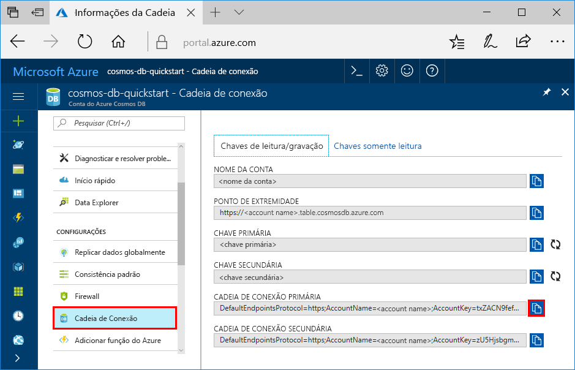

# <a name="quickstart-build-a-table-api-app-with-python-and-azure-cosmos-db"></a>Início rápido: criar um aplicativo de API de Tabela com Python e Azure Cosmos DB

Este guia de início rápido mostra como usar o Python e a [API de Tabela](table-introduction.md) do Azure Cosmos DB para compilar um aplicativo clonando um exemplo do GitHub. Este guia de início rápido também mostra como criar uma conta do Azure Cosmos DB e como usar o Data Explorer para criar tabelas e entidades no Portal do Azure baseado na Web.

O Azure Cosmos DB é o serviço de banco de dados multimodelo distribuído globalmente da Microsoft. É possível criar e consultar rapidamente documentos, chave/valor, coluna larga e bancos de dados do gráfico. Todos se beneficiam de recursos de escala horizontal e distribuição global no núcleo do Azure Cosmos DB. 

## <a name="prerequisites"></a>pré-requisitos

[!INCLUDE [quickstarts-free-trial-note](../../includes/quickstarts-free-trial-note.md)]
[!INCLUDE [cosmos-db-emulator-docdb-api](../../includes/cosmos-db-emulator-docdb-api.md)]

Além disso:

* Se você ainda não tem o Visual 2017 Studio instalado, poderá baixar e usar o **Visual Studio 2017 Community Edition** [gratuito](https://www.visualstudio.com/downloads/). Verifique se você habilitou o **desenvolvimento do Azure** durante a instalação do Visual Studio.
* Ferramentas Python para o Visual Studio do [GitHub](http://microsoft.github.io/PTVS/). Este tutorial usa as Ferramentas Python para o VS 2015.
* Python 2.7 de [python.org](https://www.python.org/downloads/release/python-2712/)

## <a name="create-a-database-account"></a>Criar uma conta de banco de dados

> [!IMPORTANT] 
> Você precisa criar uma nova conta de API de tabela para trabalhar com os SDKs de API de tabela disponíveis. Não há suporte para contas de API de tabela criadas durante a versão prévia pelos SDKs disponíveis.
>

[!INCLUDE [cosmos-db-create-dbaccount-table](../../includes/cosmos-db-create-dbaccount-table.md)]

## <a name="add-a-table"></a>Adicionar uma tabela

[!INCLUDE [cosmos-db-create-table](../../includes/cosmos-db-create-table.md)]

## <a name="add-sample-data"></a>Adicionar dados de exemplo

[!INCLUDE [cosmos-db-create-table-add-sample-data](../../includes/cosmos-db-create-table-add-sample-data.md)]

## <a name="clone-the-sample-application"></a>Clonar o aplicativo de exemplo

Agora, clonaremos um aplicativo de Tabela do github, definiremos a cadeia de conexão e o executaremos. Você verá como é fácil trabalhar usando dados de forma programática. 

1. Abra um prompt de comando, crie uma nova pasta chamada exemplos de git e feche o prompt de comando.

    ```bash
    md "C:\git-samples"
    ```

2. Abra uma janela de terminal de git, como git bash, e use o comando `cd` para alterar para a nova pasta para instalar o aplicativo de exemplo.

    ```bash
    cd "C:\git-samples"
    ```

3. Execute o comando a seguir para clonar o repositório de exemplo. Este comando cria uma cópia do aplicativo de exemplo no seu computador. 

    ```bash
    git clone https://github.com/Azure-Samples/storage-python-getting-started.git
    ```

3. Em seguida, abra o arquivo da solução no Visual Studio. 

## <a name="update-your-connection-string"></a>Atualizar sua cadeia de conexão

Agora, volte ao portal do Azure para obter informações sobre a cadeia de conexão e copiá-las para o aplicativo. Isso permite que seu aplicativo se comunique com o banco de dados hospedado. 

1. No [Portal do Azure](http://portal.azure.com/), clique em **Cadeia de Conexão**. 

    

2. Copie o NOME DA CONTA usando o botão no lado direito.

3. Abra o arquivo config.py e cole o NOME DA CONTA do portal no valor STORAGE_ACCOUNT_NAME na linha 19.

4. Volte ao portal e copie a CHAVE PRIMÁRIA.

5. Cole a CHAVE PRIMÁRIA do portal no valor STORAGE_ACCOUNT_KEY na linha 20.

3. Salve o arquivo config.py.

## <a name="run-the-app"></a>Execute o aplicativo

1. No Visual Studio, clique com o botão direito do mouse no projeto no **Gerenciador de Soluções**, selecione o ambiente atual do Python e, em seguida, clique com o botão direito do mouse.

2. Selecione Instalar Pacote do Python e digite **azure-storage-table**

3. Pressione F5 para executar o aplicativo. Seu aplicativo é exibido no navegador. 

Agora, é possível voltar ao Data Explorer e ver a consulta, modificar e trabalhar com esses novos dados. 

## <a name="review-slas-in-the-azure-portal"></a>Examinar SLAs no Portal do Azure

[!INCLUDE [cosmosdb-tutorial-review-slas](../../includes/cosmos-db-tutorial-review-slas.md)]

## <a name="clean-up-resources"></a>Limpar recursos

[!INCLUDE [cosmosdb-delete-resource-group](../../includes/cosmos-db-delete-resource-group.md)]

## <a name="next-steps"></a>Próximas etapas

Neste início rápido, você aprendeu como criar uma conta do BD Cosmos do Azure, como criar uma tabela usando o Data Explorer e como executar um aplicativo.  Agora, você pode consultar os dados usando a API de Tabela.  

> [!div class="nextstepaction"]
> [Importar dados de tabela para a API de Tabela](table-import.md)
