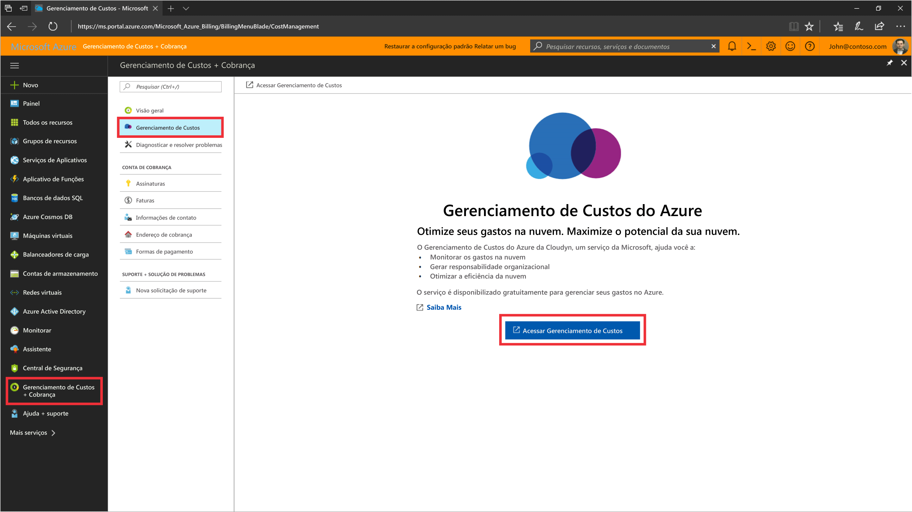
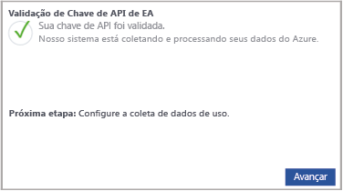

# Registrar um Contrato Enterprise do Azure e exibir dados de custo

Você usa seu contrato do Azure Enterprise para registrar-se na Cloudyn. O registro fornece acesso ao portal do Cloudyn. Este guia de início rápido fornece detalhes do processo de registro necessários para criar uma assinatura de avaliação do Cloudyn e entrar no portal do Cloudyn. Também mostra como começar a exibir dados de custo imediatamente.

O Gerenciamento de Custos do Azure oferece uma funcionalidade semelhante ao Cloudyn. O Gerenciamento de Custos do Azure é uma solução de gerenciamento de custos nativa do Azure. Ele ajuda você a analisar custos, criar e gerenciar orçamentos, exportar dados e rever e agir de acordo com recomendações de otimização para economizar dinheiro. Para obter mais informações, consulte [gerenciamento de custos do Azure](overview-cost-mgt.md).

## Entrar no Azure

- Entre no Portal do Azure em http://portal.azure.com.

## Registrar com Cloudyn

1. No portal do Azure, clique em **Gerenciamento de Custo + Cobrança** na lista de serviços.
2. Em **Visão geral**, clique em **Cloudyn**  
    
3. Sobre o **Cloudyn** página, **ir para o Cloudyn** para abrir a página de registro do Cloudyn em uma nova janela.
4. Na página de registro de avaliação do portal do Cloudyn, digite o nome de sua empresa e, em seguida, selecione **Administrador de Registro do Azure Enterprise**.  
    
5. Insira sua chave de API de registro do Enterprise Portal. Caso não tenha a chave em mãos, clique no link do [Enterprise Portal](https://ea.azure.com) e siga as seguintes etapas:
  1. Entre no site do Azure Enterprise e clique em **Relatórios**, clique em **Chave de Acesso da API** e, em seguida, copie a chave primária.  
    
  3. Volte para a página de registro e cole-a em sua chave de API.
6. Concorde com os Termos de Uso e valide a chave. Clique em **Avançar** para autorizar o Cloudyn a coletar dados do recurso do Azure. Os dados coletados incluem dados de uso, desempenho, cobrança e marcação de suas assinaturas.  
    
7. Em **Convidar outros stakeholders**, adicione usuários digitando seus endereços de email. Quando concluir, clique em **Avançar**. Dependendo do tamanho do seu registro do Azure, pode levar até 24 horas para todos os seus dados de cobrança serem adicionados ao Cloudyn.
8. Clique em **Ir para o Cloudyn** para abrir o portal de Cloudyn e, em seguida, na página **Gerenciamento de Contas de Nuvem**, você deverá ver as informações de sua conta do EA registrada.

Para assistir a um vídeo tutorial sobre como registrar seu Enterprise Agreement, consulte [Como encontrar seu ID de inscrição EA e chave de API para usar no Cloudyn](https://youtu.be/u_phLs_udig).

[!INCLUDE [cost-management-create-account-view-data](../../includes/cost-management-create-account-view-data.md)]

## Próximas etapas

Neste início rápido, você usou as informações de contrato Enterprise do Azure para registrar com Cloudyn. Você também entrou no portal do Cloudyn e começou a exibir os dados de custo. Para saber mais sobre a Cloudyn, continue o tutorial para o Cloudyn.

> [!div class="nextstepaction"]
> [Examinar o uso e os custos](./tutorial-review-usage.md)
