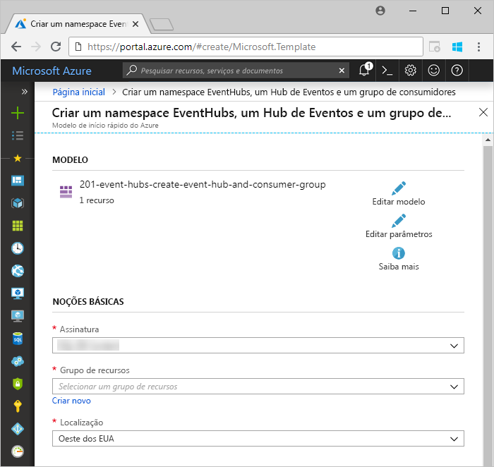
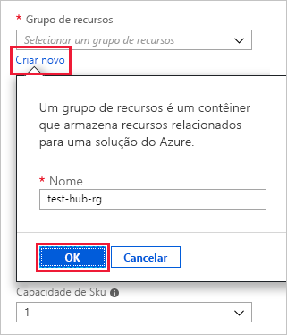
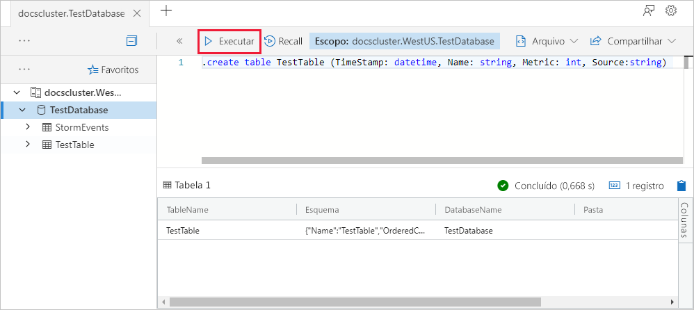
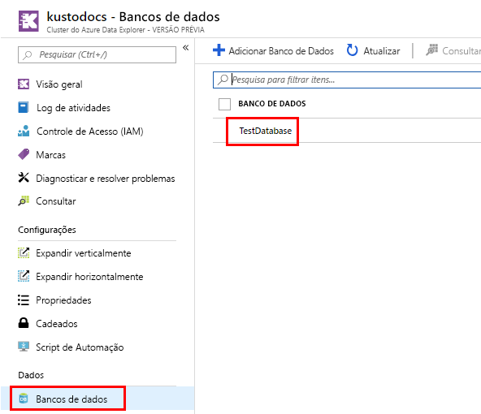
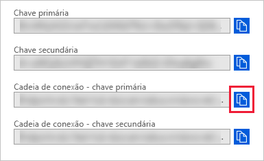
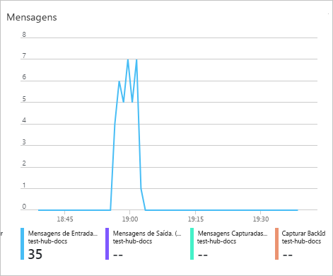

# <a name="quickstart-ingest-data-from-event-hub-into-azure-data-explorer"></a>Início Rápido: Ingerir dados do Hub de Eventos no Azure Data Explorer

O Azure Data Explorer é um serviço de exploração de dados rápido e altamente escalonável para dados de log e telemetria. O Azure Data Explorer oferece a ingestão (carregamento de dados) dos Hubs de Eventos, uma plataforma de big data streaming e um serviço de ingestão de eventos. Os [Hubs de Eventos](/azure/event-hubs/event-hubs-about) podem processar milhões de eventos por segundo quase em tempo real. Neste início rápido, você cria um hub de eventos, conecta-se ao Azure Data Explorer e vê o fluxo de dados pelo sistema.

## <a name="prerequisites"></a>Pré-requisitos

* Caso você não tenha uma assinatura do Azure, crie uma [conta gratuita do Azure](https://azure.microsoft.com/free/) antes de começar.

* [Um cluster de teste e um banco de dados](create-cluster-database-portal.md).

* [Um aplicativo de exemplo](https://github.com/Azure-Samples/event-hubs-dotnet-ingest) que gera dados e os envia para um hub de eventos. Baixe o aplicativo de exemplo em seu sistema.

* [Visual Studio 2019](https://visualstudio.microsoft.com/vs/) para executar o aplicativo de exemplo.

## <a name="sign-in-to-the-azure-portal"></a>Entre no Portal do Azure

Entre no [Portal do Azure](https://portal.azure.com/).

## <a name="create-an-event-hub"></a>Criar um Hub de Evento

Neste início rápido, você gera dados de amostra e os envia para um hub de eventos. O primeiro passo é criar um hub de eventos. Você faz isso usando um modelo do Azure Resource Manager no portal do Azure.

1. Para criar um hub de eventos, use o botão a seguir para iniciar a implantação. Clique com o botão direito do mouse e selecione **Abrir em nova janela** para que você possa acompanhar o restante das etapas neste artigo.

    [](https://portal.azure.com/#create/Microsoft.Template/uri/https%3A%2F%2Fraw.githubusercontent.com%2FAzure%2Fazure-quickstart-templates%2Fmaster%2F201-event-hubs-create-event-hub-and-consumer-group%2Fazuredeploy.json)

    O botão **Implantar no Azure** leva você ao portal do Azure para preencher um formulário de implantação.

    

1. Selecione a assinatura na qual você deseja criar o hub de eventos e crie um grupo de recursos denominado *test-hub-rg*.

    

1. Preencha o formulário com as seguintes informações.

    

    Use padrões para quaisquer configurações não listadas na tabela a seguir.

    **Configuração** | **Valor sugerido** | **Descrição do campo**
    |---|---|---|
    | Assinatura | Sua assinatura | Selecione a assinatura do Azure que você deseja usar para o seu hub de eventos.|
    | Grupo de recursos | *teste-hub-rg* | Crie um novo grupo de recursos. |
    | Local padrão | *Oeste dos EUA* | Selecione *Oeste dos EUA* para este início rápido. Para um sistema de produção, selecione a região que melhor atenda às suas necessidades. Crie o namespace do hub de eventos na mesma Localização do cluster Kusto para melhor desempenho (mais importante para namespaces do hub de eventos com alta taxa de transferência).
    | Nome do Namespace | Um nome de namespace exclusivo | Escolha um nome exclusivo que identifique seu namespace. Por exemplo, *mytestnamespace*. O nome do domínio *servicebus.windows.net* é anexado ao nome que você fornece. O campo pode conter apenas letras, números e hifens. O nome deve começar com uma letra e terminar com uma letra ou um número. O valor deve ter entre 6 e 50 caracteres.
    | Nome do Hub de Eventos | *test-hub* | O hub de eventos fica sob o namespace, que fornece um contêiner de determinação de escopo exclusivo. O nome do hub de eventos deve ser exclusivo dentro do namespace. |
    | Nome do grupo de consumidor | *grupo de teste* | Grupos de consumidores permitem que vários aplicativos de consumo tenham uma visão separada do fluxo de eventos. |
    | | |

1. Selecione **Compra**, que confirma que você está criando recursos na sua assinatura.

1. Selecione **Notificações** na barra de ferramentas para monitorar o processo de provisionamento. Pode levar alguns minutos para que a implantação seja bem-sucedida, mas você pode passar para a próxima etapa agora.

    

## <a name="create-a-target-table-in-azure-data-explorer"></a>Criar uma tabela de destino no Gerenciador de dados do Azure

Agora você cria uma tabela no Gerenciador de dados do Azure, para que os Hubs de eventos enviará dados. Você cria a tabela no cluster e no banco de dados provisionado em **Pré-requisitos**.

1. No portal do Azure, navegue até seu cluster e selecione **Consultar**.

    

1. Copie o seguinte comando na janela e selecione **Executar** para criar a tabela (TestTable) que receberá os dados ingeridos.

    ```Kusto
    .create table TestTable (TimeStamp: datetime, Name: string, Metric: int, Source:string)
    ```

    

1. Copie o seguinte comando na janela e selecione **Executar** para mapear os dados JSON de entrada para os tipos de dados e nomes de coluna da tabela (TestTable).

    ```Kusto
    .create table TestTable ingestion json mapping 'TestMapping' '[{"column":"TimeStamp","path":"$.timeStamp","datatype":"datetime"},{"column":"Name","path":"$.name","datatype":"string"},{"column":"Metric","path":"$.metric","datatype":"int"},{"column":"Source","path":"$.source","datatype":"string"}]'
    ```

## <a name="connect-to-the-event-hub"></a>Conectar-se ao hub de eventos

Agora você se conecta ao hub de eventos no Azure Data Explorer. Quando essa conexão está funcionando, os dados que seguem para o hub de eventos fluem para a tabela de teste que você criou no início deste artigo.

1. Selecione **Notificações** na barra de ferramentas para verificar se a implantação do hub de eventos foi bem-sucedida.

1. Em um cluster que você criou, selecione **bancos de dados** , em seguida, **TestDatabase**.

    

1. Selecione **ingestão de dados** e **Adicionar conexão de dados**. Então preencha o formulário com as seguintes informações. Selecione **Criar** quando tiver terminado.

    

    Fonte de dados:

    **Configuração** | **Valor sugerido** | **Descrição do campo**
    |---|---|---|
    | Nome da conexão de dados | *teste de hub de conexão* | O nome da conexão que você deseja criar no Azure Data Explorer.|
    | Namespace do Hub de Eventos | Um nome de namespace exclusivo | O nome escolhido anteriormente que identifica seu namespace. |
    | Hub de Eventos | *test-hub* | O hub de eventos que você criou. |
    | Grupo de consumidores | *grupo de teste* | O grupo de consumidores definido no hub de eventos que você criou. |
    | | |

    Tabela de destino:

    Há duas opções para rotear os dados ingeridos: *estático* e *dinâmico*. 
    Para este artigo, você usará o roteamento estático, no qual especificará o nome da tabela, o formato de dados e o mapeamento. Portanto, não selecione **Meus dados incluem informações de roteamento**.

     **Configuração** | **Valor sugerido** | **Descrição do campo**
    |---|---|---|
    | Tabela | *TestTable* | A tabela criada na **TestDatabase**. |
    | Formato de dados | *JSON* | Os formatos com suporte são Avro, CSV, JSON, MULTILINE JSON, PSV, SOH, SCSV, TSV e TXT. |
    | Mapeamento de coluna | *TestMapping* | O mapeamento que você criou em **TestDatabase**, que mapeia os dados de entrada JSON para tipos de dados e nomes de coluna da **TestTable**. Obrigatório para JSON, MULTILINE JSON ou AVRO e opcional para outros formatos.|
    | | |

    > [!NOTE]
    > Escolha **Meus dados incluem informações de roteamento** para usar o roteamento dinâmico no qual os dados incluem as informações de roteamento necessárias, como visto nos comentários do [exemplo de aplicativo](https://github.com/Azure-Samples/event-hubs-dotnet-ingest). Se as propriedades estáticas e dinâmicas estiverem definidas, as propriedades dinâmicas substituirão as estáticas. 

## <a name="copy-the-connection-string"></a>Copiar a cadeia de conexão

Quando você executa o [aplicativo de exemplo](https://github.com/Azure-Samples/event-hubs-dotnet-ingest) listado nos pré-requisitos, precisa da cadeia de conexão para o namespace do hub de eventos.

1. Sob o namespace do hub de eventos que você criou, selecione **Políticas de acesso compartilhado** e, em seguida, **RootManageSharedAccessKey**.

    

1. Cópia **cadeia de Conexão – chave primária**. Você pode colá-lo na próxima seção.

    

## <a name="generate-sample-data"></a>Gerar dados de exemplo

Use o [aplicativo de exemplo](https://github.com/Azure-Samples/event-hubs-dotnet-ingest) baixado para gerar dados.

1. Abrir o aplicativo de exemplo no Visual Studio.

1. No *program.cs* do arquivo, atualize o `connectionString` constante para a cadeia de caracteres de conexão que você copiou do namespace de hub de eventos.

    ```csharp
    const string eventHubName = "test-hub";
    // Copy the connection string ("Connection string-primary key") from your Event Hub namespace.
    const string connectionString = @"<YourConnectionString>";
    ```

1. Compile e execute o aplicativo. O aplicativo envia mensagens para o hub de eventos e imprime o status a cada dez segundos.

1. Depois que o aplicativo enviar algumas mensagens, passe para a próxima etapa: analise o fluxo de dados no hub de eventos e na tabela de teste.

## <a name="review-the-data-flow"></a>Revise o fluxo de dados

Agora que o aplicativo está gerando dados, você pode ver o fluxo de dados do hub de eventos para a tabela em seu cluster.

1. No portal do Azure, sob seu hub de eventos, você vê o pico de atividade enquanto o aplicativo está em execução.

    

1. Para verificar quantas mensagens chegaram ao banco de dados até o momento, execute a consulta a seguir em seu banco de dados de teste.

    ```Kusto
    TestTable
    | count
    ```

1. Para ver o conteúdo das mensagens, execute a consulta a seguir:

    ```Kusto
    TestTable
    ```

    O conjunto de resultados deve ser parecido com o seguinte:

    

    > [!NOTE]
    > O Azure Data Explorer tem uma política de agregação (envio em lote) para a ingestão de dados, criada para otimizar o processo de ingestão. A política é configurada como 5 minutos, de modo que você pode ter alguma latência.

## <a name="clean-up-resources"></a>Limpar recursos

Se você não planeja usar seu hub de eventos novamente, limpe **test-hub-rg** para evitar custos.

1. No portal do Azure, selecione **Grupos de recursos** na extremidade esquerda, depois selecione o recurso de grupo que você criou.  

    Se o menu à esquerda estiver recolhido, selecione  para expandi-lo.

   

1. Em **test-resource-group**, selecione **Excluir grupo de recursos**.

1. Na nova janela, digite o nome do grupo de recursos para excluir (*test-hub-rg*) e, em seguida, selecione **excluir**.

## <a name="next-steps"></a>Próximas etapas

> [!div class="nextstepaction"]
> [Início Rápido: consultar dados no Azure Data Explorer](web-query-data.md)
