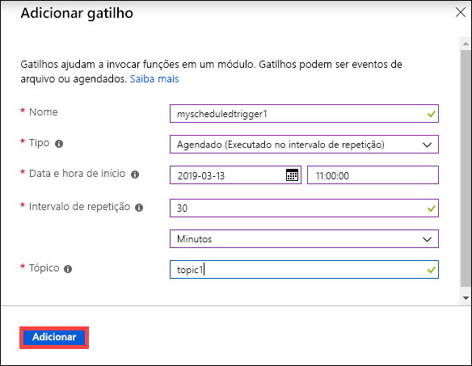
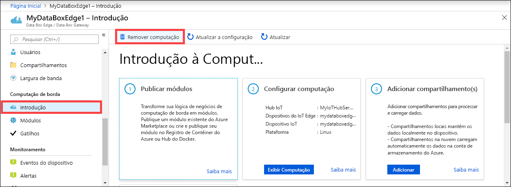
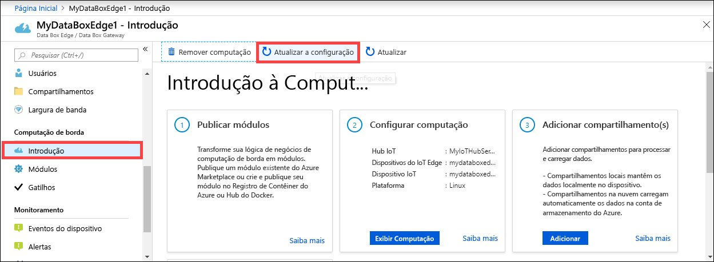

# Gerenciar computação no Azure Data Box Edge

Este artigo descreve como gerenciar a computação em seu Azure Data Box Edge. É possível gerenciar a computação pelo portal do Azure ou pela IU da Web local. Use o portal do Azure para gerenciar módulos, gatilhos e configuração de computação e a IU da Web local para gerenciar configurações de computação.

> [!IMPORTANT]
> O Data Box Edge está em versão prévia. Examine os [termos de serviço do Azure para a versão prévia](https://azure.microsoft.com/support/legal/preview-supplemental-terms/) antes de solicitar e implantar essa solução.

Neste artigo, você aprenderá a:

> [!div class="checklist"]
> * Gerenciar disparadores
> * Gerenciar configuração da computação

## Gerenciar disparadores

Os eventos são coisas que acontecem dentro de seu ambiente de nuvem ou em seu dispositivo no qual você pode executar uma ação. Por exemplo, quando um arquivo é criado em um compartilhamento, ele é um evento. Gatilhos acionam os eventos. Para o Data Box Edge, os gatilhos podem ser em resposta a eventos de arquivo ou a um agendamento.

- **Arquivo**: esses gatilhos são em resposta a eventos de arquivo, como a criação de um arquivo, a modificação de um arquivo.
- **Scheduled**: esses gatilhos são em resposta a uma agenda que você pode definir com uma data de início, hora de início e o intervalo de repetição.

### Adicionar um gatilho

Siga estas etapas no portal do Azure para criar um gatilho.

1. No portal do Azure, acesse seu recurso do Data Box Edge e acesse **Computação de borda > Gatilho**. Selecione **+ Adicionar gatilho** na barra de comandos.

    

2. Na folha **Adicionar gatilho**, forneça um nome exclusivo para o gatilho.
    
    <!--Trigger names can only contain numbers, lowercase letters, and hyphens. The share name must be between 3 and 63 characters long and begin with a letter or a number. Each hyphen must be preceded and followed by a non-hyphen character.-->

3. Selecione um **Tipo** para o gatilho. Escolha **Arquivo** quando o gatilho for em resposta a um evento de arquivo. Selecione **Agendado** quando desejar que o gatilho inicie em um horário definido e seja executado em um intervalo de repetição especificado. Dependendo da sua seleção, um conjunto de opções diferente é apresentado.

    - **Gatilho de arquivo** – escolha na lista suspensa de um compartilhamento montado. Quando um evento de arquivo é acionado nesse compartilhamento, o gatilho invocaria uma função do Azure.

        

    - **Gatilho agendado** – especifique a data/hora de início e o intervalo de repetição em horas, minutos ou segundos. Além disso, insira o nome de um tópico. Um tópico oferecerá a você a flexibilidade de rotear o gatilho para um módulo implantado no dispositivo.

        Um exemplo de cadeia de caracteres de rota é: `"route3": "FROM /* WHERE topic = 'topicname' INTO BrokeredEndpoint("modules/modulename/inputs/input1")"`.

        

4. Selecione **Adicionar** para criar o gatilho. Uma notificação mostra que a criação do gatilho está em andamento. Depois que o gatilho é criado, a folha é atualizada para refletir o novo gatilho.
 
    

### Excluir um gatilho

Siga estas etapas no portal do Azure para excluir um gatilho.

1. Na lista de gatilhos, selecione o gatilho que você deseja excluir.

    

2. Clique com o botão direito do mouse e selecione **Excluir**.

    

3. Quando solicitado a confirmar, clique em **Sim**.

    

A lista de gatilhos também é atualizada para refletir a exclusão.

## Gerenciar configuração da computação

Use o portal do Azure para exibir a configuração de computação, para remover a configuração de computação existente ou para atualizar a configuração de computação para sincronizar as chaves de acesso do dispositivo IoT e do IoT Edge para seu Data Box Edge.

### Exibir configuração de computação

Siga estas etapas no portal do Azure para exibir a configuração de computação para seu dispositivo.

1. No portal do Azure, acesse o recurso do Data Box Edge e **Computação de borda > Módulos**. Selecione **Exibir computação** na barra de comandos.

    

2. Anote a configuração de computação em seu dispositivo. Quando você tiver configurado a computação, você terá criado um recurso de hub IoT. Nesse recurso de hub IoT, um dispositivo IoT e um dispositivo IoT Edge são configurados. Há suporte apenas para a execução dos módulos do Linux no dispositivo IoT Edge.

    

### Remover configuração da computação

Siga estas etapas no portal do Azure para remover a configuração de computação de borda existente para seu dispositivo.

1. No portal do Azure, acesse seu recurso do Data Box Edge e acesse **Computação de borda > Introdução**. Selecione **Remover computação** na barra de comandos.

    

2. Se você remover a configuração de computação, será necessário reconfigurar o dispositivo caso seja necessário usar a computação novamente. Quando solicitado a confirmar, selecione **Sim**.

    

### Sincronizar as chaves de acesso do dispositivo IoT e IoT Edge

Quando você configura a computação no Data Box Edge, um dispositivo IoT e um dispositivo IoT Edge são criados. Esses dispositivos recebem chaves de acesso simétricas automaticamente. Como uma melhor prática de segurança, essas chaves são trocadas regularmente por meio do serviço de Hub IoT.

Para trocar essas chaves, é possível acessar o serviço de Hub IoT que você criou e selecione o dispositivo IoT ou IoT Edge. Cada dispositivo tem uma chave de acesso primária e uma secundária. Atribua a chave de acesso primária à chave de acesso secundária e gere novamente a chave de acesso primária.

Se as chaves do seu dispositivo IoT e IoT Edge tiverem sido trocadas, será necessário atualizar a configuração no Data Box Edge para obter as chaves de acesso mais recentes. A sincronização ajuda o dispositivo obter as chaves mais recentes para seu dispositivo IoT e IoT Edge. O Data Box Edge usa apenas as chaves de acesso primárias.

Siga estas etapas no portal do Azure para sincronizar as chaves de acesso para seu dispositivo.

1. No portal do Azure, acesse seu recurso do Data Box Edge e acesse **Computação de borda > Introdução**. Selecione **Atualizar configuração** na barra de comandos.

    

2. Selecione **Sim** quando solicitada a confirmação.

     

3. Saia da caixa de diálogo depois que a sincronização tiver sido concluída.

## Habilitar um adaptador de rede para computação

Talvez você precise acessar um módulo em execução no dispositivo Data Box Edge. Para acessar o módulo externamente, você precisará atribuir um endereço IP a um adaptador de rede no dispositivo. Você pode gerenciar essas configurações de computação por meio da IU da Web local.

Siga as seguintes etapas na IU da Web local para definir as configurações de computação.

1. Na IU da Web local, vá para **Configuração > Configurações de computação**.  

2. **Habilite** o adaptador de rede que você deseja usar para se conectar aos módulos de computação no dispositivo. 

    - Se estiver usando endereços IP estáticos, insira um endereço IP para o adaptador de rede.
    - Se estiver usando o DHCP, os endereços IP serão automaticamente atribuídos.

3. Selecione **Aplicar** para aplicar as configurações.

    

## Próximas etapas

- Saiba como [Gerenciar usuários usando o portal do Azure](data-box-edge-manage-users.md).
