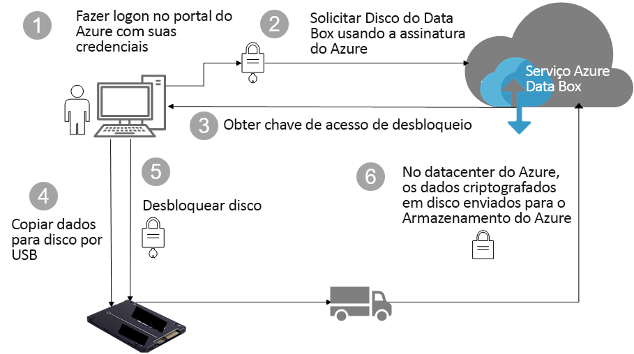

# Segurança e proteção de dados do Azure Data Box Disk (Versão prévia)

Este artigo descreve os recursos de segurança do Azure Data Box Disk que ajudam a proteger cada um dos componentes da solução do Data Box e os dados armazenados neles. 

> [!IMPORTANT]
> O Data Box Disk está em versão prévia. Examine os [termos de serviço do Azure para a versão prévia](https://azure.microsoft.com/support/legal/preview-supplemental-terms/) antes de implantar essa solução.

## Fluxo de dados por meio de componentes

A solução Microsoft Azure Data Box consiste em quatro componentes principais que interagem entre si:

- **Serviço do Azure Data Box hospedado no Azure** - o serviço de gerenciamento que você usa para criar o pedido do disco, configurar os discos e, em seguida, controlar o pedido até a conclusão.
- **Data Box Disks** - os discos físicos que são enviados para você para importar seus dados locais para o Azure. 
- **Clientes/hosts conectados aos discos** - os clientes em sua infraestrutura que se conectam ao disco do Data Box por USB e contêm dados que precisam ser protegidos.
- **Armazenamento em nuvem** – O local na nuvem do Azure onde os dados são armazenados. Isso geralmente é a conta de armazenamento vinculada ao recurso do Azure Data Box que você criou.

O diagrama a seguir indica o fluxo de dados através da solução do Azure Data Box Disk do local para o Azure.

## Recursos de segurança

O Data Box Disk fornece uma solução segura para a proteção de dados, garantindo que somente entidades autorizadas possam exibir, modificar ou excluir seus dados. Os recursos de segurança para essa solução são destinados ao disco e ao serviço associado, garantindo a segurança dos dados armazenados neles. 

### Proteção do Data Box Disk

O Data Box Disk é protegido pelos seguintes recursos:

- Criptografia BitLocker AES de 128 bits em todos os momentos.
- Recurso de atualização segura para os discos.
- Os discos são enviados em um estado bloqueado e só podem ser desbloqueados por uma ferramenta de desbloqueio do Data Box Disk. A ferramenta de desbloqueio está disponível no portal do serviço do Data Box Disk.

### Proteção de dados do Data Box Disk

Os dados que entram e saem do Data Box Disk são protegidos pelos seguintes recursos:

- Criptografia de dados BitLocker em todos os momentos. 
- Eliminação segura de dados do disco após a conclusão do carregamento de dados do Azure. A eliminação de dados cumpre os padrões do NIST 800-88r1.

### Proteção de serviço do Data Box

O serviço do Data Box é protegido pelos seguintes recursos.

- O acesso ao serviço do Data Box Disk requer que a organização tenha uma assinatura do Azure que inclua o Data Box Disk. Sua assinatura determina os recursos que você pode acessar no portal do Azure.
- Como o serviço do Data Box está hospedado no Azure, ele é protegido pelos recursos de segurança do Azure. Para obter mais informações sobre os recursos de segurança fornecidos pelo Microsoft Azure, acesse a [Central de Confiabilidade do Microsoft Azure](https://www.microsoft.com/TrustCenter/Security/default.aspx). 
- O Data Box Disk armazena a chave de acesso do disco que é usada para desbloquear o disco no serviço. 
- O serviço do Data Box Disk armazena os detalhes do pedido e o status no serviço. Essas informações são excluídas quando o pedido é excluído. 

## Gerenciando dados pessoais

[!INCLUDE [GDPR-related guidance](../../includes/gdpr-intro-sentence.md)]

O Azure Data Box Disk reúne e exibe informações pessoais nas seguintes instâncias de chave no serviço:

- **Configurações de notificação** - ao criar um pedido, você configura o endereço de email dos usuários nas configurações de notificação. Essas informações podem ser visualizadas pelo administrador. Essas informações são excluídas pelo serviço quando o trabalho atingir o estado terminal ou quando você excluir o pedido.

- **Detalhes do pedido** - após a ordem ser criada, o endereço de envio, email e as informações de contato dos usuários são armazenadas no portal do Azure. As informações salvas incluem:

    - Nome de contato
    - Número de telefone
    - Email
    - Endereço
    - City
    - CEP/Código postal
    - Estado
    - Região/País/Região
    - ID da Unidade
    - Número da conta da operadora
    - Enviar número de controle

    Os detalhes do pedido serão excluídos pelo serviço do Data Box quando o trabalho for concluído ou quando você excluir o pedido.

- **Endereço para entrega** - depois que o pedido for feito, o serviço do Data Box fornecerá o endereço de entrega para operadoras de terceiros, como a UPS ou a DHL. 

Para mais informações, revise a Política de Privacidade da Microsoft na [Central de Confiabilidade](https://www.microsoft.com/trustcenter).

## Próximas etapas

- Examine os [requisitos do Data Box Disk](data-box-disk-system-requirements.md).
- Entenda os [limites do Data Box Disk](data-box-disk-limits.md).
- Implante rapidamente o [Azure Data Box Disk](data-box-disk-quickstart-portal.md) no portal do Azure.
