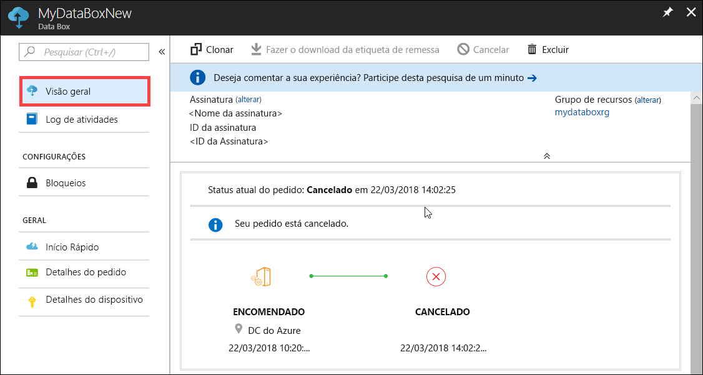
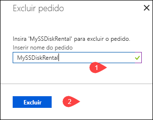
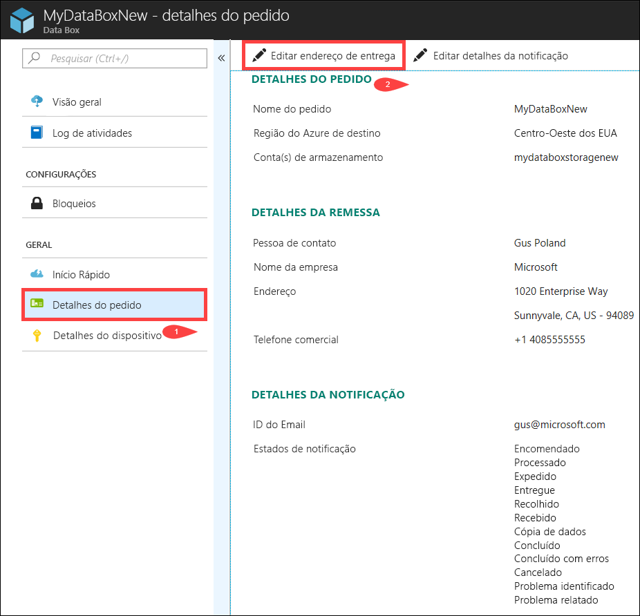
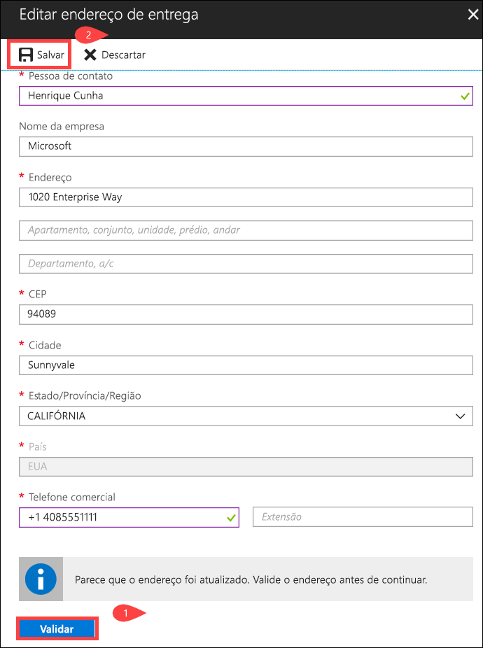
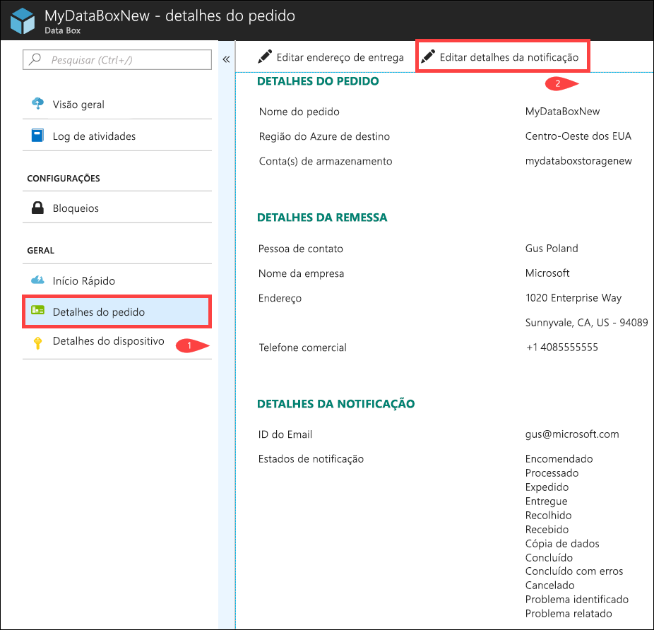
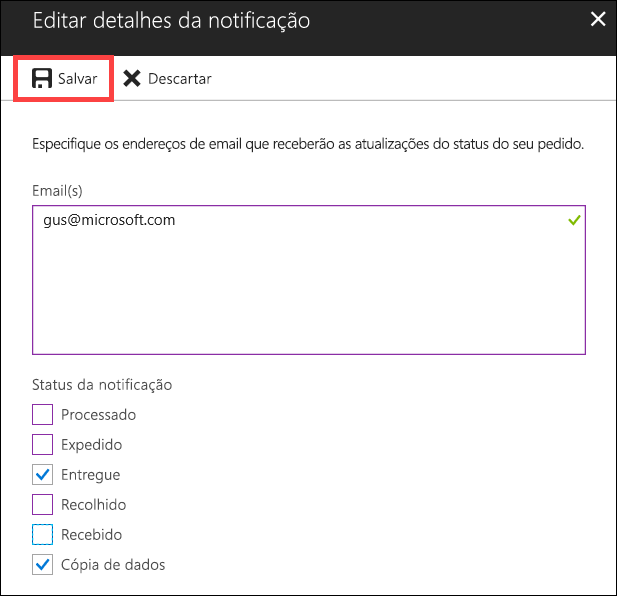

# Usar o portal do Azure para administrar o Disco do Data Box (Versão prévia)

Os tutoriais neste artigo aplicam-se ao Disco do Microsoft Azure Data Box durante a versão prévia. Este artigo descreve alguns dos fluxos de trabalho e tarefas de gerenciamento complexos que podem ser executados no Disco do Data Box. 

Você pode gerenciar o Disco do Data Box pelo portal do Azure. Este artigo se concentra nas tarefas que você pode executar usando o portal do Azure. Use o Portal do Azure para gerenciar pedidos e discos e acompanhar o status do pedido até sua conclusão.

> [!IMPORTANT]
> O Data Box Disk está em versão prévia. Examine os [termos de serviço do Azure para a versão prévia](https://azure.microsoft.com/support/legal/preview-supplemental-terms/) antes de implantar essa solução.

## Cancelar um pedido

Sempre pode haver a necessidade de cancelar um pedido depois de feito, por vários motivos. Você só pode cancelar o pedido antes do início da preparação dos discos. Depois que os discos estiverem preparados e o pedido for processado, não será possível cancelá-lo. 

Realize as etapas a seguir para cancelar um pedido.

1.  Vá para **Visão Geral > Cancelar**. 

    

2.  Preencha um motivo para cancelar o pedido.  

    

3.  Depois que o pedido for cancelado, o portal atualizará o status do pedido e o exibirá como **Cancelado**.

    

Você não recebe uma notificação por email quando o pedido é cancelado.

## Clonar um pedido

A clonagem é útil em determinadas situações. Por exemplo, um usuário usou um Disco do Data Box para transferir alguns dados. Conforme mais dados vão sendo gerados, há uma necessidade de mais discos para transferir dados para o Azure. Nesse caso, o mesmo pedido pode simplesmente ser clonado.

Execute as etapas a seguir para clonar um pedido.

1.  Vá para **Visão geral > Clonar**. 

    

2.  Todos os detalhes do pedido permanecem inalterados. O nome do pedido é o nome original do pedido acrescido de *-Clone*. Marque a caixa de seleção para confirmar que você leu as informações de privacidade. Clique em **Criar**.    

O clone é criado em alguns minutos e a portal é atualizado para mostrar o novo pedido.

 

## Excluir pedido

Você talvez queira excluir um pedido quando ele é concluído. O pedido contém suas informações pessoais, como nome, endereço e informações de contato. Essas informações pessoais são excluídas quando o pedido é excluído.

Só é possível excluir pedidos que tenham sido concluídos ou cancelados. Execute as etapas a seguir para excluir um pedido.

1. Acesse **Todos os recursos**. Pesquise seu pedido.

    

2. Clique no pedido que você deseja excluir e vá para **Visão Geral**. Na barra de comandos, clique em **Excluir**.

    

3. Insira o nome do pedido quando solicitado a confirmar a exclusão de um pedido. Clique em **Excluir**.

     

## Faça o download da etiqueta de remessa

Talvez seja necessário baixar a etiqueta de remessa quando a que foi fornecida para devolução com os discos for perdida ou danificada. 

Execute as etapas a seguir para baixar uma etiqueta de remessa.
1.  Vá para **Visão geral > Baixar etiqueta de remessa**. Essa opção estará disponível somente depois que o disco for enviado. 

    

2.  Essa opção baixa a etiqueta de remessa de devolução a seguir. Salve o rótulo, imprima-o horizontalmente e fixe-o na remessa de devolução.

    

## Editar endereço para entrega

Talvez seja necessário editar o endereço de envio depois que o pedido é feito. Isso só estará disponível até o disco ser expedido. Depois que o disco é expedido, essa opção não fica mais disponível.

Execute as etapas a seguir para editar o pedido.

1. Vá para **Detalhes do pedido > Editar endereço para entrega**.

    

2. Agora você pode editar o endereço para entrega e salvar as alterações.

    

## Editar detalhes da notificação

Talvez seja necessário alterar os usuários que devem receber os emails de status do pedido. Por exemplo, um usuário precisa ser informado quando o disco é entregue ou recolhido. Outro usuário talvez precise ser informado quando a cópia de dados é concluída para que possa verificar se os dados estão na conta de armazenamento do Azure antes de excluí-los da origem. Nesses casos, você pode editar os detalhes da notificação.

Execute as etapas a seguir para editar os detalhes de notificação.

1. Vá para **Detalhes do pedido > Editar detalhes da notificação**.

    

2. Agora você pode editar os detalhes de notificação e salvar as alterações.
 
    

## Exibir status do pedido

|Status do pedido |DESCRIÇÃO |
|---------|---------|
|Encomendado     | Pedido feito com êxito.   Se os discos não estiverem disponíveis, você receberá uma notificação.  Se os discos estiverem disponíveis, a Microsoft identificará um disco para remessa e preparará o pacote de disco.        |
|Processado     | O processamento de pedidos foi concluído.   Durante o processamento do pedido, as seguintes ações ocorrem:<li>Os discos são criptografados usando a criptografia BitLocker AES-128. </li> <li>Os Discos do Data Box estão bloqueados para impedir acesso não autorizado.</li><li>A chave de acesso que desbloqueia os discos é gerada durante esse processo.</li>        |
|Expedido     | O pedido foi enviado. Você deve receber o pedido em 1 a 2 dias.        |
|Entregue     | O pedido foi entregue no endereço especificado no pedido.        |
|Recolhido     |A remessa de devolução foi recolhida.   Depois que a remessa é recebida no datacenter do Azure, os dados são carregados no Azure automaticamente.         |
|Recebido     | Os discos foram recebidos no datacenter do Azure. A cópia de dados será iniciada em breve.        |
|Dados copiados     |Cópia de dados em andamento.  Aguarde até que a cópia de dados seja concluída.         |
|Concluído       |Pedido concluído com êxito.  Verifique se os dados estão no Azure antes de excluir os dados locais dos servidores.         |
|Concluído com erros| A cópia de dados foi concluída, mas apresentou erros.   Reveja os logs de cópia usando o caminho fornecido na **Visão Geral**. Para obter mais informações, vá para [Baixar logs de diagnóstico](data-box-disk-troubleshoot.md#download-diagnostic-logs).   |
|Cancelado            |Pedido cancelado.   Você cancelou o pedido ou ocorreu um erro e o serviço cancelou o pedido.     |

## Próximas etapas

- Saiba como [Solucionar problemas do Disco do Data Box](data-box-disk-troubleshoot.md).
