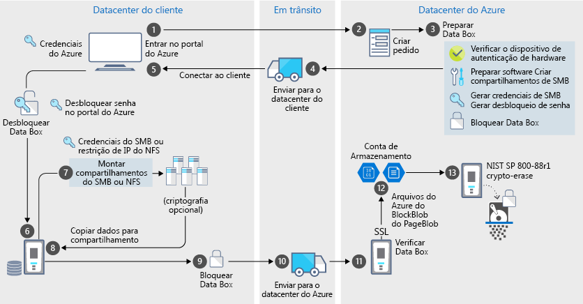

# Segurança e proteção de dados do Azure Data Box

O Data Box fornece uma solução segura para a proteção de dados, garantindo que somente entidades autorizadas possam exibir, modificar ou excluir seus dados. Este artigo descreve os recursos de segurança do Azure Data Box que ajudam a proteger cada um dos componentes da solução do Data Box e os dados armazenados neles. 

[!INCLUDE [GDPR-related guidance](../../includes/gdpr-intro-sentence.md)]

## Fluxo de dados por meio de componentes

A solução Microsoft Azure Data Box consiste em quatro componentes principais que interagem entre si:

- **Serviço do Azure Data Box hospedado no Azure** – o serviço de gerenciamento que você usa para criar o pedido do disco, configurar o dispositivo e, em seguida, controlar o pedido até a conclusão.
- **Dispositivo Data Box** – o dispositivo de transferência que é enviado para você para importar seus dados locais no Azure. 
- **Clientes/hosts conectados ao dispositivo** – os clientes em sua infraestrutura que se conectam ao dispositivo do Data Box e contêm dados que precisam ser protegidos.
- **Armazenamento em nuvem** – O local na nuvem do Azure onde os dados são armazenados. Isso geralmente é a conta de armazenamento vinculada ao recurso do Azure Data Box que você criou.

O diagrama a seguir indica o fluxo de dados através da solução do Azure Data Box do local para o Azure.

## Recursos de segurança

O Data Box fornece uma solução segura para a proteção de dados, garantindo que somente entidades autorizadas possam exibir, modificar ou excluir seus dados. Os recursos de segurança para essa solução são destinados ao disco e ao serviço associado, garantindo a segurança dos dados armazenados neles. 

### Proteção de dispositivo do Data Box

O dispositivo do Data Box é protegido pelos seguintes recursos:

- Uma caixa reforçada para o dispositivo que suporta choques, transporte adverso e condições ambientais. 
- Selos invioláveis para indicar qualquer violação do dispositivo durante o trânsito de dispositivo.
- Detecção de violação de hardware e software que impede operações do dispositivo.
- Executa apenas o software específico do Data Box.
- Inicializa em um estado bloqueado.
- Controla o acesso ao dispositivo por meio da senha de desbloqueio do dispositivo.
- Credenciais de acesso para copiar dados dentro e fora do dispositivo.

### Proteção de dados do Data Box

Os dados que entram e saem do Data Box são protegidos pelos seguintes recursos:

- Criptografia de 256 bits AES para dados em repouso. 
- Protocolos criptografados podem ser usados para dados em trânsito.
- Eliminação segura de dados do dispositivo após a conclusão do upload no Azure. A eliminação de dados cumpre os padrões do NIST 800-88r1.

### Proteção de serviço do Data Box

O serviço do Data Box é protegido pelos seguintes recursos.

- O acesso ao serviço do Data Box requer que a organização tenha uma assinatura do Azure que inclua o Data Box. Sua assinatura determina os recursos que você pode acessar no portal do Azure.
- Como o serviço do Data Box está hospedado no Azure, ele é protegido pelos recursos de segurança do Azure. Para obter mais informações sobre os recursos de segurança fornecidos pelo Microsoft Azure, acesse a [Central de Confiabilidade do Microsoft Azure](https://www.microsoft.com/TrustCenter/Security/default.aspx). 
- O serviço do Data Box armazena a senha de desbloqueio que é usada para desbloquear o dispositivo no serviço. 
- O serviço do Data Box armazena os detalhes do pedido e o status no serviço. Essas informações são excluídas quando o pedido é excluído. 

## Gerenciando dados pessoais

O Azure Data Box reúne e exibe informações pessoais nas seguintes instâncias de chave no serviço:

- **Configurações de notificação** - ao criar um pedido, você configura o endereço de email dos usuários nas configurações de notificação. Essas informações podem ser visualizadas pelo administrador. Essas informações são excluídas pelo serviço quando o trabalho atingir o estado terminal ou quando você excluir o pedido.

- **Detalhes do pedido** - após a ordem ser criada, o endereço de envio, email e as informações de contato dos usuários são armazenadas no portal do Azure. As informações salvas incluem:

  - Nome de contato
  - Número de telefone
  - Email
  - Endereço
  - City
  - CEP/Código postal
  - Estado
  - Região/País/Região
  - Número da conta da operadora
  - Enviar número de controle

    Os detalhes do pedido serão excluídos pelo serviço do Data Box quando o trabalho for concluído ou quando você excluir o pedido.

- **Endereço para entrega** – depois que o pedido for feito, o serviço do Data Box fornecerá o endereço de entrega para operadoras de terceiros, como a UPS ou a DHL. 

Para mais informações, revise a Política de Privacidade da Microsoft na [Central de Confiabilidade](https://www.microsoft.com/trustcenter).

## Referência das diretrizes de segurança

As seguintes diretrizes de segurança são implementadas no Data Box: 

|Diretriz   |DESCRIÇÃO   |
|---------|---------|
|[IEC 60529 IP52](https://www.iec.ch/)    | Para proteção contra água e poeira         |
|[ISTA 2A](https://ista.org/docs/2Aoverview.pdf)     | Para durabilidade em condições adversas de transporte          |
|[NIST SP 800-147](https://nvlpubs.nist.gov/nistpubs/Legacy/SP/nistspecialpublication800-147.pdf)      | Para atualização de firmware segura         |
|[FIPS 140-2 Nível 2](https://csrc.nist.gov/csrc/media/publications/fips/140/2/final/documents/fips1402.pdf)      | Para proteção de dados         |
|[NIST SP 800-88r1](https://nvlpubs.nist.gov/nistpubs/SpecialPublications/NIST.SP.800-88r1.pdf)      | Para limpeza de dados         |

## Próximas etapas

- Examine os [requisitos do Data Box](data-box-system-requirements.md).
- Entenda os [limites do Data Box](data-box-limits.md).
- Implante rapidamente o [Azure Data Box](data-box-quickstart-portal.md) no portal do Azure.
