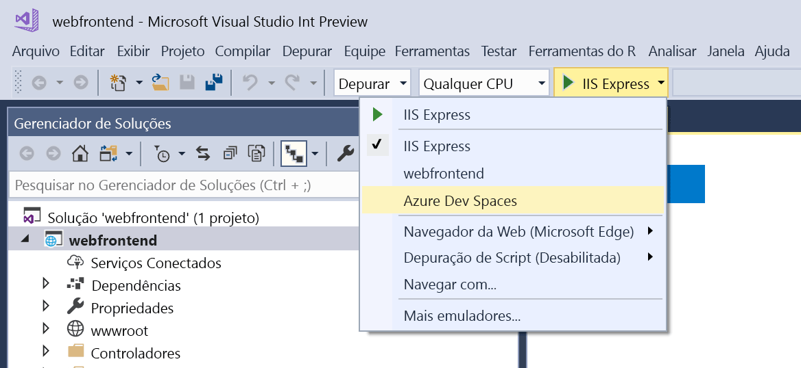
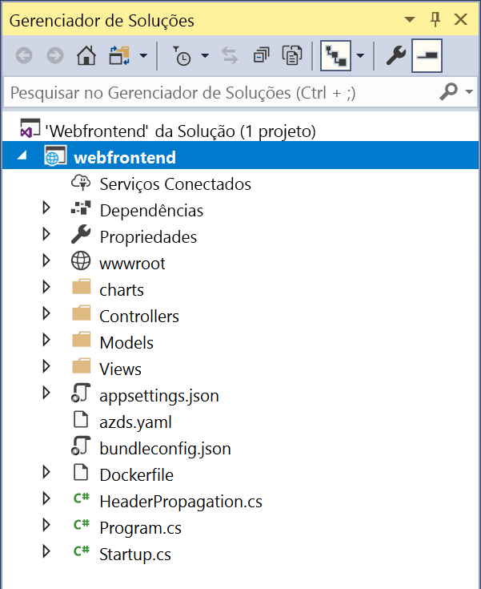

# Início Rápido: Criar um espaço de desenvolvimento do Kubernetes com o Azure Dev Spaces (.NET Core e Visual Studio)

Neste guia, você aprenderá a:

- Configure o Azure Dev Spaces com um cluster Kubernetes gerenciado no Azure.
- Desenvolva o código em contêineres iterativamente usando o Visual Studio.
- Depure o código em execução no cluster.

> [!Note]
> **Caso tenha problemas** a qualquer momento, consulte a seção [Solução de problemas](troubleshooting.md) ou poste um comentário nesta página. Você também pode experimentar um [tutorial](get-started-netcore-visualstudio.md) mais detalhado.

## pré-requisitos

- Um cluster do Kubernetes executando o Kubernetes 1.9.6 nas regiões EastUS, WestEurope ou CanadaEast, com o roteamento de aplicativo Http ativado.

  

- Visual Studio 2017 com a carga de trabalho Desenvolvimento Web instalada. Se ele não estiver instalado, baixe-o [aqui](https://aka.ms/vsdownload?utm_source=mscom&utm_campaign=msdocs).

## Configurar o Azure Dev Spaces

Instale a [extensão do Visual Studio para o Azure Dev Spaces](https://aka.ms/get-azds-visualstudio).

## Conectar a um cluster

Em seguida, você criará e configurará um projeto do Azure Dev Spaces.

### Criar um aplicativo Web ASP .NET

No Visual Studio 2017, crie um novo projeto. No momento, o projeto deve ser um **aplicativo Web do ASP.NET Core**. Nomeie o projeto como **webfrontend**.

Selecione o modelo **aplicativo Web (Model-View-Controller)** e verifique se você está usando **.NET Core** e **ASP.NET Core 2.0**.

### Criar um espaço de desenvolvimento no Azure

Depois que o projeto recém-criado estiver aberto, selecione **Azure Dev Spaces** na lista suspensa de configurações de inicialização, conforme mostrado abaixo.

Na caixa de diálogo que é exibida em seguida, verifique se você está conectado com a conta apropriada e selecione um cluster existente.

Deixe a lista suspensa **Espaço** como `default` por enquanto. Marque a caixa de seleção **Publicamente Acessível** para que o aplicativo Web possa ser acessado por meio de um ponto de extremidade público.

Clique em **OK** para selecionar ou criar o cluster.

Se você escolher um cluster que não foi configurado para trabalhar com Azure Dev Spaces, verá uma mensagem perguntando se deseja configurá-lo.

Escolha **OK**. 

### Examinar os arquivos adicionados ao projeto
Enquanto aguarda a criação do espaço de desenvolvimento, examine os arquivos que foram adicionados ao projeto quando optar por usar o Azure Dev Spaces.

- Uma pasta chamada `charts` foi adicionada e, dentro dessa pasta, foi feito scaffold de um [gráfico Helm](https://docs.helm.sh) para seu aplicativo. Esses arquivos são usados para implantar seu aplicativo no espaço de desenvolvimento.
- `Dockerfile` tem as informações necessárias para empacotar o aplicativo no formato padrão do Docker.
- `azds.yaml` contém informações de configuração necessárias para o espaço de desenvolvimento, por exemplo, se o aplicativo pode ser acessado por meio de um ponto de extremidade público.

## Depurar um contêiner no Kubernetes
Depois que o espaço de desenvolvimento for criado com êxito, você poderá depurar o aplicativo. Defina um ponto de interrupção no código, por exemplo, na linha 20 no arquivo `HomeController.cs` onde a variável `Message` é definida. Clique em **F5** para iniciar a depuração. 

O Visual Studio vai se comunicar com o espaço de desenvolvimento para criar e implantar o aplicativo e abrirá um navegador com o aplicativo Web em execução. Pode parecer que o contêiner está sendo executado localmente, mas, na verdade, ele está em execução no espaço de desenvolvimento no Azure. O motivo do endereço do localhost é que o Azure Dev Spaces cria um túnel SSH temporário para o contêiner em execução no Azure.

Clique no link **Sobre** na parte superior da página para disparar o ponto de interrupção. Você tem acesso completo às informações de depuração exatamente como teria se o código fosse executado localmente, por exemplo, a pilha de chamadas, as variáveis locais, as informações de exceção e muito mais.

## Próximas etapas

> [!div class="nextstepaction"]
> [Trabalhando com vários contêineres e desenvolvimento em equipe](get-started-netcore-visualstudio.md#call-another-container)