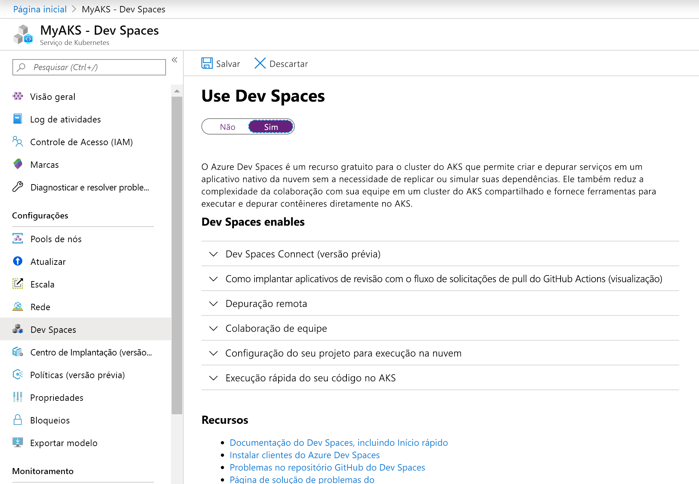

# <a name="quickstart-develop-with-net-core-on-kubernetes-with-azure-dev-spaces-visual-studio-2017"></a>Início Rápido: Desenvolver com o .NET Core no Kubernetes com o Azure Dev Spaces (Visual Studio 2017)

Neste guia, você aprenderá a:

- Configure o Azure Dev Spaces com um cluster Kubernetes gerenciado no Azure.
- Desenvolva o código em contêineres iterativamente usando o Visual Studio 2017.
- Depure o código em execução no cluster usando o Visual Studio 2017.

## <a name="prerequisites"></a>Pré-requisitos

- Uma assinatura do Azure. Se você não tiver uma, poderá [criar uma conta gratuita](https://azure.microsoft.com/free).
- Visual Studio 2017 no Windows com a carga de trabalho de desenvolvimento da Web instalada. Se ele não estiver instalado, baixe-o [aqui](https://aka.ms/vsdownload?utm_source=mscom&utm_campaign=msdocs).
- [Ferramentas do Visual Studio para Kubernetes](https://aka.ms/get-vsk8stools) instaladas.

## <a name="create-an-azure-kubernetes-service-cluster"></a>Criar um cluster do Serviço de Kubernetes do Azure

Você deve criar um cluster do AKS em uma [região com suporte](https://docs.microsoft.com/azure/dev-spaces/#a-rapid,-iterative-kubernetes-development-experience-for-teams). Para criar um cluster:

1. Entre no [Portal do Azure](https://portal.azure.com)
1. Selecione *+ Criar um recurso > Serviço de Kubernetes*. 
1. Insira a _Assinatura_, o _Grupo de Recursos_, o _nome do cluster Kubernetes_, a _Região_, a _versão do Kubernetes_ e o _prefixo de nome DNS_.

    

1. Clique em *Revisar + Criar*.
1. Clique em *Criar*.

## <a name="enable-azure-dev-spaces-on-your-aks-cluster"></a>Habilitar o Azure Dev Spaces no cluster do AKS

Navegue até o cluster AKS no portal do Azure e clique em *Dev Spaces*. Altere *Habilitar Dev Spaces* para *Sim* e clique em *Salvar*.



## <a name="create-a-new-aspnet-web-app"></a>Criar um aplicativo Web do ASP.NET

1. Abra o Visual Studio 2017.
1. Criar um novo projeto.
1. Escolha *aplicativo Web do ASP.NET Core* e nomeie o projeto como *webfrontend*.
1. Clique em *OK*.
1. Quando solicitado, escolha *Aplicativo Web (Model-View-Controller)* como o modelo.
1. Selecione *.NET Core* e *ASP.NET Core 2.0* na parte superior.
1. Clique em *OK*.

## <a name="connect-your-project-to-your-dev-space"></a>Conectar o projeto ao seu espaço de desenvolvimento

No eu projeto, selecione **Azure Dev Spaces** na lista suspensa de configurações de inicialização, conforme mostrado abaixo.


Na caixa de diálogo do Azure Dev Spaces, selecione suas *Assinatura* e *Cluster Kubernetes do Azure*. Deixe *Espaço* definido como *Padrão* e habilite a caixa de seleção *Publicamente Acessível*. Clique em *OK*.


Esse processo implanta o serviço no espaço de desenvolvimento *padrão* com uma URL publicamente acessível. Se você escolher um cluster que não foi configurado para trabalhar com Azure Dev Spaces, verá uma mensagem perguntando se deseja configurá-lo. Clique em *OK*.


A URL pública do serviço em execução no espaço de desenvolvimento *padrão* é exibida na janela *Saída*:

```cmd
Starting warmup for project 'webfrontend'.
Waiting for namespace to be provisioned.
Using dev space 'default' with target 'MyAKS'
...
Successfully built 1234567890ab
Successfully tagged webfrontend:devspaces-11122233344455566
Built container image in 39s
Waiting for container...
36s

Service 'webfrontend' port 'http' is available at http://webfrontend.1234567890abcdef1234.eus.azds.io/
Service 'webfrontend' port 80 (http) is available at http://localhost:62266
Completed warmup for project 'webfrontend' in 125 seconds.
```

No exemplo acima, a URL pública é http://webfrontend.1234567890abcdef1234.eus.azds.io/. Navegue até a URL pública do seu serviço e interaja com o serviço em execução no espaço de desenvolvimento.

## <a name="update-code"></a>Atualizar código

Se o Visual Studio 2017 ainda estiver conectado ao seu espaço de desenvolvimento, clique no botão Parar. Altere a linha 20 em `Controllers/HomeController.cs` para:
    
```csharp
ViewData["Message"] = "Your application description page in Azure.";
```

Salve suas alterações e inicie o serviço usando **Azure Dev Spaces** na lista suspensa de configurações de inicialização. Abra a URL pública do serviço em um navegador e clique em *Sobre*. Observe que a mensagem atualizada é exibida.

Em vez de recompilar e reimplantar uma nova imagem de contêiner sempre que houver edições de código, o Azure Dev Spaces recompilará incrementalmente o código dentro do contêiner existente para fornecer um loop de edição/depuração mais rápido.

## <a name="setting-and-using-breakpoints-for-debugging"></a>Definir e usar pontos de interrupção para depuração

Se o Visual Studio 2017 ainda estiver conectado ao seu espaço de desenvolvimento, clique no botão Parar. Abra `Controllers/HomeController.cs` e clique em algum lugar da linha 20 para colocar o cursor lá. Para definir um ponto de interrupção, pressione *F9* ou clique em *Depurar* e, em seguida, *Ativar/Desativar Pontos de Interrupção*. Para iniciar o serviço no modo de depuração no espaço de desenvolvimento, pressione *F5* ou clique em *Depurar* e, em seguida, *Iniciar Depuração*.

Abra o serviço em um navegador e observe que nenhuma mensagem foi exibida. Retorne ao Visual Studio 2017 e observe a linha 20 realçada. O ponto de interrupção definido colocou o serviço em pausa na linha 20. Para retomar o serviço, pressione *F5* ou clique em *Depurar* e, em seguida, *Continuar*. Volte para o navegador e observe que agora a mensagem foi exibida.

Durante a execução de seu serviço no Kubernetes com o depurador anexado, você tem acesso completo às informações de depuração como a pilha de chamadas, as variáveis locais e as informações de exceção.

Remova o ponto de interrupção, colocando o cursor na linha 20 em `Controllers/HomeController.cs` e pressionando *F9*.

## <a name="clean-up-your-azure-resources"></a>Limpar os recursos do Azure

Navegue até o grupo de recursos no portal do Azure e clique em *Excluir grupo de recursos*. Como alternativa, você pode usar o comando [az aks delete](/cli/azure/aks#az-aks-delete):

```cmd
az group delete --name MyResourceGroup --yes --no-wait
```

## <a name="next-steps"></a>Próximas etapas

> [!div class="nextstepaction"]
> [Trabalhando com vários contêineres e desenvolvimento em equipe](multi-service-netcore-visualstudio.md)
