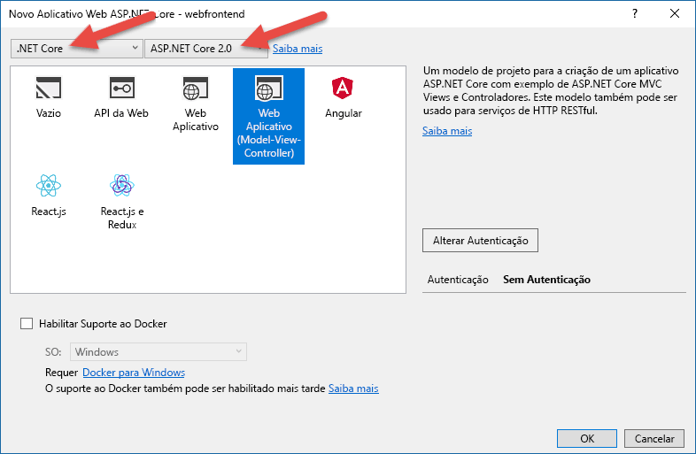
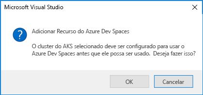

# Início Rápido: Criar um ambiente de desenvolvimento Kubernetes com o Azure Dev Spaces (.NET Core e Visual Studio)

Neste guia, você aprenderá a:

- Crie um ambiente baseado em Kubernetes no Azure otimizado para desenvolvimento.
- Desenvolva o código em contêineres iterativamente usando o Visual Studio.

[!INCLUDE]

[!INCLUDE]

## Obter as ferramentas do Visual Studio 
1. Instalar a versão mais recente do [Visual Studio 2017](https://www.visualstudio.com/vs/)
1. No instalador do Visual Studio, verifique se a Carga de Trabalho abaixo está selecionada:
    * Desenvolvimento Web e ASP.NET
1. Instale a [extensão do Visual Studio para o Azure Dev Spaces](https://aka.ms/get-azds-visualstudio)

Agora você está pronto para criar um aplicativo Web ASP.NET com o Visual Studio.

## Criar um aplicativo Web ASP .NET

No Visual Studio 2017, crie um novo projeto. No momento, o projeto deve ser um **aplicativo Web do ASP.NET Core**. Nomeie o projeto '**webfrontend**'.

Selecione o modelo **aplicativo Web (Model-View-Controller)** e verifique se você está usando **.NET Core** e **ASP.NET Core 2.0** nas duas listas suspensas na parte superior do diálogo. Clique em **OK** para criar o projeto.

## Criar um ambiente de desenvolvimento no Azure

Com o Azure Dev Spaces, você pode criar ambientes de desenvolvimento baseados em Kubernetes que são totalmente gerenciados pelo Azure e otimizados para desenvolvimento. Depois que o projeto recém-criado estiver aberto, selecione **Azure Dev Spaces** na lista suspensa de configurações de inicialização, conforme mostrado abaixo.

Na caixa de diálogo que é exibida em seguida, verifique se você está conectado com a conta apropriada e selecione um cluster existente.

Deixe a lista suspensa **Espaço** como `default` por enquanto. Posteriormente, você aprenderá mais sobre essa opção. Marque a caixa de seleção **Publicamente Acessível** para que o aplicativo Web possa ser acessado por meio de um ponto de extremidade público. Essa configuração não é necessária, mas será útil para demonstrar alguns conceitos deste passo a passo. Não se preocupe: em ambos os casos, você conseguirá depurar o site usando o Visual Studio.

Clique em **OK** para selecionar ou criar o cluster.

Se você escolher um cluster que não foi configurado para trabalhar com Azure Dev Spaces, verá uma mensagem perguntando se deseja configurá-lo.

Escolha **OK**. 

Uma tarefa em segundo plano será iniciada para isso. Ela levará alguns minutos para ser concluída. Para ver se ele ainda está sendo criado, passe o ponteiro sobre o ícone **Tarefas em segundo plano** no canto inferior esquerdo da barra de status, conforme mostrado na imagem a seguir.

> [!Note]
Só será possível depurar seu aplicativo depois que o ambiente de desenvolvimento for criado com êxito.

## Examinar os arquivos adicionados ao projeto
Enquanto aguarda a criação do ambiente de desenvolvimento, examine os arquivos que foram adicionados ao projeto quando optar por usar um ambiente de desenvolvimento.

Primeiro, você pode ver que uma pasta chamada `charts` foi adicionada e, dentro dessa pasta, foi feito scaffold de um [gráfico Helm](https://docs.helm.sh) para seu aplicativo. Esses arquivos são usados para implantar seu aplicativo no ambiente de desenvolvimento.

Você verá que um arquivo chamado `Dockerfile` foi adicionado. Esse arquivo tem as informações necessárias para empacotar o aplicativo no formato padrão do Docker. Um arquivo `HeaderPropagation.cs` também é criado; vamos discutir esse arquivo mais adiante no passo a passo. 

Por fim, você verá um arquivo chamado `azds.yaml`, que contém informações de configuração necessárias para o ambiente de desenvolvimento, por exemplo, se o aplicativo pode ser acessado por meio de um ponto de extremidade público.

## Depurar um contêiner no Kubernetes
Depois que o ambiente de desenvolvimento for criado com êxito, você poderá depurar o aplicativo. Defina um ponto de interrupção no código, por exemplo, na linha 20 no arquivo `HomeController.cs` onde a variável `Message` é definida. Clique em **F5** para iniciar a depuração. 

O Visual Studio se comunicará com o ambiente de desenvolvimento para criar e implantar o aplicativo e abrirá um navegador com o aplicativo Web em execução. Pode parecer que o contêiner está sendo executado localmente, mas, na verdade, ele está em execução no ambiente de desenvolvimento no Azure. O motivo do endereço do localhost é que o Azure Dev Spaces cria um túnel SSH temporário para o contêiner em execução no Azure.

Clique no link **Sobre** na parte superior da página para disparar o ponto de interrupção. Você tem acesso completo às informações de depuração exatamente como teria se o código fosse executado localmente, por exemplo, a pilha de chamadas, as variáveis locais, as informações de exceção e muito mais.

## Próximas etapas

> [!div class="nextstepaction"]
> [Trabalhando com vários contêineres e desenvolvimento em equipe](get-started-netcore-visualstudio.md#call-another-container)