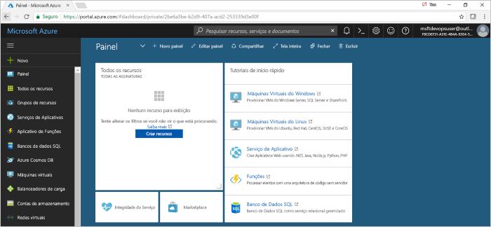
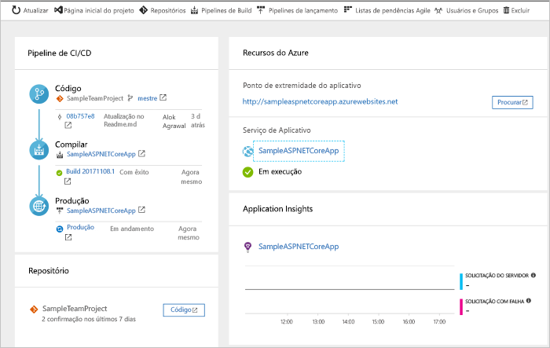
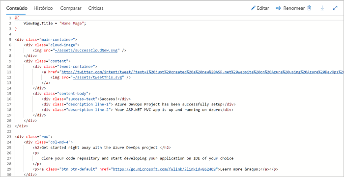

# Criar um pipeline de CI/CD para .NET com o Projeto de DevOps do Azure

Configure a integração contínua (CI) e a entrega contínua (CD) para seu aplicativo .NET Core ou ASP.NET com o **Azure DevOps Project**.  O Azure DevOps Project simplifica a configuração inicial de um build do Azure DevOps Services e o pipeline de lançamento.

Caso não tenha uma assinatura do Azure, você pode obter uma gratuita via [Visual Studio Dev Essentials](https://visualstudio.microsoft.com/dev-essentials/).

## Entre no Portal do Azure

O Azure DevOps Project cria um pipeline de CI/CD no Azure DevOps Services.  Você pode criar uma **nova organização Azure DevOps Services** ou usar uma **organização existente**.  O Projeto de DevOps do Azure também cria **recursos do Azure** na **assinatura do Azure** de sua escolha.

1. Entre no [portal do Microsoft Azure](https://portal.azure.com).

1. Escolha o ícone **Criar um recurso** na barra de navegação à esquerda e procure o **Projeto do DevOps**.  Escolha **Criar**.

    

## Selecionar um aplicativo de exemplo e o serviço do Azure

1. Selecione o aplicativo de exemplo do **.NET**.  Os exemplos do .NET incluem uma opção de estrutura do ASP.NET de fonte aberta ou estrutura do .NET Core de plataforma cruzada.

    

1. Selecione a estrutura de aplicativo do **.NET Core**.  Este exemplo é um aplicativo ASP.NET Core MVC. Quando terminar, escolha **Avançar**.

1. **Aplicativo Web no Windows** é o destino de implantação padrão.  Opcionalmente, você pode escolher Aplicativo Web no Linux ou Aplicativo Web para Contêineres.  A estrutura do aplicativo, escolhida nas etapas anteriores, determina o tipo de destino de implantação do serviço do Azure disponível aqui.  Mantenha o serviço padrão e selecione **Avançar**.

## Configurar o Azure DevOps Services e uma assinatura do Azure 

1. Crie uma **nova** organização do Azure DevOps Services gratuita ou escolha uma organização **existente**.  Escolha um **nome** para o Azure DevOps Project.  Selecione sua **assinatura do Azure**, **local** e escolha um **nome** para seu aplicativo.  Quando terminar, escolha **Concluído**.

1. Em alguns minutos, o **painel do Projeto do DevOps** é carregado no portal do Azure.  Um aplicativo de exemplo é configurado em um repositório em sua organização do Azure DevOps Services, é executado um build e seu aplicativo é implantado no Azure.  Esse painel oferece visibilidade no seu **repositório de código**, **pipeline de CI/CD do Azure DevOps Services** e seu **aplicativo no Azure**.  À direita do painel, selecione **Procurar** para exibir o aplicativo em execução.

     

## Confirmar as alterações de código e executar CI/CD

O Azure DevOps Project criou um repositório Git na sua organização do Azure DevOps Services ou na conta do GitHub.  Siga as etapas abaixo para exibir o repositório e fazer alterações de código no seu aplicativo.

1. No lado esquerdo do painel do Projeto de DevOps, selecione o link para seu branch **mestre**.  Esse link abre uma exibição do repositório de Git recém-criado.

1. Para exibir a URL de clone do repositório, selecione **Clone** na parte superior direita do navegador. Você pode clonar seu repositório Git no seu IDE favorito.  Nas próximas etapas, você pode usar o navegador da Web para criar e confirmar as alterações de código diretamente no branch mestre.

1. À esquerda do navegador, vá para o arquivo **Views/Home/index.cshtml**.

1. Selecione **Editar** e faça uma alteração no cabeçalho h2.  Por exemplo, digite **Começar agora mesmo com o Projeto de DevOps do Azure** ou faça outra alteração.

    

1. Escolha **Confirmar** e salve as alterações.

1. No seu navegador, navegue até o **Painel do Azure DevOps Project**.  Agora você deve ver uma compilação que está em andamento.  As alterações que você acabou de criar automaticamente são compiladas e implantadas por meio de um pipeline de CI/CD do Azure DevOps Services.

## Examinar o pipeline de CI/CD do Azure DevOps Services

O Azure DevOps Project configurou automaticamente um pipeline de CI/CD do Azure DevOps Services em sua organização do Azure DevOps Services.  Explore e personalize o pipeline conforme necessário.  Siga as etapas abaixo para se familiarizar com os pipelines de build e de lançamento do Azure DevOps Services.

1. Selecione **Pipelines de Build** na **parte superior** do painel do Azure DevOps Project.  Esse link abre uma guia do navegador e abre o pipeline de build do Azure DevOps Services para seu novo projeto.

1. Selecione as **reticências**.  Essa ação abre um menu no qual você pode iniciar várias atividades, como enfileirar um novo build, pausar um build e editar o pipeline de build.

1. Selecione **Editar**.

    

1. Nessa exibição, **examine as várias tarefas** para o pipeline de build.  A compilação realiza várias tarefas, como efetuar buscas das fontes no repositório Git do Azure Repos, restaurar dependências e publicar as saídas usadas para as implantações.

1. Na parte superior do pipeline de build, selecione o **nome do pipeline de build**.

1. Altere o **nome** do pipeline de build para algo mais descritivo.  Selecione **Salvar e pôr na fila**, depois selecione **Salvar**.

1. Embaixo do nome do pipeline de build, selecione **Histórico**.  Você verá uma trilha de auditoria das alterações recentes do build.  O Azure DevOps Services controla as alterações feitas no pipeline de build e permite que você compare as versões.

1. Selecione **Gatilhos**.  O Azure DevOps Project criou automaticamente um gatilho de CI e cada confirmação no repositório cria um novo build.  Você pode optar por incluir ou excluir os branches do processo de CI.

1. Selecione **Retenção**.  Com base em seu cenário, você pode especificar políticas para manter ou remover um determinado número de compilações.

1. Selecione **Compilação e Versão**, em seguida, escolha **Versões**.  O Azure DevOps Project criou um pipeline de lançamento do Azure DevOps Services para gerenciar implantações no Azure.

1. No lado esquerdo do navegador, selecione as **reticências** ao lado do pipeline de lançamento e escolha **Editar**.

1. O pipeline de lançamento contém um **pipeline** que define o processo de lançamento.  Em **Artefatos**, selecione **Soltar**.  O pipeline de build examinado nas etapas anteriores produz a saída usada para o artefato. 

1. No lado direito do ícone **Soltar**, selecione o **Gatilho de implantação contínua**.  Esse pipeline de lançamento tem um gatilho de CD habilitado, que executa uma implantação sempre que houver um novo artefato de build disponível.  Opcionalmente, você pode desabilitar o gatilho para que suas implantações exijam uma execução manual. 

1. À esquerda do navegador, selecione **Tarefas**.  As tarefas são as atividades que seu processo de implantação realiza.  Neste exemplo, uma tarefa foi criada para ser implantada no **serviço de Aplicativo do Azure**.

1. No lado direito do navegador, selecione **Exibir versões**.  Essa exibição mostra um histórico de versões.

1. Selecione as **reticências** ao lado de uma das versões e escolha **Abrir**.  Há vários menus para explorar nessa exibição, como um resumo da versão, itens de trabalho associados e testes.

1. Selecione **Confirmações**.  Essa exibição mostra as confirmações de código associadas à implantação específica. 

1. Selecione **Logs**.  Os logs contêm informações úteis sobre o processo de implantação.  Eles podem ser exibidos durante e após as implantações.

## Limpar recursos

Quando não for mais necessário, você poderá excluir o serviço Azure App e os recursos relacionados criados nesse início rápido usando a funcionalidade **Excluir** no painel do Azure DevOps Project.

## Próximas etapas

Para saber mais sobre como modificar os pipelines de build e de lançamento para atender às necessidades de sua equipe, consulte este tutorial:

> [!div class="nextstepaction"]
> [Personalizar o processo de CD](https://docs.microsoft.com/azure/devops/pipelines/release/define-multistage-release-process?view=vsts)

## vídeos

> [!VIDEO https://www.youtube.com/embed/itwqMf9aR0w]
