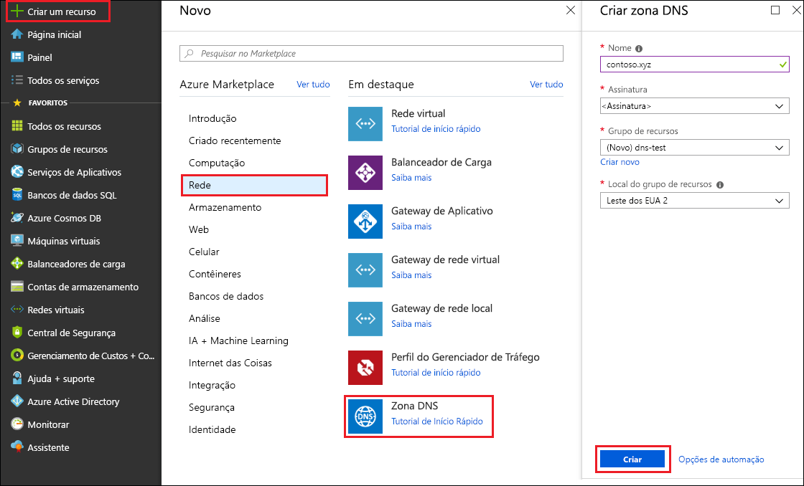

# <a name="quickstart-configure-azure-dns-for-name-resolution-by-using-the-portal"></a>Início Rápido: Configurar o DNS do Azure para resolução de nome usando o portal

Você pode configurar o DNS do Azure para resolver nomes de host em seu domínio público. Por exemplo, se você adquiriu o nome de domínio *contoso.com* de um registrador de nomes de domínio, pode configurar o DNS do Azure para hospedar o domínio *contoso.com* e resolver *www.contoso.com* para o endereço IP de seu servidor Web ou aplicativo Web.

Neste início rápido, você criará um domínio de teste e depois um registro de endereço para resolver o *www* do endereço IP *10.10.10.10*.

>[!IMPORTANT]
>Todos os nomes e endereços IP neste início rápido são exemplos que não representam cenários do mundo real. O início rápido também discute implicações do mundo real quando aplicável.

<!---
You can also perform these steps using [Azure PowerShell](dns-getstarted-powershell.md) or the cross-platform [Azure CLI](dns-getstarted-cli.md).
--->

Se você não tiver uma assinatura do Azure, crie uma [conta gratuita](https://azure.microsoft.com/free/?WT.mc_id=A261C142F) antes de começar.

Em todas as etapas do portal, entre no [portal do Azure](https://portal.azure.com).

## <a name="create-a-dns-zone"></a>Criar uma zona DNS

Uma zona DNS contém as entradas DNS para um domínio. Para iniciar a hospedagem do seu domínio no DNS do Azure, crie uma zona DNS para esse nome de domínio. 

**Para criar a zona DNS:**

1. No canto superior esquerdo, selecione **Criar um recurso**, em seguida, **Rede** e **Zona DNS**.
   
1. Na página **Criar zona DNS**, insira ou selecione os seguintes valores:
   
   - **Nome**: insira *contoso.xyz* para esse exemplo de início rápido. O nome da zona DNS pode ser qualquer valor que ainda não esteja configurado nos servidores DNS do Azure. Um valor real seria um domínio que você comprou de um registrador de nome de domínio.
   - **Grupo de recursos**: selecione **Criar novo**, insira *dns-test*e selecione **OK**. O nome do grupo de recursos deve ser exclusivo na assinatura do Azure. 
   
1. Selecione **Criar**.

   
   
A criação da zona pode levar alguns minutos.

## <a name="create-a-dns-record"></a>Criar um registro DNS

Crie registros ou entradas DNS para seu domínio dentro da zona DNS. Crie um novo registro de endereço ou o registro 'A' para resolver um nome de host para um endereço IPv4.

**Para criar um registro 'A':**

1. No portal do Azure, em **Todos os recursos**, abra zona DNS **contoso.xyz** no grupo de recursos **dns-test**. Você pode inserir *contoso.xyz* na caixa **Filtrar por nome** para encontrá-lo mais facilmente.

1. Na parte superior da página **Zona DNS**, selecione **+Conjunto de registros**.

1. Na página **Adicionar investigação de integridade**, insira ou selecione os seguintes valores:

   - **Nome**: insira *www*. O nome do registro é o nome de host que você deseja resolver para o endereço IP especificado.
   - **Tipo**: selecione **A**. Registros 'A' são os mais comuns, mas há outros tipos de registro para servidores de email ('MX'), endereços IP v6 ('AAAA') e assim por diante. 
   - **TTL**: insira *1*. O *Tempo até ser ativado* da solicitação de DNS especifica por quanto tempo clientes e servidores DNS podem armazenar uma resposta em cache.
   - **Unidade de TTL**: selecione **Horas**. Esta é a unidade de tempo para o valor **TTL**. 
   - **Endereço IP**: para este exemplo de início rápido, insira *10.10.10.10*. Esse valor é o endereço IP para o qual o registro resolve. Em um cenário do mundo real, você inseriria o endereço IP público do seu servidor Web.

Como este início rápido não usa um domínio real, não é necessário configurar os servidores de nome DNS do Azure em um registrador de nome de domínio. Com um domínio real, a intenção é que qualquer pessoa na Internet resolva o nome do host para se conectar a seu servidor ou aplicativo Web. Você visitará seu registrador de nome de domínio para substituir os registros de nome de servidor com os servidores de nome do DNS do Azure. Para saber mais, consulte [Tutorial: Hospedar seu domínio no DNS do Azure](dns-delegate-domain-azure-dns.md#delegate-the-domain).

## <a name="test-the-name-resolution"></a>Testar a resolução de nome

Agora que você tem uma zona DNS de teste com um registro 'A' de teste, é possível testar a resolução de nome com uma ferramenta chamada *nslookup*. 

**Para testar a resolução de nomes DNS:**

1. No portal do Azure, em **Todos os recursos**, abra zona DNS **contoso.xyz** no grupo de recursos **dns-test**. Você pode inserir *contoso.xyz* na caixa **Filtrar por nome** para encontrá-lo mais facilmente.

1. Copie um dos nomes de servidor da lista de servidores de nome na página **Visão geral**. 
   
   
   
   >[!NOTE]
   >Em um cenário do mundo real, você copia todos os quatro nomes de servidor, incluindo os pontos à direita e os usa nos novos nomes de servidor de nome DNS do Azure no seu registrador de domínio. Para obter mais informações, confira [Delegar um domínio ao DNS do Azure](dns-delegate-domain-azure-dns.md)
   
1. Abra um prompt de comando e execute o seguinte:

   ```
   nslookup <host name> <name server name>
   ```
   
   Por exemplo: 
   
   ```
   nslookup www.contoso.xyz ns1-08.azure-dns.com.
   ```
   
   Você deve ver algo semelhante à tela a seguir:
   
   

O nome do host **www.contoso.xyz** resolve para **10.10.10.10**, conforme você o configurou. Esse resultado verifica se a resolução do nome está funcionando corretamente. 

## <a name="clean-up-resources"></a>Limpar recursos

Quando não precisar mais dos recursos criados neste início rápido, remova-os excluindo o grupo de recursos **dns-test**. Abra o grupo de recursos **dns-test** e selecione **Excluir grupo de recursos**.

## <a name="next-steps"></a>Próximas etapas

> [!div class="nextstepaction"]
> [Criar registros DNS para um aplicativo Web em um domínio personalizado](./dns-web-sites-custom-domain.md)