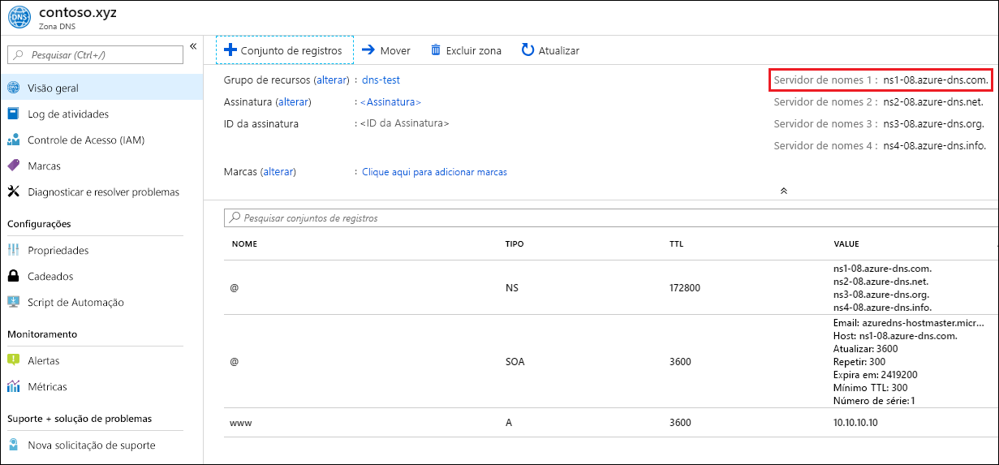

# <a name="quickstart-configure-azure-dns-for-name-resolution-using-the-azure-portal"></a>Início Rápido: Configurar o DNS do Azure para resolução de nome usando o Portal do Azure

 Você pode configurar o DNS do Azure para resolver nomes de host em seu domínio público. Por exemplo, se você adquiriu o nome de domínio contoso.com de um registrador de nome de domínio, pode configurar o DNS do Azure para hospedar o domínio contoso.com e resolver www.contoso.com para o endereço IP de seu servidor Web ou aplicativo Web.

Neste início rápido, você cria um domínio de teste e um registro de endereço nomeado 'www' para resolver o endereço IP 10.10.10.10.

É importante saber que todos os nomes e endereços IP usados neste início rápido são apenas exemplos e não representam um cenário do mundo real. No entanto, quando aplicável, cenários do mundo real também serão descritos.

<!---
You can also perform these steps using [Azure PowerShell](dns-getstarted-powershell.md) or the cross-platform [Azure CLI 2.0](dns-getstarted-cli.md).
--->

Uma zona DNS é usada para conter as entradas DNS de um domínio específico. Para iniciar a hospedagem do seu domínio no DNS do Azure, você precisará criar uma zona DNS para esse nome de domínio. Cada entrada (ou registro) DNS para seu domínio é criada dentro dessa zona DNS. As etapas a seguir mostram como fazer isso.

Se você não tiver uma assinatura do Azure, crie uma [conta gratuita](https://azure.microsoft.com/free/?WT.mc_id=A261C142F) antes de começar.

## <a name="create-a-dns-zone"></a>Criar uma zona DNS

1. Entre no Portal do Azure.
2. No menu superior esquerdo, clique em **+Criar um recurso**, **Rede** e clique em **Zona DNS** para abrir a página **Criar zona DNS**.

    

4. Na página **Criar zona DNS**, insira os seguintes valores e clique em **Criar**:


   | **Configuração** | **Valor** | **Detalhes** |
   |---|---|---|
   |**Nome**|Contoso.xyz|O nome da zona DNS do exemplo. Você pode usar qualquer valor desejado para este início rápido, desde que ainda não esteja configurado nos servidores do DNS do Azure. Um valor real seria um domínio que você comprou de um registrador de nome de domínio.|
   |**Assinatura**|[Sua assinatura]|Selecione uma assinatura para criar a zona DNS.|
   |**Grupo de recursos**|**Criar novo:** dns-test|Crie um grupos de recursos. O nome do grupo de recursos deve ser exclusivo na assinatura selecionada. |
   |**Localidade**|Leste dos EUA||

A criação da zona pode levar alguns minutos.

## <a name="create-a-dns-record"></a>Criar um registro DNS

Agora, crie um novo registro de endereço (registro 'A'). Registros 'A' são usados para resolver um nome de host para um endereço IP v4.

1. No painel **Favoritos** do portal do Azure, clique em **Todos os recursos**. Clique na zona DNS **contoso.xyz** na página Todos os recursos. Se a assinatura selecionada já contém vários recursos, você pode inserir **contoso.xyz** na caixa **Filtrar por nome...** para acessar a Zona DNS facilmente.

1. Na parte superior da página **zona DNS**, selecione **+Conjunto de registros** para abrir a página **Adicionar conjunto de registros**.

1. Na página **Adicionar conjunto de registros**, digite os valores abaixo e clique em **OK**. Neste exemplo, crie um registro 'A'.

   |**Configuração** | **Valor** | **Detalhes** |
   |---|---|---|
   |**Nome**|www|Nome do registro. Esse é o nome que você deseja usar para o host que deve resolver para um endereço IP.|
   |**Tipo**|O | Tipo de registro DNS a ser criado. Registros 'A' são os mais comuns, mas há outros tipos de registro para servidores de email (MX), endereços IP v6 (AAAA) e assim por diante. |
   |**TTL**|1|Vida útil da solicitação de DNS. Especifica por quanto tempo clientes e servidores DNS podem armazenar uma resposta em cache.|
   |**Unidade de TTL**|hours|Medição de tempo para o valor de TTL.|
   |**Endereço IP**|10.10.10.10| Esse valor é o endereço IP para o qual o registro “A” resolve. É apenas um valor de teste para este início rápido. Para obter um exemplo do mundo real, você digitaria o endereço IP público de seu servidor Web.|


Já que você não compra um nome de domínio real neste início rápido, não é necessário configurar o DNS do Azure como o servidor de nomes em seu registrador de nome de domínio. Mas, em um cenário do mundo real, seria ideal que qualquer pessoa na Internet fosse capaz de resolver o nome do host para se conectar a seu servidor ou aplicativo Web. Para obter mais informações sobre esse cenário do mundo real, consulte [Delegar um domínio ao DNS do Azure](dns-delegate-domain-azure-dns.md).


## <a name="test-the-name-resolution"></a>Testar a resolução de nome

Agora que você tem uma zona de teste com um registro de 'A' de teste, pode testar a resolução de nome com uma ferramenta chamada nslookup. 

1. Primeiro você precisa anotar os servidores de nome do DNS do Azure que serão usados com o nslookup. 

   Os servidores de nome para sua zona são listados na página **Visão Geral** da zona DNS. Copie o nome de um dos servidores de nome:

   

2. Agora, abra um prompt de comando e execute o seguinte comando:

   ```
   nslookup <host name> <name server>
   
   For example:

   nslookup www.contoso.xyz ns1-08.azure-dns.com
   ```

Você deverá ver algo semelhante à seguinte captura de tela:


Isso verifica se a resolução de nomes está funcionando corretamente. www.contoso.xyz resolve para 10.10.10.10, exatamente como você o configurou!

## <a name="clean-up-resources"></a>Limpar recursos

Quando não for mais necessário, exclua o grupo de recursos **dns-test** para excluir os recursos criados neste início rápido. Para fazer isso, clique no grupo de recursos **dns-test** e clique em **Excluir grupo de recursos**.


## <a name="next-steps"></a>Próximas etapas

> [!div class="nextstepaction"]
> [Criar registros DNS para um aplicativo Web em um domínio personalizado](./dns-web-sites-custom-domain.md)