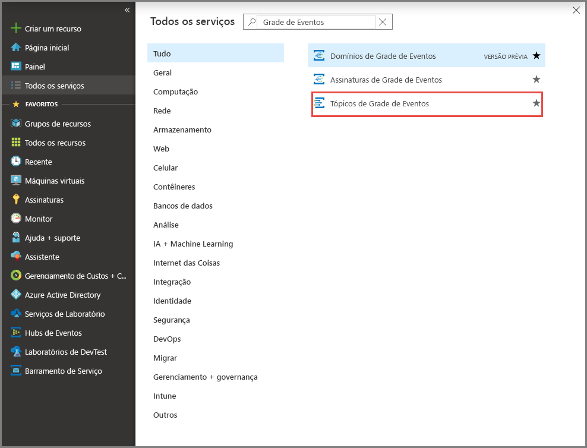
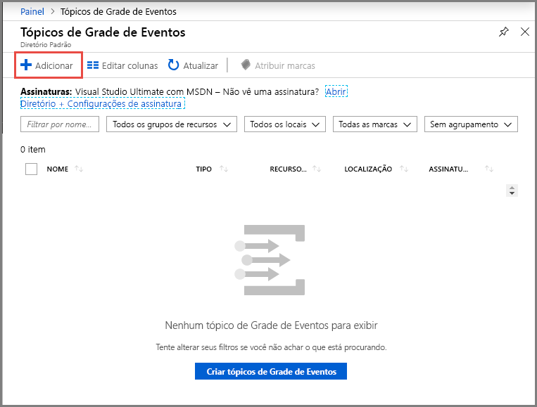
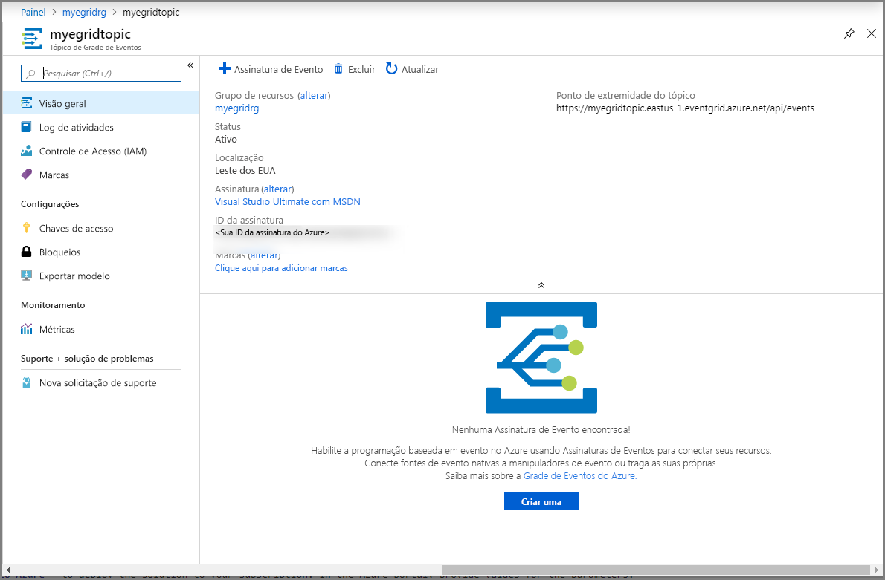
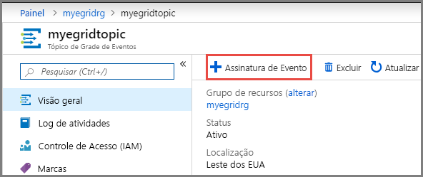
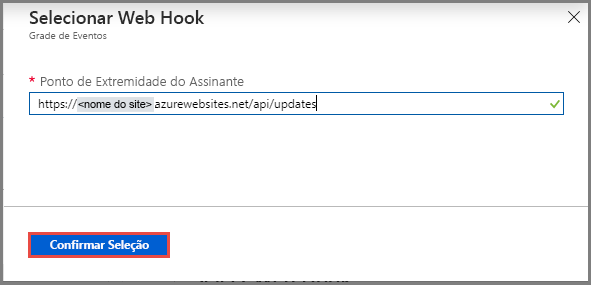

# <a name="quickstart-route-custom-events-to-web-endpoint-with-the-azure-portal-and-event-grid"></a>Início Rápido: Encaminhar eventos personalizados ao ponto de extremidade Web com o portal do Azure e a Grade de Eventos

A Grade de Eventos do Azure é um serviço de eventos para a nuvem. Neste artigo, você pode usar o portal do Azure para criar um tópico personalizado, assinar o tópico personalizado e disparar o evento para exibir o resultado. Normalmente, você envia eventos para um ponto de extremidade que processa os dados de evento e realiza ações. No entanto, para simplificar este artigo, você enviará os eventos para um aplicativo Web que coleta e exibe as mensagens.

Ao concluir, você verá que os dados do evento foram enviados para um aplicativo Web.


[!INCLUDE [updated-for-az](../../includes/updated-for-az.md)]

[!INCLUDE [quickstarts-free-trial-note.md](../../includes/quickstarts-free-trial-note.md)]

[!INCLUDE [event-grid-register-provider-portal.md](../../includes/event-grid-register-provider-portal.md)]

## <a name="create-a-custom-topic"></a>Criar um tópico personalizado

Um tópico de grade de evento fornece um ponto de extremidade definido pelo usuário no qual você posta seus eventos. 

1. Entre no [Portal do Azure](https://portal.azure.com/).
2. Selecione **Todos os serviços** no menu de navegação à esquerda, pesquise **Grade de Eventos** e selecione **Tópicos da Grade de Eventos**. 

    
3. Na página **Tópicos da Grade de Eventos**, selecione **+ Adicionar** na barra de ferramentas. 

    
4. Na página **Criar Tópico**, siga estas etapas:
    1. Informe um **nome** exclusivo para o tópico personalizado. O nome do tópico deve ser exclusivo, pois é representado por uma entrada DNS. Não use o nome mostrado na imagem. Em vez disso, crie seu próprio nome – ele deve ter entre 3 e 50 caracteres e conter apenas valores a-z, A-Z, 0-9 e "-".
    2. Selecione sua **assinatura**do Azure.
    3. Selecione um grupo de recursos existente ou selecione **Criar novo** e insira um **nome** para o **grupo de recursos**.
    4. Selecione um **local** para o tópico de grade de eventos.
    5. Mantenha o valor padrão **Esquema de Grade de Eventos** para o campo **Esquema de Eventos**. 

       
    6. Selecione **Criar**. 
5. Depois que o tópico personalizado tiver sido criado, você verá a notificação de êxito. Selecione **Ir para grupo de recursos**. 

   
6. Na página **Grupo de Recursos**, selecione o tópico de grade de eventos. 

   
7. Você vê a página **Tópico de Grade de Eventos** para sua grade de eventos. Mantenha essa página aberta. Você a usará posteriormente no início rápido. 

    

## <a name="create-a-message-endpoint"></a>Criar um ponto de extremidade de mensagem
Antes de criar uma assinatura para o tópico personalizado, crie um ponto de extremidade para a mensagem de evento. Normalmente, o ponto de extremidade executa ações com base nos dados de evento. Para simplificar este início rápido, você implanta um [aplicativo Web criado previamente](https://github.com/Azure-Samples/azure-event-grid-viewer) que exibe as mensagens de eventos. A solução implantada inclui um plano do Serviço de Aplicativo, um aplicativo Web do Aplicativo do Serviço de e o código-fonte do GitHub.

1. Na página do artigo, selecione **Implantar no Azure** para implantar a solução na sua assinatura. No portal do Azure, forneça os valores para os parâmetros.

   <a href="https://portal.azure.com/#create/Microsoft.Template/uri/https%3A%2F%2Fraw.githubusercontent.com%2FAzure-Samples%2Fazure-event-grid-viewer%2Fmaster%2Fazuredeploy.json" target="_blank"></a>
1. A implantação pode levar alguns minutos para ser concluída. Depois que a implantação for bem-sucedida, exiba seu aplicativo Web para garantir que ele esteja em execução. Em um navegador da Web, navegue até: `https://<your-site-name>.azurewebsites.net`
1. Você verá o site, mas nenhum evento ainda estará publicado.

   

## <a name="subscribe-to-custom-topic"></a>Inscrever-se em um tópico personalizado

Você assina um tópico da grade de eventos para indicar à Grade de Eventos quais eventos você deseja acompanhar e para onde enviá-los.

1. Agora, na página **Tópico de Grade de Eventos** para seu tópico personalizado, selecione **+ Assinatura de Evento** na barra de ferramentas.

   
2. Na página **Criar Assinatura de Eventos**, siga estas etapas:
    1. Insira um **nome** para a assinatura de evento.
    3. Selecione **Web Hook** para o **Tipo de ponto de extremidade**. 
    4. Escolha **Selecionar um ponto de extremidade**. 

       
    5. Para o ponto de extremidade do web hook, forneça a URL do seu aplicativo Web e adicione `api/updates` à URL da página inicial. Selecione **Confirmar seleção**.

       
    6. Volte para a página **Criar Assinatura de Evento** e selecione **Criar**.

3. Exiba novamente o seu aplicativo Web e observe que um evento de validação de assinatura foi enviado a ele. Selecione o ícone de olho para expandir os dados de evento. A Grade de Eventos envia o evento de validação de modo que o ponto de extremidade possa verificar se ele deseja receber os dados de evento. O aplicativo Web inclui o código para validar a assinatura.

    

## <a name="send-an-event-to-your-topic"></a>Enviar um evento para o tópico

Agora, vamos disparar um evento para ver como a Grade de Eventos distribui a mensagem para o ponto de extremidade. Use a CLI do Azure ou o PowerShell para enviar um evento de teste para seu tópico personalizado. Normalmente, um aplicativo ou serviço do Azure enviaria os dados de evento.

O primeiro exemplo usa a CLI do Azure. Ele obtém a URL e a chave do tópico personalizado, além dos dados de evento de exemplo. Use o nome do tópico personalizado para `<topic name>`. Ele cria dados de evento de exemplo. O elemento `data` do JSON é a carga do evento. Qualquer JSON bem formado pode ficar nesse campo. Você também pode usar o campo de assunto para roteamento e filtragem avançados. CURL é um utilitário que envia solicitações HTTP.


### <a name="azure-cli"></a>CLI do Azure
1. No portal do Azure, selecione **Cloud Shell**. Selecione **Bash** no canto superior esquerdo da janela do Cloud Shell. 

    
1. Execute o seguinte comando para obter o **ponto de extremidade** para o tópico: Depois de copiar e colar o comando, atualize o **nome do tópico** e o **nome do grupo de recursos** antes de executar o comando. 

    ```azurecli
    endpoint=$(az eventgrid topic show --name <topic name> -g <resource group name> --query "endpoint" --output tsv)
    ```
2. Execute o seguinte comando para obter a **chave** para o tópico personalizado: Depois de copiar e colar o comando, atualize o **nome do tópico** e o **nome do grupo de recursos** antes de executar o comando. 

    ```azurecli
    key=$(az eventgrid topic key list --name <topic name> -g <resource group name> --query "key1" --output tsv)
    ```
3. Copie a seguinte instrução com a definição do evento e pressione **ENTER**. 

    ```json
    event='[ {"id": "'"$RANDOM"'", "eventType": "recordInserted", "subject": "myapp/vehicles/motorcycles", "eventTime": "'`date +%Y-%m-%dT%H:%M:%S%z`'", "data":{ "make": "Ducati", "model": "Monster"},"dataVersion": "1.0"} ]'
    ```
4. Execute o seguinte comando **Curl** para publicar o evento:

    ```
    curl -X POST -H "aeg-sas-key: $key" -d "$event" $endpoint
    ```

### <a name="azure-powershell"></a>Azure PowerShell
O segundo exemplo usa o PowerShell para realizar etapas semelhantes.

1. No portal do Azure, selecione **Cloud Shell**. Selecione **PowerShell** no canto superior esquerdo da janela do Cloud Shell. Veja a imagem da janela **Cloud Shell** de exemplo na seção da CLI do Azure. 
2. Execute o seguinte comando para obter o **ponto de extremidade** para o tópico: Depois de copiar e colar o comando, atualize o **nome do tópico** e o **nome do grupo de recursos** antes de executar o comando. 

    ```powershell
    $endpoint = (Get-AzEventGridTopic -ResourceGroupName <resource group name> -Name <topic name>).Endpoint
    ```
3. Execute o seguinte comando para obter a **chave** para o tópico personalizado: Depois de copiar e colar o comando, atualize o **nome do tópico** e o **nome do grupo de recursos** antes de executar o comando.

    ```powershell
    $keys = Get-AzEventGridTopicKey -ResourceGroupName gridResourceGroup -Name <topic name>
    ```
4. Prepare o evento. Copie e execute as instruções na janela do Cloud Shell. 

    ```azurepowershell
    $eventID = Get-Random 99999

    #Date format should be SortableDateTimePattern (ISO 8601)
    $eventDate = Get-Date -Format s

    #Construct body using Hashtable
    $htbody = @{
        id= $eventID
        eventType="recordInserted"
        subject="myapp/vehicles/motorcycles"
        eventTime= $eventDate   
        data= @{
            make="Ducati"
            model="Monster"
        }
        dataVersion="1.0"
    }
    
    #Use ConvertTo-Json to convert event body from Hashtable to JSON Object
    #Append square brackets to the converted JSON payload since they are expected in the event's JSON payload syntax
    $body = "["+(ConvertTo-Json $htbody)+"]"
    ```
5. Use o cmdlet **Invoke-WebRequest** para enviar o evento. 

    ```powershell
    Invoke-WebRequest -Uri $endpoint -Method POST -Body $body -Headers @{"aeg-sas-key" = $keys.Key1}
    ```

### <a name="verify-in-the-event-grid-viewer"></a>Verifique se no Visualizador de Grade de Eventos
Você disparou o evento, e a Grade de Eventos enviou a mensagem para o ponto de extremidade configurado durante a assinatura. Exiba seu aplicativo Web para ver o evento que você acabou de enviar.

```json
{
  "id": "974",
  "eventType": "recordInserted",
  "subject": "myapp/vehicles/motorcycles",
  "eventTime": "2019-03-28T01:11:59+00:00",
  "data": {
    "make": "Ducati",
    "model": "Monster"
  },
  "dataVersion": "1.0",
  "metadataVersion": "1",
  "topic": "/subscriptions/11111111-1111-1111-1111-111111111111/resourceGroups/myegridrg/providers/Microsoft.EventGrid/topics/myegridtopic"
}
```

## <a name="clean-up-resources"></a>Limpar recursos
Caso planeje continuar a trabalhar com esse evento, não limpe os recursos criados neste artigo. Caso contrário, exclua os recursos criados neste artigo.

1. Selecione **Grupos de Recursos** no menu esquerdo. Se você não o visualizar no menu à esquerda, selecione **Todos os Serviços** no menu à esquerda e selecione **Grupos de Recursos**. 
2. Selecione o grupo de recursos para iniciar a página **Grupo de Recursos**. 
3. Selecione **Excluir grupo de recursos** na barra de ferramentas. 
4. Confirme a exclusão inserindo o nome do grupo de recursos e selecione **Excluir**. 

    

    O outro grupo de recursos que você vê na imagem foi criado e usado pela janela do Cloud Shell. Exclua-o se você não planeja usar a janela do Cloud Shell mais tarde. 

## <a name="next-steps"></a>Próximas etapas

Agora que você sabe como criar tópicos e assinaturas de evento personalizados, saiba mais sobre como a Grade de Eventos pode ajudá-lo:

- [Sobre a Grade de Eventos](overview.md)
- [Rotear eventos do Armazenamento de Blobs para um ponto de extremidade da Web personalizado](../storage/blobs/storage-blob-event-quickstart.md?toc=%2fazure%2fevent-grid%2ftoc.json)
- [Monitorar alterações de máquina virtual com a Grade de Eventos do Azure e os Aplicativos Lógicos](monitor-virtual-machine-changes-event-grid-logic-app.md)
- [Transmitir Big Data para um data warehouse](event-grid-event-hubs-integration.md)
