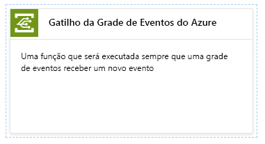
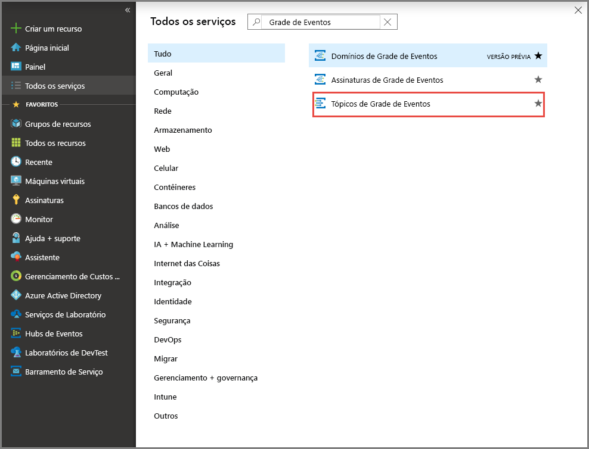
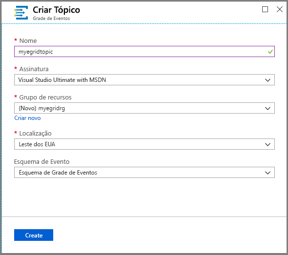
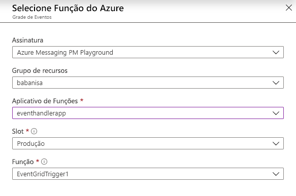
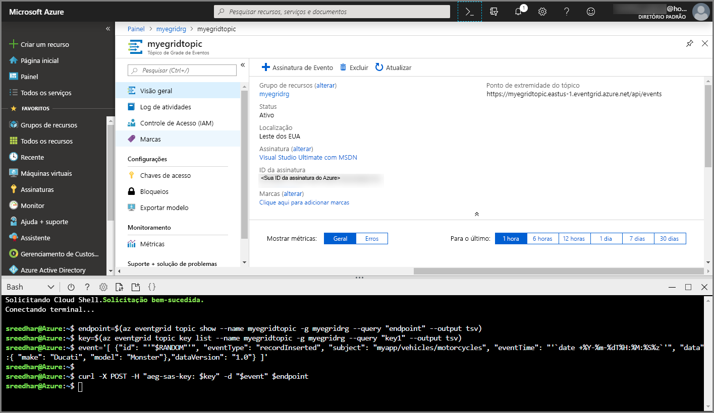
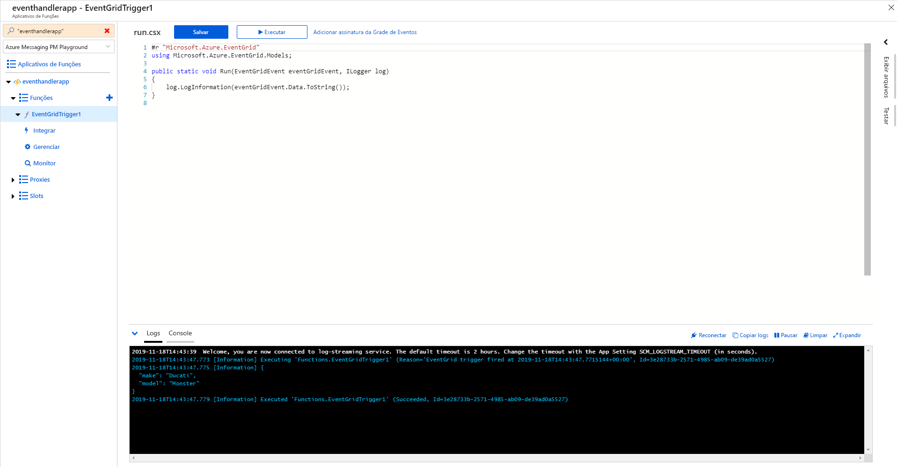

# <a name="quickstart-route-custom-events-to-an-azure-function-with-event-grid"></a>Início Rápido: Rotear eventos personalizados para uma Função do Azure com a Grade de Eventos

A Grade de Eventos do Azure é um serviço de eventos para a nuvem. O Azure Functions é um dos manipuladores de eventos com suporte. Neste artigo, você pode usar o portal do Azure para criar um tópico personalizado, assinar o tópico personalizado e disparar o evento para exibir o resultado. Você envia os eventos para uma Função do Azure.

[!INCLUDE [quickstarts-free-trial-note.md](../../includes/quickstarts-free-trial-note.md)]

## <a name="create-azure-function"></a>Criar Função do Azure

Antes de assinar o tópico personalizado, vamos criar uma função para a lidar com os eventos. No portal do Azure, clique em 'Criar um recurso', digite 'função ', escolha 'aplicativo de funções' e clique em Criar. Selecione 'Criar novo' em grupo de recursos e dê a ele um nome. Você usará isso para o restante do tutorial. Dê ao aplicativo de funções um nome, deixe a alternância 'Publicar' em 'Código', selecione qualquer runtime e região e clique em Criar.

Quando o aplicativo de funções estiver pronto, navegue até ele e clique em '+ Nova Função'. Selecione 'No portal' para o ambiente de desenvolvimento e clique em Continuar. Em Criar uma função, escolha 'Mais modelos' para exibir mais modelos e, em seguida, procure 'Gatilho da Grade de Eventos do Azure' e selecione-o. Se esta for a primeira vez que você usa esse gatilho, talvez seja necessário clicar em 'Instalar' para instalar a extensão.



Depois de instalar a extensão, clique em Continuar, dê um nome à sua função e clique em Criar.

[!INCLUDE [event-grid-register-provider-portal.md](../../includes/event-grid-register-provider-portal.md)]

## <a name="create-a-custom-topic"></a>Criar um tópico personalizado

Um tópico de grade de evento fornece um ponto de extremidade definido pelo usuário no qual você posta seus eventos. 

1. Entre no [Portal do Azure](https://portal.azure.com/).
2. Selecione **Todos os serviços** no menu de navegação à esquerda, pesquise **Grade de Eventos** e selecione **Tópicos da Grade de Eventos**. 

    
3. Na página **Tópicos da Grade de Eventos**, selecione **+ Adicionar** na barra de ferramentas. 

    

4. Na página **Criar Tópico**, siga estas etapas:

    1. Informe um **nome** exclusivo para o tópico personalizado. O nome do tópico deve ser exclusivo, pois é representado por uma entrada DNS. Não use o nome mostrado na imagem. Em vez disso, crie seu próprio nome – ele deve ter entre 3 e 50 caracteres e conter apenas valores a-z, A-Z, 0-9 e "-".
    2. Selecione sua **assinatura**do Azure.
    3. Selecione o mesmo grupo de recursos das etapas anteriores.
    4. Selecione um **local** para o tópico de grade de eventos.
    5. Mantenha o valor padrão **Esquema de Grade de Eventos** para o campo **Esquema de Eventos**. 

       
    6. Selecione **Criar**. 

5. Depois que o tópico personalizado tiver sido criado, você verá a notificação de êxito. Selecione **Ir para grupo de recursos**. 

   

6. Na página **Grupo de Recursos**, selecione o tópico de grade de eventos. 

   

7. Você vê a página **Tópico de Grade de Eventos** para sua grade de eventos. Mantenha essa página aberta. Você a usará posteriormente no início rápido. 

    

## <a name="subscribe-to-custom-topic"></a>Inscrever-se em um tópico personalizado

Você assina um tópico da grade de eventos para indicar à Grade de Eventos quais eventos você deseja acompanhar e para onde enviá-los.

1. Agora, na página **Tópico de Grade de Eventos** para seu tópico personalizado, selecione **+ Assinatura de Evento** na barra de ferramentas.

   

2. Na página **Criar Assinatura de Eventos**, siga estas etapas:
    1. Insira um **nome** para a assinatura de evento.
    3. Selecione **Função do Azure** para o **tipo de ponto de extremidade**. 
    4. Escolha **Selecionar um ponto de extremidade**. 

       

    5. Para o ponto de extremidade da função, selecione a Assinatura do Azure e o Grupo de Recursos no qual o aplicativo de funções está e, em seguida, selecione o aplicativo de funções e a função que você criou anteriormente. Selecione **Confirmar seleção**.

       

    6. Volte para a página **Criar Assinatura de Evento** e selecione **Criar**.

## <a name="send-an-event-to-your-topic"></a>Enviar um evento para o tópico

Agora, vamos disparar um evento para ver como a Grade de Eventos distribui a mensagem para o ponto de extremidade. Use a CLI do Azure ou o PowerShell para enviar um evento de teste para seu tópico personalizado. Normalmente, um aplicativo ou serviço do Azure enviaria os dados de evento.

O primeiro exemplo usa a CLI do Azure. Ele obtém a URL e a chave do tópico personalizado, além dos dados de evento de exemplo. Use o nome do tópico personalizado para `<topic name>`. Ele cria dados de evento de exemplo. O elemento `data` do JSON é a carga do evento. Qualquer JSON bem formado pode ficar nesse campo. Você também pode usar o campo de assunto para roteamento e filtragem avançados. CURL é um utilitário que envia solicitações HTTP.


### <a name="azure-cli"></a>CLI do Azure
1. No portal do Azure, selecione **Cloud Shell**. Selecione **Bash** no canto superior esquerdo da janela do Cloud Shell. 

    
1. Execute o seguinte comando para obter o **ponto de extremidade** para o tópico: Depois de copiar e colar o comando, atualize o **nome do tópico** e o **nome do grupo de recursos** antes de executar o comando. 

    ```azurecli
    endpoint=$(az eventgrid topic show --name <topic name> -g <resource group name> --query "endpoint" --output tsv)
    ```
2. Execute o seguinte comando para obter a **chave** para o tópico personalizado: Depois de copiar e colar o comando, atualize o **nome do tópico** e o **nome do grupo de recursos** antes de executar o comando. 

    ```azurecli
    key=$(az eventgrid topic key list --name <topic name> -g <resource group name> --query "key1" --output tsv)
    ```
3. Copie a seguinte instrução com a definição do evento e pressione **ENTER**. 

    ```json
    event='[ {"id": "'"$RANDOM"'", "eventType": "recordInserted", "subject": "myapp/vehicles/motorcycles", "eventTime": "'`date +%Y-%m-%dT%H:%M:%S%z`'", "data":{ "make": "Ducati", "model": "Monster"},"dataVersion": "1.0"} ]'
    ```
4. Execute o seguinte comando **Curl** para publicar o evento:

    ```
    curl -X POST -H "aeg-sas-key: $key" -d "$event" $endpoint
    ```

### <a name="azure-powershell"></a>Azure PowerShell
O segundo exemplo usa o PowerShell para realizar etapas semelhantes.

1. No portal do Azure, selecione **Cloud Shell** (como alternativa, acesse https://shell.azure.com/) ). Selecione **PowerShell** no canto superior esquerdo da janela do Cloud Shell. Veja a imagem da janela **Cloud Shell** de exemplo na seção da CLI do Azure.
2. Defina as variáveis a seguir. Depois de copiar e colar cada comando, atualize o **nome do tópico** e o **nome do grupo de recursos** antes de executar o comando:

    ```powershell
    $resourceGroupName = <resource group name>
    $topicName = <topic name>
    ```
3. Execute os seguintes comandos para obter o **ponto de extremidade** e as **chaves** para o tópico:

    ```powershell
    $endpoint = (Get-AzEventGridTopic -ResourceGroupName $resourceGroupName -Name $topicName).Endpoint
    $keys = Get-AzEventGridTopicKey -ResourceGroupName $resourceGroupName -Name $topicName
    ```
4. Prepare o evento. Copie e execute as instruções na janela do Cloud Shell. 

    ```powershell
    $eventID = Get-Random 99999

    #Date format should be SortableDateTimePattern (ISO 8601)
    $eventDate = Get-Date -Format s

    #Construct body using Hashtable
    $htbody = @{
        id= $eventID
        eventType="recordInserted"
        subject="myapp/vehicles/motorcycles"
        eventTime= $eventDate   
        data= @{
            make="Ducati"
            model="Monster"
        }
        dataVersion="1.0"
    }
    
    #Use ConvertTo-Json to convert event body from Hashtable to JSON Object
    #Append square brackets to the converted JSON payload since they are expected in the event's JSON payload syntax
    $body = "["+(ConvertTo-Json $htbody)+"]"
    ```
5. Use o cmdlet **Invoke-WebRequest** para enviar o evento. 

    ```powershell
    Invoke-WebRequest -Uri $endpoint -Method POST -Body $body -Headers @{"aeg-sas-key" = $keys.Key1}
    ```

### <a name="verify-in-the-event-grid-viewer"></a>Verifique se no Visualizador de Grade de Eventos
Você disparou o evento, e a Grade de Eventos enviou a mensagem para o ponto de extremidade configurado durante a assinatura. Navegue até a função disparada pela Grade de Eventos e abra os logs. Você deverá ver uma cópia do conteúdo de dados do evento nos logs. Se você não tiver certeza, abra a janela de logs primeiro ou clique em reconectar e tente enviar um evento de teste novamente.



## <a name="clean-up-resources"></a>Limpar recursos
Caso planeje continuar a trabalhar com esse evento, não limpe os recursos criados neste artigo. Caso contrário, exclua os recursos criados neste artigo.

1. Selecione **Grupos de Recursos** no menu esquerdo. Se você não o visualizar no menu à esquerda, selecione **Todos os Serviços** no menu à esquerda e selecione **Grupos de Recursos**. 
2. Selecione o grupo de recursos para iniciar a página **Grupo de Recursos**. 
3. Selecione **Excluir grupo de recursos** na barra de ferramentas. 
4. Confirme a exclusão inserindo o nome do grupo de recursos e selecione **Excluir**. 

    

    O outro grupo de recursos que você vê na imagem foi criado e usado pela janela do Cloud Shell. Exclua-o se você não planeja usar a janela do Cloud Shell mais tarde. 
```

## Next steps

Now that you know how to create topics and event subscriptions, learn more about what Event Grid can help you do:

- [About Event Grid](overview.md)
- [Route Blob storage events to a custom web endpoint](../storage/blobs/storage-blob-event-quickstart.md?toc=%2fazure%2fevent-grid%2ftoc.json)
- [Monitor virtual machine changes with Azure Event Grid and Logic Apps](monitor-virtual-machine-changes-event-grid-logic-app.md)
- [Stream big data into a data warehouse](event-grid-event-hubs-integration.md)
