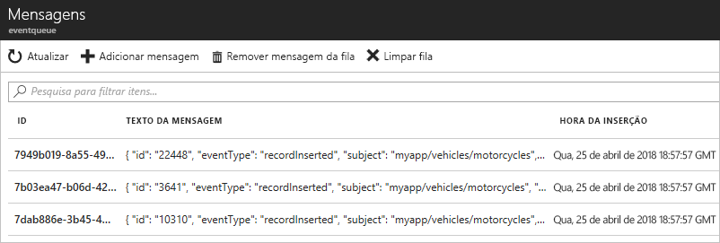

# <a name="route-custom-events-to-azure-queue-storage-with-azure-cli-and-event-grid"></a>Encaminhar eventos personalizados para o Armazenamento de Filas do Azure com a CLI do Azure e a Grade de Eventos

A Grade de Eventos do Azure é um serviço de eventos para a nuvem. O Armazenamento de Filas do Azure é um dos manipuladores de eventos com suporte. Neste artigo, você pode usar a CLI do Azure para criar um tópico personalizado, assinar o tópico e disparar o evento para exibir o resultado. Você pode enviar os eventos para o Armazenamento de Filas.

[!INCLUDE [quickstarts-free-trial-note.md](../../includes/quickstarts-free-trial-note.md)]

[!INCLUDE [cloud-shell-try-it.md](../../includes/cloud-shell-try-it.md)]

Se você optar por instalar e usar a CLI localmente, este artigo exigirá que você esteja executando a versão da CLI do Azure mais recente (2.0.24 ou posterior). Para saber qual é a versão, execute `az --version`. Se você precisa instalar ou atualizar, consulte [Instalar a CLI 2.0 do Azure](/cli/azure/install-azure-cli).

Caso não esteja usando o Cloud Shell, primeiro você deve entrar usando `az login`.

## <a name="create-a-resource-group"></a>Criar um grupo de recursos

Os tópicos de Grade de Eventos são recursos do Azure e devem ser colocados em um grupo de recursos do Azure. O grupo de recursos do Azure é uma coleção lógica na qual os recursos do Azure são implantados e gerenciados.

Crie um grupo de recursos com o comando [az group create](/cli/azure/group#az_group_create). 

O exemplo a seguir cria um grupo de recursos chamado *gridResourceGroup* no local *westus2*.

```azurecli-interactive
az group create --name gridResourceGroup --location westus2
```

## <a name="create-a-custom-topic"></a>Criar um tópico personalizado

Um tópico de grade de evento fornece um ponto de extremidade definido pelo usuário no qual você posta seus eventos. O exemplo a seguir cria o tópico personalizado no seu grupo de recursos. Substitua `<topic_name>` por um nome exclusivo para o tópico. O nome do tópico deve ser exclusivo, pois é representado por uma entrada DNS.

```azurecli-interactive
az eventgrid topic create --name <topic_name> -l westus2 -g gridResourceGroup
```

## <a name="create-queue-storage"></a>Criar Armazenamento de Filas

Antes de assinar o tópico, vamos criar o ponto de extremidade para a mensagem do evento. Crie um Armazenamento de Filas para coletar os eventos.

```azurecli-interactive
storagename="<unique-storage-name>"
queuename="eventqueue"

az storage account create -n $storagename -g gridResourceGroup -l westus2 --sku Standard_LRS
az storage queue create --name $queuename --account-name $storagename
```

## <a name="subscribe-to-a-topic"></a>Assinar um tópico

Assine um tópico para indicar à Grade de Eventos quais eventos você deseja acompanhar. O exemplo a seguir assina o tópico que você criou e transmite a ID de recurso do Armazenamento em Filas para o ponto de extremidade. A ID do Armazenamento em Filas está no formato:

`/subscriptions/<subscription-id>/resourcegroups/<resource-group-name>/providers/Microsoft.Storage/storageAccounts/<storage-name>/queueservices/default/queues/<queue-name>`

O script a seguir obtém a ID de recurso da conta de armazenamento para a fila. Ele constrói a ID para o armazenamento de fila e assina um tópico de grade de eventos. Ele define o tipo de ponto de extremidade como `storagequeue` e usa a ID da fila do ponto de extremidade.

```azurecli-interactive
storageid=$(az storage account show --name $storagename --resource-group gridResourceGroup --query id --output tsv)
queueid="$storageid/queueservices/default/queues/$queuename"

az eventgrid event-subscription create \
  --topic-name <topic_name> \
  -g gridResourceGroup \
  --name <event_subscription_name> \
  --endpoint-type storagequeue \
  --endpoint $queueid
```

## <a name="send-an-event-to-your-topic"></a>Enviar um evento para o tópico

Vamos disparar um evento para ver como a Grade de Eventos distribui a mensagem para o ponto de extremidade. Primeiro, vamos obter a URL e a chave para o tópico personalizado. Novamente, use o nome do tópico em `<topic_name>`.

```azurecli-interactive
endpoint=$(az eventgrid topic show --name <topic_name> -g gridResourceGroup --query "endpoint" --output tsv)
key=$(az eventgrid topic key list --name <topic_name> -g gridResourceGroup --query "key1" --output tsv)
```

Para simplificar este artigo, use dados de evento de exemplo para enviar ao tópico. Normalmente, um aplicativo ou serviço do Azure enviaria os dados de evento. CURL é um utilitário que envia solicitações HTTP. Neste artigo, use o CURL para enviar o evento ao tópico.  O exemplo a seguir envia três eventos para o tópico de grade de eventos:

```azurecli-interactive
for i in 1 2 3
do
   body=$(eval echo "'$(curl https://raw.githubusercontent.com/Azure/azure-docs-json-samples/master/event-grid/customevent.json)'")
   curl -X POST -H "aeg-sas-key: $key" -d "$body" $endpoint
done
```

Navegue até o Armazenamento em Filas no portal e observe que a Grade de Eventos enviou esses três eventos para a fila.




## <a name="clean-up-resources"></a>Limpar recursos
Caso planeje continuar a trabalhar com esse evento, não limpe os recursos criados neste artigo. Caso contrário, use os comandos a seguir para excluir os recursos criados por você neste artigo.

```azurecli-interactive
az group delete --name gridResourceGroup
```

## <a name="next-steps"></a>Próximas etapas

Agora que você sabe como criar tópicos e assinaturas de evento, saiba mais sobre como a Grade de Eventos pode ajudá-lo:

- [Sobre a Grade de Eventos](overview.md)
- [Rotear eventos do Armazenamento de Blobs para um ponto de extremidade da Web personalizado](../storage/blobs/storage-blob-event-quickstart.md?toc=%2fazure%2fevent-grid%2ftoc.json)
- [Monitorar alterações de máquina virtual com a Grade de Eventos do Azure e os Aplicativos Lógicos](monitor-virtual-machine-changes-event-grid-logic-app.md)
- [Transmitir Big Data para um data warehouse](event-grid-event-hubs-integration.md)
