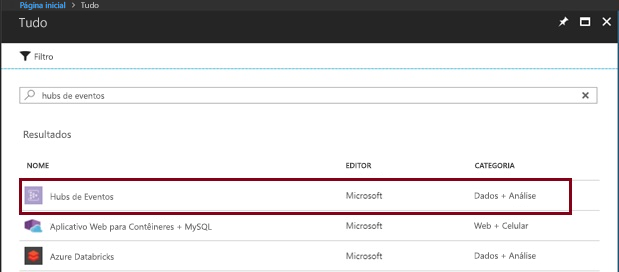

# Criar Hubs de Eventos habilitados para Kafka

Os Hubs de eventos do Azure são streaming de Big Data de Plataforma como Serviço (PaaS) que ingere milhões de eventos por segundo e fornece pouca latência e alta taxa de transferência para análise em tempo real e visualização.

Os hubs de eventos do Azure para ecossistemas Kafka fornece um ponto de extremidade. Esse ponto de extremidade permite que seu namespace de Hubs de eventos entenda nativamente a mensagem de protocolo [Kafka Apache](https://kafka.apache.org/intro) e as APIs. Com essa funcionalidade, você pode se comunicar com seus Hubs de eventos, como você faria com tópicos Kafka sem alterar seus clientes de protocolo ou seus próprio clusters em execução. Os Hubs de Eventos do Azure para o Ecossistema Kakfa são compatíveis com [Apache Kafka versão 1.0.](https://kafka.apache.org/10/documentation.html)

Este artigo descreve como criar um namespace de Hubs de eventos e obter a cadeia de caracteres de conexão necessária para se conectar aplicativos Kafka a Kafka habilitado aos Hubs de Eventos.

## pré-requisitos

Se você não tiver uma assinatura do Azure, crie uma [conta gratuita](https://azure.microsoft.com/free/?ref=microsoft.com&utm_source=microsoft.com&utm_medium=docs&utm_campaign=visualstudio) antes de começar.

## Criar um Kafka habilitado com o namespace dos Hubs de Evento

1. Faça logon no [Portal do Azure][Azure portal] e clique em **Criar um recurso** na parte superior esquerda da tela.

2. Pesquisar os Hubs de eventos e selecionar as opções mostradas aqui:
    
    
 
3. **Criar o namespace**, fornecendo um nome exclusivo e habilitar Kafka no namespace. Clique em **Criar**.
    
    
 
4. Depois que o namespace foi criado, na guia **Configurações** , clique em **Políticas de acesso compartilhado** para obter a cadeia de conexão.

    

5. Você pode escolher o padrão **RootManageSharedAccessKey**, ou adicionar uma nova política. Clique no nome da política e copie a cadeia de conexão. 
    
    
 
6. Adiciona esta cadeia de conexão à sua configuração de aplicativo Kafka.

Agora você pode transmitir eventos de aplicativos que usam o protocolo Kafka nos Hubs de eventos.

## Próximas etapas

Para saber mais sobre os Hubs de Eventos, consulte estes links:

* [Transmitir para Hubs de Eventos a partir de seus aplicativos Kafka](event-hubs-quickstart-kafka-enabled-event-hubs.md)
* [Saiba mais sobre os Hubs de Eventos para o Ecossistema Kafka](event-hubs-for-kafka-ecosystem-overview.md)
* [Saiba sobre os Hubs de Evento](event-hubs-what-is-event-hubs.md)

[Azure portal]: https://portal.azure.com/
