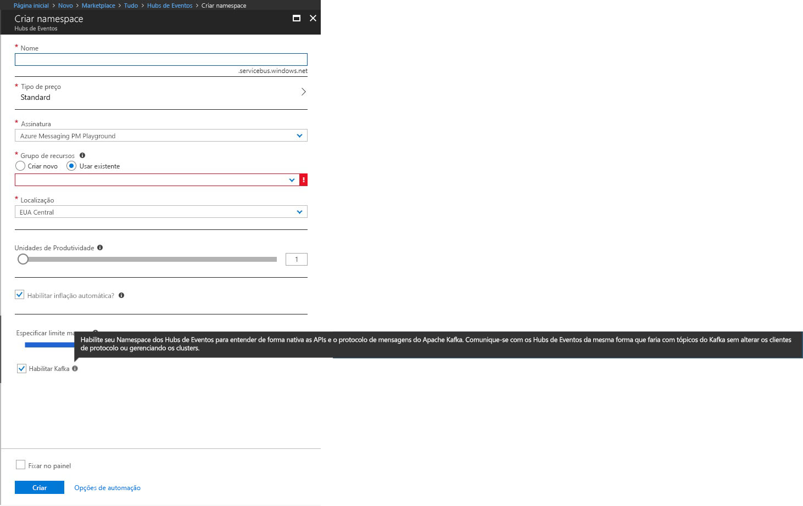
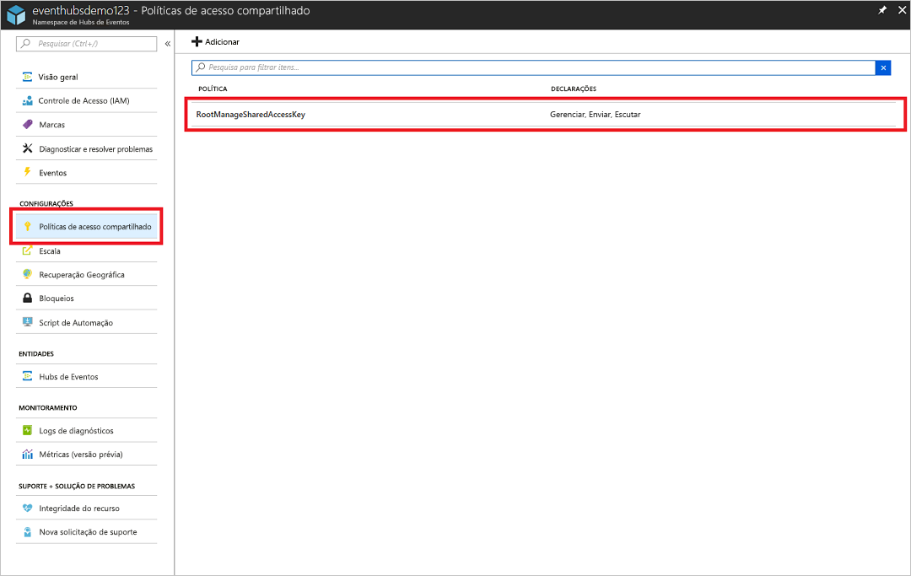

# Criar Apache Kafka hubs de eventos habilitados

Os hubs de eventos do Azure são uma plataforma de streaming de Big data como um serviço (PaaS) que ingere milhões de eventos por segundo e fornece baixa latência e alta taxa de transferência para análise e visualização em tempo real.

Os hubs de eventos do Azure fornecem um ponto de extremidade Kafka. Esse ponto de extremidade permite que seu namespace de hubs de eventos entenda nativamente [Apache Kafka](https://kafka.apache.org/intro) protocolo de mensagem e APIs. Com esse recurso, você pode se comunicar com seus hubs de eventos como faria com os tópicos do Kafka sem alterar seus clientes de protocolo nem executar seus próprios clusters. Os hubs de eventos oferecem suporte às [versões 1,0](https://kafka.apache.org/10/documentation.html) e posteriores do Apache Kafka.

Este artigo descreve como criar um namespace de hubs de eventos e obter a cadeia de conexão necessária para conectar aplicativos Kafka a hubs de eventos habilitados para Kafka.

## Pré-requisitos

Se você não tiver uma assinatura do Azure, crie uma [conta gratuita](https://azure.microsoft.com/free/?ref=microsoft.com&utm_source=microsoft.com&utm_medium=docs&utm_campaign=visualstudio) antes de começar.

## Criar um namespace de hubs de eventos habilitados para Kafka

1. Entre no [portal do Azure][Azure portal]e clique em **criar um recurso** na parte superior esquerda da tela.

2. Procure por hubs de eventos e selecione as opções mostradas aqui:
    
    
 
3. Forneça um nome exclusivo e habilite Kafka no namespace. Clique em **Criar**.
    
    
 
4. Depois que o namespace for criado, na guia **configurações** , clique em **políticas de acesso compartilhado** para obter a cadeia de conexão.

    

5. Você pode escolher o **RootManageSharedAccessKey**padrão ou adicionar uma nova política. Clique no nome da política e copie a cadeia de conexão. 
    
    
 
6. Adicione essa cadeia de conexão à configuração do aplicativo Kafka.

Agora você pode transmitir eventos de seus aplicativos que usam o protocolo Kafka para os hubs de eventos.

## Próximos passos

Para saber mais sobre os hubs de eventos, visite estes links:

* [Transmita para os hubs de eventos de seus aplicativos Kafka](event-hubs-quickstart-kafka-enabled-event-hubs.md)
* [Saiba mais sobre os hubs de eventos para Kafka](event-hubs-for-kafka-ecosystem-overview.md)
* [Saiba mais sobre os hubs de eventos](event-hubs-what-is-event-hubs.md)

[Azure portal]: https://portal.azure.com/
