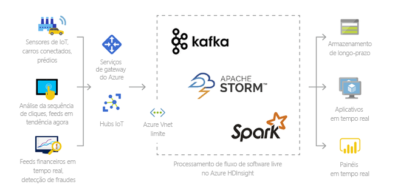
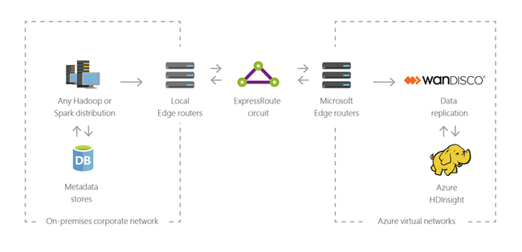

# O que é o Azure HDInsight e a pilha de tecnologias do Hadoop

Este artigo fornece uma introdução ao Apache Hadoop no Azure HDInsight. O HDInsight do Azure é um serviço de análise totalmente gerenciado, completo e de fonte aberta para empresas. Você pode usar estruturas de código aberto, como Hadoop, Spark, Hive, LLAP, Kafka, Storm, R e muito mais. 

[!INCLUDE [hdinsight-price-change](../../../includes/hdinsight-enhancements.md)]

## O que é o HDInsight e a pilha de tecnologias do Hadoop?

O [Apache Hadoop](http://hadoop.apache.org/) era a estrutura de código aberto original para processamento distribuído e análise de conjuntos de Big Data em clusters. A pilha de tecnologias do Hadoop inclui software e utilitários relacionados, inclusive Apache Hive, HBase, Spark, Kafka e muitos outros.

O Azure HDInsight é uma distribuição em nuvem dos componentes do Hadoop da [HDP (Hortonworks Data Platform)](https://hortonworks.com/products/data-center/hdp/). O Azure HDInsight torna mais fácil, rápido e econômico processar grandes quantidades de dados. Você pode usar as estruturas de código aberto mais populares, como Hadoop, Spark, Hive, LLAP, Kafka, Storm, R e muito mais. Com essas estruturas, você pode habilitar uma grande variedade de cenários, como extração, transformação e carregamento (ETL), data warehouse, aprendizado de máquina e IoT.

Para ver os componentes disponíveis da pilha de tecnologia do Hadoop no HDInsight, confira [Componentes e versões disponíveis com o HDInsight][component-versioning]. Para ler mais sobre o Hadoop no HDInsight, consulte a [Página de recursos do Azure para HDInsight](https://azure.microsoft.com/services/hdinsight/).

## O que é big data?

Mais do que nunca, o Big Data está sendo coletado em volumes crescentes, em velocidades mais altas e em uma maior variedade de formatos. Ele pode ser histórico (referente a dados armazenados) ou em tempo real (o que significa que é transmitido da fonte). Consulte [Cenários de uso do HDInsight](#scenarios-for-using-hdinsight) para saber mais sobre os casos de uso mais comuns de Big Data.

## Por que devo usar o Hadoop no HDInsight?

Esta seção lista os recursos do Azure HDInsight.

|Recurso  |DESCRIÇÃO  |
|---------|---------|
|Nativo de nuvem     |     O Azure HDInsight permite a criação de cluster otimizados para [Hadoop](apache-hadoop-linux-tutorial-get-started.md), [Spark](../spark/apache-spark-jupyter-spark-sql.md), [Consulta interativa (LLAP)](../interactive-query/apache-interactive-query-get-started.md), [Kafka](../kafka/apache-kafka-get-started.md), [Storm](../storm/apache-storm-tutorial-get-started-linux.md), [HBase](../hbase/apache-hbase-tutorial-get-started-linux.md) e  [ML Services](../r-server/r-server-get-started.md) no Azure. O HDInsight também oferece um SLA de ponta a ponta em todas as suas cargas de trabalho de produção.  |
|De baixo custo e escalonável     | O HDInsight permite [escalar](../hdinsight-administer-use-portal-linux.md) as cargas de trabalho para cima ou para baixo. É possível reduzir os custos [criando clusters sob demanda](../hdinsight-hadoop-create-linux-clusters-adf.md) e pagando apenas pelo que for usado. Você também pode compilar pipelines de dados para operacionalizar seus trabalhos. A computação e o armazenamento desacoplados fornecem melhor desempenho e flexibilidade. |
|Seguro e em conformidade    | O HDInsight permite a proteção dos ativos de dados corporativos com a [Rede Virtual do Microsoft Azure](../hdinsight-extend-hadoop-virtual-network.md), [criptografia](../hdinsight-hadoop-create-linux-clusters-with-secure-transfer-storage.md) e integração com o [Azure Active Directory](../domain-joined/apache-domain-joined-introduction.md). O HDInsight também atende aos [padrões de conformidade](https://azure.microsoft.com/overview/trusted-cloud) mais populares do setor e do governo.        |
|Monitoramento    | O Azure HDInsight integra-se ao [Log Analytics do Azure](../hdinsight-hadoop-oms-log-analytics-tutorial.md) para fornecer uma interface única com a qual você pode monitorar todos os seus clusters.        |
|Disponibilidade global | O HDInsight está disponível em mais  [regiões](https://azure.microsoft.com/regions/services/) que qualquer outra oferta de análise de Big Data. O Azure HDInsight também está disponível no Azure Governamental, na China e na Alemanha, o que permite atender às necessidades da sua empresa nas principais áreas soberanas. |  
|Produtividade     |  O Microsoft Azure HDInsight permite que você use ferramentas produtivas avançadas para o Hadoop e o Spark com seus ambientes de desenvolvimento preferidos. Esses ambientes de desenvolvimento incluem [Visual Studio](apache-hadoop-visual-studio-tools-get-started.md), [VSCode](../hdinsight-for-vscode.md), [Eclipse](../spark/apache-spark-eclipse-tool-plugin.md) e [IntelliJ](../spark/apache-spark-intellij-tool-plugin.md) para dar suporte ao Scala, Python, R, Java e .NET. Os cientistas de dados também podem colaborar usando notebooks populares como o [Jupyter](../spark/apache-spark-jupyter-notebook-kernels.md) e o [Zeppelin](../spark/apache-spark-zeppelin-notebook.md).    |
|Extensibilidade     |  Você pode estender os clusters do HDInsight com componentes instalados (Hue, Presto, etc.) usando [ações de script](../hdinsight-hadoop-customize-cluster-linux.md), [adicionando nós de borda](../hdinsight-apps-use-edge-node.md) ou [integrando outros aplicativos de Big Data certificados](../hdinsight-apps-install-applications.md). O HDInsight permite a integração perfeita com as soluções de Big Data mais populares com uma implantação com [um clique](https://azure.microsoft.com/services/hdinsight/partner-ecosystem/).|

## Cenários de uso do HDInsight

O Azure HDInsight pode ser usado para uma variedade de cenários no processamento de Big Data. Podem ser dados históricos (dados que já estão coletados e armazenados) ou dados em tempo real (dados que são transmitidos diretamente da fonte). Os cenários para processar esses dados podem ser resumidos nas seguintes categorias: 

### Processamento em lotes (ETL)

Extração, transformação e carregamento (ETL) é um processo em que os dados estruturados ou não estruturados são extraídos de fontes de dados heterogêneas. Em seguida, ele é transformado em um formato estruturado e carregado no repositório de dados. Você pode usar os dados transformados para ciência de dados ou data warehousing.

### Data warehousing

É possível usar o HDInsight para executar consultas interativas em escalas petabyte sobre dados estruturados ou não estruturados em qualquer formato. Também é possível criar modelos conectando-os a ferramentas de BI. Para obter mais informações, [leia esta história de cliente](https://customers.microsoft.com/story/milliman). 

### Internet das coisas (IoT)

Você pode usar o HDInsight para processar os dados de streaming recebidos em tempo real de uma variedade de dispositivos. Para obter mais informações, [leia esta postagem de blog do Azure que informa a visualização pública do Apache Kafka no HDInsight com Azure Managed Disks](https://azure.microsoft.com/blog/announcing-public-preview-of-apache-kafka-on-hdinsight-with-azure-managed-disks/).

 

### Ciência de dados

Você pode usar o HDInsight para compilar aplicativos que extraem informações críticas dos dados. Você também pode usar o Azure Machine Learning antes disso para prever tendências futuras para seu negócio. Para obter mais informações, [leia esta história de cliente](https://customers.microsoft.com/story/pros).

### Híbrido

Você pode usar o HDInsight para estender sua infraestrutura de Big Data local existente ao Azure para aproveitar os recursos de análise avançada da nuvem.

## Tipos de cluster no HDInsight
O HDInsight inclui tipos específicos de cluster e recursos de personalização do cluster, como a capacidade de adicionar componentes, utilitários e idiomas. O HDInsight oferece os seguintes tipos de cluster:

* **[Apache Hadoop](https://wiki.apache.org/hadoop)**: uma estrutura que usa HDFS, gerenciamento de recursos YARN e um modelo de programação MapReduce simples para processar e analisar dados em lote em paralelo.

* **[Apache Spark](http://spark.apache.org/)**: uma estrutura de processamento paralelo de software livre que dá suporte ao processamento na memória para melhorar o desempenho dos aplicativos de análise de Big Data. Confira [O que é o Apache Spark no HDInsight?](../spark/apache-spark-overview.md).

* **[Apache HBase](http://hbase.apache.org/)**: um banco de dados NoSQL baseado em Hadoop que fornece acesso aleatório e coerência forte para grandes quantidades de dados desestruturados e semi-estruturados, potencialmente com bilhões de linhas vezes milhões de colunas. Confira [O que é o HBase em HDInsight?](../hbase/apache-hbase-overview.md)

* **[ML Services](https://msdn.microsoft.com/microsoft-r/rserver)**: um servidor para hospedagem e gerenciamento paralelo, processos R distribuídos. Ele fornece aos cientistas de dados, estatísticos e programadores de R o acesso sob demanda a métodos escalonáveis e distribuídos de análise no HDInsight. Consulte a [Visão geral de ML Services no HDInsight](../r-server/r-server-overview.md).

* **[Apache Storm](https://storm.incubator.apache.org/)**: um sistema de computação distribuído e em tempo real para processar rapidamente grandes fluxos de dados. O Storm é oferecido como um cluster gerenciado no HDInsight. Consulte [Analisar dados do sensor em tempo real usando o Storm e o Hadoop](../storm/apache-storm-sensor-data-analysis.md).

* **[Visualização de consulta do Apache Interactive Hive (ou: vida longa e processo)](https://cwiki.apache.org/confluence/display/Hive/LLAP)**: cache na memória para consultas Hive interativas e mais rápidas. Veja [Usar a consulta interativa no HDInsight](../interactive-query/apache-interactive-query-get-started.md).

* **[Apache Kafka](https://kafka.apache.org/)**: uma plataforma de código-fonte aberto usada para criar aplicativos e pipelines de dados de transmissão. O Kafka também fornece funcionalidade de fila de mensagens, o que permite que você publique e assine fluxos de dados. Consulte [Uma introdução ao Apache Kafka no HDInsight](../kafka/apache-kafka-introduction.md).

## Componentes de código aberto no HDInsight

O Azure HDInsight permite criar clusters com estruturas de código aberto como Hadoop, Spark, Hive, LLAP, Kafka, Storm, HBase e R. Esses clusters, por padrão, vêm com outros componentes de código aberto incluídos no cluster, como [Ambari](https://github.com/apache/ambari/blob/trunk/ambari-server/docs/api/v1/index.md), [Avro](http://avro.apache.org/docs/current/spec.html), [Hive](http://hive.apache.org), [HCatalog](https://cwiki.apache.org/confluence/display/Hive/HCatalog/), [Mahout](https://mahout.apache.org/), [MapReduce](http://wiki.apache.org/hadoop/MapReduce), [YARN](http://hadoop.apache.org/docs/current/hadoop-yarn/hadoop-yarn-site/YARN.html), [Phoenix](http://phoenix.apache.org/), [Pig](http://pig.apache.org/), [Sqoop](http://sqoop.apache.org/), [Tez](http://tez.apache.org/), [Oozie](http://oozie.apache.org/) e [ZooKeeper](http://zookeeper.apache.org/).  

## Linguagens de programação no HDInsight
Os clusters do HDInsight, incluindo Spark, HBase, Kafka, Hadoop e outros, dão suporte a várias linguagens de programação. Algumas linguagens de programação não são instaladas por padrão. No caso de bibliotecas, módulos ou pacotes que não são instalados por padrão, [use uma ação de script para instalar o componente](../hdinsight-hadoop-script-actions-linux.md).

|Linguagem de programação  |Informações  |
|---------|---------|
|Suporte padrão à linguagem de programação     | Por padrão, os clusters HDInsight são compatíveis com:<ul><li>Java</li><li>Python</li></ul> Você pode instalar linguagens adicionais usando [ações de script](../hdinsight-hadoop-script-actions-linux.md).       |
|Linguagens JVM (máquina virtual Java)     | Muitas linguagens diferentes do Java podem ser executadas em uma máquina virtual do Java (JVM). No entanto, se você executar algumas dessas linguagens, você talvez precise instalar componentes adicionais no cluster. As seguintes linguagens baseadas em JVM são permitidas nos clusters HDInsight: <ul><li>Clojure</li><li>Jython (Python para Java)</li><li>Scala</li></ul>     |
|Linguagens específicas do Hadoop     | Os clusters HDInsight dão suporte às seguintes linguagens que são específicas ao ecossistema da pilha de tecnologias do Hadoop: <ul><li>Pig Latin para trabalhos do Pig</li><li>HiveQL para trabalhos do Hive e SparkSQL</li></ul>        |
 

## Ferramentas de desenvolvimento para HDInsight 
Você pode usar ferramentas de desenvolvimento do HDInsight, incluindo IntelliJ, Eclipse, Visual Studio Code e Visual Studio, para criar e enviar a consulta de dados do HDInsight e o trabalho com integração perfeita com o Azure.

* [Azure Toolkit for IntelliJ](https://docs.microsoft.com/en-us/azure/hdinsight/spark/apache-spark-intellij-tool-plugin)

* [Azure Toolkit for Eclipse](https://docs.microsoft.com/en-us/azure/hdinsight/spark/apache-spark-eclipse-tool-plugin)

* [Ferramentas do Azure HDInsight para VS Code](https://docs.microsoft.com/en-us/azure/hdinsight/hdinsight-for-vscode?branch=pr-en-us-22999)

* [Ferramentas do Azure Data Lake para Visual Studio](https://docs.microsoft.com/en-us/azure/hdinsight/hadoop/apache-hadoop-visual-studio-tools-get-started)

## Business intelligence no HDInsight
As ferramentas familiares de BI (business intelligence) recuperam, analisam e relatam os dados que estão integrados ao HDInsight usando o suplemento Power Query ou o Driver ODBC do Microsoft Hive:

* [Apache Spark BI usando ferramentas de visualização de dados com o Azure HDInsight](../spark/apache-spark-use-bi-tools.md)

* [Visualizar dados de Hive com o Microsoft Power BI no Azure HDInsight](apache-hadoop-connect-hive-power-bi.md) 

* [Visualizar dados da consulta interativa do Hive com o Power BI no Azure HDInsight](../interactive-query/apache-hadoop-connect-hive-power-bi-directquery.md)

* [Conectar o Excel ao Hadoop com o Power Query](apache-hadoop-connect-excel-power-query.md) (exige o Windows) 

* [Conectar o Excel ao Hadoop com o driver ODBC do Microsoft Hive](apache-hadoop-connect-excel-hive-odbc-driver.md) (exige o Windows) 

* [Usar o SQL Server Analysis Services com o HDInsight](https://msdn.microsoft.com/library/dn749857.aspx)

* [Usar o SQL Server Reporting Services com o HDInsight](https://msdn.microsoft.com/library/dn749856.aspx)

## Próximas etapas

Neste artigo, você aprendeu o que é o Azure HDInsight e como ele fornece o Hadoop e outros tipos de cluster no Azure. Vá para o próximo artigo para saber como criar um cluster do Apache Hadoop no HDInsight.

> [!div class="nextstepaction"]
> [Criar cluster Hadoop no HDInsight](apache-hadoop-linux-create-cluster-get-started-portal.md)

[component-versioning]: ../hdinsight-component-versioning.md
[zookeeper]: http://zookeeper.apache.org/
