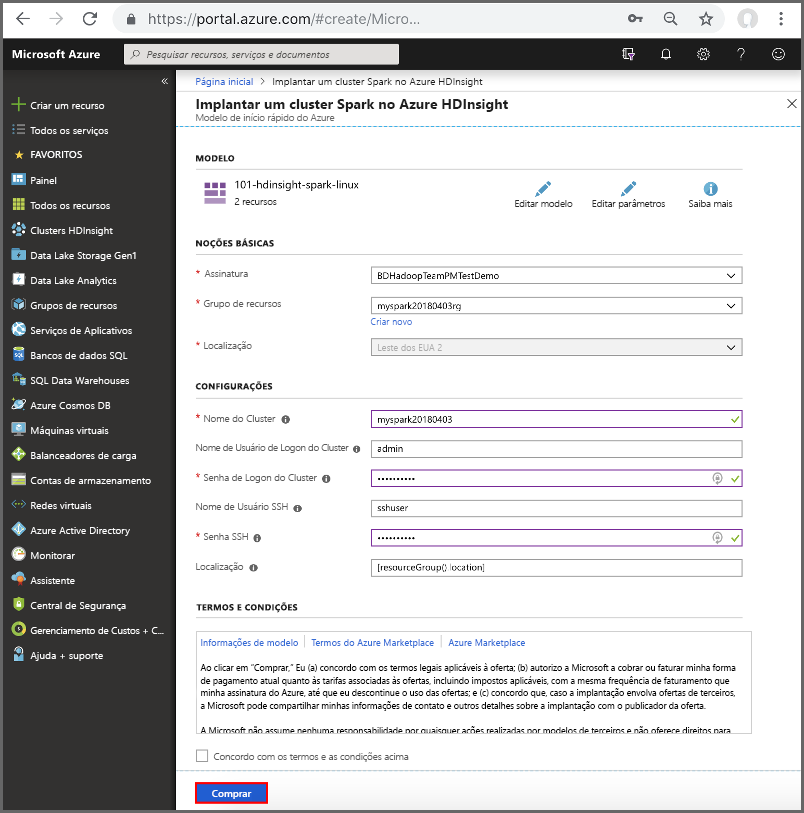
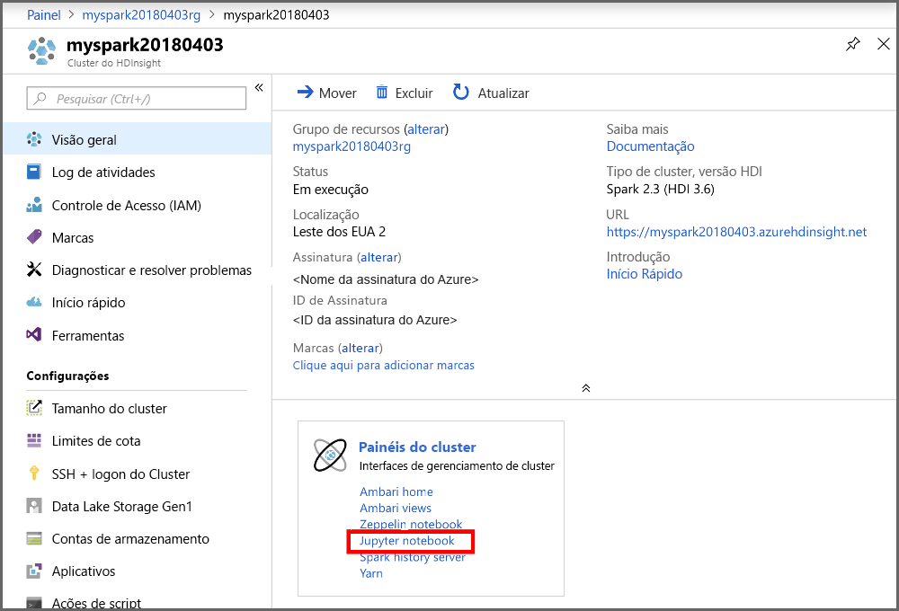

# <a name="quickstart-create-an-apache-spark-cluster-in-hdinsight-using-template"></a>Início Rápido: Criar um cluster do Apache Spark no HDInsight usando um modelo

Saiba como criar um cluster do [Apache Spark](https://spark.apache.org/) no Azure HDInsight e como executar consultas Spark SQL nas tabelas do [Apache Hive](https://hive.apache.org/). O Apache Spark permite análises rápidas de dados e computação de cluster usando processamento na memória. Para obter informações sobre o Spark no HDInsight, confira [Visão geral: Apache Spark no Azure HDInsight](apache-spark-overview.md).

Neste início rápido, você usará um modelo do Resource Manager para criar um cluster Spark do HDInsight. Modelos semelhantes podem ser exibidos nos [Modelos de início rápido do Azure](https://azure.microsoft.com/resources/templates/?resourceType=Microsoft.Hdinsight&pageNumber=1&sort=Popular). A referência de modelo pode ser encontrada [aqui](https://docs.microsoft.com/azure/templates/microsoft.hdinsight/allversions).

O cluster usa Azure Storage Blobs como o armazenamento de cluster. Para obter mais informações sobre como usar o Data Lake Storage Gen2, consulte o [Guia de Início Rápido: Configurar clusters no HDInsight](../../storage/data-lake-storage/quickstart-create-connect-hdi-cluster.md).

> [!IMPORTANT]  
> A cobrança dos clusters do HDInsight será proporcional por minuto, independentemente de eles estarem sendo usados ou não. Exclua seu cluster depois de terminar de usá-lo. Para saber mais, confira a seção [Recursos de limpeza](#clean-up-resources) deste artigo.

Se você não tiver uma assinatura do Azure, [crie uma conta gratuita](https://azure.microsoft.com/free/) antes de começar.

## <a name="create-an-hdinsight-spark-cluster"></a>Criar um cluster Spark no HDInsight

Crie um cluster Spark do HDInsight usando um modelo do Azure Resource Manager. O modelo pode ser encontrado no [GitHub](https://azure.microsoft.com/resources/templates/101-hdinsight-spark-linux/). Para obter a sintaxe JSON e as propriedades do cluster, confira [Microsoft.HDInsight/clusters](/azure/templates/microsoft.hdinsight/clusters).

1. Selecione o link a seguir para abrir o modelo no Portal do Azure em uma nova guia do navegador:

    <a href="https://portal.azure.com/#create/Microsoft.Template/uri/https%3A%2F%2Fraw.githubusercontent.com%2FAzure%2Fazure-quickstart-templates%2Fmaster%2F101-hdinsight-spark-linux%2Fazuredeploy.json" target="_blank">Implantar no Azure</a>

2. Insira os valores a seguir:

    | Propriedade | Valor |
    |---|---|
    |**Assinatura**|Selecione sua assinatura do Azure usada para criar este cluster. A assinatura usada para este início rápido é **&lt;nome da assinatura do Azure>**. |
    | **Grupo de recursos**|Crie um grupo de recursos ou selecione um existente. O grupo de recursos é usado para gerenciar recursos do Azure em seus projetos. O novo nome do grupo de recursos usado para este início rápido é **myspark20180403rg**.|
    | **Localidade**|Selecione um local para o grupo de recursos. O modelo usa esse local para criar o cluster, bem como para o armazenamento de cluster padrão. O local usado para este início rápido é **Leste dos EUA 2**.|
    | **ClusterName**|Insira um nome para o cluster HDInsight que você deseja criar. O novo nome do cluster usado para este início rápido é **myspark20180403**.|
    | **Nome e senha de logon do cluster**|O nome padrão de logon é admin. Escolha uma senha para o logon do cluster. O nome de logon usado para este início rápido é **admin**.|
    | **Nome de usuário e senha de SSH**|Escolha uma senha para o usuário do SSH. O nome de usuário de SSH usado para este início rápido é **sshuser**.|

    

3. Selecione **Concordo com os termos e condições declarados acima**, selecione **Fixar no painel**e, em seguida, selecione **Comprar**. Veja um novo bloco intitulado **Implantar a implantação de modelo**. Demora cerca de 20 minutos para criar o cluster. O cluster deve ser criado antes de prosseguir para a próxima sessão.

Se você tiver um problema com a criação de clusters HDInsight, é possível que você não tenha as permissões corretas para fazer isso. Para saber mais, confira [Requisitos do controle de acesso](../hdinsight-hadoop-create-linux-clusters-portal.md).

## <a name="install-intellijeclipse-for-spark-application"></a>Instalar IntelliJ/Eclipse para aplicativo Spark
Use o plug-in Azure Toolkit for IntelliJ/Eclipse a fim de desenvolver aplicativos Spark escritos em [Scala](https://www.scala-lang.org/) e enviá-los a um cluster do Azure HDInsight Spark diretamente do ambiente de desenvolvimento integrado (IDE) do IntelliJ/Eclipse. Para obter mais informações, consulte [Usar IntelliJ para criar/enviar aplicativo Spark](./apache-spark-intellij-tool-plugin.md) e [Usar Eclipse para criar/enviar aplicativo Spark](./apache-spark-eclipse-tool-plugin.md).

## <a name="install-vscode-for-pysparkhive-applications"></a>Instalar o VSCode para aplicativos PySpark/hive
Saiba como usar as Ferramentas do Azure HDInsight para Visual Studio Code (VSCode) para criar e enviar trabalhos em lotes do Hive, consultas interativas do Hive, lote do PySpark e scripts interativos PySpark. As Ferramentas do Azure HDInsight podem ser instaladas em plataformas compatíveis com VSCode. Isso inclui Windows, Linux e macOS. Para obter mais informações, consulte [Usar o VSCode para criar/enviar aplicativo PySpark](../hdinsight-for-vscode.md).

## <a name="create-a-jupyter-notebook"></a>Criar um notebook Jupyter

O [Jupyter Notebook](https://jupyter.org/) é um ambiente de notebook interativo que oferece suporte a várias linguagens de programação. O notebook permite que você interaja com seus dados, combine código com texto markdown e execute visualizações simples.

1. Abra o [Portal do Azure](https://portal.azure.com).
2. Selecione **Clusters HDInsight** e, em seguida, selecione o cluster que você criou.

    

3. No portal, na seção **Painéis de cluster**, clique em **Jupyter Notebook**. Em caso de solicitação, insira as credenciais de logon do cluster.

   

4. Selecione **Novo** > **PySpark** para criar um notebook.

   

   Um novo bloco de anotações é criado e aberto com o nome Untitled(Untitled.pynb).


## <a name="run-spark-sql-statements"></a>Executar Instruções Spark SQL

O SQL (Structured Query Language) é a linguagem mais comum e amplamente usada para consultar e transformar dados. O Spark SQL funciona como uma extensão do Apache Spark para processar dados estruturados, usando a sintaxe SQL familiar.

1. Verifique se o kernel está pronto. O kernel estará pronto quando você vir um círculo vazio ao lado do nome do kernel no notebook. Círculo sólido indica que o kernel está ocupado.

    

    Quando você inicia o notebook pela primeira vez, o kernel executa algumas tarefas em segundo plano. Aguarde a leitura do kernel.
2. Cole o código a seguir em uma célula vazia e pressione **SHIFT + ENTER** para executar o código. O comando lista as tabelas de Hive no cluster:

    ```sql
    %%sql
    SHOW TABLES
    ```
    Quando você usa um Notebook Jupyter com o cluster HDInsight Spark, obtém uma sessão de predefinição `spark` que você pode usar para executar consultas do Hive usando o Spark SQL. `%%sql` informa ao Notebook Jupyter para usar a sessão de predefinição `spark` para executar a consulta Hive. A consulta recupera as primeiras 10 linhas de uma tabela Hive (**hivesampletable**) que vem com todos os clusters HDInsight por padrão. Na primeira vez que você enviar a consulta o Jupyter criará o aplicativo Spark para o notebook. O processo leva aproximadamente 30 segundos para ser concluído. Depois que o aplicativo Spark estiver pronto a consulta é executada em aproximadamente um segundo e produz os resultados. A saída se parece com isso:

    

    Toda vez que você executar uma consulta no Jupyter, o título da janela do navegador da Web mostrará um status **(Ocupado)** com o título do bloco de anotações. Você também verá um círculo sólido ao lado do texto **PySpark** no canto superior direito.

2. Execute outra consulta para ver os dados em `hivesampletable`.

    ```sql
    %%sql
    SELECT * FROM hivesampletable LIMIT 10
    ```
    
    A tela deve ser atualizada para mostrar a saída da consulta.

    

2. No menu **Arquivo** do notebook, selecione **Fechar e Interromper**. O desligamento do notebook libera os recursos do cluster, incluindo o Aplicativo Spark.

## <a name="clean-up-resources"></a>Limpar recursos
O HDInsight salva seus dados e os notebooks do Jupyter no Armazenamento do Azure ou no Azure Data Lake Store, assim você poderá excluir um cluster quando ele não estiver em uso. Você também é cobrado por um cluster HDInsight, mesmo quando ele não está em uso. Como os encargos para o cluster são muitas vezes maiores do que os encargos para armazenamento, faz sentido, do ponto de vista econômico, excluir os clusters quando não estiverem em uso. Se você planeja trabalhar no tutorial listado em [Próximas etapas](#next-steps) imediatamente, convém manter o cluster.

Retorne ao Portal do Azure e selecione **Excluir**.


Também é possível selecionar o nome do grupo de recursos para abrir a página do grupo de recursos, e depois selecionar **Excluir grupo de recursos**. Ao excluir o grupo de recursos, você exclui o cluster Spark do HDInsight e a conta de armazenamento padrão.

## <a name="next-steps"></a>Próximas etapas

Neste início rápido, você aprendeu a criar um cluster HDInsight Spark e executar uma consulta de SQL básica do Spark. Avança para o próximo tutorial para saber como usar um cluster HDInsight Spark para executar consultas interativas em dados de exemplo.

> [!div class="nextstepaction"]
>[Executar consultas interativas no Apache Spark](./apache-spark-load-data-run-query.md)


