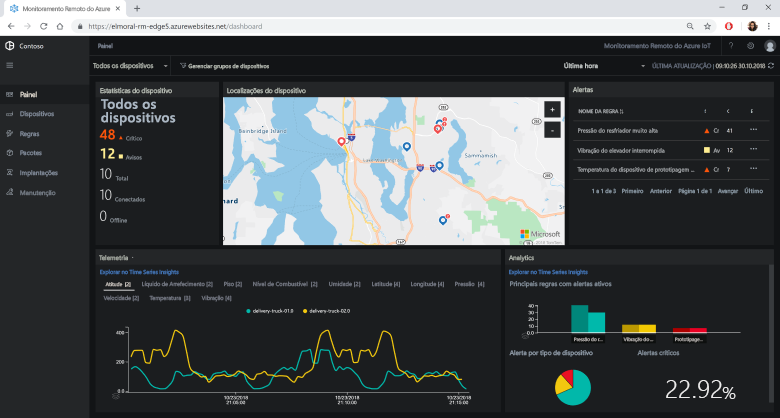
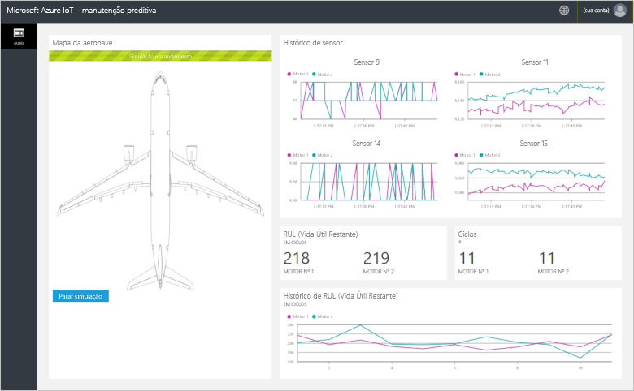
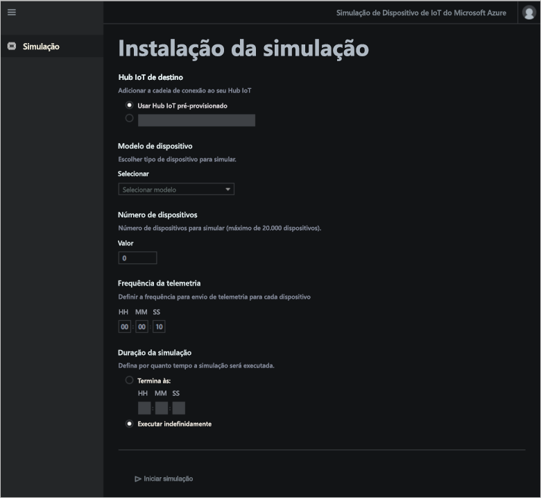

# O que são aceleradores de solução do Azure IoT?

Uma solução de IoT baseada em nuvem normalmente usa o código personalizado e vários serviços de nuvem para gerenciar a conectividade do dispositivo, o processamento de dados e análise e apresentação.

Os aceleradores de solução de IoT são uma coleção de soluções de IoT completas, prontas para implantação, que implementam cenários comuns de IoT, como monitoramento remoto, fábrica conectada, manutenção preditiva e simulação de dispositivo. Quando você implanta um acelerador de solução, a implantação inclui todos os serviços baseados em nuvem necessários junto com qualquer código de aplicativo necessário.

Os aceleradores de solução são pontos de partida para suas próprias soluções de IoT. O código-fonte para todos os aceleradores de solução é um software livre e está disponível no GitHub. Recomenda-se baixar e personalizar os aceleradores de solução para atender às suas necessidades.

Você também pode usar os aceleradores de solução como ferramentas de aprendizado antes de compilar uma solução de IoT personalizada do zero. Os aceleradores de solução implementam práticas comprovadas para soluções de IoT baseadas em nuvem para você seguir.

O código do aplicativo em cada acelerador de solução inclui um aplicativo Web que permite que você gerencie o acelerador de solução.

## Cenários de IoT com suporte

Atualmente, há quatro aceleradores de soluções disponíveis para implantação:

### Monitoramento remoto

Use este acelerador de solução para coletar a telemetria de vários dispositivos remotos e controlá-los. Os exemplos de dispositivo incluem sistemas de arrefecimento instalados no local dos seus clientes ou válvulas instaladas em estações de bombeamento remotas.

É possível usar o painel de monitoramento remoto para exibir a telemetria dos seus dispositivos conectados, provisionar novos dispositivos ou atualizar o firmware em seus dispositivos conectados:

### Fábrica conectada

Use este acelerador de solução para coletar a telemetria de ativos industriais com uma interface de [Arquitetura Unificada OPC](https://opcfoundation.org/about/opc-technologies/opc-ua/) e para controlá-los. Os ativos industriais podem incluir montagem e teste de estações em uma linha de produção de fábrica.

É possível usar o painel da fábrica conectada para monitorar e gerenciar seus dispositivos industriais:

### Manutenção preditiva

Use este acelerador de solução para prever quando um dispositivo remoto deve falhar, para que você possa realizar manutenção antes que a falha prevista ocorra. Este acelerador de solução usa algoritmos de aprendizado de máquina para prever falhas de telemetria do dispositivo. Os exemplos de dispositivo incluem motores de avião ou elevadores.

É possível usar o painel de manutenção preditiva para exibir a análise de manutenção preditiva:

### Simulação de dispositivo

Use este acelerador de solução para executar vários dispositivos simulados que geram telemetria realista. Você pode usar este acelerador de solução para testar o comportamento de outros aceleradores de solução ou testar suas próprias soluções personalizadas de IoT.

Você pode usar o aplicativo Web de simulação de dispositivo para configurar e executar simulações:

## Princípios de design

Todos os aceleradores de solução seguem os mesmos princípios de design e metas. Eles são projetados para serem:

* **Escalonáveis**, permitindo que você conecte e gerencie milhões de dispositivos conectados.
* **Extensíveis**, permitindo que você personalize-os para atender às suas necessidades.
* **Compreensíveis**, permitindo que você entenda como eles funcionam e como eles são implementados.
* **Modulares**, permitindo que você troque os serviços por alternativas.
* **Seguros**, combinando a segurança do Azure com recursos internos de segurança do dispositivo e de conectividade.

## Arquiteturas e linguagens

Os aceleradores de solução originais foram escritos usando o .NET usando uma arquitetura de model-view-controller (MVC). A Microsoft está atualizando os aceleradores de solução para uma nova arquitetura de microsserviços. A tabela a seguir mostra o status atual dos aceleradores de solução com links para repositórios GitHub:

| Acelerador de solução   | Arquitetura  | Linguagens     |
| ---------------------- | ------------- | ------------- |
| Monitoramento remoto      | Microsserviços | [Java](https://github.com/Azure/azure-iot-pcs-remote-monitoring-java) e [.NET](https://github.com/Azure/azure-iot-pcs-remote-monitoring-dotnet) |
| Manutenção preditiva | MVC           | [.NET](https://github.com/Azure/azure-iot-predictive-maintenance)          |
| Fábrica conectada      | MVC           | [.NET](https://github.com/Azure/azure-iot-connected-factory)          |
| Simulação de dispositivo      | Microsserviços | [.NET](https://github.com/Azure/device-simulation-dotnet)          |

Para saber mais sobre as arquiteturas de microsserviço, confira [Arquitetura do Aplicativo .NET](https://www.microsoft.com/net/learn/architecture) e [Microsserviços: uma revolução de aplicativo fornecida pela nuvem](https://azure.microsoft.com/blog/microservices-an-application-revolution-powered-by-the-cloud/).

## Opções de implantação

Você pode implantar os aceleradores de solução do site [Aceleradores de solução IoT do Microsoft Azure](https://www.azureiotsolutions.com/Accelerators#) ou usando a linha de comando.

Você pode implantar o acelerador de solução de monitoramento remoto nas seguintes configurações:

* **Standard**: Implantação de infraestrutura expandida para o desenvolvimento de uma implantação de produção. O Serviço de Contêiner do Azure implanta os microsserviços em várias máquinas virtuais do Azure. O Kubernetes orquestra os contêineres do Docker que hospedam os microsserviços individuais.
* **Básica**: Versão de custo reduzido para obter uma demonstração ou testar uma implantação. Todos os microsserviços implantam em uma única máquina virtual do Azure.
* **Local:** Implantação da máquina local para teste e desenvolvimento. Essa abordagem implanta os microsserviços em um contêiner do Docker local e conecta-se ao Hub IoT, Azure Cosmos DB e serviços de armazenamento do Azure na nuvem.

O custo de executar um acelerador de solução é uma agregação do [custo de serviços subjacentes do Azure](https://azure.microsoft.com/pricing). Você verá os detalhes dos serviços do Azure usados quando você escolher as opções de implantação.

## Próximas etapas

Para experimentar um dos aceleradores de solução de IoT, confira os guias de início rápido:

* [Experimente uma solução de monitoramento remoto](quickstart-remote-monitoring-deploy.md)
* [Experimente uma solução de fábrica conectada](quickstart-connected-factory-deploy.md)
* [Experimente uma solução de manutenção preditiva](quickstart-predictive-maintenance-deploy.md)
* [Experimente uma solução de simulação de dispositivo](quickstart-device-simulation-deploy.md)
