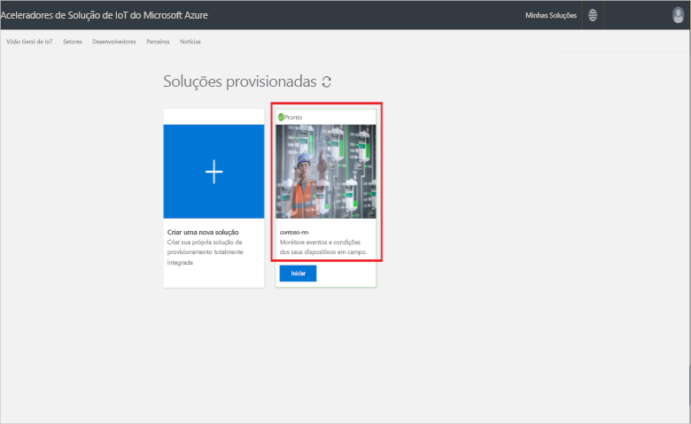

# Conecte um dispositivo IoT DevKit ao acelerador de solução de monitoramento remoto

[!INCLUDE [iot-suite-selector-connecting](../../includes/iot-suite-selector-connecting.md)]

Este guia prático mostra como executar um aplicativo de amostra no seu dispositivo IoT DevKit. O código de amostra envia a telemetria dos sensores no dispositivo DevKit ao seu acelerador de solução.

O [IoT DevKit](https://aka.ms/iot-devkit) é uma placa compatível com Arduino, com periféricos e sensores avançados. É possível desenvolvê-lo usando a [Azure Machine Learning Workbench](https://marketplace.visualstudio.com/items?itemName=vsciot-vscode.vscode-iot-workbench) no Visual Studio Code. O [catálogo de projetos](https://microsoft.github.io/azure-iot-developer-kit/docs/projects/) contém aplicativos de exemplo para ajudá-lo a criar protótipos de soluções de IoT.

## Pré-requisitos

Execute o [guia de Introdução ao IoT DevKet obtendo](https://docs.microsoft.com/azure/iot-hub/iot-hub-arduino-iot-devkit-az3166-get-started) e conclua as seguintes seções:

* Prepare seu hardware
* Configurar o Wi-Fi
* Começar a usar o Kit de Desenvolvimento
* Preparar o ambiente de desenvolvimento

## Abrir o aplicativo de exemplo

Para abrir o exemplo de monitoramento remoto no código VS:

1. Verifique se o seu IoT DevKit não está no seu computador. Inicie o VS Code primeiro e, em seguida, conecte o kit de desenvolvimento ao computador.

1. Clique em `F1` para abrir a paleta de comandos, digite e selecione **IoT Workbench: exemplos**. Em seguida, selecione **Kit de Desenvolvimento de IoT** como placa.

1. Encontre **Monitoramento Remoto** e clique em **Exemplo Aberto**. Uma nova janela do VS Code é exibida mostrando a pasta do projeto:

  

## Configurar o dispositivo

Para configurar a cadeia de conexão do dispositivo Hub IoT no seu dispositivo DevKit:

1. Alternar o IoT DevKit no **modo de configuração**:

    * Mantenha pressionado o botão **A**.
    * Pressione e solte a o botão**Reiniciar**.

1. A tela exibe a ID do DevKit e `Configuration`.

    

1. Pressione **F1** para abrir a paleta de comandos, digite e selecione **IoT Workbench: Dispositivo> Configs. Do dispositivo de configuração**.

1. Cole a sequência de conexão que você copiou anteriormente e pressione **Enter** para configurar o dispositivo.

## Compilar o código

Para compilar e carregar o código de dispositivo:

1. Pressione **F1** `** para abrir a paleta de comandos, digite e selecione **IoT Workbench: Device> Device Upload**:

    

1. O VS Code compila e envia o código para o seu dispositivo DevKit:

    

1. O dispositivo DevKit é reinicializado e executa o código que você carregou.

## O exemplo de teste

Para verificar se o aplicativo de amostra enviado para o dispositivo DevKit está funcionando, conclua as etapas a seguir:

### Exibir a telemetria enviada à solução de Monitoramento Remoto

Quando o aplicativo de amostra é executado, o dispositivo DevKit envia a telemetria de seus dados de sensores via Wi-Fi para o acelerador de solução. Para ver a telemetria:

1. Vá para o painel de solução e, em seguida, clique em **Dispositivos**.

1. Clique no nome do dispositivo do seu dispositivo DevKit. na guia à direita, você pode ver a telemetria do DevKit em tempo real:

    

### Controlar o dispositivo do Kit de desenvolvimento

O acelerador da solução de monitoramento remoto permite controlar o dispositivo remotamente. O código de exemplo implementa três métodos que você pode ver na seção **Método** ao selecionar o dispositivo na página **Dispositivos**:

Para alterar a cor de um dos LEDs do DevKit, use o método **LedColor**:

1. Selecione o nome do dispositivo da lista de dispositivos e clique em **trabalhos**:

    

1. Configure os trabalhos usando os seguintes valores e clique em **aplicar**:

    * Selecione trabalho: **Método Run**
    * Nome do método: **LedColor**
    * Nome do trabalho: **ChangeLedColor**

    

1. Depois de alguns segundos, a cor do LED de RGB (abaixo do botão um) em suas alterações do Kit de desenvolvimento:

    

## Limpar recursos

Se você planeja passar para outros tutoriais, deixe o acelerador de solução de Monitoramento Remoto implantado.

Caso não precise mais do acelerador de solução, exclua-o da página Soluções provisionadas, selecionando-o e clicando em Excluir Solução:

## Comentários e problemas

Se você tiver algum problema, consulte [as Perguntas frequentes sobre o IoT DevKit](https://microsoft.github.io/azure-iot-developer-kit/docs/faq/) ou entre em contato conosco usando os seguintes canais:

* [Gitter.im](http://gitter.im/Microsoft/azure-iot-developer-kit)
* [Stackoverflow](https://stackoverflow.com/questions/tagged/iot-devkit)

## Próximas etapas

Agora que você aprendeu como conectar um dispositivo DevKit ao seu acelerador de solução de monitoramento remoto, aqui estão alguns próximos passos sugeridos:

* [Visão geral dos aceleradores de solução do Azure IoT](https://docs.microsoft.com/azure/iot-accelerators/)
* [Personalizar a interface do usuário](iot-accelerators-remote-monitoring-customize.md)
* [Conectar o kit de desenvolvimento de IoT ao aplicativo Azure IoT Central](../iot-central/howto-connect-devkit.md)