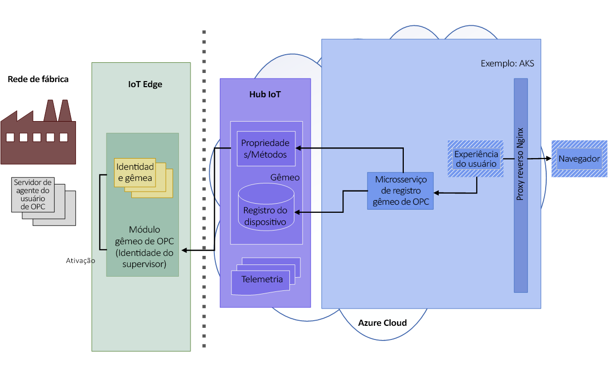
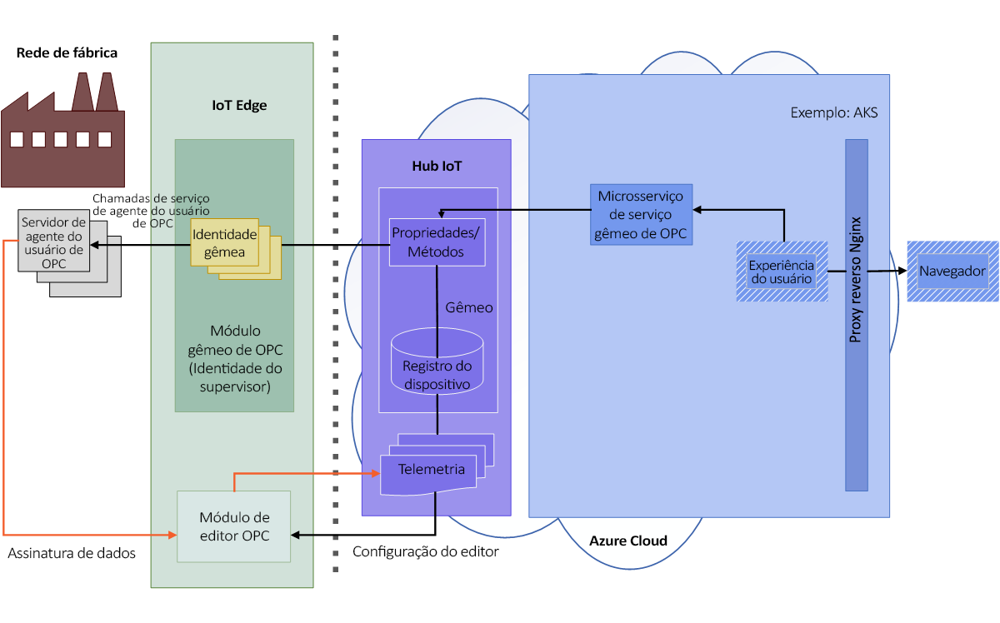

# Arquitetura do OPC Twin

Os diagramas a seguir ilustram a arquitetura do OPC Twin.

## Descobrir e ativar

1. O operador habilita o exame de rede no módulo ou faz uma descoberta única usando uma URL de descoberta. As informações de aplicativo e os pontos de extremidade descobertos são enviados por meio de telemetria para o agente de integração para processamento.  O agente de integração do dispositivo da UA de OPC processa eventos de descoberta do servidor da UA de OPC enviados pelo módulo do IoT Edge do Gêmeo OPC quando no modo de descoberta ou de exame. Os eventos de descoberta resultam em registro de aplicativo e atualizações no registro do dispositivo da UA de OPC.

   

1. O operador inspeciona o certificado do ponto de extremidade descoberto e ativa o gêmeo do ponto de extremidade registrado para acesso. 

   

## Procurar e monitor

1. Uma vez ativado, o operador pode usar a API REST de serviço de Gêmeo para procurar ou inspecionar o modelo de informações do servidor, ler/gravar variáveis de objeto e chamar métodos.  O usuário usa uma API simplificada da UA de OPC totalmente expressa em HTTP e JSON.

   

1. A interface REST do serviço de gêmeo também pode ser usada para criar itens monitorados e assinaturas no OPC Publisher. O OPC Publisher permite enviar telemetria de sistemas de servidor da UA de OPC ao Hub IoT. Para obter mais informações sobre o OPC Publisher, veja [O que é o OPC Publisher](overview-opc-publisher.md).

   
