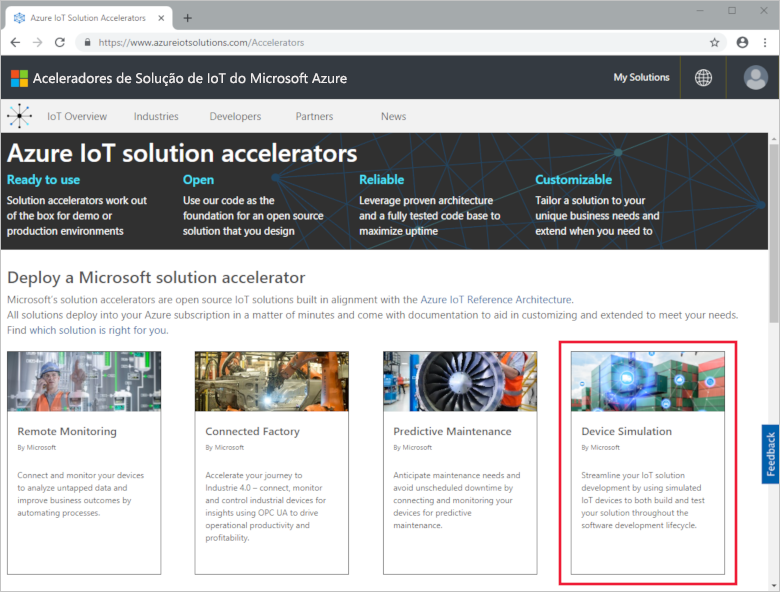
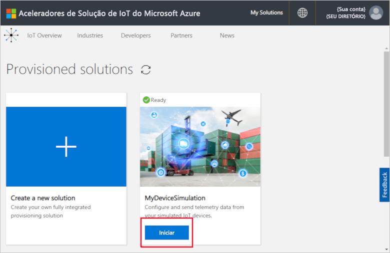

# Início Rápido: Implantar e executar uma solução de simulação de dispositivo baseada em nuvem

Este início rápido mostra como implantar o acelerador de solução de simulação de dispositivo do Azure IoT para usar no teste da sua soução IoT. Após ter implantado o acelerador de solução, você usa a página **Simulação** para criar e executar uma simulação.

## pré-requisitos

Para concluir este início rápido, você precisará de uma assinatura do Azure ativa.

Se você não tiver uma assinatura do Azure, crie uma [conta gratuita](https://azure.microsoft.com/free/?WT.mc_id=A261C142F) antes de começar.

## Implantar a solução

Ao implantar o acelerador de solução em sua assinatura do Azure, você precisa definir algumas opções de configuração.

Entre no [azureiotsolutions.com](https://www.azureiotsolutions.com/Accelerators) usando suas credenciais de conta do Azure.

Clique em **Experimentar agora** no bloco **Simulação de dispositivo**.

Na página **Criar solução de simulação de dispositivo**, insira um **Nome da solução** exclusivo. Anote o nome da sua solução, este é o nome do grupo de recursos do Azure que contém todos os recursos da solução.

Selecione a **Assinatura** e a **Região** que você deseja usar para o acelerador de solução. Normalmente a região escolhida é a mais próxima de você. Você deve ser um [usuário ou administrador global ](iot-accelerators-permissions.md) na assinatura.

Marque a caixa para implantar um Hub IoT a ser usado com a sua solução de simulação de dispositivo. Você pode sempre alterar o Hub IoT usado pela sua simulação posteriormente.

Clique em **Criar solução** para começar a provisionar a sua solução. Esse processo leva pelo menos cinco minutos para ser executado:

## Entrar na solução

Quando o processo de provisionamento estiver concluído, você pode entrar no painel do acelerador de solução de simulação de dispositivo.

Na página **Soluções provisionadas**, clique no novo acelerador de solução de simulação de dispositivo:

Você pode exibir as informações sobre o seu acelerador de solução de simulação de dispositivo no painel que será exibido. Escolha o **Painel da solução** para exibir o acelerador de solução de simulação de dispositivo:

Clique em **Aceitar** para aceitar a solicitação das permissões, o painel de solução de simulação de dispositivo será exibido no seu navegador:

## Configurar a simulação

A simulação é configurada e executada a partir do painel. Use os valores na tabela a seguir para configurar a sua simlação:

| Configuração             | Valor                       |
| ------------------- | --------------------------- |
| Hub IoT de destino      | Use o Hub IoT pré-provisionado |
| Modelo do dispositivo        | Resfriador                     |
| Número de dispositivos   | 10                          |
| Frequência de telemetria | 10 segundos                  |
| Duração da simulação | 5 minutos                   |

## Executar a simulação

Clique em **Iniciar simulação**. A simulação é executada durante um período escolhido por você. É possível interromper a simulação a qualquer momento clicando em **Interromper simulação**. A simulação mostra as estatísticas para a execução atual. Clique em **Exibir métricas do Hub IoT no portal do Azure** para ver as métricas relatadas pelo Hub IoT:

Só é possível executar uma simulação de cada vez de uma instância provisionada do acelerador de solução.

## Limpar recursos

Se você planeja explorar ainda mais, deixe o acelerador de solução de simulação de dispositivo implantado.

Se você não precisar mais do acelerador de solução, exclua-o da página [Soluções provisionadas](https://www.azureiotsolutions.com/Accelerators#dashboard):

## Próximas etapas

Neste início rápido, você implantou o acelerador de solução de simulação de dispositivo e executou uma simulação de dispositivo de IoT.

Para saber como usar um Hub IoT existente em uma simulação, consulte o guia de instruções:

> [!div class="nextstepaction"]
> [Usar um Hub IoT existente com o acelerador de solução de simulação de dispositivo](iot-accelerators-device-simulation-choose-hub.md)