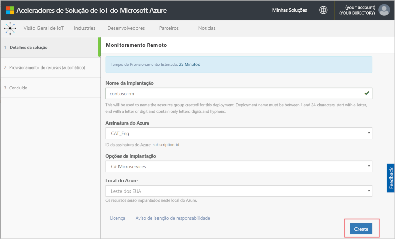
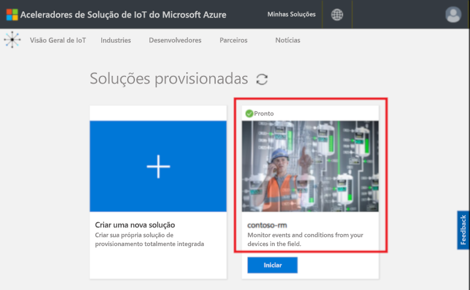
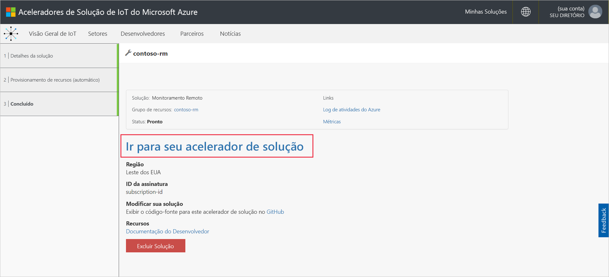
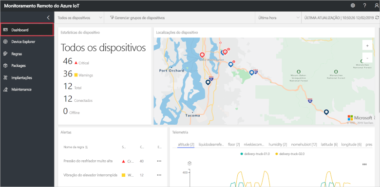
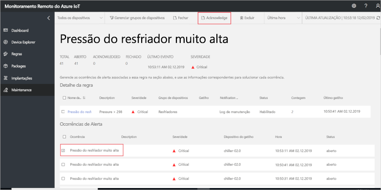
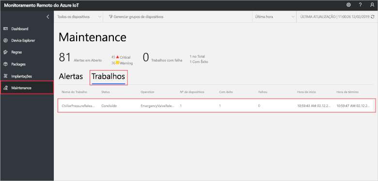

# Início Rápido: Experimentar uma solução de monitoramento remoto baseado em nuvem

Este início rápido mostra como implantar o acelerador de solução de monitoramento remoto do Azure IoT. Depois que você implantar a solução baseada em nuvem, poderá usar a página **Painel** da solução para visualizar os dispositivos simulados em um mapa e a página **Manutenção** para responder a um alerta de pressão de um dispositivo resfriador simulado. Você pode usar esse acelerador de solução como o ponto de partida para sua própria implementação ou como uma ferramenta de aprendizado.

A implantação inicial configura o acelerador de solução para uma empresa chamada Contoso. Como operador da Contoso, você gerencia um conjunto de vários tipos de dispositivos, como resfriadores, implantados em ambientes físicos diferentes. Um dispositivo resfriador envia telemetria de temperatura, umidade e pressão para o acelerador de solução de Monitoramento Remoto.

Este início rápido implanta uma versão **Básica** do acelerador de solução para fins de teste e demonstração que minimiza os custos. Para obter mais informações sobre as diferentes versões que você pode implantar, veja [Implantações básicas e padrão](iot-accelerators-remote-monitoring-deploy-cli.md#basic-and-standard-deployments).

Para concluir este início rápido, você precisará de uma assinatura do Azure ativa.

Se você não tiver uma assinatura do Azure, crie uma [conta gratuita](https://azure.microsoft.com/free/?WT.mc_id=A261C142F) antes de começar.

## Implantar a solução

Ao implantar o acelerador de solução em sua assinatura do Azure, você precisa definir algumas opções de configuração.

Entre no [azureiotsolutions.com](https://www.azureiotsolutions.com/Accelerators) usando suas credenciais de conta do Azure.

Clique no bloco **Monitoramento Remoto**. Na página **Monitoramento Remoto**, clique no bloco **Experimentar Agora**:

Escolha **Microsserviços em C#** como **Opções de implantação**. As implementações de Java e C# têm os mesmos recursos.

Insira um **Nome de solução** exclusivo para o acelerador de solução de Monitoramento Remoto. Para este início rápido, estamos chamando nosso **contoso-rm**.

Selecione a **Assinatura** e a **Região** que você deseja usar para o acelerador de solução. Normalmente a região escolhida é a mais próxima de você. Para este início rápido, usamos **Leste dos EUA**.
Escolha **Visual Studio Enterprise**, mas você deve ser [administrador global ou usuário](iot-accelerators-permissions.md) para fazer isso.

Para iniciar a implantação, clique em **Criar**. Esse processo leva pelo menos cinco minutos para ser executado:

## Entrar na solução

Quando a implantação para sua assinatura do Azure for concluída, você verá uma marca de seleção verde e **Pronto** no bloco da solução. Agora você pode entrar em seu painel de acelerador de solução Monitoramento Remoto.

Na página **Soluções provisionadas**, clique em seu novo acelerador de solução de Monitoramento Remoto:

Você pode exibir informações sobre o acelerador de solução de Monitoramento Remoto no painel exibido. Escolha **Ir para o acelerador de solução** para exibir o acelerador de solução do Monitoramento Remoto:

Clique em **Aceitar** para aceitar a solicitação de permissões. O painel de solução de Monitoramento Remoto é exibido no navegador:

## Exibir dispositivos

O painel da solução mostra as seguintes informações sobre os dispositivos simulados da Contoso:

* O painel **Estatísticas de dispositivo** mostra informações resumidas sobre alertas e o número total de dispositivos. Na implantação padrão, a Contoso tem 10 dispositivos simulados de tipos diferentes.

* O painel **Locais do dispositivo** mostra onde os dispositivos estão localizados fisicamente. A cor do pino mostra quando há alertas do dispositivo.

* O painel **Alertas** mostra detalhes de alertas dos dispositivos.

* O painel **Telemetria** mostra a telemetria dos dispositivos. Você pode exibir fluxos de telemetria diferentes clicando nos tipos de telemetria na parte superior.

* O painel **Análise** mostra informações combinadas sobre os alertas dos dispositivos.

## Responder a um alerta

Como um operador da Contoso, você pode monitorar os dispositivos no painel da solução. O painel **Estatísticas do dispositivo** mostra que houve um número de alertas críticos e o painel **Alertas** mostra que a maioria deles é proveniente de um dispositivo resfriador. Para dispositivos resfriadores da Contoso, uma pressão interna acima de 250 PSI indica que o dispositivo não está funcionando corretamente.

### Identificar o problema

Na página **Painel**, no painel **Alertas**, você pode ver o alerta **Pressão do resfriador muito alta**. O resfriador tem um pino vermelho no mapa (você talvez precise ver a panorâmica e ampliar o mapa):

No painel **Alertas**, clique em **...** na coluna **Explorar** ao lado da regra **Pressão do resfriador muito alta**. Essa ação leva você para a página **Manutenção**, onde você pode exibir os detalhes da regra que disparou o alerta.

A página de manutenção **Pressão do resfriador muito alta** mostra detalhes da regra que disparou o alerta. A página também lista quando o alerta ocorreu e qual dispositivo o disparou:

Você identificou o problema que disparou o alerta e o dispositivo associado. Como operador, suas próximas etapas serão para confirmar o alerta e corrigir o problema.

### Corrigir o problema

Para indicar a outros operadores que você está trabalhando no alerta, selecione-o e altere o **status de alerta** para **Confirmado**:

O valor na coluna de status muda para **Confirmado**.

Para agir no resfriador, role para baixo até **Informações relacionadas**, selecione o dispositivo resfriador na lista **Dispositivos com alerta** e escolha **Trabalhos**:

No painel **Trabalhos**, escolha **Executar método** e então o método **EmergencyValveRelease**. Adicione o nome do trabalho **ChillerPressureRelease** e clique em **Aplicar**. Essas configurações criam um trabalho para você que é executado imediatamente.

Para exibir o status do trabalho, retorne à página **Manutenção** e exiba a lista de trabalhos no modo de exibição **Trabalhos**. Talvez seja necessário aguardar alguns segundos para conseguir ver que o trabalho foi executado:

### Verificar se a pressão voltou ao normal

Para exibir a telemetria de pressão para o resfriador, navegue até a página **Painel**, selecione **Pressão** no painel telemetria e confirme se a pressão de **chiller-02.0** voltou ao normal:

Para fechar o incidente, navegue até a página **Manutenção**, selecione o alerta e defina o status como **Fechado**:

O valor na coluna de status muda para **Fechado**.

## Limpar recursos

Se você planeja passar para outros tutoriais, deixe o acelerador de solução de Monitoramento Remoto implantado.

Caso não precise mais do acelerador de solução, exclua-o da página [Soluções provisionadas](https://www.azureiotsolutions.com/Accelerators#dashboard) selecionando-o e clicando em **Excluir solução**:

## Próximas etapas

Neste início rápido, você implantou o acelerador de solução de Monitoramento Remoto e concluiu uma tarefa de monitoramento usando os dispositivos simulados na implantação padrão da Contoso.

Para saber mais sobre o acelerador de soluções usando dispositivos simulados, prossiga para o tutorial a seguir.

> [!div class="nextstepaction"]
> [Tutorial: Monitorar seus dispositivos de IoT](iot-accelerators-remote-monitoring-monitor.md)