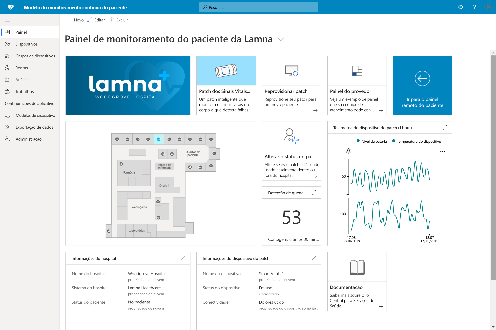

# Como criar soluções de serviços de saúde com o Azure IoT Central 

[!INCLUDE [iot-central-pnp-original](../../../includes/iot-central-pnp-original-note.md)]

Aprenda a criar uma solução para serviços de saúde com o Azure IoT Central usando modelos de aplicativo.

## O que é um modelo de monitoramento contínuo do paciente?

No espaço de IoT para serviços de saúde, o monitoramento contínuo de pacientes é um dos principais fatores que permitem reduzir o risco de readmissão, gerenciar doenças crônicas com mais eficiência e melhorar os resultados do paciente. O monitoramento contínuo do paciente pode ser dividido em duas categorias principais:

1. **Monitoramento interno de pacientes**: usando dispositivos médicos vestíveis e outros dispositivos no hospital, as equipes de atendimento podem monitorar os sinais vitais e as condições médicas do paciente sem precisar enviar enfermeiros para verificar o paciente várias vezes por dia. As equipes de atendimento podem saber em que momento um paciente precisa de atendimento crítico por meio de notificações e pode priorizar seu tempo de forma eficaz.
1. **Monitoramento remoto de pacientes**: com o uso de dispositivos médicos vestíveis e PROs (resultados relatados pelo paciente) para monitorar pacientes fora do hospital, o risco de readmissão pode ser reduzido significativamente. Dados de pacientes com doenças crônicas e pacientes em reabilitação podem ser coletados para garantir que os pacientes estejam cumprindo os planos de tratamento e que alertas de piora do paciente sejam exibidos para as equipes de atendimento antes que eles cheguem a situações críticas.

Este modelo de aplicativo pode ser usado para criar soluções para as duas categorias de monitoramento contínuo de pacientes. Os benefícios incluem:

* conectar diretamente diversos dispositivos médicos vestíveis a uma instância de aplicativo do IoT Central.
* monitorar e gerenciar os dispositivos para garantir que permaneçam íntegros.
* criar regras personalizadas relacionadas aos dados do dispositivo para disparar os alertas apropriados.
* exportar seus dados de integridade do paciente para a API do Azure para FHIR, um armazenamento de dados compatível.
* exportar os insights agregados para aplicativos de negócios novos ou existentes, capacitando as equipes de atendimento.

>[!div class="mx-imgBorder"] 
>

## Próximas etapas

Para começar a criar uma solução de monitoramento contínuo de pacientes:

* [Implantar o modelo do aplicativo](tutorial-continuous-patient-monitoring.md)
* [Ver uma arquitetura de exemplo](concept-continuous-patient-monitoring-architecture.md)