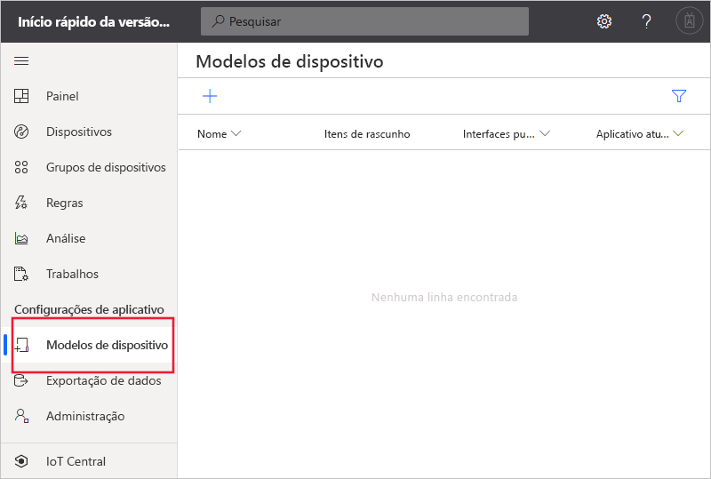
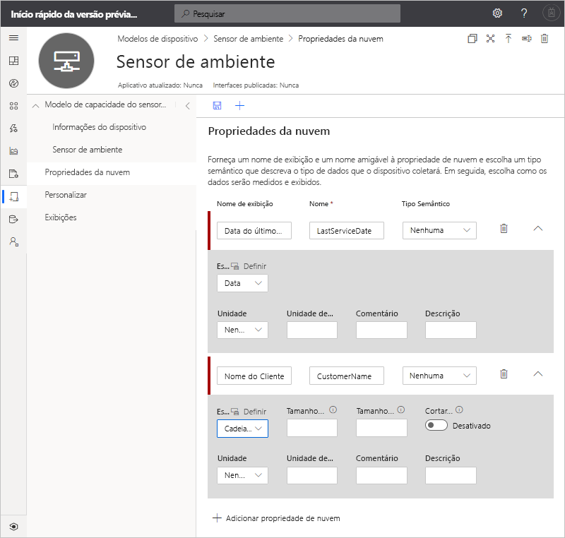
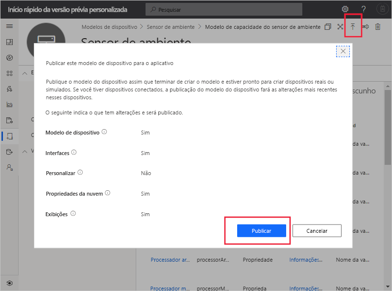
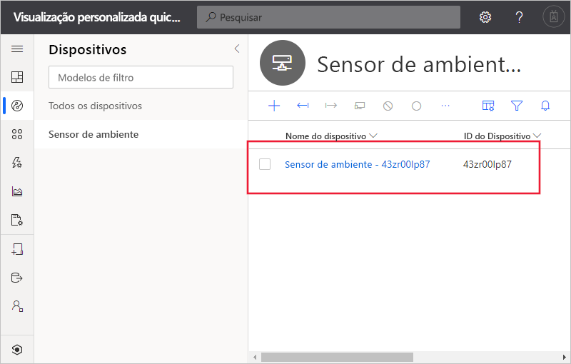
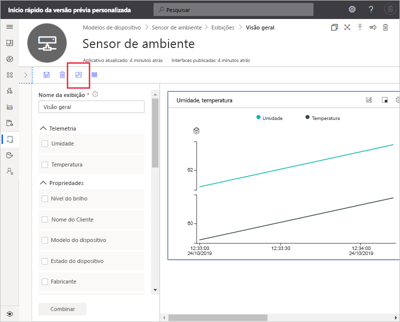

# Início Rápido: Adicionar um dispositivo simulado ao seu aplicativo do IoT Central (versão prévia dos recursos)

*Este artigo aplica-se a operadores, construtores e administradores.*

[!INCLUDE [iot-central-pnp-original](../../../includes/iot-central-pnp-original-note.md)]

Um modelo de dispositivo define as funcionalidades de um dispositivo que se conecta ao seu aplicativo do IoT Central. Os recursos incluem telemetria que o dispositivo envia, as propriedades do dispositivo e os comandos aos quais um dispositivo responde. Em um modelo de dispositivo, um construtor ou operador pode adicionar dispositivos reais e simulados a um aplicativo. Dispositivos simulados são úteis para testar o comportamento do seu aplicativo do IoT Central antes de conectar dispositivos reais.

Neste início rápido, você criará um dispositivo de **Sensor Ambiental** e adicionará um dispositivo simulado. Um dispositivo de sensor ambiental:

* Envia telemetria como a temperatura.
* Relata propriedades específicas do dispositivo, como o nível de brilho.
* Responde a comandos como ativar e desativar.
* Relata propriedades genéricas de dispositivo como a versão de firmware e o número de série.

## Pré-requisitos

Conclua o início rápido [Criar um aplicativo do Azure IoT Central (versão prévia dos recursos)](./quick-deploy-iot-central.md) para criar um aplicativo do IoT Central usando o modelo de **Aplicativo personalizado > Aplicativo de versão prévia**.

Você também precisa de uma cópia local do arquivo **EnvironmentalSensorInline. capabilitymodel.json** que contém o modelo de funcionalidade do dispositivo [IoT Plug and Play](../../iot-pnp/overview-iot-plug-and-play.md). Você pode baixá-lo [aqui](https://raw.githubusercontent.com/Azure/IoTPlugandPlay/master/samples/EnvironmentalSensorInline.capabilitymodel.json). Clique com o botão direito do mouse na página e selecione **Salvar como**.

Depois de baixar o arquivo, abra-o em um editor de texto e substitua as duas instâncias de `<YOUR_COMPANY_NAME_HERE>` pelo seu nome. Use somente os caracteres a-z, A-Z, 0-9 e sublinhado.

## Criar um modelo

Como um construtor, você pode criar e editar os modelos de dispositivo no seu aplicativo. Depois de publicar um modelo de dispositivo, você pode gerar um dispositivo simulado ou conectar dispositivos reais que implementam o modelo de dispositivo. Dispositivos simulados permitem testar o comportamento do aplicativo antes de você conectar um dispositivo real.

Para adicionar um novo modelo de dispositivo ao seu aplicativo, vá até a página **Modelos de Aplicativo**. Para fazer isso, selecione a guia **Modelos de Dispositivo** no painel esquerdo.

### Adicionar um modelo de funcionalidade do dispositivo

Há várias opções para a criação de um modelo de funcionalidade do dispositivo no IoT Central. Você pode optar por criar um modelo personalizado do zero, importar de um arquivo, selecionar no catálogo do dispositivo ou conectar um dispositivo IoT Plug and Play por meio de uma conexão do dispositivo-primeiro em que o modelo de funcionalidade do dispositivo foi publicado no repositório público. Neste tutorial, você importará um modelo de funcionalidade do dispositivo de um arquivo.

As etapas a seguir mostram como importar o modelo de funcionalidade para um dispositivo de **Sensor Ambiental**. Esses dispositivos enviam a telemetria, como a temperatura, para seu aplicativo:

1. Para adicionar um novo modelo de dispositivo, selecione **+** na página **Modelos de Dispositivo**.

1. Escolha **Dispositivo IoT** na lista de modelos de dispositivo personalizados, selecione **Avançar: Personalizar** e, em seguida, selecione **Avançar: Examinar** e **Criar**.

1. Insira **Sensor Ambiental** como nome do seu modelo de dispositivo.

1. Escolha **Importar Modelo de Funcionalidade** para criar um modelo de funcionalidade do dispositivo de um arquivo JSON. Navegue até a pasta em que você salvou o arquivo **EnvironmentalSensorInline. capabilitymodel.json** em seu computador local. Selecione o arquivo **EnvironmentalSensorInline. capabilitymodel. json** e, em seguida, selecione **Abrir**. O modelo de funcionalidade do sensor de ambiente inclui as interfaces do **Sensor Ambiental** e de **Informações do Dispositivo**:

    

    Essas interfaces definem os recursos de um dispositivo de **Sensor ambiental**. Os recursos incluem a telemetria que o dispositivo envia, as propriedades que o dispositivo relata e os comandos aos quais um dispositivo responde.

### Adicionar propriedades da nuvem

Um modelo de dispositivo pode incluir propriedades de nuvem. As propriedades de nuvem existem somente no aplicativo IoT Central e nunca são enviadas ou recebidas de um dispositivo.

1. Selecione **Propriedades da Nuvem** e, em seguida, **+ Adicionar Propriedade de nuvem**. Use as informações na tabela a seguir para adicionar uma propriedade de nuvem ao seu modelo de dispositivo.

    | Nome de exibição      | Tipo Semântico | Esquema |
    | ----------------- | ------------- | ------ |
    | Data do Último Serviço | Nenhum          | Data   |
    | Nome do Cliente     | Nenhum          | Cadeia de caracteres |

1. Selecione **Salvar** para salvar as alterações:

    

## Criar exibições

Como um construtor, você pode personalizar o aplicativo para exibir informações relevantes sobre o dispositivo de sensor ambiental para um operador. Suas personalizações habilitam o operador a gerenciar os dispositivos de sensor ambiental conectados ao aplicativo. Você pode criar dois tipos de modos de exibição para que um operador use para interagir com dispositivos:

* Formulários para exibir e editar propriedades de dispositivo e de nuvem.
* Painéis para visualizar dispositivos.

### Gerar modos de exibição padrão

Gerar modos de exibição padrão é uma maneira rápida de começar a visualizar as informações importantes do dispositivo. Você pode ter até três modos de exibição padrão geradas para seu modelo de dispositivo:

* O modo de exibição **Comandos** permite que o operador despache comandos para seu dispositivo.
* O modo de exibição **Visão Geral** usa gráficos e métricas para exibir a telemetria do dispositivo.
* O modo de exibição **Sobre** exibe as propriedades do dispositivo.

Selecione **Exibições** e **Gerar exibições padrão**.

### Configurar um modo de exibição para visualizar dispositivos

Um painel de dispositivos permite que um operador visualize um dispositivo usando gráficos e métricas. Como um construtor, você pode definir quais informações são exibidas em um painel do dispositivo. Você pode definir vários painéis para os dispositivos. Para criar um painel para visualizar a telemetria do sensor ambiental, selecione **Modo de exibição** e, em seguida, **Visualizando o dispositivo**:

1. Todas as propriedades do dispositivo, propriedades de nuvem, telemetria e opções estáticas são listadas em **Propriedades**. Você pode arrastar e soltar qualquer um desses itens para a exibição. Arraste a propriedade **Nível de Brilho** para a exibição. Você pode configurar o bloco usando o ícone de engrenagem.

1. Para adicionar um gráfico que plota telemetria, selecione **Umidade** e **Temperatura**. Em seguida, selecione **Combinar**. Para exibir esse gráfico em um formato diferente, como um gráfico de pizza ou um gráfico de barras, selecione o botão **Alterar Visualização** na parte superior do bloco.

1. Selecione **Salvar** para salvar sua exibição:

Você pode adicionar mais blocos que mostram outras propriedades ou valores de telemetria. Você também pode adicionar texto estático, links e imagens. Para mover ou redimensionar um bloco no painel, mova o ponteiro do mouse sobre o bloco e solte-o para uma nova localização ou para redimensioná-lo.

### Adicionar um formulário de dispositivo

Um formulário de dispositivo permite que um operador edite as propriedades de dispositivo graváveis e as propriedades de nuvem. Como um construtor, você pode definir vários formulários e escolher quais propriedades de dispositivo e de nuvem mostrar em cada formulário. Você também pode exibir propriedades de dispositivo somente leitura em um formulário.

Para criar um formulário para exibir e editar as propriedades do sensor ambiental:

1. Navegue até **Exibições** no modelo **Sensor Ambiental**. Selecione o bloco **Editando dados de Dispositivo e de Nuvem** para adicionar uma nova exibição.

1. Insira o nome do formulário **Propriedades do Sensor Ambiental**.

1. Arraste as propriedades da nuvem **Nome do cliente** e **Última data de serviço** até a seção existente no formulário.

1. Selecione o **Nível do brilho** e as propriedades do dispositivo **Estado do dispositivo**. Em seguida, selecione **Adicionar Seção**. Edite o título da seção para ser **Propriedades do Sensor**. Escolha **Aplicar**.

1. Selecione as propriedades **Modelo do dispositivo**, **Versão de software**, **Fabricante** e **Fabricante do processador** do dispositivo. Em seguida, selecione **Adicionar Seção**. Edite o título da seção para ser **Propriedades do Dispositivo**. Escolha **Aplicar**.

1. Selecione **Salvar** para salvar sua exibição.

## Publicar um modelo de dispositivo

Antes de criar um sensor ambiental simulado ou conectar um sensor ambiental real, você precisa publicar o modelo do dispositivo.

Para publicar um modelo de dispositivo:

1. Vá para seu modelo de dispositivo na página **Modelos de Dispositivo**.

1. Selecione **Publicar**.

1. Na caixa de diálogo **Publicar um Modelo de Dispositivo** escolha **Publicar**:

    

Depois que um modelo de dispositivo é publicado, ele fica visível na página **Dispositivos** e para o operador. Em um modelo de dispositivo publicado, você não pode editar um modelo de funcionalidade do dispositivo sem criar uma nova versão. No entanto, você pode fazer atualizações nas propriedades de nuvem, nas personalizações e nos modos de exibição, em um modelo de dispositivo publicado sem controle de versão. Depois de fazer qualquer alteração, selecione **Publicar** para enviar por push essas alterações para o operador.

## Adicionar um dispositivo simulado

Para adicionar um dispositivo simulado ao seu aplicativo, use o modelo de dispositivo do **Sensor Ambiental** que você criou.

1. Para adicionar um novo dispositivo como um operador, escolha **Dispositivos** no painel esquerdo. A guia **Dispositivos** mostra **Todos os dispositivos** e o modelo de dispositivo **Sensor Ambiental**. Selecione **Sensor Ambiental**.

1. Para adicionar um dispositivo de sensor de ambiente simulado, selecione **+ Novo**. Use a **ID do Dispositivo** sugerida ou insira sua própria **ID do Dispositivo** em minúsculas. Você também pode inserir um nome para o novo dispositivo. Alterne a opção **simulado** para **Ativado** e, em seguida, selecione **Criar**.

    

Agora você pode interagir com as exibições que foram criadas pelo construtor para o modelo de dispositivo usando dados simulados.

## Usar um dispositivo simulado para melhorar as exibições

Depois de criar um novo dispositivo simulado, o construtor pode usar esse dispositivo para continuar a melhorar e reforçar as exibições para o modelo de dispositivo.

1. Escolha **Modelos de Dispositivo** no painel esquerdo e selecione o modelo **Sensor Ambiental**.

1. Selecione qualquer uma das exibições que você gostaria de editar ou crie uma nova exibição. Clique em **Configurar dispositivo de visualização** e **Selecionar em um dispositivo em execução**. Aqui você pode escolher entre não ter nenhuma visualização do dispositivo, usando um dispositivo real que pode ser configurado para teste ou selecionado de um dispositivo existente que você adicionou ao IoT Central.

1. Escolha seu dispositivo simulado na lista. Em seguida, selecione **Aplicar**. Agora você pode ver o mesmo dispositivo simulado em sua experiência de construção de exibições de modelo de dispositivo. Essa exibição é particularmente útil para gráficos e outras visualizações.

    

## Próximas etapas

Neste início rápido, você aprendeu a criar um dispositivo de **Sensor Ambiental** e a adicionar um dispositivo simulado ao seu aplicativo.

Para saber mais sobre como monitorar dispositivos conectados ao seu aplicativo, passe para o início rápido:

> [!div class="nextstepaction"]
> [Configurar regras e ações](./quick-configure-rules.md)
