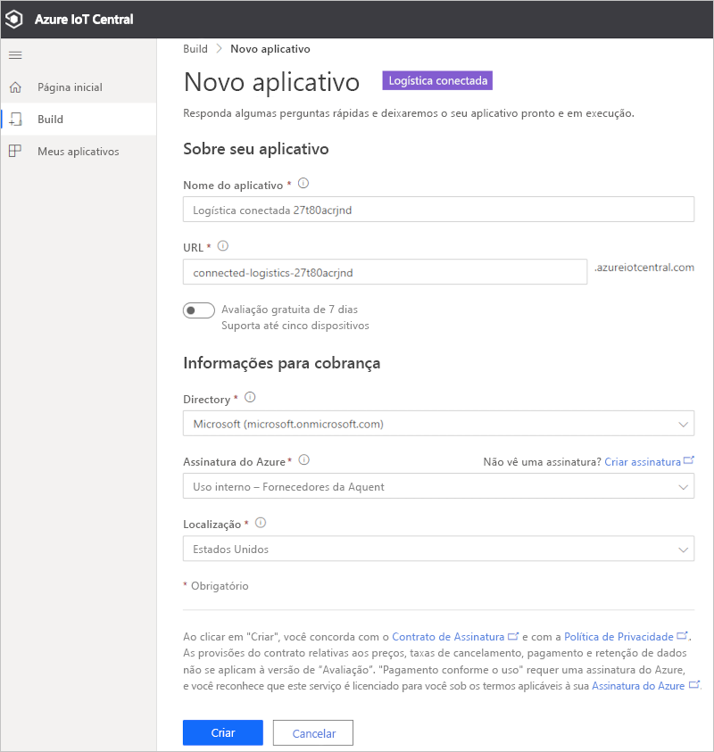

# Criar um aplicativo do Azure IoT Central (versão prévia dos recursos)

[!INCLUDE [iot-central-pnp-original](../../../includes/iot-central-pnp-original-note.md)]

Este início rápido mostra como criar um aplicativo do Azure IoT Central que contém a versão prévia dos recursos, como o IoT Plug and Play.

> [!WARNING]
> As funcionalidades do IoT Plug and Play no Azure IoT Central estão atualmente em versão prévia pública. Não use um aplicativo do IoT Central habilitado para o IoT Plug and Play em cargas de trabalho de produção. Para ambientes de produção, use um aplicativo do IoT Central criado com base em um modelo de aplicativo atual, em disponibilidade geral.

## Criar um aplicativo

Navegue até o site do [Build do Azure IoT Central](https://aka.ms/iotcentral). Em seguida, entre com uma conta pessoal, corporativa ou de estudante da Microsoft.

Crie um aplicativo da lista de modelos do IoT Central relevantes do setor para ajudar você a começar rapidamente, ou comece do zero, usando o modelo **Aplicativo personalizado**.

Para criar um novo aplicativo Azure IoT Central:

1. Para criar um aplicativo do Azure IoT Central de um *Modelo do setor*, selecione um modelo de aplicativo na lista de modelos disponíveis em um dos setores. Você também pode começar do zero, escolhendo *Aplicativo personalizado*.
1. O Azure IoT Central sugere automaticamente um **nome de aplicativo** com base no modelo de aplicativo que você selecionou. Você pode usar esse nome ou inserir seu próprio nome de aplicativo amigável.
1. O Azure IoT Central também gera um prefixo de **URL de aplicativo** único para você, com base no nome do aplicativo. Use esta URL para acessar seu aplicativo. Você terá a liberdade para alterar esse prefixo de URL para algo mais fácil de memorizar se desejar.

    

    > [!NOTE]
    > Se estiver usando um modelo de aplicativo personalizado, você verá um campo suspenso **Modelo do aplicativo**. Daqui, você pode alterar entre os modelos de versão prévia e aqueles em disponibilidade geral. Você também pode ver outros modelos que foram disponibilizados para sua organização.

1. Escolha se deseja criar esse aplicativo, usando uma avaliação gratuita de sete dias, ou se deseja usar uma assinatura com pagamento conforme o uso.
    - Os aplicativos de **avaliação** são gratuitos por sete dias e dão suporte a até cinco dispositivos. Eles podem ser convertidos em Pagamento Conforme o Uso em qualquer momento antes de expirarem. Se você criar um aplicativo de Avaliação, precisará inserir suas informações de contato e escolher se deseja receber informações e dicas da Microsoft.
    - Os aplicativos com **Pagamento Conforme o Uso** são cobrados por dispositivo, sendo que os dois primeiros dispositivos são gratuitos. Saiba mais sobre os [preços do IoT Central](https://aka.ms/iotcentral-pricing). Se você criar um aplicativo com Pagamento Conforme o Uso, precisará selecionar seu *Diretório*, sua *Assinatura do Azure* e sua *Região*:
        - *Directory* é o AAD (Azure Active Directory) no qual você criará o aplicativo. Um Azure AD contém identidades de usuário, credenciais e outras informações organizacionais. Se você não tiver um Azure AD, ele será gerado quando você criar uma assinatura do Azure.
        - Uma *Assinatura do Azure* permite que você crie instâncias de serviços do Azure. O IoT Central provisiona recursos em sua assinatura. Se você não tiver uma assinatura do Azure, poderá criar uma na [página de entrada do Azure](https://aka.ms/createazuresubscription). Depois de criar a assinatura do Azure, volte à página **Criar um aplicativo**. A nova assinatura aparecerá na lista suspensa **Assinatura do Azure**.
        - A *Região* é o local físico em que você deseja que os dados dos seus dispositivos sejam armazenados. Normalmente, você deve escolher a região fisicamente mais próxima de seus dispositivos para obter um desempenho ideal, assim como para garantir a conformidade de soberania de dados. Depois de escolher uma região, você não poderá mover o aplicativo para outra região posteriormente.

        > [!NOTE]
        > Durante a versão prévia pública, as únicas regiões disponíveis para **aplicativos em versão prévia** são **Europa Setentrional** e **EUA Central**.

1. Examine os Termos e Condições e selecione **Criar** na parte inferior da página.

## Próximas etapas

Neste início rápido, você criou um aplicativo IoT Central. Aqui estão sugestões para as próximas etapas:

> [!div class="nextstepaction"]
> [Adicionar um dispositivo simulado ao seu aplicativo IoT Central](./quick-create-pnp-device.md)
