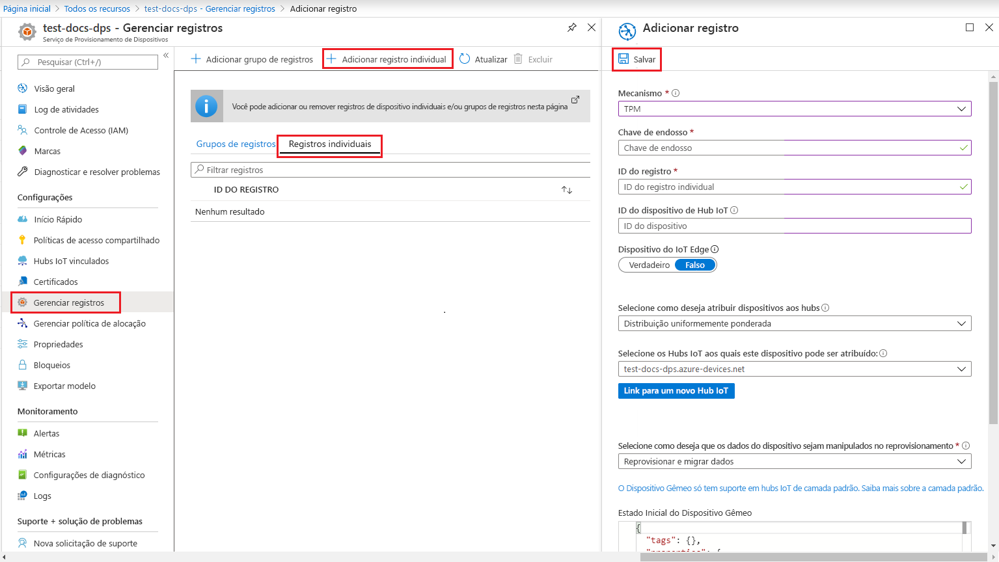
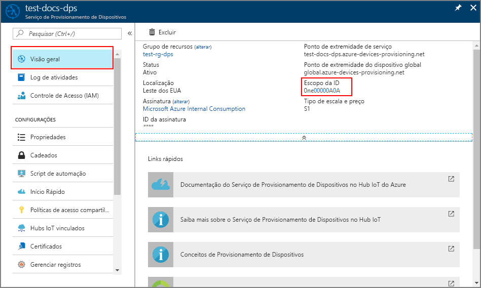

# <a name="create-and-provision-a-simulated-tpm-device-using-nodejs-device-sdk-for-iot-hub-device-provisioning-service"></a>Criar e provisionar um dispositivo TPM simulado usando o Node.js do SDK do dispositivo Python para o Serviço de Provisionamento de Dispositivos no Hub IoT

[!INCLUDE [iot-dps-selector-quick-create-simulated-device-tpm](../../includes/iot-dps-selector-quick-create-simulated-device-tpm.md)]

Estas etapas mostram como criar um dispositivo simulado em seu computador de desenvolvimento executando o sistema operacional Windows, executar o simulador do TPM do Windows como [HSM (Módulo de Segurança de Hardware)](https://azure.microsoft.com/blog/azure-iot-supports-new-security-hardware-to-strengthen-iot-security/) do dispositivo e usar o código de exemplo para se conectar a esse dispositivo simulado com o Serviço de Provisionamento de Dispositivos e o Hub IoT. 

Se você não estiver familiarizado com o processo de provisionamento automático, analise também os [Conceitos de provisionamento automático](concepts-auto-provisioning.md). Não se esqueça de concluir as etapas em [Configurar o Serviço de Provisionamento de Dispositivos no Hub IoT com o Portal do Azure](./quick-setup-auto-provision.md) antes de continuar. 

O Serviço de Provisionamento de Dispositivos de IoT do Azure dá suporte a dois tipos de registros:
- [Grupos de registros](concepts-service.md#enrollment-group): usados para inscrever vários dispositivos relacionados.
- [Registros individuais](concepts-service.md#individual-enrollment): usados para inscrever um único dispositivo.

Este artigo irá demonstrar registros individuais.

[!INCLUDE [IoT Device Provisioning Service basic](../../includes/iot-dps-basic.md)]

## <a name="prepare-the-environment"></a>Preparar o ambiente 

1. Verifique se o [Node.js v4.0 ou superior](https://nodejs.org) está instalado no computador.

1. Verifique se o `git` está instalado em seu computador e é adicionado às variáveis de ambiente que podem ser acessadas pela janela de comando. Confira [ferramentas de cliente Git do Software Freedom Conservancy](https://git-scm.com/download/) para obter a versão mais recente das ferramentas `git` a serem instaladas, que inclui o **Git Bash**, o aplicativo de linha de comando que você pode usar para interagir com seu repositório Git local. 


## <a name="simulate-a-tpm-device"></a>Simular um dispositivo TPM

1. Abra um prompt de comando ou o Bash do Git. Clone o repositório GitHub `azure-utpm-c`:
    
    ```cmd/sh
    git clone https://github.com/Azure/azure-utpm-c.git --recursive
    ```

1. Navegue até a pasta raiz do GitHub e execute o simulador de [TPM](https://docs.microsoft.com/windows/device-security/tpm/trusted-platform-module-overview). Ele escuta em um soquete nas portas 2321 e 2322. Não feche essa janela de comando; você precisa manter esse simulador em execução até o término deste Guia de Início Rápido: 

    ```cmd/sh
    .\azure-utpm-c\tools\tpm_simulator\Simulator.exe
    ```

1. Crie uma nova pasta vazia denominada **registerdevice**. Na pasta **registerdevice**, crie um arquivo package.json usando o comando a seguir no seu prompt de comando. Verifique se você respondeu a todas as perguntas feitas por `npm` ou aceite os padrões se eles forem adequados a você:
   
    ```cmd/sh
    npm init
    ```

1. Instale os seguintes pacotes precursores:

    ```cmd/sh
    npm install node-gyp -g
    npm install ffi -g
    ```

    > [!NOTE]
    > Há alguns problemas conhecidos ao instalar os pacotes acima. Para resolver esses problemas, execute `npm install --global --production windows-build-tools` usando um prompt de comando no modo **Executar como administrador**, execute `SET VCTargetsPath=C:\Program Files (x86)\MSBuild\Microsoft.Cpp\v4.0\V140` depois de substituir o caminho com sua versão instalada e execute novamente os comandos de instalação acima.
    >

1. Instale os pacotes a seguir que contêm os componentes usados durante o registro:

    - um cliente de segurança que funciona com TPM: `azure-iot-security-tpm`
    - um transporte para o dispositivo para se conectar ao Serviço de provisionamento do dispositivo: `azure-iot-provisioning-device-http` ou `azure-iot-provisioning-device-amqp`
    - um cliente para usar o cliente de transporte e segurança: `azure-iot-provisioning-device`

    Assim que o dispositivo estiver registrado, é possível usar os pacotes usuais de cliente do dispositivo Hub IoT para conectar o dispositivo usando as credenciais fornecidas durante o registro. Serão necessários:

    - o cliente do dispositivo: `azure-iot-device`
    - um transporte: qualquer um entre `azure-iot-device-amqp`, `azure-iot-device-mqtt` ou `azure-iot-device-http`
    - o cliente de segurança já instalado por você: `azure-iot-security-tpm`

    > [!NOTE]
    > Os exemplos a seguir usam os transportes `azure-iot-provisioning-device-http` e `azure-iot-device-mqtt`.
    > 

    Você pode instalar todos esses pacotes simultaneamente executando o seguinte comando no prompt de comando na pasta **registerdevice**:

        ```cmd/sh
        npm install --save azure-iot-device azure-iot-device-mqtt azure-iot-security-tpm azure-iot-provisioning-device-http azure-iot-provisioning-device
        ```

1. Usando um editor de texto, crie um novo arquivo **ExtractDevice.js** na pasta **registerdevice**.

1. Adicione as seguintes instruções `require` no início do arquivo **ExtractDevice.js**:
   
    ```
    'use strict';

    var tpmSecurity = require('azure-iot-security-tpm');
    var tssJs = require("tss.js");

    var myTpm = new tpmSecurity.TpmSecurityClient(undefined, new tssJs.Tpm(true));
    ```

1. Adicione a seguinte função para implementar o método:
   
    ```
    myTpm.getEndorsementKey(function(err, endorsementKey) {
      if (err) {
        console.log('The error returned from get key is: ' + err);
      } else {
        console.log('the endorsement key is: ' + endorsementKey.toString('base64'));
        myTpm.getRegistrationId((getRegistrationIdError, registrationId) => {
          if (getRegistrationIdError) {
            console.log('The error returned from get registration id is: ' + getRegistrationIdError);
          } else {
            console.log('The Registration Id is: ' + registrationId);
            process.exit();
          }
        });
      }
    });
    ```

1. Salve e feche o arquivo **ExtractDevice.js**. Execute o exemplo:

    ```cmd/sh
    node ExtractDevice.js
    ```

1. A janela de saída exibe a **_Chave de Endosso_** e a **_ID de Registro_** necessárias para registrar o dispositivo. Anote esses valores. 


## <a name="create-a-device-entry"></a>Criar uma entrada de dispositivo

1. Entre no portal do Azure, clique no botão **Todos os recursos** no menu esquerdo e abra o serviço de Provisionamento de Dispositivos.

1. Na folha de resumo do Serviço de Provisionamento de Dispositivos, selecione **Gerenciar registros**. Selecione a guia **Registros Individuais** e clique no botão **Adicionar registro individual** na parte superior. 

1. No painel **Adicionar Registro**, insira as seguintes informações:
    - Selecione **TPM** como o atestado de identidade *Mecanismo*.
    - Insira a *ID de Registro* e *Chave de Endosso* para seu dispositivo do TPM.
    - Opcionalmente, você pode fornecer as seguintes informações:
        - Selecione um hub IoT vinculado com o serviço de provisionamento.
        - Insira uma ID de dispositivo exclusiva. Evite dados confidenciais ao nomear seu dispositivo.
        - Atualize o **Estado inicial do dispositivo gêmeo** com a configuração inicial desejada para o dispositivo.
    - Uma vez concluído, clique no botão **Salvar**. 

      

   Em caso de registro bem-sucedido, a *ID de Registro* do seu dispositivo é exibida na lista na guia *Registros Individuais*. 


## <a name="register-the-device"></a>Registrar o dispositivo

1. No portal do Azure, selecione a folha **Visão Geral** do seu Serviço de Provisionamento de Dispositivos e anote os valores de **_Ponto de Extremidade do Dispositivo Global_** e **_Escopo de ID_**.

     

1. Usando um editor de texto, crie um novo arquivo **RegisterDevice.js** na pasta **registerdevice**.

1. Adicione as seguintes instruções `require` no início do arquivo **RegisterDevice.js**:
   
    ```
    'use strict';

    var ProvisioningTransport = require('azure-iot-provisioning-device-http').Http;
    var iotHubTransport = require('azure-iot-device-mqtt').Mqtt;
    var Client = require('azure-iot-device').Client;
    var Message = require('azure-iot-device').Message;
    var tpmSecurity = require('azure-iot-security-tpm');
    var ProvisioningDeviceClient = require('azure-iot-provisioning-device').ProvisioningDeviceClient;
    ```

    > [!NOTE]
    > O **SDK do IoT do Azure para Node.js** oferece suporte a protocolos adicionais como _AMQP_, _AMQP WS_ e _MQTT WS_.  Para obter mais exemplos, consulte [SDK do serviço de provisionamento de dispositivos para obter exemplos de Node.js](https://github.com/Azure/azure-iot-sdk-node/tree/master/provisioning/device/samples).
    > 

1. Adicione as variáveis **globalDeviceEndpoint** e **idScope** e use-as para criar uma instância **ProvisioningDeviceClient**. Substitua **{globalDeviceEndpoint}** e **{idScope}** pelos valores **_Ponto de Extremidade do Dispositivo Global_** e **_Escopo da ID_** da **Etapa 1**:
   
    ```
    var provisioningHost = '{globalDeviceEndpoint}';
    var idScope = '{idScope}';

    var tssJs = require("tss.js");
    var securityClient = new tpmSecurity.TpmSecurityClient('', new tssJs.Tpm(true));
    // if using non-simulated device, replace the above line with following:
    //var securityClient = new tpmSecurity.TpmSecurityClient();

    var provisioningClient = ProvisioningDeviceClient.create(provisioningHost, idScope, new ProvisioningTransport(), securityClient);
    ```

1. Adicione a seguinte função para implementar o método no dispositivo:
   
    ```
    provisioningClient.register(function(err, result) {
      if (err) {
        console.log("error registering device: " + err);
      } else {
        console.log('registration succeeded');
        console.log('assigned hub=' + result.registrationState.assignedHub);
        console.log('deviceId=' + result.registrationState.deviceId);
        var tpmAuthenticationProvider = tpmSecurity.TpmAuthenticationProvider.fromTpmSecurityClient(result.registrationState.deviceId, result.registrationState.assignedHub, securityClient);
        var hubClient = Client.fromAuthenticationProvider(tpmAuthenticationProvider, iotHubTransport);

        var connectCallback = function (err) {
          if (err) {
            console.error('Could not connect: ' + err.message);
          } else {
            console.log('Client connected');
            var message = new Message('Hello world');
            hubClient.sendEvent(message, printResultFor('send'));
          }
        };

        hubClient.open(connectCallback);

        function printResultFor(op) {
          return function printResult(err, res) {
            if (err) console.log(op + ' error: ' + err.toString());
            if (res) console.log(op + ' status: ' + res.constructor.name);
            process.exit(1);
          };
        }
      }
    });
    ```

1. Salve e feche o arquivo **RegisterDevice.js**. Execute o exemplo:

    ```cmd/sh
    node RegisterDevice.js
    ```

1. Observe as mensagens que simulam a inicialização e a conexão do dispositivo com o Serviço de Provisionamento de Dispositivos para obter as informações do Hub IoT. No provisionamento bem-sucedido do dispositivo simulado para o Hub IoT vinculado ao serviço de provisionamento, a ID do dispositivo aparece na folha **Dispositivos IOT** do hub. 

     

    Se você tiver alterado o *estado de dispositivo gêmeo inicial* do valor padrão na entrada de registro para o seu dispositivo, pode receber o estado desejado duas do hub e agir de acordo. Para saber mais, veja [Noções básicas e uso de dispositivos gêmeos no Hub IoT](../iot-hub/iot-hub-devguide-device-twins.md)


## <a name="clean-up-resources"></a>Limpar recursos

Se você planeja continuar a trabalhar e explorar o dispositivo cliente de exemplo, não limpe os recursos criados neste Guia de Início Rápido. Caso contrário, use as etapas a seguir para excluir todos os recursos criados por este Guia de Início Rápido.

1. Feche a janela de saída de exemplo de dispositivo cliente em seu computador.
1. Feche a janela do simulador do TPM no seu computador.
1. No menu à esquerda no Portal do Azure, clique em **Todos os recursos** e selecione o serviço de Provisionamento de Dispositivos. Abra a folha **Gerenciar Registros** de seu serviço e clique na guia **Registros Individuais**. Selecione *ID de REGISTRO* do dispositivo descrito no Guia de Início Rápido e clique no botão **Excluir** na parte superior. 
1. No menu à esquerda no Portal do Azure, clique em **Todos os recursos** e selecione seu Hub IoT. Abra a folha **Dispositivos IoT** do hub, selecione *DEVICE ID* registrado nesse Guia de Início Rápido, e clique no botão **Excluir** na parte superior.


## <a name="next-steps"></a>Próximas etapas

Neste Guia de Início Rápido, você criou um dispositivo TPM simulado no seu computador e o provisionou no Hub IoT usando o Serviço de Provisionamento de Dispositivos do Hub IoT. Para saber como registrar seu dispositivo TPM programaticamente, continue com o Guia de Início Rápido para registro programático de um dispositivo TPM. 

> [!div class="nextstepaction"]
> [Guia de Início Rápido do Azure – Registrar dispositivo TPM no Serviço de Provisionamento de Dispositivos do Hub IoT do Azure](quick-enroll-device-tpm-node.md)
