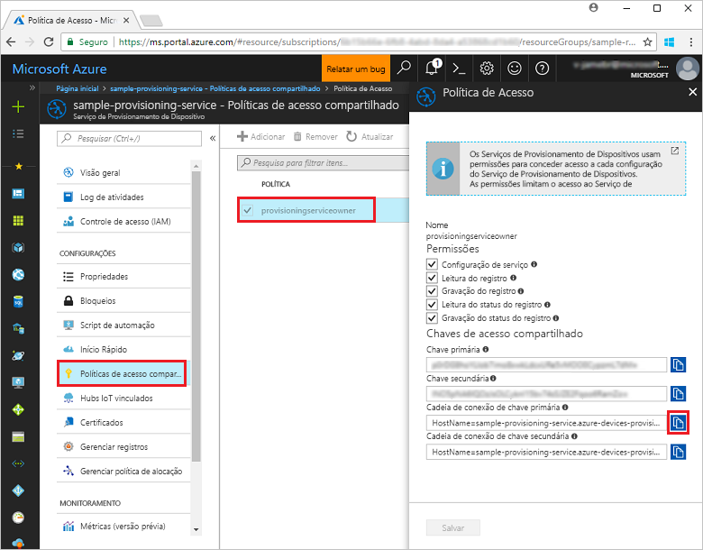
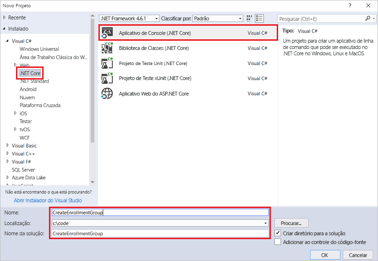
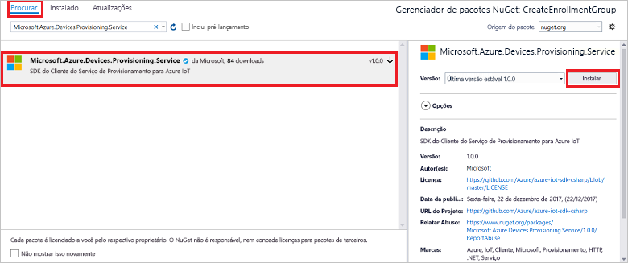

# <a name="quickstart-enroll-x509-devices-to-the-device-provisioning-service-using-c"></a>Início Rápido: Inscrever dispositivos X.509 no Serviço de Provisionamento de Dispositivos usando C#

[!INCLUDE [iot-dps-selector-quick-enroll-device-x509](../../includes/iot-dps-selector-quick-enroll-device-x509.md)]


Este início rápido mostra como usar C# para criar programaticamente um [Grupo de registro](concepts-service.md#enrollment-group) que usa certificados raiz ou intermediários de autoridade de certificação X.509. O grupo de registro é criado usando o [SDK do IoT do Microsoft Azure para .NET](https://github.com/Azure/azure-iot-sdk-csharp) e um aplicativo C# .NET Core de exemplo. Um grupo de registros controla o acesso ao serviço de provisionamento para dispositivos que compartilham um certificado de autenticação comum em sua cadeia de certificados. Para saber mais, confira [Como controlar o acesso ao dispositivo para o serviço de provisionamento com certificados X.509](./concepts-security.md#controlling-device-access-to-the-provisioning-service-with-x509-certificates). Para obter mais informações sobre como usar a Infraestrutura de Chave Pública (PKI) do X.509 baseada em certificado com o Hub IoT do Azure e o Serviço de Provisionamento do Dispositivo, confira [Visão geral de segurança do certificado de Autoridade de Certificação do X.509](https://docs.microsoft.com/azure/iot-hub/iot-hub-x509ca-overview). 

Este início rápido espera que você já tenha criado uma instância do serviço de provisionamento de dispositivos e do Hub IoT. Se você já não tiver criado esses recursos, conclua o início rápido [Configurar o Serviço de Provisionamento de Dispositivos no Hub IoT com o portal do Azure](./quick-setup-auto-provision.md) antes de continuar com este artigo.

Embora as etapas deste artigo funcionem em computadores Windows e Linux, este artigo foi desenvolvido para um computador de desenvolvimento do Windows.

[!INCLUDE [quickstarts-free-trial-note](../../includes/quickstarts-free-trial-note.md)]


## <a name="prerequisites"></a>Pré-requisitos

* Instalar o [Visual Studio 2017](https://www.visualstudio.com/vs/).
* Instalar o [SDK do .Net Core](https://www.microsoft.com/net/download/windows).
* Instale o [Git](https://git-scm.com/download/).


## <a name="prepare-test-certificates"></a>Preparar certificados de teste

Para este início rápido, você deve ter um arquivo .pem ou .cer que contém a parte pública de um certificado raiz ou intermediário de autoridade de certificação X.509. Este certificado deve ser carregado para o serviço de provisionamento e verificado pelo serviço. 

O [SDK de C do IoT do Azure](https://github.com/Azure/azure-iot-sdk-c) contém ferramentas de teste que podem ajudá-lo a criar uma cadeia de certificados X.509, carregar um certificado raiz ou intermediário a partir dessa cadeia e executar a prova de posse com o serviço para verificar o certificado. Os certificados criados com as ferramentas do SDK são projetados para uso **apenas para testes de desenvolvimento**. Esses certificados **não devem ser usados em produção**. Eles contêm senhas codificadas (“1234”) que expiram após 30 dias. Para obter informações sobre como obter certificados adequados para o uso de produção, confira [Como obter um certificado de Autoridade de Certificação X.509](https://docs.microsoft.com/azure/iot-hub/iot-hub-x509ca-overview#how-to-get-an-x509-ca-certificate) na documentação do Hub IoT do Azure.

Para usar essas ferramentas de teste para gerar certificados, execute as seguintes etapas: 
 
1. Abra um prompt de comando ou shell do Git Bash e altere para uma pasta de trabalho em seu computador. Execute o seguinte comando para clonar o repositório do GitHub [SDK de C do IoT do Azure](https://github.com/Azure/azure-iot-sdk-c):
    
   ```cmd/sh
   git clone https://github.com/Azure/azure-iot-sdk-c.git --recursive
   ```

   Atualmente, o tamanho desse repositório está em torno de 220 MB. Essa operação deve demorar alguns minutos.

   As ferramentas de teste estão localizadas em *azure-iot-sdk-c/tools/CACertificates* do repositório clonado.    

2. Siga as etapas em [Gerenciar certificados de Autoridade de Certificação de teste para exemplos e tutoriais](https://github.com/Azure/azure-iot-sdk-c/blob/master/tools/CACertificates/CACertificateOverview.md). 

Além disso, para as ferramentas no SDK do C, o [Exemplo de verificação de certificado do grupo](https://github.com/Azure/azure-iot-sdk-csharp/tree/master/provisioning/service/samples/GroupCertificateVerificationSample) no *SDK do IoT do Microsoft Azure para .NET* mostra como executar a verificação de posse em C# com um certificado de Autoridade de Certificação X.509 intermediário ou raiz. 


## <a name="get-the-connection-string-for-your-provisioning-service"></a>Obter a cadeia de conexão do serviço de provisionamento

Para o exemplo deste início rápido, é preciso ter a cadeia de conexão do serviço de provisionamento.
1. Entre no portal do Azure, clique no botão **Todos os recursos** no menu esquerdo e abra o Serviço de Provisionamento de Dispositivos. 
2. Clique em **Políticas de acesso compartilhado**, em seguida, clique na política de acesso que deseja usar para abrir suas propriedades. Na janela **Política de Acesso**, copie e anote a cadeia de conexão da chave primária. 

    

## <a name="create-the-enrollment-group-sample"></a>Criar exemplo de grupo de registros 

As etapas nesta seção mostram como criar um aplicativo de console do .NET Core que adiciona um grupo de registro ao serviço de provisionamento. Com algumas modificações, você também pode seguir estas etapas para criar um aplicativo de console do [Windows IoT Core](https://developer.microsoft.com/en-us/windows/iot) para adicionar o grupo de registros. Para saber mais sobre como desenvolver com o IoT Core, confira a [Documentação do desenvolvedor do Windows IoT Core](https://docs.microsoft.com/windows/iot-core/).
1. No Visual Studio, adicione um projeto de Aplicativo de Console do Visual C# .NET Core a uma nova solução usando o modelo de projeto **Aplicativo de Console (.NET Core)**. Verifique se a versão do .NET Framework é 4.5.1 ou posterior. Nomeie o projeto como **CreateEnrollmentGroup**.

    

2. No Gerenciador de Soluções, clique com o botão direito do mouse no projeto **CreateEnrollmentGroup** e clique em **Gerenciar Pacotes NuGet**.
3. Na janela **Gerenciador de Pacotes NuGet**, selecione **Procurar**, procure **Microsoft.Azure.Devices.Provisioning.Service**, selecione **Instalar** para instalar o pacote **Microsoft.Azure.Devices.Provisioning.Service** e aceite os termos de uso. Esse procedimento baixa, instala e adiciona uma referência ao pacote NuGet do [SDK do Cliente do Serviço de Provisionamento do IoT do Azure](https://www.nuget.org/packages/Microsoft.Azure.Devices.Provisioning.Service/) e suas dependências.

    

4. Adicione as seguintes instruções `using` após as outras instruções `using` na parte superior do arquivo **Program.cs**:
   
   ```csharp
   using System.Security.Cryptography.X509Certificates;
   using System.Threading.Tasks;
   using Microsoft.Azure.Devices.Provisioning.Service;
   ```
    
5. Adicione os seguintes campos à classe **Program** .  
   - Substitua o valor do espaço reservado **ProvisioningConnectionString** pela cadeia de conexão do serviço de provisionamento para o qual você deseja criar o registro.
   - Substitua o valor do espaço reservado de **X509RootCertPath** pelo caminho para um arquivo .pem ou .cer que representa a parte pública de um certificado de Autoridade de Certificação X.509 intermediário ou raiz que tenha sido carregado anteriormente e verificado com o serviço de provisionamento.
   - Outra opção é alterar o valor **EnrollmentGroupId**. A cadeia de caracteres pode conter apenas letras minúsculas e hifens. 

   > [!IMPORTANT]
   > No código de produção, esteja ciente das seguintes considerações de segurança:
   >
   > - Codificar a cadeia de conexão para o administrador de serviço de provisionamento é contra as práticas recomendadas de segurança. Em vez disso, a cadeia de conexão deve ser mantida de uma maneira segura, como em um arquivo de configuração seguro ou no registro.
   > - Verifique se você carregou somente a parte pública do certificado de autenticação. Nunca carregue arquivos .pfx (PKCS12) ou .pem que contenham as chaves privadas para o serviço de provisionamento.
        
   ```csharp
   private static string ProvisioningConnectionString = "{Your provisioning service connection string}";
   private static string EnrollmentGroupId = "enrollmentgrouptest";
   private static string X509RootCertPath = @"{Path to a .cer or .pem file for a verified root CA or intermediate CA X.509 certificate}";
   ```
    
6. Adicione o seguinte método à classe **Programa**. Esse código cria uma entrada do grupo de registros e depois chama o método **CreateOrUpdateEnrollmentGroupAsync** no **ProvisioningServiceClient** para adicionar o grupo de registros ao serviço de provisionamento.
   
   ```csharp
   public static async Task RunSample()
   {
       Console.WriteLine("Starting sample...");
 
       using (ProvisioningServiceClient provisioningServiceClient =
               ProvisioningServiceClient.CreateFromConnectionString(ProvisioningConnectionString))
       {
           #region Create a new enrollmentGroup config
           Console.WriteLine("\nCreating a new enrollmentGroup...");
           var certificate = new X509Certificate2(X509RootCertPath);
           Attestation attestation = X509Attestation.CreateFromRootCertificates(certificate);
           EnrollmentGroup enrollmentGroup =
                   new EnrollmentGroup(
                           EnrollmentGroupId,
                           attestation)
                   {
                       ProvisioningStatus = ProvisioningStatus.Enabled
                   };
           Console.WriteLine(enrollmentGroup);
           #endregion
 
           #region Create the enrollmentGroup
           Console.WriteLine("\nAdding new enrollmentGroup...");
           EnrollmentGroup enrollmentGroupResult =
               await provisioningServiceClient.CreateOrUpdateEnrollmentGroupAsync(enrollmentGroup).ConfigureAwait(false);
           Console.WriteLine("\nEnrollmentGroup created with success.");
           Console.WriteLine(enrollmentGroupResult);
           #endregion
 
       }
   }
   ```

7. Por fim, substitua o corpo do método **Main** pelas seguintes linhas:
   
   ```csharp
   RunSample().GetAwaiter().GetResult();
   Console.WriteLine("\nHit <Enter> to exit ...");
   Console.ReadLine();
   ```
        
8. Compilar a solução.

## <a name="run-the-enrollment-group-sample"></a>Executar exemplo de grupo de registros
  
1. Execute o exemplo no Visual Studio para criar o grupo de registros.
 
2. Na criação bem-sucedida, a janela de comando exibe as propriedades do novo grupo de registros.

    

3. Para verificar se o grupo de registros foi criado, na folha de resumo do Serviço de Provisionamento do Dispositivo no portal do Azure, selecione **Gerenciar registros**, depois selecione a guia **Grupos de registros**. Você deve ver uma nova entrada de registro que corresponda à ID de registro usada no exemplo. Clique na entrada para verificar a impressão digital do certificado e outras propriedades da entrada.

    
 
## <a name="clean-up-resources"></a>Limpar recursos
Se você planeja explorar o exemplo do serviço C#, não limpe os recursos criados neste Início Rápido. Caso contrário, use as etapas a seguir para excluir todos os recursos criados por este Guia de Início Rápido.

1. Feche a janela de saída de exemplo do C# em seu computador.
2. Navegue até o Serviço de Provisionamento de Dispositivos no Portal do Azure, clique em **Gerenciar registros** e, em seguida, selecione a guia **Grupos de Registro**. Selecione *ID de Registro* para a entrada de registro criada usando este Início Rápido e clique no botão **Excluir** na parte superior da folha.  
3. No Serviço de Provisionamento de Dispositivos no Portal do Azure, clique em **Certificados**, clique no certificado que você enviou para este Guia de Início Rápido e clique no botão**Excluir** na parte superior da janela **Detalhes do Certificado**.  
 
## <a name="next-steps"></a>Próximas etapas
Neste Início Rápido, você criou um grupo de registros para um certificado de Autoridade de Certificação X.509 raiz ou intermediário usando o Serviço de Provisionamento de Dispositivos no Hub IoT do Azure. Para saber mais sobre os detalhes de configuração do dispositivo, prossiga para o tutorial de configuração do Serviço de Provisionamento de Dispositivos no portal do Azure. 
 
> [!div class="nextstepaction"]
> [Tutoriais do Serviço de Provisionamento de Dispositivos no Hub IoT do Azure](./tutorial-set-up-cloud.md)
