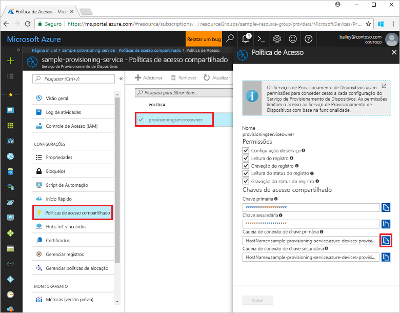
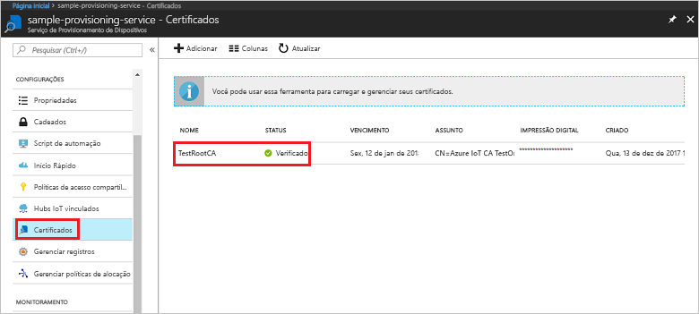
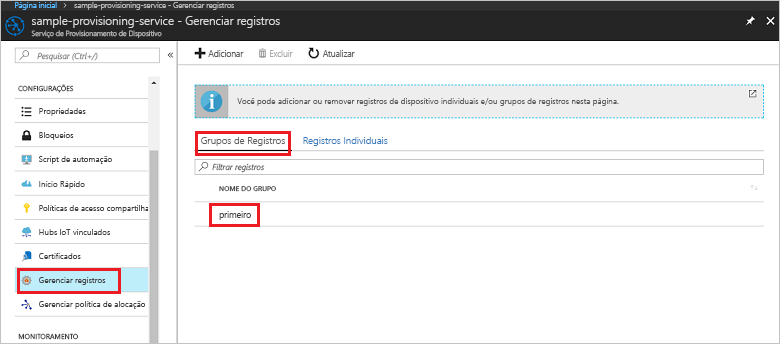

# <a name="quickstart-enroll-x509-devices-to-the-device-provisioning-service-using-nodejs"></a>Início Rápido: Inscrever dispositivos X.509 no Serviço de Provisionamento de Dispositivos usando o Node.js

[!INCLUDE [iot-dps-selector-quick-enroll-device-x509](../../includes/iot-dps-selector-quick-enroll-device-x509.md)]

Este início rápido mostra como usar Node.js para criar programaticamente um [Grupo de registro](concepts-service.md#enrollment-group) que usa certificados raiz ou intermediários de autoridade de certificação X.509. O grupo de registro é criado usando o [SDK de IoT para Node.js](https://github.com/Azure/azure-iot-sdk-node) e um aplicativo do Node.js de exemplo. Um grupo de registros controla o acesso ao serviço de provisionamento para dispositivos que compartilham um certificado de autenticação comum em sua cadeia de certificados. Para saber mais, confira [Como controlar o acesso ao dispositivo para o serviço de provisionamento com certificados X.509](./concepts-security.md#controlling-device-access-to-the-provisioning-service-with-x509-certificates). Para obter mais informações sobre como usar a Infraestrutura de Chave Pública (PKI) do X.509 baseada em certificado com o Hub IoT do Azure e o Serviço de Provisionamento do Dispositivo, confira [Visão geral de segurança do certificado de Autoridade de Certificação do X.509](https://docs.microsoft.com/azure/iot-hub/iot-hub-x509ca-overview). 

Este início rápido espera que você já tenha criado uma instância do serviço de provisionamento de dispositivos e do Hub IoT. Se você já não tiver criado esses recursos, conclua o início rápido [Configurar o Serviço de Provisionamento de Dispositivos no Hub IoT com o portal do Azure](./quick-setup-auto-provision.md) antes de continuar com este artigo.

Embora as etapas deste artigo funcionem em computadores Windows e Linux, este artigo foi desenvolvido para um computador de desenvolvimento do Windows.

[!INCLUDE [quickstarts-free-trial-note](../../includes/quickstarts-free-trial-note.md)]


## <a name="prerequisites"></a>Pré-requisitos

- Instalar [Node.js v4.0 ou superior](https://nodejs.org).
- Instale o [Git](https://git-scm.com/download/).


## <a name="prepare-test-certificates"></a>Preparar certificados de teste

Para este início rápido, você deve ter um arquivo .pem ou .cer que contém a parte pública de um certificado raiz ou intermediário de autoridade de certificação X.509. Este certificado deve ser carregado para o serviço de provisionamento e verificado pelo serviço. 

O [SDK de C do IoT do Azure](https://github.com/Azure/azure-iot-sdk-c) contém ferramentas de teste que podem ajudá-lo a criar uma cadeia de certificados X.509, carregar um certificado raiz ou intermediário a partir dessa cadeia e executar a prova de posse com o serviço para verificar o certificado. Os certificados criados com as ferramentas do SDK são projetados para uso **apenas para testes de desenvolvimento**. Esses certificados **não devem ser usados em produção**. Eles contêm senhas codificadas (“1234”) que expiram após 30 dias. Para obter informações sobre como obter certificados adequados para o uso de produção, confira [Como obter um certificado de Autoridade de Certificação X.509](https://docs.microsoft.com/azure/iot-hub/iot-hub-x509ca-overview#how-to-get-an-x509-ca-certificate) na documentação do Hub IoT do Azure.

Para usar essas ferramentas de teste para gerar certificados, execute as seguintes etapas: 
 
1. Abra um prompt de comando ou shell do Git Bash e altere para uma pasta de trabalho em seu computador. Execute o seguinte comando para clonar o repositório do GitHub [SDK de C do IoT do Azure](https://github.com/Azure/azure-iot-sdk-c):
    
   ```cmd/sh
   git clone https://github.com/Azure/azure-iot-sdk-c.git --recursive
   ```

   Essa operação deve demorar alguns minutos.

   As ferramentas de teste estão localizadas em *azure-iot-sdk-c/tools/CACertificates* do repositório clonado.    

2. Siga as etapas em [Gerenciar certificados de Autoridade de Certificação de teste para exemplos e tutoriais](https://github.com/Azure/azure-iot-sdk-c/blob/master/tools/CACertificates/CACertificateOverview.md). 


## <a name="create-the-enrollment-group-sample"></a>Criar exemplo de grupo de registros 

 
1. Em uma janela de comando na sua pasta de trabalho, execute:
  
     ```cmd\sh
     npm install azure-iot-provisioning-service
     ```  

2. Usando um editor de texto, crie um arquivo **create_enrollment_group.js** em sua pasta de trabalho. Adicione o seguinte código ao arquivo e salve:

    ```
    'use strict';
    var fs = require('fs');

    var provisioningServiceClient = require('azure-iot-provisioning-service').ProvisioningServiceClient;

    var serviceClient = provisioningServiceClient.fromConnectionString(process.argv[2]);

    var enrollment = {
      enrollmentGroupId: 'first',
      attestation: {
        type: 'x509',
        x509: {
          signingCertificates: {
            primary: {
              certificate: fs.readFileSync(process.argv[3], 'utf-8').toString()
            }
          }
        }
      },
      provisioningStatus: 'disabled'
    };

    serviceClient.createOrUpdateEnrollmentGroup(enrollment, function(err, enrollmentResponse) {
      if (err) {
        console.log('error creating the group enrollment: ' + err);
      } else {
        console.log("enrollment record returned: " + JSON.stringify(enrollmentResponse, null, 2));
        enrollmentResponse.provisioningStatus = 'enabled';
        serviceClient.createOrUpdateEnrollmentGroup(enrollmentResponse, function(err, enrollmentResponse) {
          if (err) {
            console.log('error updating the group enrollment: ' + err);
          } else {
            console.log("updated enrollment record returned: " + JSON.stringify(enrollmentResponse, null, 2));
          }
        });
      }
    });
    ```

## <a name="run-the-enrollment-group-sample"></a>Executar exemplo de grupo de registros
 
1. Para executar o exemplo, é necessário a cadeia de conexão com o serviço de provisionamento. 
    1. Entre no portal do Azure, clique no botão **Todos os recursos** no menu esquerdo e abra o serviço de Provisionamento de Dispositivos. 
    2. Clique em **Políticas de acesso compartilhado**, em seguida, clique na política de acesso que deseja usar para abrir suas propriedades. Na janela **Política de Acesso**, copie e anote a cadeia de conexão da chave primária. 

        


3. Como informado em [Preparar certificados de teste](quick-enroll-device-x509-node.md#prepare-test-certificates), você também precisa de um arquivo .pem que contenha um certificado de Autoridade de Certificação X.509 raiz ou intermediário, carregado e verificado anteriormente com seu serviço de provisionamento. Para verificar se o seu certificado foi carregado e verificado, na página de resumo do Serviço de Provisionamento de Dispositivos no portal Azure, clique em **Certificados**. Encontre o certificado que deseja usar para registro do grupo e veja se o valor do status é *verificado*.

     

1. Para criar um grupo de registros para o seu certificado, execute o seguinte comando (inclua aspas nos argumentos do comando):
 
     ```cmd\sh
     node create_enrollment_group.js "<the connection string for your provisioning service>" "<your certificate's .pem file>"
     ```
 
3. Na criação bem-sucedida, a janela de comando exibe as propriedades do novo grupo de registros.

     

4. Verifique se o grupo de registros foi criado. No Portal do Azure, na folha de resumo do Serviço de Provisionamento de Dispositivos, selecione **Gerenciar registros**. Selecione a guia **Grupos de Inscrição** e verifique se a nova entrada de registro (*primeira*) está presente.

     
 
## <a name="clean-up-resources"></a>Limpar recursos
Se você planeja explorar exemplos do serviço Node.js, não limpe os recursos criados neste Guia de início rápido. Caso contrário, use as etapas a seguir para excluir todos os recursos do Azure criados por este Guia de Início Rápido.
 
1. Feche a janela de saída de exemplo do Node.js no computador.
2. Navegue até o Serviço de Provisionamento de Dispositivos no Portal do Azure, clique em **Gerenciar registros** e, em seguida, selecione a guia **Grupos de Registro**. Selecione *ID de Registro* para a entrada de registro criada usando este Início Rápido e clique no botão **Excluir** na parte superior da folha.  
3. No Serviço de Provisionamento de Dispositivos no Portal do Azure, clique em **Certificados**, clique no certificado que você enviou para este Guia de Início Rápido e clique no botão**Excluir** na parte superior da janela **Detalhes do Certificado**.  
 
## <a name="next-steps"></a>Próximas etapas
Neste Guia de Início Rápido, você criou um registro de grupo para um certificado X.509 AC raiz ou intermediário usando o Serviço de Provisionamento de Dispositivos Hub IoT do Azure. Para saber mais sobre os detalhes de configuração do dispositivo, prossiga para o tutorial de configuração do Serviço de Provisionamento de Dispositivos no portal do Azure. 
 
> [!div class="nextstepaction"]
> [Tutoriais do Serviço de Provisionamento de Dispositivos no Hub IoT do Azure](./tutorial-set-up-cloud.md)