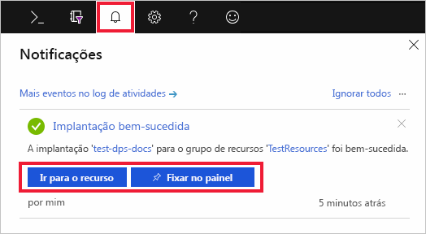
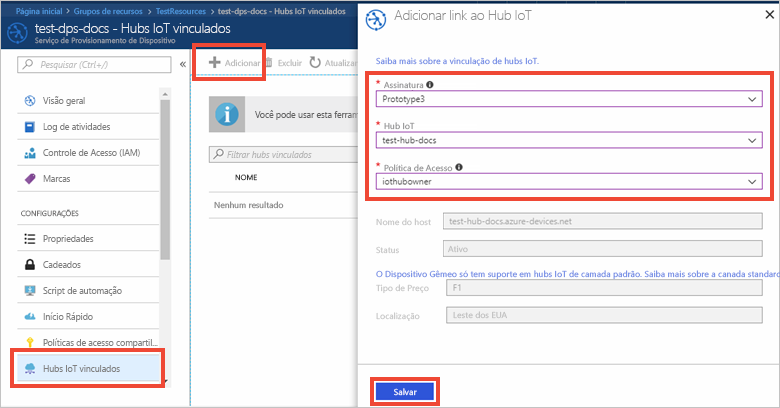

# Início Rápido: Configurar o Serviço de Provisionamento de Dispositivos do Hub IoT com o portal do Azure

Estas etapas mostram como configurar os recursos de nuvem do Azure no portal para provisionar seus dispositivos. Este artigo inclui etapas para criar um novo IoT Serviço de Provisionamento de Dispositivos no Hub IoT e vincular os dois serviços. 

Se você não tiver uma assinatura do Azure, crie uma [conta gratuita](https://azure.microsoft.com/free/?WT.mc_id=A261C142F) antes de começar.

## Crie um hub IoT

[!INCLUDE [iot-hub-include-create-hub](../../includes/iot-hub-include-create-hub.md)]

## Criar uma nova instância para o Serviço de Provisionamento de Dispositivos do Hub IoT

1. Selecione o botão **+ Criar um recurso** novamente.

2. *Pesquise no Marketplace* o **Serviço de Provisionamento de Dispositivos**. Selecione o botão **Serviço de Provisionamento de Dispositivos no Hub IoT** e clique em **Criar**. 

3. Forneça as seguintes informações para a nova instância de serviço de provisionamento de dispositivos e clique em **Criar**.

    * **Nome:** forneça um nome exclusivo para sua nova instância do Serviço de Provisionamento de Dispositivos. Caso o nome inserido esteja disponível, uma marca de seleção verde será exibida.
    * **Assinatura:** escolha a assinatura que você deseja usar para criar essa instância do Serviço de Provisionamento de Dispositivos.
    * **Grupo de recursos:** este campo permite que você crie um novo grupo de recursos ou escolha um existente para conter a nova instância. Escolha o mesmo grupo de recursos que contenha o hub Iot criado acima, por exemplo, **TestResources**. Ao colocar todos os recursos relacionados em um grupo, você pode gerenciá-los juntos. Por exemplo, a exclusão do grupo de recursos exclui todos os recursos contidos nesse grupo. Para obter mais informações, veja [Gerenciar grupos de recursos do Azure Resource Manager](../azure-resource-manager/manage-resource-groups-portal.md).
    * **Localização:** selecione a localização mais próxima de seus dispositivos.

        

4. Selecione o botão de notificação para monitorar a criação da instância do recurso. Depois que o serviço é implantado com êxito, selecione **Fixar no painel** e, então, **Ir para o recurso**.

    

## Vincular o Hub IoT e o Serviço de Provisionamento de Dispositivos

Nesta seção, você adicionará uma configuração para a instância do Serviço de Provisionamento de Dispositivos. Essa configuração define o hub IoT para o qual os dispositivos serão provisionados.

1. Selecione o botão **Todos os recursos** no menu à esquerda do portal do Azure. Selecione a instância de Serviço de Provisionamento de Dispositivos que você criou na seção anterior.  

2. No menu do Serviço de Provisionamento de Dispositivos, selecione **Hubs IoT Vinculados**. Clique no botão **+ Adicionar** na parte superior. 

3. Sobre o **Adicionar link para o hub IoT**, forneça as informações a seguir para vincular a nova instância de serviço de provisionamento de dispositivo a um hub IoT. Em seguida, clique em **Salvar**. 

    * **Assinatura:** selecione a assinatura que contém o hub IoT que você deseja vincular com a nova instância do Serviço de Provisionamento de Dispositivos.
    * **Hub IoT:** selecione o hub IoT para vincular com a nova instância do Serviço de Provisionamento de Dispositivos.
    * **Política de acesso:** selecione **iothubowner** como as credenciais para estabelecer o link com o hub IoT.  

        

3. Agora você deve ver o hub selecionado na folha **Hubs IoT Vinculados**. Talvez seja necessário clicar em **Atualizar** para que ele apareça.

## Limpar recursos

Outros inícios rápidos nessa coleção aproveitam esse início rápido. Se você planeja continuar trabalhando com inícios rápidos subsequentes ou com os tutoriais, não limpe os recursos criados nesse início rápido. Caso contrário, siga estas etapas para excluir todos os recursos criados por esse início rápido no Portal do Azure.

1. No menu à esquerda no Portal do Azure, selecione **Todos os recursos** e selecione o Serviço de Provisionamento de Dispositivos. Na parte superior do painel de detalhes do dispositivo, selecione **Excluir**.  
2. No menu à esquerda no portal do Azure, selecione **Todos os recursos** e seu Hub IoT. Na parte superior do painel de detalhes do hub, selecione **Excluir**.  

## Próximas etapas

Neste Início Rápido, você implantou um Hub IoT e uma instância do Serviço de Provisionamento de Dispositivos, bem como vinculou os dois recursos. Para aprender a usar essa configuração a fim de provisionar um dispositivo simulado, prossiga para o Início Rápido de criação de dispositivo simulado.

> [!div class="nextstepaction"]
> [Início Rápido para criar um dispositivo simulado](./quick-create-simulated-device.md)
