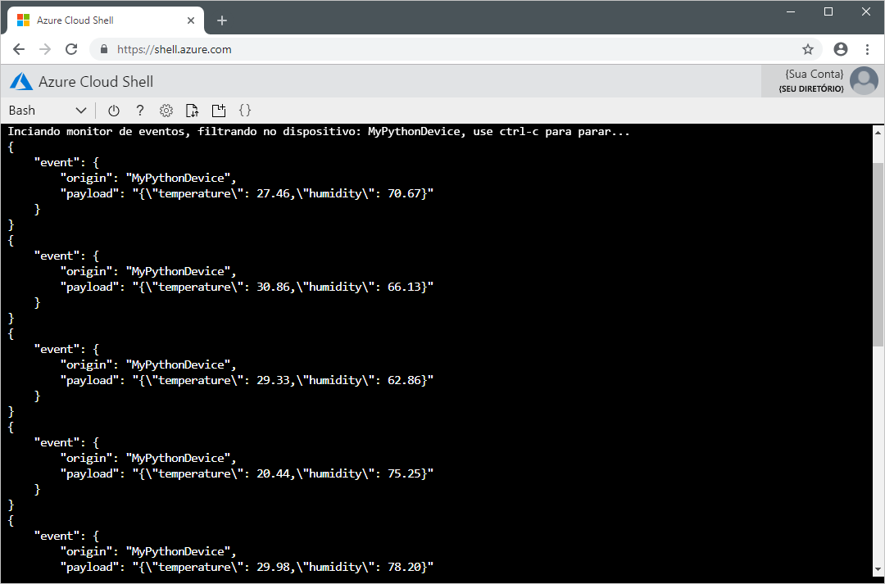

# <a name="quickstart-send-telemetry-from-a-device-to-an-iot-hub-and-read-it-with-a-back-end-application-python"></a>Início Rápido: Enviar a telemetria de um dispositivo para um hub IoT e lê-la com um back-end (Python)

[!INCLUDE [iot-hub-quickstarts-1-selector](../../includes/iot-hub-quickstarts-1-selector.md)]

O Hub IoT é um serviço do Azure que permite a ingestão de grandes volumes de telemetria de seus dispositivos IoT pela nuvem para processamento ou armazenamento. Neste início rápido, você envia telemetria de um aplicativo de dispositivo simulado, por meio do Hub IoT, para um aplicativo de back-end para processamento.

Este início rápido usa um aplicativo Python previamente codificado para enviar a telemetria, e um utilitário CLI para ler a telemetria do Hub. Antes de executar esses dois aplicativos, você cria um hub IoT e registra um dispositivo com o hub.

Se você não tiver uma assinatura do Azure, crie uma [conta gratuita](https://azure.microsoft.com/free/?WT.mc_id=A261C142F) antes de começar.

## <a name="prerequisites"></a>Pré-requisitos

Execute o comando a seguir para adicionar a Extensão do Microsoft Azure IoT para a CLI do Azure à instância do Cloud Shell. A Extensão de IoT adiciona comandos específicos do Hub IoT, do IoT Edge e do DPS (Serviço de Provisionamento de Dispositivos IoT) à CLI do Azure.

```azurecli-interactive
az extension add --name azure-cli-iot-ext
```

Faça o download do projeto de exemplo de Python do https://github.com/Azure-Samples/azure-iot-samples-python/archive/master.zip e extraia o arquivo ZIP.

Ter o Python versão 3.5.3 ou posterior instalado no computador de desenvolvimento. 

## <a name="create-an-iot-hub"></a>Crie um hub IoT

[!INCLUDE [iot-hub-include-create-hub](../../includes/iot-hub-include-create-hub.md)]

## <a name="register-a-device"></a>Registrar um dispositivo

Um dispositivo deve ser registrado no hub IoT antes de poder se conectar. Neste início rápido, você usa o Azure Cloud Shell para registrar um dispositivo simulado.

1. Execute o comando a seguir no Azure Cloud Shell para criar a identidade do dispositivo.

    **YourIoTHubName**: substitua o espaço reservado abaixo pelo nome escolhido para o hub IoT.

    **MyPythonDevice**: esse é o nome do dispositivo que está sendo registrado. É recomendável usar o **MyPythonDevice** conforme mostrado. Se você escolher um nome diferente para seu dispositivo, você também precisará usar esse nome ao longo deste artigo e atualizar o nome de dispositivo nos aplicativos de exemplo antes de executá-los.

    ```azurecli-interactive
    az iot hub device-identity create --hub-name {YourIoTHubName} --device-id MyPythonDevice
    ```

1. Execute o seguinte comando no Azure Cloud Shell para obter a _cadeia de conexão de dispositivo_ referente ao dispositivo que você registrou:

    **YourIoTHubName**: substitua o espaço reservado abaixo pelo nome escolhido para o hub IoT.

    ```azurecli-interactive
    az iot hub device-identity show-connection-string --hub-name {YourIoTHubName} --device-id MyPythonDevice --output table
    ```

    Tome nota da cadeia de conexão do dispositivo, que se parece com:

   `HostName={YourIoTHubName}.azure-devices.net;DeviceId=MyPythonDevice;SharedAccessKey={YourSharedAccessKey}`

    Você usará esse valor posteriormente no início rápido.

## <a name="send-simulated-telemetry"></a>Enviar telemetria simulada

O aplicativo de dispositivo simulado se conecta a um ponto de extremidade específico do dispositivo em seu hub IoT e envia telemetria simulada de temperatura e umidade.

1. Em uma janela de terminal local, navegue até a pasta raiz do projeto Python de exemplo. Em seguida, navegue até a pasta **iot-hub\Quickstarts\simulated-device**.

1. Abra o arquivo **SimulatedDevice.py** em seu editor de texto preferido.

    Substitua o valor da variável `CONNECTION_STRING` pela cadeia de conexão do dispositivo que você anotou anteriormente. Salve suas alterações em **SimulatedDevice.py**.

1. Na janela de terminal local, execute os seguintes comandos para instalar as bibliotecas necessárias para o aplicativo de dispositivo simulado:

    ```cmd/sh
    pip install azure-iot-device
    ```

1. Na janela de terminal local, execute os seguintes comandos para executar o aplicativo de dispositivo simulado:

    ```cmd/sh
    python SimulatedDevice.py
    ```

    A captura de tela a seguir mostra o resultado à medida que o aplicativo de dispositivo simulado envia telemetria para o seu hub IoT:

    


## <a name="read-the-telemetry-from-your-hub"></a>Ler a telemetria do hub

A extensão de CLI do Hub IoT pode se conectar ao ponto de extremidade **Eventos** do lado do serviço em seu Hub IoT. A extensão recebe as mensagens do dispositivo para a nuvem, enviadas de seu dispositivo simulado. Um aplicativo de back-end do Hub IoT normalmente é executado na nuvem para receber e processar as mensagens do dispositivo para a nuvem.

Execute os seguintes comandos no Azure Cloud Shell, substituindo `YourIoTHubName` pelo nome do Hub IoT:

```azurecli-interactive
az iot hub monitor-events --hub-name {YourIoTHubName} --device-id MyPythonDevice 
```

A captura de tela a seguir mostra a saída à medida que a extensão recebe a telemetria enviada pelo dispositivo simulado para o hub:



## <a name="clean-up-resources"></a>Limpar recursos

[!INCLUDE [iot-hub-quickstarts-clean-up-resources](../../includes/iot-hub-quickstarts-clean-up-resources.md)]

## <a name="next-steps"></a>Próximas etapas

Neste início rápido, você configurou um hub IoT, registrou um dispositivo, enviou telemetria simulada para o hub usando um aplicativo Python e leu a telemetria do hub usando um aplicativo de back-end simples.

Para saber como controlar o dispositivo simulado em um aplicativo de back-end, continue no próximo início rápido.

> [!div class="nextstepaction"]
> [Início Rápido: Controlar um dispositivo conectado a um hub IoT](quickstart-control-device-python.md)
