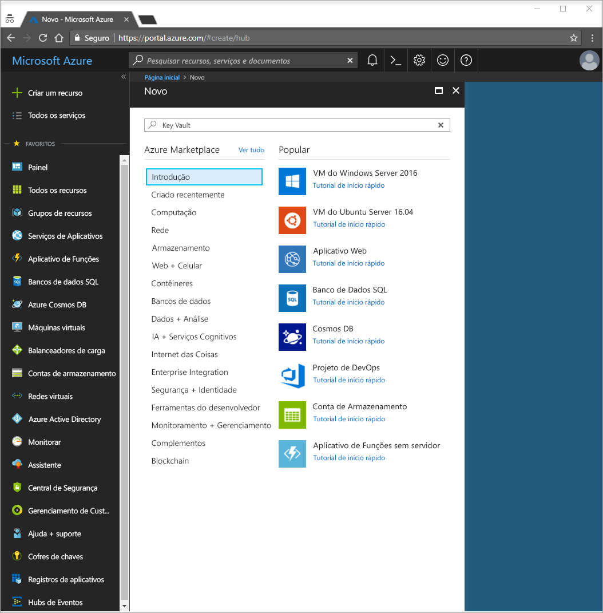
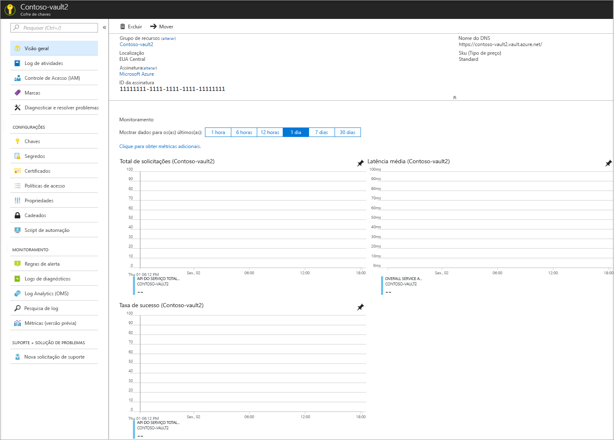

# Início Rápido: definir e recuperar um segredo do Azure Key Vault usando o portal do Azure

O Azure Key Vault é um serviço de nuvem que funciona como um repositório seguro de segredos. Você pode armazenar chaves, senhas, certificados e outros segredos com segurança. Os cofres de chaves do Azure podem ser criados e gerenciados por meio do portal do Azure. Neste início rápido, você cria um cofre de chaves e o utiliza para armazenar um segredo. Para saber mais sobre o Key Vault, analise a [Visão geral](key-vault-overview.md).

Se você não tiver uma assinatura do Azure, crie uma [conta gratuita](https://azure.microsoft.com/free/?WT.mc_id=A261C142F) antes de começar.

## Entrar no Azure

Entre no Portal do Azure em http://portal.azure.com.

## Criar um cofre

1. Selecione a opção **Criar um recurso** no canto superior esquerdo do portal do Azure

    
2. Digite **Key Vault** na caixa Pesquisar.
3. Na lista de resultados, escolha **Key Vault**.
4. Na seção Key Vault, escolha **Criar**.
5. A seção **Criar cofre de chaves** fornece as seguintes informações:
    - **Nome**: um nome exclusivo é necessário. Neste início rápido, usamos **Contoso-vault2**. 
    - **Assinatura**: Escolha uma assinatura.
    - Em **Grupo de Recursos**, escolha **Criar novo** e digite um nome para o grupo de recursos.
    - No menu suspenso **Local**, escolha um local.
    - Marque a caixa de seleção **Fixar no painel**.
    - Deixe as outras opções em seus padrões.
6. Depois de fornecer as informações acima, selecione **Criar**.

Anote as duas propriedades listadas abaixo:

* **Nome do cofre**: no exemplo, é **Contoso-Vault2**. Você usará esse nome nas outras etapas.
* **URI do cofre**: no exemplo, é https://contoso-vault2.vault.azure.net/. Aplicativos que usam seu cofre via API REST devem usar esse URI.

Nesse ponto, sua conta do Azure é a única autorizada a executar operações nesse novo cofre.

## Adicionar um segredo ao Key Vault

Para adicionar um segredo ao cofre, basta executar algumas etapas adicionais. Nesse caso, adicionamos uma senha que pode ser usada por um aplicativo. A senha é chamada **ExamplePassword**, e armazenamos o valor **hVFkk965BuUv** nela.

1. Na página de propriedades do Key Vault, selecione **Segredos**.
2. Clique em **Gerar/Importar**.
3. Na tela **Criar um segredo**, escolha os seguintes valores:
    - **Opções de upload**: Manual.
    - **Nome**: ExamplePassword.
    - **Valor**: hVFkk965BuUv
    - Deixe os outros valores com seus padrões. Clique em **Criar**.

Quando receber a mensagem de que o segredo foi criado com êxito, clique nele na lista. Você pode ver algumas das propriedades. Se você clicar na versão atual, poderá ver o valor especificado na etapa anterior.

## Limpar recursos

Outros tutoriais e inícios rápidos do Key Vault complementam este início rápido. Se você planeja continuar a trabalhar com os tutoriais e inícios rápidos subsequentes, deixe esses recursos onde estão.
Quando não for mais necessário, exclua o grupo de recursos, que excluirá o Key Vault e os recursos relacionados. Para excluir o grupo de recursos pelo portal:

1. Insira o nome do grupo de recursos na caixa de pesquisa na parte superior do portal. Quando você vir o grupo de recursos usado neste início rápido nos resultados da pesquisa, selecione-o.
2. Selecione **Excluir grupo de recursos**.
3. Na caixa **DIGITE O NOME DO GRUPO DE RECURSOS:**, digite o nome do grupo de recursos e selecione **Excluir**.

## Próximas etapas

Neste início rápido, você criou um Key Vault e armazenou um segredo. Para saber mais sobre o Key Vault e como você pode usá-lo com seus aplicativos, prossiga para o tutorial de aplicativos Web que trabalham com o Key Vault.

> [!div class="nextstepaction"]
> Para saber como ler um segredo do Key Vault de um aplicativo Web usando identidades gerenciadas para recursos do Azure, continue com o tutorial a seguir, [Configurar um aplicativo Web do Azure para ler um segredo do Cofre de chaves](quick-create-net.md).
