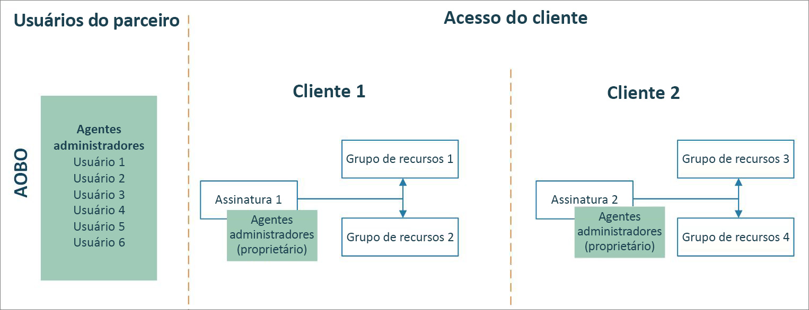
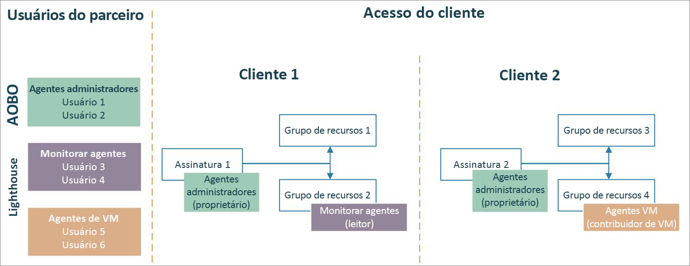

# Azure Lighthouse e o programa Provedor de Soluções na Nuvem

Se você é [parceiro CSP (Provedor de Soluções na Nuvem)](https://docs.microsoft.com/partner-center/csp-overview), já pode acessar as assinaturas do Azure criadas para seus clientes por meio do programa CSP usando a funcionalidade [AOBO (Administrar em nome de)](https://channel9.msdn.com/Series/cspdev/Module-11-Admin-On-Behalf-Of-AOBO). Esse acesso permite que você dê suporte, configure e gerencie diretamente as assinaturas dos seus clientes.

Com o Azure Lighthouse, é possível usar o gerenciamento de recursos delegados do Azure juntamente com o AOBO. Isso ajuda a melhorar a segurança e reduz o acesso desnecessário habilitando permissões mais granulares para seus usuários. Isso também possibilita maior eficiência e escalabilidade, pois os usuários podem trabalhar em várias assinaturas de clientes usando um único logon em seu locatário.

## AOBO (Administrar em Nome de)

Com o AOBO, qualquer usuário com a função [Agente Administrador](https://docs.microsoft.com/partner-center/permissions-overview#manage-commercial-transactions-in-partner-center-azure-ad-and-csp-roles) em seu locatário terá acesso AOBO às assinaturas do Azure que você criar por meio do programa CSP. Os usuários que precisarem de acesso às assinaturas de clientes deverão ser um membro deste grupo. O AOBO não permite a flexibilidade de criar grupos distintos que funcionam com clientes diferentes ou de habilitar funções diferentes para grupos ou usuários.

## Gerenciamento de recursos delegados do Azure

Usando o gerenciamento de recursos delegados do Azure, é possível atribuir diferentes grupos a diferentes clientes ou funções, conforme mostrado no diagrama a seguir. Como os usuários terão o nível apropriado de acesso por meio do gerenciamento de recursos delegados do Azure, é possível reduzir o número de usuários que têm a função Agente Administrador (e, portanto, ter acesso AOBO total). Isso ajuda a melhorar a segurança limitando o acesso desnecessário aos recursos dos seus clientes. Também oferece mais flexibilidade de gerenciar vários clientes em escala.

A integração de uma assinatura que você criou por meio do programa CSP segue as etapas descritas em [Integrar uma assinatura ao gerenciamento de recursos delegados do Azure](../how-to/onboard-customer.md). Qualquer usuário que tenha a função Agente Administrador em seu locatário poderá realizar essa integração.

## Próximas etapas

- Saiba mais sobre as [experiências de gerenciamento entre locatários](cross-tenant-management-experience.md).
- Saiba como [integrar uma assinatura ao gerenciamento de recursos delegados do Azure](../how-to/onboard-customer.md).
- Saiba mais sobre o [programa Provedor de Soluções na Nuvem](https://docs.microsoft.com/partner-center/csp-overview).
