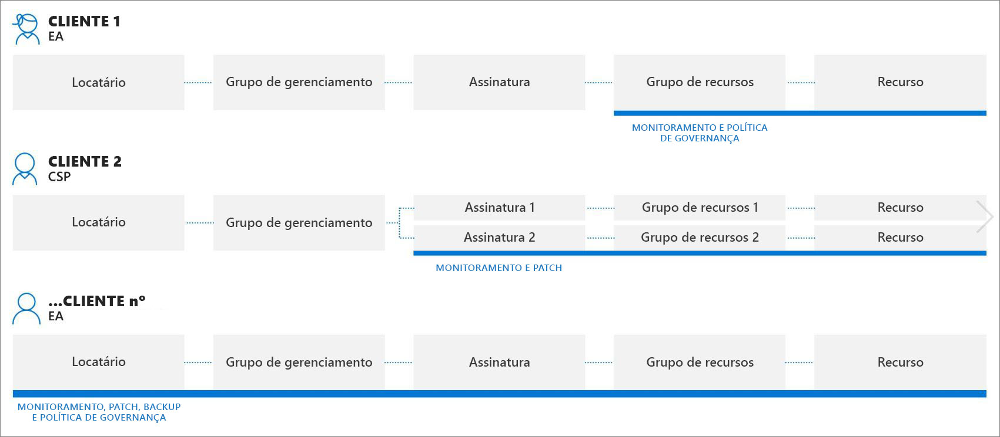
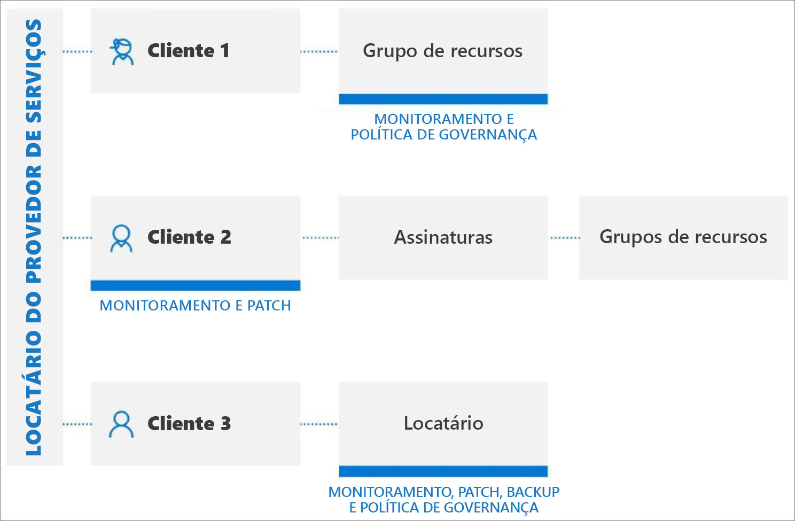

# Experiências de gerenciamento entre locatários

Como provedor de serviços, você pode usar o [Gerenciamento de recursos delegados do Azure](../concepts/azure-delegated-resource-management.md) para gerenciar recursos do Azure para vários clientes de dentro de seu próprio locatário no [portal do Azure](https://portal.azure.com). A maioria das tarefas e serviços pode ser realizada em recursos delegados do Azure em locatários gerenciados. Este artigo descreve alguns dos cenários otimizados em que o gerenciamento do recurso delegado do Azure pode ser efetivo.

> [!NOTE]
> O gerenciamento de recursos delegados do Azure também pode ser usado dentro de uma empresa que tem vários locatários próprios para simplificar a administração entre locatários.

## Noções básicas sobre locatários de cliente

Um locatário do Azure AD (Active Directory) é uma representação de uma organização. É uma instância dedicada do Azure AD que uma organização recebe quando cria uma relação com a Microsoft inscrevendo-se no Azure, no Microsoft 365 ou em outros serviços. Cada locatário do Azure AD é diferente e separado de outros locatários do Azure AD e tem sua própria ID de locatário (um GUID). Para saber mais, confira [O que é Azure Active Directory?](https://docs.microsoft.com/azure/active-directory/fundamentals/active-directory-whatis)

Normalmente, para gerenciar recursos do Azure para um cliente, os provedores de serviço teriam que entrar no portal do Azure usando uma conta associada ao locatário desse cliente, que requer um administrador no locatário do cliente para criar e gerenciar contas de usuário para o provedor de serviços.

Com o gerenciamento de recursos delegados do Azure, o processo de integração especifica usuários dentro do locatário do provedor de serviços que poderão acessar e gerenciar assinaturas, grupos de recursos e recursos no locatário do cliente. Esses usuários podem entrar no portal do Azure usando suas próprias credenciais. Dentro do portal do Azure, eles podem gerenciar recursos que pertencem a todos os clientes aos quais eles têm acesso. Isso pode ser feito acessando a página [Meus clientes](../how-to/view-manage-customers.md) no portal do Azure ou trabalhando diretamente no contexto da assinatura do cliente, seja no portal do Azure ou por meio de APIs.

O gerenciamento de recursos delegados do Azure permite maior flexibilidade para gerenciar recursos para vários clientes sem precisar entrar em diferentes contas em diferentes locatários. Por exemplo, um provedor de serviços pode ter três clientes, com responsabilidades e níveis de acesso diferentes, como mostrado aqui:

Usando o gerenciamento de recursos delegado do Azure, os usuários autorizados podem entrar no locatário do provedor de serviços para acessar esses recursos, conforme mostrado aqui:

## Suporte às ferramentas de gerenciamento e APIs

Você pode executar tarefas de gerenciamento em recursos delegados diretamente no portal ou usando APIs e ferramentas de gerenciamento (como a CLI do Azure e o Azure PowerShell). Todas as APIs existentes podem ser usadas ao trabalhar com recursos delegados, desde que a funcionalidade seja compatível com o gerenciamento entre diferentes locatários e que o usuário tenha as permissões apropriadas.

Também fornecemos APIs para realizar tarefas de gerenciamento de recursos delegados do Azure. Para saber mais, confira a seção **Referência**.

## Serviços e cenários com aprimorados

A maioria das tarefas e serviços pode ser realizada em recursos delegados em locatários gerenciados. Abaixo estão alguns dos principais cenários em que o gerenciamento entre diferentes locatários pode ser eficaz.

[Azure Arc para servidores (versão prévia)](https://docs.microsoft.com/azure/azure-arc/servers/overview):

- [Conecte os computadores ao Windows Server ou ao Linux fora do Azure](https://docs.microsoft.com/azure/azure-arc/servers/quickstart-onboard-portal) para delegar assinaturas e/ou grupos de recursos no Azure
- Gerenciar computadores conectados usando constructos do Azure, como o Azure Policy e a marcação

[Automação do Azure](https://docs.microsoft.com/azure/automation/):

- Use contas de automação para acessar recursos de cliente delegado e trabalhar com eles

[Backup do Azure](https://docs.microsoft.com/azure/backup/):

- Faça backup e restaure dados do cliente em locatários do cliente

[AKS (Serviço de Kubernetes do Azure)](https://docs.microsoft.com//azure/aks/):

- Gerencie ambientes Kubernetes hospedados e implante e gerencie aplicativos em contêineres dentro de locatários do cliente

[Azure Monitor](https://docs.microsoft.com/azure/azure-monitor/):

- Exibir alertas para assinaturas delegadas, com a possibilidade de exibir alertas em todas as assinaturas
- Exibir detalhes do log de atividades para assinaturas delegadas
- Log analytics: Query data from remote customer workspaces in multiple tenants
- Crie alertas em locatários do cliente que disparam a automação, tais como os runbooks de Automação do Azure ou o Azure Functions, no locatário do provedor de serviços por meio de webhooks

[Azure Policy](https://docs.microsoft.com/azure/governance/policy/):

- Instantâneos de conformidade mostram detalhes para políticas atribuídas dentro de assinaturas delegadas
- Crie e edite definições de política dentro de uma assinatura delegada
- Atribua definições de política definida pelo cliente dentro da assinatura delegada
- Os clientes veem políticas criadas pelo provedor de serviços junto com políticas que eles mesmos criaram
- É possível [corrigir deployIfNotExists ou modificar atribuições no locatário do cliente](../how-to/deploy-policy-remediation.md)

[Azure Resource Graph](https://docs.microsoft.com/azure/governance/resource-graph/):

- Agora inclui a ID do locatário em resultados de consulta retornados, permitindo que você identifique se uma assinatura pertence ao locatário do cliente ou ao locatário do provedor de serviços

[Central de Segurança do Azure](https://docs.microsoft.com/azure/security-center/):

- Visibilidade entre locatários
  - Monitore a conformidade para políticas de segurança e verifique a cobertura de segurança entre os recursos de todos os locatários
  - Monitoramento contínuo de conformidade regulatória entre vários clientes em uma única exibição
  - Monitore, faça triagem e priorize recomendações de segurança acionáveis com o cálculo de classificação de segurança
- Gerenciamento de postura de segurança entre locatários
  - Gerenciar políticas de segurança
  - Execute ações em recursos que estão fora de conformidade com recomendações de segurança acionáveis
  - Colete e armazene dados relacionados à segurança
- Detecção e proteção contra ameaças entre locatários
  - Detecte ameaças entre recursos de locatários
  - Aplique controles de proteção avançada contra ameaças como acesso à VM JIT (Just-in-time)
  - Proteja configuração do grupo de segurança de rede com o Fortalecimento de Rede Adaptável
  - Verifique se os servidores estão executando apenas os aplicativos e processos que eles devem estar com controles de aplicativo adaptáveis
  - Monitore alterações em arquivos importantes e entradas do Registro com o FIM (Monitoramento de Integridade do Arquivo)

[Azure Sentinel](https://docs.microsoft.com/azure/sentinel/multiple-tenants-service-providers):

- gerencie recursos do Azure Sentinel em locatários do cliente

[Integridade do Serviço do Azure](https://docs.microsoft.com/azure/service-health/):

- Monitore a integridade dos recursos do cliente com o Azure Resource Health
- Acompanhe a integridade dos serviços do Azure usados por seus clientes

[Azure Site Recovery](https://docs.microsoft.com/azure/site-recovery/):

- Gerencie opções de recuperação de desastre para máquinas virtuais do Azure em locatários do cliente (observe que você não pode usar contas RunAs para copiar extensões de VM)

[Máquinas Virtuais do Azure](https://docs.microsoft.com/azure/virtual-machines/):

- Use extensões da máquina virtual para fornecer configuração pós-implantação e tarefas de automação em VMs do Azure em locatários do cliente
- Use diagnóstico de inicialização para solucionar problemas de VMs do Azure em locatários do cliente
- Acesse VMs com console serial em locatários do cliente
- Observe que você não pode usar o Azure Active Directory para acesso remoto em uma VM e não pode integrar uma VM com um Key Vault para senhas, segredos ou chaves de criptografia para criptografia de disco

[Rede Virtual do Azure](https://docs.microsoft.com/azure/virtual-network/):

- Implante e gerencie redes virtuais e vNICs (placas de adaptador de rede virtual) em locatários do cliente

Solicitações de suporte:

- Abra solicitações de suporte para recursos delegados na folha **Ajuda + suporte** no portal do Azure (selecionando o plano de suporte disponível para o escopo delegado)

## Limitações atuais
Com todos os cenários, esteja ciente das seguintes limitações atuais:

- Solicitações manipuladas pelo Azure Resource Manager podem ser realizadas usando o gerenciamento de recursos delegados do Azure. Os URIs de operação para essas solicitações começam com `https://management.azure.com`. No entanto, não há suporte para as solicitações manipuladas por uma instância de um tipo de recurso (como acesso aos segredos ou acesso a dados de armazenamento do Key Vault) com o gerenciamento de recursos delegados do Azure. Os URIs de operação para essas solicitações normalmente começam com um endereço exclusivo de sua instância, como `https://myaccount.blob.core.windows.net` ou `https://mykeyvault.vault.azure.net/`. A última opção também são normalmente operações de dados em vez de operações de gerenciamento. 
- As atribuições de função devem usar [funções internas](https://docs.microsoft.com/azure/role-based-access-control/built-in-roles) de RBAC (controle de acesso baseado em função). Atualmente, todas as funções internas têm suporte com o gerenciamento de recursos delegados do Azure, exceto para a função Proprietário ou quaisquer funções internas com a permissão [DataActions](https://docs.microsoft.com/azure/role-based-access-control/role-definitions#dataactions). A função de Administrador de Acesso do Usuário tem suporte apenas para uso limitado na [atribuição de funções a identidades gerenciadas](../how-to/deploy-policy-remediation.md#create-a-user-who-can-assign-roles-to-a-managed-identity-in-the-customer-tenant).  As funções personalizadas e as [funções de administrador de assinatura clássica](https://docs.microsoft.com/azure/role-based-access-control/classic-administrators) não têm suporte.
- No momento não é possível integrar uma assinatura (ou grupo de recursos em uma assinatura) no gerenciamento de recursos delegados do Azure se a assinatura usar o Azure Databricks. Da mesma forma, se uma assinatura for registrada para integração com o provedor de recursos **Microsoft.ManagedServices**, não será possível criar um espaço de trabalho no Databricks para essa assinatura neste momento.
- Embora você possa integrar assinaturas e grupos de recursos para o gerenciamento de recursos delegados do Azure que tenham bloqueios de recursos, esses bloqueios não impedirão que as ações sejam executadas por usuários no locatário de gerenciamento. As [atribuições de negação](https://docs.microsoft.com/azure/role-based-access-control/deny-assignments) que protegem recursos gerenciados pelo sistema, como aqueles criados pelos Aplicativos Gerenciados do Azure ou pelo Azure Blueprints (atribuições de negação atribuídas ao sistema), impedem que os usuários do locatário de gerenciamento executem ações nesses recursos; no entanto, atualmente, os usuários do locatário do cliente não podem criar suas próprias atribuições de negação (atribuições de negação atribuídas ao usuário).

## Próximos passos

- Integre seus clientes ao gerenciamento de recursos delegados do Azure, seja [usando modelos do Azure Resource Manager](../how-to/onboard-customer.md) ou [publicando uma oferta privada ou pública de serviços gerenciados para o Azure Marketplace](../how-to/publish-managed-services-offers.md).
- [Exiba e gerencie clientes](../how-to/view-manage-customers.md) acessando **Meus clientes** no portal do Azure.
