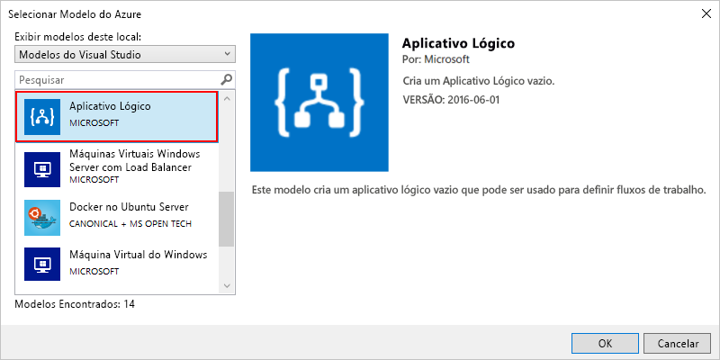
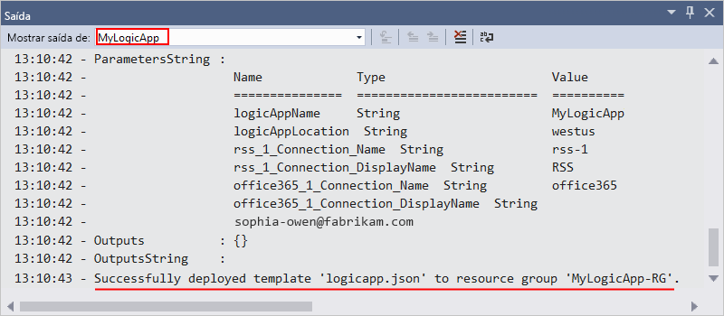
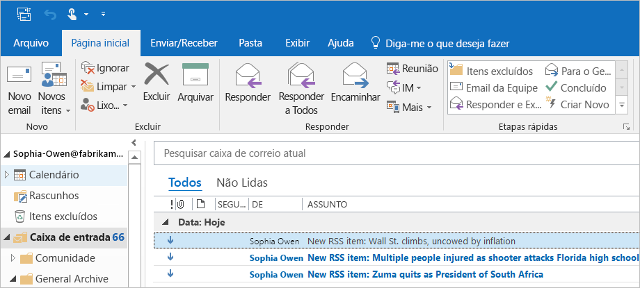

# Início Rápido: Criar tarefas automatizadas, processos e fluxos de trabalho com Aplicativos Lógicos do Azure – Visual Studio

Com os [Aplicativos Lógicos do Azure](../logic-apps/logic-apps-overview.md) e o Visual Studio, você pode criar fluxos de trabalho que automatizam tarefas e processos para a integração de aplicativos, dados, sistemas e serviços entre empresas e organizações. Este início rápido mostra como você pode projetar e criar esses fluxos de trabalho criando aplicativos lógicos no Visual Studio e implantando esses aplicativos no Azure. Embora você possa executar essas tarefas no portal do Azure, o Visual Studio permite que você adicione aplicativos lógicos ao controle do código-fonte, publique diferentes versões e crie modelos do Azure Resource Manager para ambientes de implantação diferentes.

Se você não estiver familiarizado com os Aplicativos Lógicos do Azure e deseja apenas os conceitos básicos, experimente o [guia de início rápido para a criação de um aplicativo lógico no portal do Azure](../logic-apps/quickstart-create-first-logic-app-workflow.md). O Designer de Aplicativo Lógico funciona de forma semelhante no portal do Azure e no Visual Studio.

Neste início rápido, você cria o mesmo aplicativo lógico com o Visual Studio como o início rápido do portal do Azure. Esse aplicativo lógico monitora um feed RSS de site e envia um email para cada novo item nesse feed. Seu aplicativo lógico finalizado se parece com este fluxo de trabalho de alto nível:

## Pré-requisitos

* Uma assinatura do Azure. Se você não tiver uma assinatura do Azure, [inscreva-se em uma conta gratuita do Azure](https://azure.microsoft.com/free/).

* Baixe e instale essas ferramentas, caso você ainda não as tenha:

  * [Visual Studio 2019, 2017 ou 2015 – Community Edition ou superior](https://aka.ms/download-visual-studio). 
  Este início rápido usa o Visual Studio Community 2017.

    > [!IMPORTANT]
    > Ao instalar o Visual Studio 2019 ou 2017, selecione a carga de trabalho **Desenvolvimento do Azure**.

  * O [SDK do Microsoft Azure para .NET (2.9.1 ou posterior)](https://azure.microsoft.com/downloads/). 
  Saiba mais sobre o [SDK do Azure para .NET](https://docs.microsoft.com/dotnet/azure/dotnet-tools?view=azure-dotnet).

  * [PowerShell do Azure](https://github.com/Azure/azure-powershell#installation)

  * Ferramentas de Aplicativos Lógicos do Azure para as versões do Visual Studio que você deseja:

    * [Visual Studio 2019](https://aka.ms/download-azure-logic-apps-tools-visual-studio-2019)

    * [Visual Studio 2017](https://aka.ms/download-azure-logic-apps-tools-visual-studio-2017)

    * [Visual Studio 2015](https://aka.ms/download-azure-logic-apps-tools-visual-studio-2015)
  
    Você pode baixar e instalar as Ferramentas dos Aplicativos Lógicos do Azure diretamente do Visual Studio Marketplace ou aprender como [instalar essa extensão de dentro do Visual Studio](https://docs.microsoft.com/visualstudio/ide/finding-and-using-visual-studio-extensions). 
    Reinicie o Visual Studio após concluir a instalação.

* Acesso à Web ao usar o Designer do Aplicativo Lógico incorporado

  O designer precisa de uma conexão com a Internet para criar recursos no Azure e ler propriedades e dados dos conectores em seu aplicativo lógico. 
  Por exemplo, para conexões do Dynamics CRM Online, o designer verifica sua instância do CRM para propriedades padrão e personalizadas.

* Uma conta de email que seja compatível com os Aplicativos Lógicos, como o Outlook do Office 365, o Outlook.com ou o Gmail. Para outros provedores, [revise a lista de conectores aqui](https://docs.microsoft.com/connectors/). Este exemplo usa o Outlook do Office 365. Se você usar um provedor diferente, as etapas gerais são as mesmos, mas a interface do usuário pode ser ligeiramente diferente.

## Criar um projeto do grupo de recursos do Azure

Para começar, crie um [projeto do Grupo de Recursos do Azure](../azure-resource-manager/vs-azure-tools-resource-groups-deployment-projects-create-deploy.md). Saiba mais sobre [Recursos e grupos de recursos do Azure](../azure-resource-manager/resource-group-overview.md).

1. Inicie o Visual Studio. Faça logon usando sua conta do Azure.

1. No menu **Arquivo**, selecione **Novo** > **Projeto**. (teclado: Ctrl+Shift+N)

   

1. Em **Instalado**, selecione **Visual C#** ou **Visual Basic**. Selecione **Nuvem** > **Grupo de Recursos do Azure**. Nomeie o projeto , por exemplo:

   

   > [!NOTE]
   > Se **Nuvem** ou **Grupo de Recursos do Azure** não aparecer, instale o SDK do Azure para o Visual Studio.

   Se você estiver usando o Visual Studio 2019, siga estas etapas:

   1. Na caixa **Criar um novo projeto**, selecione o projeto **Grupo de Recursos do Azure** para Visual C# ou Visual Basic. Selecione **Avançar**.

   1. Forneça um nome para o grupo de recursos do Azure que você deseja usar e outras informações do projeto. Escolha **Criar**.

1. Na lista de modelos, selecione o modelo **Aplicativo Lógico**. Escolha **OK**.

   

   Depois que o Visual Studio cria seu projeto, o Gerenciador de Soluções é aberto e mostra sua solução. 
   Em sua solução, o arquivo **LogicApp.json** não só armazena a definição de aplicativo lógico, mas também é um modelo do Azure Resource Manager que você pode usar para a implantação.

   

## Criar um aplicativo lógico em branco

Quando tiver seu projeto do Grupo de Recursos do Azure, crie seu aplicativo lógico com o modelo **Aplicativo Lógico em Branco**.

1. No Gerenciador de Soluções, abra o menu de atalho do arquivo **LogicApp.json**. Selecione **Abrir com o Designer de Aplicativo Lógico**. (teclado: Ctrl+L)

   

   > [!TIP]
   > Caso não tenha esse comando no Visual Studio 2019, verifique se você tem as atualizações mais recentes do Visual Studio.

   O Visual Studio solicitará sua assinatura do Azure e um grupo de recursos do Azure para criar e implantar recursos para seu aplicativo lógico e conexões.

1. Para **Assinatura**, selecione sua assinatura do Azure. Para **Grupo de recursos**, selecione **Criar novo** para criar um novo grupo de recursos do Azure.

   

   | Configuração | Valor de exemplo | DESCRIÇÃO |
   | ------- | ------------- | ----------- |
   | Lista de perfis do usuário | Contoso   jamalhartnett@contoso.com | Por padrão, a conta que você usou para entrar |
   | **Assinatura** | Pré-paga   (jamalhartnett@contoso.com) | O nome para sua assinatura do Azure e a conta associada |
   | **Grupo de recursos** | MyLogicApp-RG   (Oeste dos EUA) | O grupo de recursos do Azure e a localização para armazenar e implantar recursos do aplicativo lógico |
   | **Localidade** | MyLogicApp-RG2   (Oeste dos EUA) | Um local diferente, se você não quiser usar o local do grupo de recursos |
   ||||

1. O Designer de Aplicativos Lógicos abre uma página que mostra um vídeo de introdução e gatilhos normalmente usados. Role para baixo após o vídeo e os gatilhos para **Modelos** e selecione **Aplicativo Lógico em Branco**.

   

## Criar fluxo de trabalho do aplicativo lógico

Em seguida, adicione um [gatilho](../logic-apps/logic-apps-overview.md#logic-app-concepts) RSS que é acionado quando um novo item de feed é exibido. Cada aplicativo lógico começa com um gatilho, que é acionado quando critérios específicos são atendidos. Cada vez que o gatilho é disparado, o mecanismo dos Aplicativos Lógicos cria uma instância de aplicativo lógico que executa o fluxo de trabalho.

1. No Designer de Aplicativos Lógicos, na caixa de pesquisa, escolha **Tudo**.
Na caixa de pesquisa, digite "rss". Na lista de gatilhos, selecione este gatilho: **Quando um item do feed é publicado – RSS**

   

1. Depois que o gatilho aparece no designer, conclua a construção do aplicativo lógico seguindo as etapas do fluxo de trabalho, no [início rápido do portal do Azure](../logic-apps/quickstart-create-first-logic-app-workflow.md#add-rss-trigger), em seguida, retorne a este artigo. Quando terminar, seu aplicativo lógico será semelhante a este exemplo:

   

1. Salve sua solução do Visual Studio. (teclado: Ctrl + S)

## Implante o aplicativo lógico para o Azure

Antes de executar e testar seu aplicativo lógico, implante o aplicativo no Azure pelo Visual Studio.

1. No Gerenciador de Soluções, no menu de atalho do projeto, selecione **Implantar** > **Novo**. Se solicitado, entre com sua conta do Azure.

   

1. Para essa implantação, mantenha a assinatura do Azure, o grupo de recursos e outras configurações padrão. Escolha **Implantar**.

   

1. Se a caixa **Editar parâmetros** for exibida, forneça um nome de recurso para seu aplicativo lógico. Salve suas configurações.

   

   Ao iniciar a implantação, o status da implantação do aplicativo é exibido na janela **Saída** do Visual Studio. Se o status não aparecer, abra a lista **Mostrar saída de** e selecione o grupo de recursos do Azure.

   

   Se os conectores selecionados precisarem de alguma inserção sua, uma janela do PowerShell abrirá em segundo plano e solicitará as senhas ou chaves secretas necessárias. Depois de inserir essas informações, a implantação continuará.

   

   Após a implantação ser concluída, seu aplicativo lógico estará ativo no portal do Azure e será executado em seu agendamento especificado (a cada minuto). Se o gatilho encontrar novos itens de feed, ele será disparado, o que criará uma instância de fluxo de trabalho que executará as ações do aplicativo lógico. Seu aplicativo lógico enviará um email para cada novo item. Caso contrário, se o gatilho não localizar novos itens, ele não será disparado e ignorará o instanciamento do fluxo de trabalho. O aplicativo lógico aguarda até o próximo intervalo antes de verificar.

   Aqui estão emails de exemplo que esse aplicativo lógico envia. 
   Se você não receber nenhum email, verifique a sua pasta de Lixo eletrônico.

   

Parabéns, você criou e implantou seu aplicativo lógico com o Visual Studio com sucesso. Para gerenciar seu aplicativo lógico e examinar seu histórico de execução, confira [Gerenciar aplicativos lógicos com o Visual Studio](../logic-apps/manage-logic-apps-with-visual-studio.md).

## Limpar recursos

Quando terminar com seu aplicativo lógico, exclua o grupo de recursos que contém seu aplicativo lógico e os recursos relacionados.

1. Entre no [portal do Azure](https://portal.azure.com) com a mesma conta usada para criar seu aplicativo lógico.

1. No menu principal do Azure, selecione **Grupos de recursos**.
Selecione o grupo de recursos do aplicativo lógico e selecione **Visão geral**.

1. Na página **Visão geral**, escolha **Excluir grupo de recursos**. Insira o nome do grupo de recursos como confirmação e escolha **Excluir**.

   

1. Exclua a solução do Visual Studio do computador local.

## Próximas etapas

Neste artigo, você criou, implantou e executou seu aplicativo lógico com o Visual Studio. Para saber mais sobre como gerenciar e executar a implantação avançada para aplicativos lógicos com o Visual Studio, confira estes artigos:

> [!div class="nextstepaction"]
> * [Gerenciar aplicativos lógicos no Visual Studio](../logic-apps/manage-logic-apps-with-visual-studio.md)