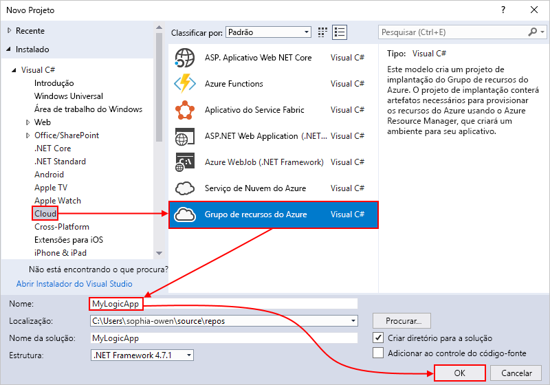
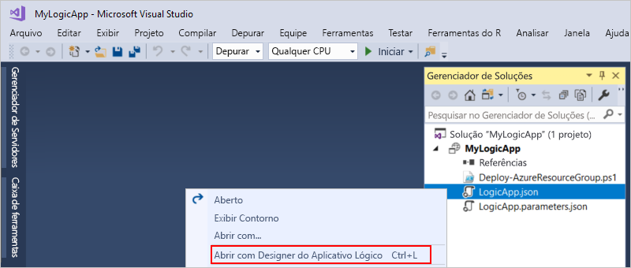

# Início rápido: Criar e automatizar tarefas, processos e fluxos de trabalho com os Aplicativos Lógicos do Azure - Visual Studio

Com os [Aplicativos Lógicos do Azure](../logic-apps/logic-apps-overview.md) e o Visual Studio, você pode criar fluxos de trabalho que automatizam tarefas e processos para a integração de aplicativos, dados, sistemas e serviços entre empresas e organizações. Este início rápido mostra como você pode projetar e criar esses fluxos de trabalho criando aplicativos lógicos no Visual Studio e implantar esses aplicativos para o <a href="https://docs.microsoft.com/azure/guides/developer/azure-developer-guide" target="_blank">Azure</a> na nuvem. E embora você possa executar essas tarefas no <a href="https://portal.azure.com" target="_blank">Portal do Azure</a>, o Visual Studio permite que você adicione aplicativos lógicos para controle do código-fonte, diferentes versões de publicação e crie modelos do Azure Resource Manager para ambientes de implantação diferentes. 

Se você não estiver familiarizado com os Aplicativos Lógicos do Azure e deseja apenas os conceitos básicos, experimente o [início rápido para a criação de um aplicativo lógico no portal do Azure](../logic-apps/quickstart-create-first-logic-app-workflow.md). O Designer de Aplicativo Lógico no portal do Azure e no Visual Studio funcionam de forma semelhante. 

Aqui, você pode criar o mesmo aplicativo lógico no início rápido do portal do Azure, mas com o Visual Studio. Este aplicativo lógico monitora o RSS feed de um site e envia um email para cada novo item postado no site. Quando terminar, o aplicativo lógico ficará parecido com este fluxo de trabalho de alto nível:

Antes de começar, verifique se você tem estes itens:

* Caso você não tenha uma assinatura do Azure, <a href="https://azure.microsoft.com/free/" target="_blank">inscreva-se em uma conta gratuita do Azure</a>.

* Baixe e instale essas ferramentas, caso você ainda não as tenha: 

  * <a href="https://www.visualstudio.com/downloads" target="_blank">Visual Studio 2017 ou Visual Studio 2015 - Community Edition ou posterior</a>. 
  Este início rápido usa o Visual Studio Community 2017, que é gratuito.

  * <a href="https://azure.microsoft.com/downloads/" target="_blank">SDK do Microsoft Azure para .NET (2.9.1 ou posterior)</a> e <a href="https://github.com/Azure/azure-powershell#installation" target="_blank">Azure PowerShell</a>. 
  Saiba mais sobre o <a href="https://docs.microsoft.com/dotnet/azure/dotnet-tools?view=azure-dotnet">SDK do Azure para .NET</a>.

  * <a href="https://marketplace.visualstudio.com/items?itemName=VinaySinghMSFT.AzureLogicAppsToolsforVisualStudio-18551" target="_blank">Ferramentas de Aplicativo Lógico do Azure para Visual Studio 2017</a> ou a <a href="https://marketplace.visualstudio.com/items?itemName=VinaySinghMSFT.AzureLogicAppsToolsforVisualStudio" target="_blank">Versão do Visual Studio 2015</a>
  
    Você pode baixar e instalar as Ferramentas de Aplicativo Lógico do Azure diretamente do Visual Studio Marketplace ou aprender a <a href="https://docs.microsoft.com/visualstudio/ide/finding-and-using-visual-studio-extensions" target="_blank"> instalar essa extensão de dentro do Visual Studio</a>. 
    Reinicie o Visual Studio depois de concluir a instalação.

* Uma conta de email que seja compatível com os Aplicativos Lógicos, como o Outlook do Office 365, o Outlook.com ou o Gmail. Para outros provedores, <a href="https://docs.microsoft.com/connectors/" target="_blank">revise a lista de conectores aqui</a>. Este aplicativo lógico usa uma conta do Outlook do Office 365. Se você usar um provedor diferente, as etapas gerais são as mesmos, mas a interface do usuário pode ser ligeiramente diferente.

* Acesso à Web ao usar o Designer de Aplicativo Lógico incorporado

  O Designer requer uma conexão de Internet para criar recursos no Azure e ler as propriedades e os dados dos conectores em seu aplicativo lógico. 
  Por exemplo, se você usar o conector do Dynamics CRM Online, o designer verifica sua instância CRM para propriedades padrão e personalizadas disponíveis.

## Criar um projeto do grupo de recursos do Azure

Para começar, crie um [projeto do Grupo de Recursos do Azure](../azure-resource-manager/vs-azure-tools-resource-groups-deployment-projects-create-deploy.md). Saiba mais sobre [Recursos e grupos de recursos do Azure](../azure-resource-manager/resource-group-overview.md).

1. Inicie o Visual Studio e entre com sua conta do Azure.

2. No menu **Arquivo**, selecione **Novo** > **Projeto**. (Teclado: Ctrl + Shift + N)

   

3. Em **Instalado**, selecione **Visual C#** ou **Visual Basic**. Selecione **Nuvem** > **Grupo de Recursos do Azure**. Nomeie o projeto , por exemplo:

   

4. Selecione o modelo **Aplicativo Lógico**. 

   

   Depois que o Visual Studio cria seu projeto, o Gerenciador de Soluções é aberto e mostra sua solução. 

   

   Em sua solução, o arquivo **LogicApp.json** armazena não apenas a definição para seu aplicativo lógico mas também é um modelo do Azure Resource Manager que você pode configurar para implantação.

## Criar um aplicativo lógico em branco

Depois de criar seu projeto do Grupo de Recursos do Azure, crie e compile o aplicativo lógico a partir de um modelo **Aplicativo lógico em branco**.

1. No Gerenciador de Soluções, abra o menu de atalho para o arquivo **LogicApp.json**. Selecione **Abrir com o Designer de Aplicativo Lógico**. (Teclado: Ctrl + L)

   

2. Para **Assinatura**, selecione a assinatura do Azure que você deseja usar. Para **Grupo de Recursos**, selecione **Criar Novo...**, que cria um novo grupo de recursos do Azure. 

   

   O Visual Studio precisa de sua assinatura do Azure e um grupo de recursos para criar e implantar recursos associados ao seu aplicativo lógico e conexões. 

   | Configuração | Valor de exemplo | DESCRIÇÃO | 
   | ------- | ------------- | ----------- | 
   | Lista de perfis do usuário | Contoso   jamalhartnett@contoso.com | Por padrão, a conta que você usou para entrar | 
   | **Assinatura** | Pré-paga   (jamalhartnett@contoso.com) | O nome para sua assinatura do Azure e a conta associada |
   | **Grupo de recursos** | MyLogicApp-RG   (Oeste dos EUA) | O grupo de recursos do Azure e o local para armazenar e implantar recursos para seu aplicativo lógico | 
   | **Localidade** | MyLogicApp-RG2   (Oeste dos EUA) | Um local diferente, se você não quiser usar o local do grupo de recursos |
   ||||

3. O Designer de Aplicativos Lógicos é exibido e mostra uma página com um vídeo de introdução e os gatilhos normalmente usados. Role pelo vídeo e pelos gatilhos. Em **Modelos**, selecione **Aplicativo lógico em branco**.

   

## Criar fluxo de trabalho do aplicativo lógico

Em seguida, adicione um [gatilho](../logic-apps/logic-apps-overview.md#logic-app-concepts) que é acionado quando um novo item de RSS feed aparece. Cada aplicativo lógico deve começar com um gatilho, que é acionado quando os critérios específicos são atingidos. Cada vez que o gatilho é disparado, o mecanismo dos Aplicativos Lógicos cria uma instância de aplicativo lógico que executa o fluxo de trabalho.

1. No Designer de Aplicativo Lógico, digite "rss" na caixa de pesquisa. Selecione este gatilho: **Quando um item do feed é publicado**

   

   O gatilho agora aparece no designer:

   

2. Para concluir a criação do aplicativo lógico, siga as etapas do fluxo de trabalho no [início rápido do portal do Azure](../logic-apps/quickstart-create-first-logic-app-workflow.md#add-rss-trigger) e, em seguida, retorne a este artigo.

   Quando terminar, seu aplicativo lógico será semelhante a este exemplo: 

   

3. Para salvar seu aplicativo lógico, salve sua solução do Visual Studio. (Teclado: Ctrl + S)

Agora, antes de poder testar seu aplicativo lógico, implante seu aplicativo no Azure.

## Implante o aplicativo lógico para o Azure

Antes de executar seu aplicativo lógico, implante o aplicativo do Visual Studio no Azure, e são apenas alguns passos.

1. No Gerenciador de Soluções, no menu de atalho do projeto, selecione **Implantar** > **Novo**. Se solicitado, entre com sua conta do Azure.

   

2. Para essa implantação, mantenha a assinatura do Azure, o grupo de recursos e outras configurações padrão. Quando estiver pronto, escolha **Concluído**. 

   

3. Se a caixa **Editar Parâmetros** for exibida, forneça o nome do recurso para o aplicativo lógico usar na implantação e salve suas configurações, por exemplo:

   

   Ao iniciar a implantação, o status da implantação do aplicativo é exibido na janela **Saída** do Visual Studio. 
   Se o status não aparecer, abra a lista **Mostrar saída de** e selecione o grupo de recursos do Azure.

   

   Após a conclusão da implantação, o aplicativo lógico está ativo no portal do Azure e verifica o RSS feed com base em seu agendamento especificado (cada minuto). 
   Se o RSS feed possuir novos itens, o seu aplicativo lógico enviará um email para cada novo item. 
   Caso contrário, o aplicativo lógico aguarda até o próximo intervalo antes de verificar novamente. 

   Por exemplo, aqui estão emails de exemplo enviados por esse aplicativo lógico. 
   Se você não receber nenhum email, verifique a sua pasta de Lixo eletrônico. 

   

   Tecnicamente, quando o gatilho verifica o RSS feed e localiza novos itens, o gatilho é acionado e o mecanismo de Aplicativos Lógicos cria uma instância do seu fluxo de trabalho de aplicativo lógico que executa as ações no fluxo de trabalho.
   Se o gatilho não localizar novos itens, ele não é acionado e "ignora" instanciando o fluxo de trabalho.

Parabéns, agora você criou e implantou com êxito o aplicativo lógico com o Visual Studio! Para gerenciar seu aplicativo lógico e examinar seu histórico de execução, confira [Gerenciar aplicativos lógicos com o Visual Studio](../logic-apps/manage-logic-apps-with-visual-studio.md).

## Limpar recursos

Quando não for mais necessário, exclua o grupo de recursos que contém o aplicativo lógico e os recursos relacionados.

1. Entre no <a href="https://portal.azure.com" target="_blank">portal do Azure</a> com a mesma conta usada para criar seu aplicativo lógico. 

2. No menu principal do Azure, selecione **Grupos de recursos**.
Selecione o grupo de recursos para seu aplicativo lógico e selecione **Visão geral**.

3. Na página **Visão geral**, escolha **Excluir grupo de recursos**. Insira o nome do grupo de recursos como confirmação e escolha **Excluir**.

   

4. Exclua a solução do Visual Studio do computador local.

## Obtenha suporte

* Em caso de dúvidas, visite o <a href="https://social.msdn.microsoft.com/Forums/en-US/home?forum=azurelogicapps" target="_blank">Fórum dos Aplicativos Lógicos do Azure</a>.
* Para enviar ou votar em ideias de recurso, visite o <a href="http://aka.ms/logicapps-wish" target="_blank">site de comentários do usuário de Aplicativos Lógicos</a>.

## Próximas etapas

Neste artigo, você criou, implantou e executou seu aplicativo lógico com o Visual Studio. Para saber mais sobre como gerenciar e executar a implantação avançada para aplicativos lógicos com o Visual Studio, confira estes artigos:

> [!div class="nextstepaction"]
> * [Gerenciar aplicativos lógicos no Visual Studio](../logic-apps/manage-logic-apps-with-visual-studio.md)
> * [Criar modelos de implantação para aplicativos lógicos com o Visual Studio](../logic-apps/logic-apps-create-deploy-template.md)
