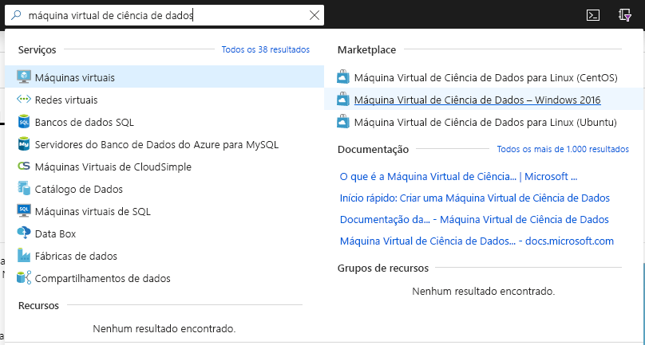

# Início Rápido: Configurar a Máquina Virtual de Ciência de Dados para Windows

Inicie o funcionamento usando a Máquina Virtual de Ciência de Dados do Windows.

## Pré-requisito

Para criar uma Máquina Virtual de Ciência de Dados do Windows, é necessário ter uma assinatura do Azure. [Experimentar o Azure gratuitamente](https://azure.com/free).
Observe que as contas gratuitas do Azure não dão suporte a SKUs de máquina virtual habilitada para GPU.

## Criar sua DSVM

Para criar uma instância de DSVM:

1. Acesse o [portal do Azure](https://portal.azure.com). Você pode ser solicitado a entrar na sua conta do Azure, caso ainda não esteja conectado.
1. Localize a listagem de máquinas virtuais digitando "máquina virtual de ciência de dados" e selecionando "Máquina Virtual de Ciência de Dados – Windows 2016".

    

1. Selecione o botão **Criar** na parte inferior.

    

1. Você deve ser redirecionado para a folha "Criar uma máquina virtual".
   

1. Preencha a guia **Noções básicas**:
      * **Assinatura**: se você tiver mais de uma assinatura, selecione aquela em que o computador será criado e cobrado. Você deve ter privilégios de criação de recurso nessa assinatura.
      * **Grupo de recursos**: crie um novo grupo ou use um existente.
      * **Nome da máquina virtual**: Insira o nome da máquina virtual. É assim que ela aparecerá no seu portal do Azure.
      * **Localização**: selecione o datacenter mais apropriado. Para um acesso mais rápido à rede, é o data center que contém a maioria dos seus dados ou que está mais próximo de sua localização física. Leia mais sobre as [Regiões do Azure](https://azure.microsoft.com/global-infrastructure/regions/).
      * **Imagem**: Mantenha o valor padrão.
      * **Tamanho**: Isso deve ser preenchido automaticamente com um tamanho apropriado para cargas de trabalho gerais. Leia mais sobre [Tamanhos de VM do Windows no Azure](../../virtual-machines/windows/sizes.md).
      * **Nome de usuário**: Insira o nome de usuário do administrador. Esse é o nome de usuário que você usará para fazer logon em sua máquina virtual e não precisa ser o mesmo que o seu nome de usuário do Azure.
      * **Senha**: Insira a senha que você usará para fazer logon em sua máquina virtual.    
1. Selecione **Examinar + criar**.
1. **Examinar + criar**
   * Verifique se todas as informações inseridas estão corretas. 
   * Selecione **Criar**.

> [!NOTE]
> * Você não paga taxas de licenciamento para o software que vem pré-carregado na máquina virtual. Você paga o custo de computação para o tamanho do servidor que você escolheu na etapa **Tamanho**.
> * O provisionamento leva de 10 a 20 minutos. Você pode exibir o status da VM no portal do Azure.

## Acessar a DSVM

Depois que a VM for criada e provisionada, siga as etapas listadas para [conectar-se à sua máquina virtual baseada no Azure](../../marketplace/cloud-partner-portal/virtual-machine/cpp-connect-vm.md). Use as credenciais da conta do administrador que você configurou na etapa **Básico** da criação da máquina virtual. 

Você está pronto para começar a usar as ferramentas que estão instaladas e pré-configuradas na VM. Muitas das ferramentas podem ser acessadas por meio de blocos do menu **Iniciar** e ícones da área de trabalho.

Também é possível anexar uma DSVM ao Azure Notebooks para executar os Jupyter Notebooks na VM e ignorar as limitações da camada de serviço gratuita. Para saber mais, confira [Gerenciar e configurar projetos de Notebooks](../../notebooks/configure-manage-azure-notebooks-projects.md#manage-and-configure-projects).

## Próximas etapas

* Explore as ferramentas na DSVM abrindo o menu **Iniciar**.
* Para saber mais sobre o Azure Machine Learning, leia [O que é o Azure Machine Learning?](../service/overview-what-is-azure-ml.md) e teste os [tutoriais](../index.yml).
* No Explorador de Arquivos, navegue até C:\Arquivos de Programas\Microsoft\ML Server\R_SERVER\library\RevoScaleR\demoScripts para obter exemplos de como usar a biblioteca RevoScaleR no R, que é compatível com análise de dados em escala empresarial. 
* Leia o artigo [Dez coisas que você pode fazer na Máquina Virtual de Ciência de Dados](https://aka.ms/dsvmtenthings).
* Saiba como criar soluções completas de análise sistematicamente usando o [Processo de Ciência de Dados de Equipe](../team-data-science-process/index.yml).
* Visite a [Galeria de IA do Azure](https://gallery.cortanaintelligence.com) para obter exemplos de Machine Learning e de análise de dados que usam o Azure Machine Learning e os serviços de dados relacionados no Azure. Também fornecemos um ícone para essa galeria no menu **Iniciar** e na área de trabalho da máquina virtual.

