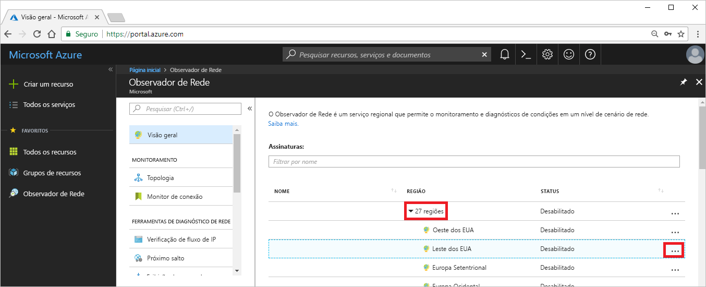
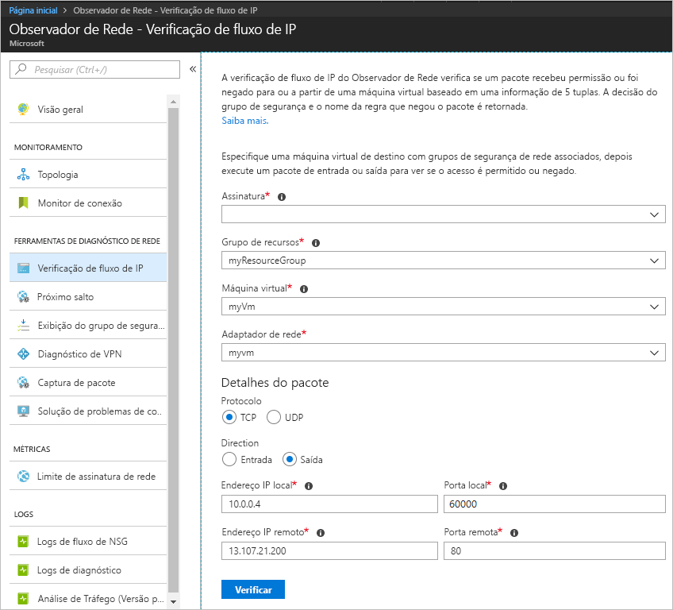
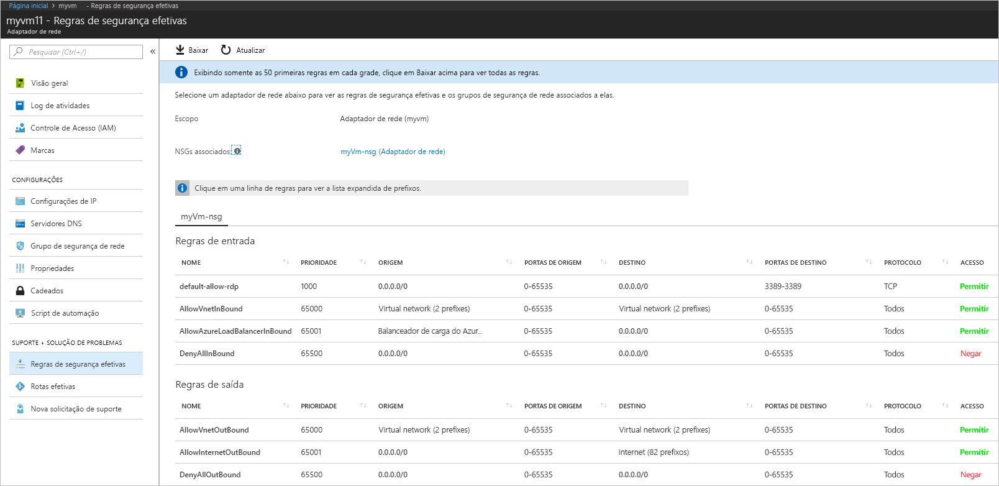

# Início Rápido: Diagnosticar um problema de filtro do tráfego de rede da máquina virtual usando o portal do Azure

Neste início rápido, você vai implantar uma VM (máquina virtual ) e, em seguida, verificar a comunicação com um endereço IP e uma URL e de um endereço IP. Você determina a causa de uma falha de comunicação e como resolvê-la.

Se você não tiver uma assinatura do Azure, crie uma [conta gratuita](https://azure.microsoft.com/free/?WT.mc_id=A261C142F) antes de começar.

## Fazer logon no Azure

Faça logon no Portal do Azure em https://portal.azure.com.

## Criar uma máquina virtual

1. Selecione **+ Criar um recurso** localizado no canto superior esquerdo do Portal do Azure.
2. Selecione **Computação** e, em seguida, **Windows Server 2016 Datacenter** ou uma versão do **Ubuntu Server**.
3. Insira, ou selecione, as informações a seguir, aceite os padrões para as configurações restantes e, em seguida, selecione **OK**:

    |Configuração|Valor|
    |---|---|
    |NOME|myVm|
    |Nome de usuário| Insira um nome de usuário de sua escolha.|
    |Senha| Insira uma senha de sua escolha. A senha deve ter no mínimo 12 caracteres e atender a [requisitos de complexidade definidos](../virtual-machines/windows/faq.md?toc=%2fazure%2fnetwork-watcher%2ftoc.json#what-are-the-password-requirements-when-creating-a-vm).|
    |Assinatura| Selecione sua assinatura.|
    |Grupo de recursos| Selecione **Criar novo** e insira **myResourceGroup**.|
    |Local padrão| Selecione **Leste dos EUA**|

4. Selecione um tamanho para a VM e selecione **Selecionar**.
5. Em **Configurações**, aceite todos os padrões e selecione **OK**.
6. Em **Criar** do **Resumo**, selecione **Criar** para iniciar a implantação da VM. A VM demora alguns minutos para implantar. Aguarde até que a VM conclua a implantação antes de continuar com as etapas restantes.

## Testar comunicação de rede

Para testar a comunicação de rede com o Observador de Rede, primeiro habilite um observador de rede em pelo menos uma região do Azure e, em seguida, use a funcionalidade Verificação de fluxo de IP do Observador de Rede.

### Habilitar o observador de rede

Se você já tiver um observador de rede habilitado em pelo menos uma região, vá para [Usar verificação de fluxo de IP](#use-ip-flow-verify).

1. No portal, selecione **Todos os serviços**. Na **caixa Filtro**, insira *Observador de Rede*. Quando o **Observador de Rede** for exibido nos resultados, selecione-o.
2. Habilite um observador de rede na região Leste dos EUA, pois essa é a região que a VM foi implantada em uma etapa anterior. Selecione **Regiões** para expandi-la e, em seguida, selecione **...** à direita de **Leste dos EUA**, conforme mostrado na seguinte imagem:

    

3. Selecione **Habilitar o Observador de Rede**.

### Usar verificação de fluxo de IP

Quando você cria uma VM, o Azure permite e nega o tráfego de rede na VM, por padrão. Mais tarde, você pode substituir os padrões do Azure, permitindo ou negando tipos adicionais de tráfego.

1. No portal, selecione **Todos os serviços**. Na caixa **Todos os serviços** *Filtro*, insira *Observador de Rede*. Quando o **Observador de Rede** for exibido nos resultados, selecione-o.
2. Selecione **Verificação de fluxo de IP** em **FERRAMENTAS DE DIAGNÓSTICO DE REDE**.
3. Selecione sua assinatura, insira ou selecione os seguintes valores e, em seguida, selecione **Verificar**, conforme mostrado na seguinte imagem:

    |Configuração            |Valor                                                                                              |
    |---------          |---------                                                                                          |
    | Grupo de recursos    | Selecionar myResourceGroup                                                                            |
    | Máquina virtual   | Selecionar myVm                                                                                       |
    | interface de rede | myvm – o nome do adaptador de rede criado pelo portal no momento da criação da VM é diferente. |
    | Protocolo          | TCP                                                                                               |
    | Direção         | Saída                                                                                          |
    | Endereço IP local  | 10.0.0.4                                                                                          |
    | Porta local      | 60000                                                                                                |
    | Endereço IP remoto | 13.107.21.200 – Um dos endereços de www.bing.com.                                             |
    | Porta remota       | 80                                                                                                |

    

    Após alguns segundos, o resultado retornado informa que o acesso é permitido devido a uma regra de segurança chamada **AllowInternetOutbound**. Quando você executou a verificação, o Observador de Rede criou automaticamente um observador de rede na região Leste dos EUA, se você tinha um observador de rede existente em uma região diferente da região Leste dos EUA antes de executar a verificação.
4. Conclua a etapa 3 novamente, mas altere o **Endereço IP remoto** para **172.31.0.100**. O resultado retornado informa que o acesso é negado devido a uma regra de segurança chamada **DefaultOutboundDenyAll**.
5. Conclua a etapa 3 novamente, mas altere a **Direção** para **Entrada**, a **Porta local** para **80** e a **Porta remota** para **60000**. O resultado retornado informa que o acesso é negado devido a uma regra de segurança chamada **DefaultInboundDenyAll**.

Agora que você sabe quais regras de segurança permitem ou negam o tráfego bidirecionalmente em uma VM, você pode determinar como resolver os problemas.

## Exibir os detalhes de uma regra de segurança

1. Para determinar por que as regras das etapas 3 a 5 de [Usar verificação de fluxo de IP](#use-ip-flow-verify) permitem ou negam a comunicação, examine as regras de segurança em vigor para o adaptador de rede na VM. Na caixa de pesquisa na parte superior do portal, insira *myvm*. Quando o adaptador de rede **myvm** (ou qualquer que seja o nome do adaptador de rede) é exibido nos resultados da pesquisa, selecione-o.
2. Selecione **Regras de segurança em vigor** em **SUPORTE + SOLUÇÃO DE PROBLEMAS**, conforme mostrado na seguinte imagem:

    

    Na etapa 3 de [Usar verificação de fluxo de IP](#use-ip-flow-verify), você aprendeu que o motivo pelo qual a comunicação foi permitida foi devido à regra **AllowInternetOutbound**. Você pode ver na imagem anterior que o **DESTINO** para a regra é **Internet**. No entanto, não ficou claro como 13.107.21.200, o endereço testado na etapa 3 de [Usar verificação de fluxo de IP](#use-ip-flow-verify), está relacionado à **Internet**.
3. Selecione a regra **AllowInternetOutBound** e, em seguida, **Destino**, conforme mostrado na seguinte imagem:

    

    Um dos prefixos na lista é **12.0.0.0/6**, que abrange o intervalo 12.0.0.1-15.255.255.254 de endereços IP. Como 13.107.21.200 está dentro desse intervalo de endereços, a regra **AllowInternetOutBound** permite o tráfego de saída. Além disso, não existem regras de prioridade mais alta (número inferior) mostradas na imagem na etapa 2 que substituem essa regra. Feche a caixa **Prefixos de endereço**. Para negar a comunicação de saída a 13.107.21.200, você pode adicionar uma regra de segurança com uma prioridade mais alta, que nega a porta 80 de saída para o endereço IP.
4. Quando você executou a verificação de saída para 172.131.0.100 na etapa 4 de [Usar verificação de fluxo de IP](#use-ip-flow-verify), você descobriu que a regra **DefaultOutboundDenyAll** negou a comunicação. Essa regra é equivalente à regra **DenyAllOutBound** mostrada na imagem da etapa 2 que especifica **0.0.0.0/0** como o **DESTINO**. Essa regra nega a comunicação de saída com 172.131.0.100, porque o endereço não está dentro do **DESTINO** de uma das outras **Regras de saída** mostradas na imagem. Para permitir a comunicação de saída, adicione uma regra de segurança de entrada com uma prioridade mais alta que permite o tráfego de entrada para a porta 80 para o endereço 172.131.0.100.
5. Quando você executou a verificação de entrada de 172.131.0.100 na etapa 5 de [Usar verificação de fluxo de IP](#use-ip-flow-verify), você descobriu que a regra **DefaultInboundDenyAll** negou a comunicação. Essa regra é equivalente à regra **DenyAllInBound** mostrada na imagem da etapa 2. A regra **DenyAllInBound** é imposta porque não há nenhuma outra regra de prioridade mais alta que permite a porta 80 de entrada para a VM de 172.31.0.100. Para permitir a comunicação de entrada, adicione uma regra de segurança de entrada com uma prioridade mais alta que permite a porta 80 de entrada de 172.31.0.100.

As verificações deste início rápido testaram a configuração do Azure. Se as verificações retornarem resultados esperados e você ainda tiver problemas de rede, verifique se você não tem um firewall entre a VM e o ponto de extremidade com o qual está se comunicando e se o sistema operacional na VM não tem um firewall que permite ou nega a comunicação.

## Limpar recursos

Quando não for mais necessário, exclua o grupo de recursos e todos os recursos que ele contém:

1. Insira *myResourceGroup* na caixa **Pesquisar** na parte superior do portal. Quando aparecer **myResourceGroup** nos resultados da pesquisa, selecione-o.
2. Selecione **Excluir grupo de recursos**.
3. Insira *myResourceGroup* para **DIGITAR O NOME DO GRUPO DE RECURSOS:** e selecione **Excluir**.

## Próximas etapas

Neste início rápido, você criou uma VM e diagnosticou os filtros de tráfego de rede de entrada e saída. Você aprendeu que as regras do grupo de segurança de rede permitem ou negam o tráfego bidirecionalmente em uma VM. Saiba mais sobre [regras de segurança](../virtual-network/security-overview.md?toc=%2fazure%2fnetwork-watcher%2ftoc.json) e como [criar regras de segurança](../virtual-network/manage-network-security-group.md?toc=%2fazure%2fnetwork-watcher%2ftoc.json#create-a-security-rule).

Mesmo com os filtros de tráfego de rede apropriados em vigor, a comunicação com uma VM ainda poderá falhar, devido à configuração de roteamento. Para saber como diagnosticar problemas de roteamento de rede de VMs, consulte [Diagnosticar problemas de roteamento de VM](diagnose-vm-network-routing-problem.md) ou, para diagnosticar problemas de roteamento de saída, latência e filtragem de tráfego, com uma única ferramenta, consulte [Solução de problemas de conexão](network-watcher-connectivity-portal.md).
