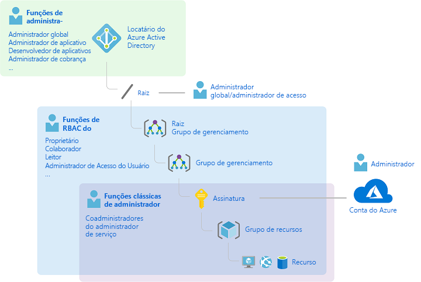
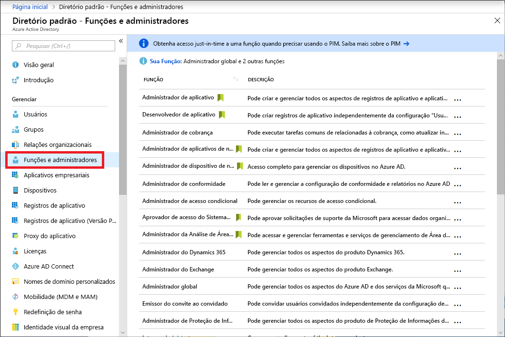
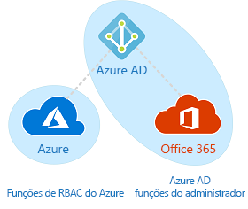

# Funções de administrador de assinatura Clássico X Funções do Azure RBAC X Funções de administrador do Azure AD

Se você for novo no Azure, poderá ter alguma dificuldade em entender todas as diferentes funções no Azure. Este artigo ajuda a explicar as funções e quando usar cada uma:
- Funções de administrador de assinatura Clássico
- Funções do Azure RBAC (Controle de Acesso Baseado em Função)
- Funções de administrador do Azure AD (Azure Active Directory)

## Como as funções estão relacionadas

Para entender melhor as funções no Azure, é bom conhecer sua história. Quando o Azure foi lançado inicialmente, o acesso aos recursos era gerenciado por apenas três funções de administrador: administrador da conta, administrador de serviços e coadministrador. Posteriormente, o RBAC (controle de acesso baseado em função) foi adicionado para recursos do Azure. O Azure RBAC é um sistema de autorização mais recente que fornece gerenciamento de acesso refinado para recursos do Azure. O RBAC inclui muitas funções internas, pode ser atribuído em escopos diferentes e permite que você crie suas próprias funções personalizadas. Para gerenciar recursos no Azure AD, como usuários, grupos e domínios, há várias funções de administrador do Azure AD.

O diagrama a seguir é uma visão geral de como se relacionam as funções de administrador de assinatura clássico, as funções do Azure RBAC e as funções de administrador do Azure AD.

## Funções de administrador de assinatura Clássico

Administrador da Conta, Administrador de Serviços e Coadministrador são as funções de administrador de assinatura clássicas no Azure. Os administradores de assinatura clássicos têm acesso total à assinatura do Azure. Eles podem gerenciar recursos usando o portal do Azure, as APIs do Azure Resource Manager e as APIs do modelo de implantação clássico. A conta que é usada para se inscrever no Azure é definida automaticamente como o Administrador da Conta e o Administrador de Serviços. Depois, outros Coadministradores podem ser adicionados. O administrador de serviços e os coadministradores têm o acesso equivalente ao de usuários que receberam a função de Proprietário (uma função do Azure RBAC) no escopo da assinatura. A tabela a seguir descreve as diferenças entre essas três funções administrativas de assinatura clássico.

| Administrador de assinatura clássico | Limite | Permissões | Observações |
| --- | --- | --- | --- |
| Administrador de conta | 1 por conta do Azure | <ul><li>Acessar o [Centro de Contas do Azure](https://account.azure.com/Subscriptions)</li><li>Gerenciar todas as assinaturas em uma conta</li><li>Criar novas assinaturas</li><li>Cancelar assinaturas</li><li>Alterar a cobrança de uma assinatura</li><li>Alterar o administrador do serviço</li></ul> | Conceitualmente, o proprietário de cobrança da assinatura.|
| Administrador de serviços | 1 por assinatura do Azure | <ul><li>Gerenciar serviços no [portal do Azure](https://portal.azure.com)</li><li>Atribuir usuários à função de coadministrador</li></ul> | Por padrão, para uma nova assinatura, o Administrador da Conta também é o Administrador de Serviços. O administrador de serviço tem o acesso equivalente ao de um usuário que é atribuído à função de Proprietário no escopo da assinatura. |
| Coadministrador | 200 por assinatura | <ul><li>Mesmos privilégios de acesso que o Administrador de Serviços, mas não pode alterar a associação de assinaturas nos diretórios do Azure</li><li>Atribui usuários à função de coadministrador, mas não pode alterar o administrador de serviço</li></ul> | O coadministrador tem o acesso equivalente ao de um usuário que é atribuído à função de Proprietário no escopo da assinatura. |

No portal do Azure, você pode ver quem está atribuído como administrador da conta e administrador de serviços exibindo as propriedades de sua assinatura.

Para obter informações sobre como adicionar ou alterar os administradores da assinatura, consulte [Adicionar ou alterar os administradores de assinatura do Azure](../billing/billing-add-change-azure-subscription-administrator.md) na documentação da cobrança do Azure.

### Conta do Azure e assinaturas do Azure

Uma conta do Azure representa uma relação de cobrança. Uma conta do Azure é uma identidade de usuário, uma ou mais assinaturas do Azure e um conjunto de recursos do Azure associado. A pessoa que cria a conta é o administrador da conta para todas as assinaturas criadas nessa conta. Essa pessoa também é o administrador de serviço padrão da assinatura.

As assinaturas do Azure o ajudam a organizar o acesso aos recursos do Azure. Eles também ajudam a controlar como o uso de recursos é reportado, cobrado e pago. Cada assinatura pode ter uma configuração diferente de cobrança e pagamento, assim você pode ter diferentes assinaturas e planos diferentes por escritório, departamento, projeto e afins. Cada serviço pertence a uma assinatura e a ID da assinatura pode ser exigida para operações programáticas.

Contas e assinaturas são gerenciadas no [Centro de Contas do Azure](https://account.azure.com/Subscriptions).
## Funções do Azure RBAC

O Azure RBAC é um sistema de autorização baseado no [Azure Resource Manager](../azure-resource-manager/resource-group-overview.md) que fornece gerenciamento de acesso refinado aos recursos do Azure, como computação e armazenamento. O Azure RBAC inclui mais de 70 funções internas. Há quatro funções RBAC fundamentais. As três primeiras se aplicam a todos os tipos de recursos:

| Função do Azure RBAC | Permissões | Observações |
| --- | --- | --- |
| [Proprietário](built-in-roles.md#owner) | <ul><li>Acesso completo a todos os recursos</li><li>Delegar acesso a outras pessoas</li></ul> | O administrador de serviços e os coadministradores recebem a função de Proprietário no escopo da assinatura Aplica-se a todos os tipos de recurso. |
| [Colaborador](built-in-roles.md#contributor) | <ul><li>Criar e gerenciar todos os tipos de recursos do Azure</li><li>Não é possível conceder acesso a outras pessoas</li></ul> | Aplica-se a todos os tipos de recurso. |
| [Leitor](built-in-roles.md#reader) | <ul><li>Exibir recursos do Azure</li></ul> | Aplica-se a todos os tipos de recurso. |
| [Administrador de Acesso do Usuário](built-in-roles.md#user-access-administrator) | <ul><li>Gerenciar o acesso do usuário aos recursos do Azure</li></ul> |  |

As demais funções internas permitem o gerenciamento de recursos específicos do Azure. Por exemplo, a função [Colaborador de Máquina Virtual](built-in-roles.md#virtual-machine-contributor) permite que o usuário crie e gerencie máquinas virtuais. Para obter uma lista de todas as funções internas, consulte [Funções internas](built-in-roles.md).

Somente o portal do Azure e as APIs do Azure Resource Manager dão suporte ao RBAC. Os usuários, grupos e aplicativos aos quais são atribuídas funções RBAC não podem usar as [APIs do modelo de implantação clássico do Azure](../azure-resource-manager/resource-manager-deployment-model.md).

No portal do Azure, as atribuições de função usando o RBAC aparecem na folha **Controle de acesso (IAM)**. Essa folha pode ser encontrada em todo o portal, por exemplo, em assinaturas, grupos de recursos e vários recursos.

Quando você clicar na opção **Funções**, verá a lista de funções internas e personalizadas.

## Funções de administrador do Azure AD

As funções de administrador do Azure AD são usadas para gerenciar recursos do Azure AD em um diretório, como criar ou editar usuários, atribuir funções administrativas a outros usuários, redefinir senhas de usuário, gerenciar licenças de usuário e gerenciar domínios. A tabela a seguir descreve algumas das funções de administrador do Azure AD mais importantes.

| Função de administrador do Azure AD | Permissões | Observações |
| --- | --- | --- |
| [Administrador global](../active-directory/users-groups-roles/directory-assign-admin-roles.md#company-administrator) | <ul><li>Gerenciar o acesso a todos os recursos administrativos do Azure Active Directory, bem como serviços federados ao Azure Active Directory</li><li>Atribuir funções de administrador a outras pessoas</li><li>Redefinir a senha para qualquer usuário e todos os outros administradores</li></ul> | A pessoa que se inscreve no locatário do Azure Active Directory torna-se um administrador global. |
| [Administrador de usuários](../active-directory/users-groups-roles/directory-assign-admin-roles.md#user-account-administrator) | <ul><li>Criar e gerenciar todos os aspectos de usuários e grupos</li><li>Gerenciar tíquetes de suporte</li><li>Monitorar a integridade do serviço</li><li>Alterar senhas de usuários, Administradores de Assistência Técnica e outros Administradores de Usuário</li></ul> |  |
| [Administrador de cobrança](../active-directory/users-groups-roles/directory-assign-admin-roles.md#billing-administrator) | <ul><li>Fazer compras</li><li>Gerenciar Assinaturas</li><li>Gerenciar tíquetes de suporte</li><li>Monitorar a integridade do serviço</li></ul> |  |

Para obter uma lista de todas as funções de administrador do Azure AD, consulte [Atribuindo funções de administrador no Azure Active Directory](/azure/active-directory/active-directory-assign-admin-roles-azure-portal).

No portal do Azure, você pode ver a lista de funções de administrador do Azure AD na folha **Funções e administradores**.

## Diferenças entre funções do Azure RBAC e funções de administrador do Azure AD

De maneira geral, as funções do Azure RBAC controlam permissões para gerenciar recursos do Azure e as funções de administrador do Azure AD controlam as permissões para gerenciar recursos do Azure Active Directory. A tabela a seguir compara algumas das diferenças.

| Funções do Azure RBAC | Funções de administrador do Azure AD |
| --- | --- |
| Gerenciar o acesso com recursos do Azure | Gerenciar o acesso a recursos do Azure Active Directory |
| Dá suporte a funções personalizadas | Não é possível criar suas próprias funções |
| O escopo pode ser especificado em vários níveis (grupo de gerenciamento, assinatura, grupo de recursos e recursos) | O escopo está no nível do locatário |
| As informações de função podem ser acessadas no portal do Azure, na CLI do Azure, no Azure PowerShell, nos modelos do Azure Resource Manager, na API REST | As informações de função podem ser acessadas no portal de administração do Azure, no portal do administrador do Office 365, no Microsoft Graph, no AzureAD PowerShell |

### As funções de Azure RBAC e de administrador do Azure AD se sobrepõem?

Por padrão, as funções de administrador do Azure AD e as funções do Azure RBAC (controle de acesso baseado em função) não se estendem ao Azure e ao Azure AD. No entanto, se um Administrador Global elevar o acesso ao escolher a opção **Administrador Global Pode Gerenciar Assinaturas do Azure e Grupos de Gerenciamento** no portal do Azure, ele receberá a função [Administrador de acesso do usuário](built-in-roles.md#user-access-administrator) (uma função RBAC) em todas as assinaturas de um locatário específico. A função de Administrador de Acesso do Usuário permite que o usuário conceda a outros usuários o acesso aos recursos do Azure. Essa opção pode ser útil para recuperar o acesso a uma assinatura. Para obter mais informações, consulte [Elevar acesso como administrador do Azure AD](elevate-access-global-admin.md).

Várias funções de administrador do Azure AD englobam o Azure AD e o Microsoft Office 365, como as funções de Administrador Global e Administrador de Usuários. Por exemplo, se você for um membro da função de Administrador Global, terá recursos de administrador global no Azure AD e no Office 365, por exemplo, poderá fazer alterações no Microsoft Exchange e no Microsoft SharePoint. No entanto, por padrão, o Administrador Global não tem acesso aos recursos do Azure.

## Próximas etapas

- [O que é o RBAC (controle de acesso baseado em função)?](overview.md)
- [Atribuindo funções de administrador no Azure Active Directory](/azure/active-directory/active-directory-assign-admin-roles-azure-portal)
- [Adicionar ou alterar administradores de assinatura do Azure](/azure/billing/billing-add-change-azure-subscription-administrator)
