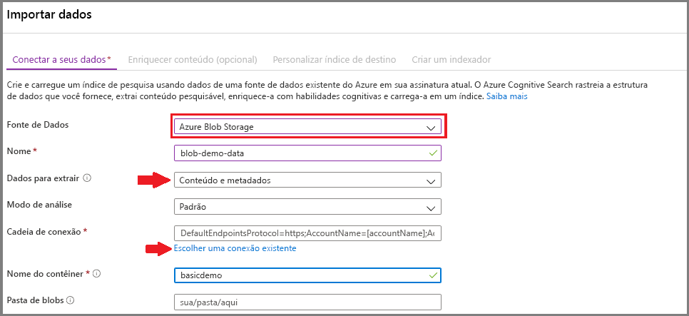
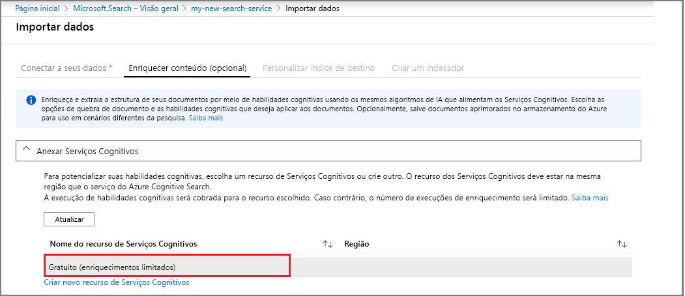
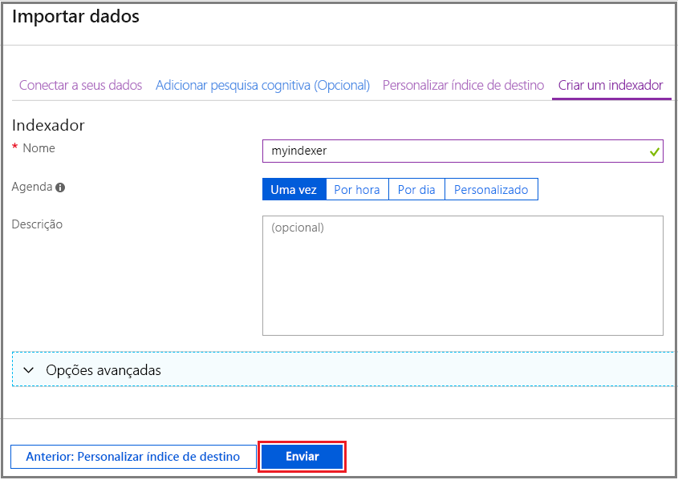

# Início Rápido: Criar um pipeline de Pesquisa Cognitiva usando habilidades e dados de exemplo

Pesquisa cognitiva (visualização) adiciona a extração de dados, processamento de linguagem natural (NLP) e imagem, processamento de habilidades para um pipeline de indexação do Azure Search, tornando o conteúdo não pesquisável ou não estruturado mais pesquisável. 

Um pipeline de pesquisa cognitiva integra [Recursos dos Serviços Cognitivos](https://azure.microsoft.com/services/cognitive-services/) – como [OCR](cognitive-search-skill-ocr.md), [detecção de idioma](cognitive-search-skill-language-detection.md), [reconhecimento de entidade](cognitive-search-skill-entity-recognition.md) – a um processo de indexação. Os algoritmos de IA dos Serviços Cognitivos são usados para encontrar padrões, recursos e características em dados de origem, retornando estruturas e conteúdo textual que podem ser usados em soluções de pesquisa de texto completo baseadas no Azure Search.

Neste início rápido, crie seu primeiro pipeline de enriquecimento no [portal do Azure](https://portal.azure.com) antes de escrever uma única linha de código:

> [!div class="checklist"]
> * Comece com dados de exemplo no armazenamento de blob do Azure
> * Configurar o assistente para [**Importação de dados**](search-import-data-portal.md) para indexação e enriquecimento cognitivos 
> * Execute o Assistente (uma habilidade de entidade detecta pessoas, local e organizações)
> * Usar o [**Gerenciador de pesquisa**](search-explorer.md) para consultar os dados enriquecidos

##  Regiões com suporte

Você pode experimentar pesquisa cognitiva em um serviço do Azure Search criado nas seguintes regiões:

* Centro-Oeste dos EUA
* Centro-Sul dos Estados Unidos
* Leste dos EUA
* Leste dos EUA 2
* Oeste dos EUA 2
* Canadá Central
* Europa Ocidental
* Sul do Reino Unido
* Norte da Europa
* Sul do Brasil
* Sudeste Asiático
* Índia Central
* Leste da Austrália

Se você não tiver uma assinatura do Azure, crie uma [conta gratuita](https://azure.microsoft.com/free/?WT.mc_id=A261C142F) antes de começar.

> [!NOTE]
> Iniciando em 21 de dezembro de 2018, você poderá associar um recurso de Serviços Cognitivos com um conjunto de habilidades do Azure Search. Isso nos permitirá começar a cobrar pela execução do conjunto de habilidades. Nessa data, também passaremos a cobrar pela extração de imagem como parte do estágio de decodificação de documentos. A extração de texto de documentos continuará sendo oferecida sem custo adicional.
>
> A execução do conjunto de qualificações será cobrada com o [Preço pago conforme o uso dos Serviços Cognitivos](https://azure.microsoft.com/pricing/details/cognitive-services/) existente. O preço da extração de imagem será cobrado com o preço da versão prévia, o que está descrito na [página de preço do Azure Search](https://go.microsoft.com/fwlink/?linkid=2042400). Saiba [mais](cognitive-search-attach-cognitive-services.md).

## Pré-requisitos

[“O que é pesquisa cognitiva?”](cognitive-search-concept-intro.md) apresenta a arquitetura de enriquecimento e componentes. 

Os serviços do Azure são usados exclusivamente nesse cenário. A criação de serviços que você precisa é parte da preparação.

+ O [Armazenamento de Blobs do Azure](https://azure.microsoft.com/services/storage/blobs/) fornece os dados de origem
+ Os [Serviços Cognitivos](https://azure.microsoft.com/services/cognitive-services/) fornecem a IA (você pode criar esses recursos em linha, ao especificar o pipeline)
+ O [Azure Search](https://azure.microsoft.com/services/search/) fornece o pipeline de indexação enriquecido e uma experiência sofisticada de pesquisa de texto de forma livre para uso em aplicativos personalizados

### Configurar o Azure Search

Primeiro, inscreva-se no serviço do Azure Search. 

1. Acesse o [Portal do Azure](https://portal.azure.com) e entre usando sua conta do Azure.

1. Clique em **Criar um recurso**, pesquise por Azure Search e clique em **Criar**. Consulte [Criar um serviço do Azure Search no portal de](search-create-service-portal.md) se você estiver configurando um serviço de pesquisa pela primeira vez e precisar de mais ajuda.

  

1. Para Grupo de recursos, crie um grupo de recursos para conter todos os recursos criados neste início rápido. Isso torna mais fácil limpar os recursos, depois de concluir o guia de início rápido.

1. Para Localização, escolha uma das [regiões com suporte](#supported-regions) para pesquisa cognitiva.

1. Para a camada de preços, você pode criar um serviço **Livre** para completar tutoriais e guias de início rápido. Para uma investigação mais detalhada usando seus próprios dados, crie um [serviço pago](https://azure.microsoft.com/pricing/details/search/) como **Básico** ou **Standard**. 

  Um serviço gratuito está limitado a 3 índices, tamanho máximo do blob de 16 MB e 2 minutos de indexação, o que não é suficiente para exercer todos os recursos de pesquisa cognitiva. Para examinar os limites para as diferentes camadas, consulte [Limites de Serviço](search-limits-quotas-capacity.md).

  

  > [!NOTE]
  > A pesquisa cognitiva está na visualização pública. Execução do conjunto de qualificações está disponível em todas as camadas, incluindo livre. Você poderá realizar um número limitado de aprimoramentos sem associar um recurso de Serviços Cognitivos pago. Saiba [mais](cognitive-search-attach-cognitive-services.md).

1. Fixe o serviço no painel de controle para acesso rápido a informações de serviço.

  

### Configurar o serviço Blob do Azure e carregar dados de amostra

O pipeline de enriquecimento recebe de fontes de dados do Azure com suporte [indexadores do Azure Search](search-indexer-overview.md). Observe que não há suporte para o Armazenamento de Tabelas do Azure para Pesquisa Cognitiva. Para este exercício, usamos o armazenamento de blob para apresentar múltiplos tipos de conteúdo.

1. [Fazer o download de dados de exemplo](https://1drv.ms/f/s!As7Oy81M_gVPa-LCb5lC_3hbS-4) consiste em um conjunto de pequenos arquivos de tipos diferentes. 

1. Inscreva-se no Armazenamento de Blobs do Azure, crie uma conta de armazenamento, abra as páginas de serviços Blob e crie um contêiner. No contêiner, defina o nível de acesso público como **Contêiner**. Para obter mais informações, confira a [seção "Criar um contêiner"](../storage/blobs/storage-unstructured-search.md#create-a-container) no tutorial *Pesquisar dados não estruturados*.

1. No contêiner criado, clique em **Carregar** para carregar os arquivos de exemplo baixados em uma etapa anterior.

  

## Criar o pipeline de enriquecimento

Retorne à página do painel do serviço Azure Search e clique em **Importar dados** na barra de comandos para configurar o enriquecimento cognitivo em quatro etapas.

  

### Etapa 1: Criar uma fonte de dados

Em **Conectar-se aos seus dados**, escolha **Armazenamento de Blobs do Azure** e selecione a conta e o contêiner criados. Dê um nome de fonte de dados e use valores padrão para o restante. 

  

Continue para a próxima página.

  

### Etapa 2: Adicionar habilidades cognitivas

Em seguida, adicione etapas de enriquecimento para o pipeline de indexação. Caso não tenha um recurso dos Serviços Cognitivos, inscreva-se para usar uma versão gratuita que fornece 20 transações diariamente. Os dados de exemplo consistem em 14 arquivos e, portanto, grande parte de sua alocação diária será consumida quando você executar esse assistente.

1. Expanda **Anexar Serviços Cognitivos** para exibir opções para obter recursos para as APIs de Serviços Cognitivos. Para os fins deste tutorial, você poderá usar o recurso **Gratuito**.

  

2. Expanda **Adicionar Enriquecimentos** e selecione as habilidades que executam o processamento de idioma natural. Para este guia de início rápido, escolha o reconhecimento de entidade para pessoas, empresas e locais.

  

  O portal oferece habilidades internas para processamento de OCR e análise de texto. No portal, um conjunto de qualificações opera em um campo de origem única. Isso pode parecer assim como um destino pequeno, mas para blobs do Azure o campo `content` contém a maior parte do documento blob (por exemplo, um documento do Word ou PowerPoint). Como tal, esse campo é uma entrada ideal porque todo o conteúdo de um blob está lá.

3. Continue para a próxima página.

  

> [!NOTE]
> Capacidade de processamento de idioma natural opera em conteúdo de texto do conjunto de dados de exemplo. Como não selecionamos a opção de OCR, os arquivos JPEG e PNG encontrados no conjunto de dados de exemplo não serão processados neste início rápido. 

### Etapa 3: Configurar o índice

O assistente geralmente pode inferir um índice padrão. Nesta etapa, você poderá exibir o esquema de índice gerado e, potencialmente, revisar todas as configurações. Veja abaixo o índice padrão criado para o conjunto de dados de Blob de demonstração.

Para este guia de início rápido, o assistente faz um bom trabalho configurando padrões razoáveis: 

+ O nome padrão é *azureblob-index*.
+ A chave padrão é *metadata_storage_path* (esse campo contém valores exclusivos).
+ Os atributos e os tipos de dados padrão são válidos para cenários de pesquisa de texto completo.

Considere a possibilidade de desmarcar a opção **Recuperável** no campo `content`. Em blobs, esse campo pode chegar a milhares de linhas. Você pode imaginar como será difícil exibir arquivos com muito conteúdo, como documentos do Word ou apresentações do PowerPoint, como JSON em uma lista de resultados da pesquisa. 

Como você definiu um conjunto de habilidades, o assistente pressupõe que você deseja ter o campo de dados de origem original, mais os campos de saída criados pelo pipeline cognitivo. Por esse motivo, o portal adiciona campos de índice para `content`, `people`, `organizations`, e `locations`. Observe que o assistente habilita automaticamente as opções **Recuperável** e **Pesquisável** nesses campos. **Pesquisável** indica que um campo pode ser pesquisado. **Recuperável** significa que ele pode ser retornado nos resultados. 

  
  
Continue para a próxima página.

  

### Etapa 4: Configurar o indexador

O indexador é um recurso de alto nível que orienta o processo de indexação. Ele especifica o nome da fonte de dados, um índice de destino e a frequência de execução. O resultado final de assistente **importar dados** é sempre um indexador que você pode executar várias vezes.

Na página **Indexador**, você pode aceitar o nome padrão e usar a opção de agenda **Executar uma vez** para executá-lo imediatamente. 

  

Clique em **Enviar** para criar e executar simultaneamente o indexador.

## Monitorar a indexação

As etapas de enriquecimento levam mais tempo para serem concluídas em comparação à indexação típica baseada em texto. O assistente deverá abrir a lista Indexador na página de visão geral, de modo que você possa acompanhar o progresso. Para a autonavegação, acesse a página Visão Geral e clique em **Indexadores**.

O aviso ocorre porque os arquivos JPG e PNG são arquivos de imagem e omitimos a habilidade de OCR nesse pipeline. Você também encontrará notificações de truncamento. O Azure Search limita a extração a 32.000 caracteres na camada Gratuita.

  

A indexação e enriquecimento podem levar tempo, por isso, os conjuntos de dados menores são recomendados para exploração inicial. 

## Consultar no Gerenciador de pesquisa

Depois que um índice é criado, você pode enviar consultas para retornar os documentos do índice. No portal, use **Gerenciador de pesquisa** para executar consultas e exibir os resultados. 

1. Na página de painel do serviço de pesquisa, clique em **Gerenciador de pesquisa** na barra de comandos.

1. Clique em **Alterar índice** na parte superior para selecionar o índice que você criou.

1. Insira uma cadeia de caracteres de pesquisa para consultar o índice, como `search=Microsoft&searchFields=organizations`.

Os resultados são retornados em JSON, que pode ser difíceis de ler, especialmente em documentos grandes provenientes de blobs do Azure e detalhado. Se você não pode examinar os resultados facilmente, use CTRL-F para pesquisar dentro de documentos. Para essa consulta, você poderá pesquisar termos específicos no JSON. 

CTRL + F pode ajudá-lo a determinar quantos documentos estão em um determinado resultado definidos. Para blobs do Azure, o portal escolhe "metadata_storage_path" como a chave, porque cada valor é exclusivo para o documento. Usar CTRL + F, pesquise "metadata_storage_path" obter uma contagem de documentos. 

  

## Observações

Agora você concluiu seu primeiro exercício de indexação enriquecida cognitivamente. A finalidade deste guia de início rápido foi introduz conceitos importantes e orientá-lo por meio do Assistente para que você possa rapidamente o protótipo de uma solução de pesquisa cognitivas usando seus próprios dados.

Alguns conceitos-chave Esperamos que você pegou incluem a dependência em fontes de dados do Azure. Enriquecimento cognitivas pesquisa está associado a indexadores e indexadores são Azure e específico de fonte. Embora este guia de início rápido Use o armazenamento de BLOBs do Azure, outras fontes de dados do Azure são possíveis. Para obter mais informações, consulte [Indexadores no Azure Search](search-indexer-overview.md).

Outro conceito importante é que as habilidades operam em campos de entrada. No portal, você precisa escolher um campo de origem única para todas as habilidades. No código, entradas podem ser outros campos, ou a saída de uma habilidade de upstream.

 Entradas para uma habilidade são mapeadas para um campo de saída em um índice. Internamente, o portal configura [anotações](cognitive-search-concept-annotations-syntax.md) e define uma [conjunto de qualificações](cognitive-search-defining-skillset.md), estabelecendo a ordem das operações e o fluxo geral. Essas etapas estão ocultos no portal, mas quando você começar a escrever código, esses conceitos tornam-se importantes.

Por fim, você aprendeu que exibindo resultados é obtida pela consulta do índice. No final, o que fornece o Azure Search é um índice de pesquisado, que podem ser consultados usando a [simples](https://docs.microsoft.com/rest/api/searchservice/simple-query-syntax-in-azure-search) ou [totalmente estendida sintaxe de consulta](https://docs.microsoft.com/rest/api/searchservice/lucene-query-syntax-in-azure-search). Um índice que contém campos enriquecidos é como qualquer outro. Se você quiser incorporar padrão ou [analisadores personalizados](search-analyzers.md), [perfis de pontuação](https://docs.microsoft.com/rest/api/searchservice/add-scoring-profiles-to-a-search-index), [sinônimos](search-synonyms.md), [filtros Facetado](search-filters-facets.md), pesquisa geográfica ou qualquer outro recurso do Azure Search, você pode certamente fazê-lo.

## Limpar recursos

Se sua exploração é concluída, a maneira mais rápida para limpar é excluindo o grupo de recursos que contém o serviço do Azure Search e o serviço de Blob do Azure.  

Supondo que você colocar ambos os serviços no mesmo grupo, exclua o grupo de recursos agora para excluir permanentemente todo o conteúdo, incluindo os serviços e qualquer conteúdo armazenado criado para este exercício. No portal, o nome do grupo de recurso está na página de Visão geral de cada serviço.

## Próximas etapas

Dependendo de como você provisionou o recurso de Serviços Cognitivos, você poderá fazer experimentos com a indexação e o enriquecimento executando novamente o assistente com diferentes habilidades e campos de dados de origem. Para repetir as etapas, excluir o índice e o indexador e recrie o indexador com uma nova combinação de seleções.

+ Em **visão geral** > **índices**, selecione o índice que você criou e, em seguida, clique em **excluir**.

+ Em **visão geral**, clique duas vezes o **indexadores** lado a lado. Localize o indexador que você criou e excluí-lo.

Como alternativa, reutilize os dados de exemplo e serviços que você criou e saiba como executar as mesmas tarefas programaticamente no tutorial do próximo. 

> [!div class="nextstepaction"]
> [Tutorial: Aprender as APIs REST de Pesquisa Cognitiva](cognitive-search-tutorial-blob.md)
