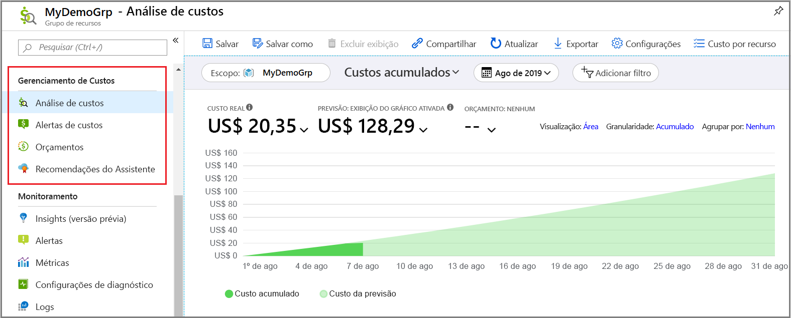
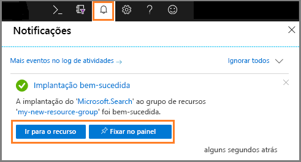
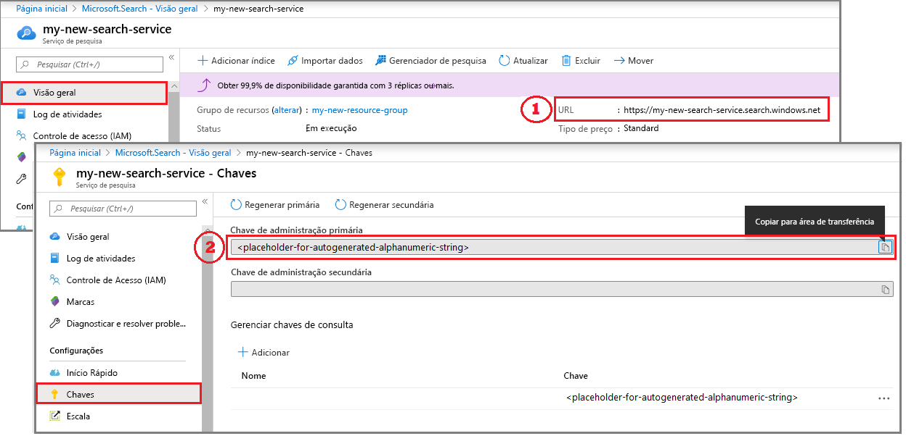

# Início Rápido: Criar um serviço de Azure Search no portal

O Azure Search é um recurso independente usado para conectar uma experiência de pesquisa a aplicativos personalizados. Embora o Azure Search seja integrado com facilidade a outros serviços do Azure, você também poderá usá-lo como um componente autônomo ou integrá-lo a aplicativos em servidores de rede ou a um software em execução em outras plataformas de nuvem.

Neste artigo, saiba como criar um recurso do Azure Search no [portal do Azure](https://portal.azure.com/).

Prefere o PowerShell? Use o [modelo de serviço](https://azure.microsoft.com/resources/templates/101-azure-search-create/) do Azure Resource Manager. Para obter ajuda para começar a usá-lo, confira [Manage Azure Search with PowerShell](search-manage-powershell.md) (Gerenciar o Azure Search com o PowerShell).

## Assinar (gratuito ou pago)

[Abra uma conta gratuita do Azure](https://azure.microsoft.com/pricing/free-trial/?WT.mc_id=A261C142F) e use créditos gratuitos para experimentar serviços pagos do Azure. Depois que os créditos forem usados, mantenha a conta e continue a usar os serviços do Azure gratuitos, como os sites. Seu cartão de crédito nunca será cobrado, a menos que você altere explicitamente suas configurações, solicitando esse tipo de cobrança.

Alternativamente, você pode [ativar os benefícios de assinante MSDN](https://azure.microsoft.com/pricing/member-offers/msdn-benefits-details/?WT.mc_id=A261C142F). Todos os meses, uma assinatura do MSDN lhe oferece créditos que podem ser usados para serviços pagos do Azure. 

## Encontrar o Azure Search

1. Entre no [Portal do Azure](https://portal.azure.com/).
2. Clique no sinal de adição ("+ Criar Recurso") no canto superior esquerdo.
3. Use a barra de pesquisa para localizar "Azure Search" ou navegue para o recurso por meio de **Web** > **Azure Search**.

## Selecionar uma assinatura

Se você tiver mais de uma assinatura, escolha uma que também tenha serviços de armazenamento de arquivos ou dados. O Azure Search pode detectar automaticamente o armazenamento de Blobs e Tabela do Azure, o Banco de Dados SQL e o Azure Cosmos DB para indexação por meio de [*indexadores*](search-indexer-overview.md), mas apenas para os serviços na mesma assinatura.

## Definir um grupo de recursos

Um grupo de recursos é necessário e útil para gerenciar todos os recursos, incluindo o gerenciamento de custos. Um grupo de recursos pode consistir em um ou em vários serviços usados juntos. Por exemplo, se você estiver usando o Azure Search para indexar um banco de dados do Azure Cosmos DB, poderá fazer com que ambos os serviços façam parte do mesmo grupo de recursos para fins de gerenciamento. 

Se você não estiver combinando recursos em um único grupo ou se os grupos de recursos existentes estiverem preenchidos com recursos usados em soluções não relacionadas, crie um grupo de recursos apenas para o recurso do Azure Search. 

Ao usar o serviço, você pode acompanhar todos os custos atuais e projetados (conforme mostrado na captura de tela) ou rolar para baixo para exibir os encargos de recursos individuais.

> [!TIP]
> Excluir um grupo de recursos também exclui os serviços dentro dele. Para projetos de protótipo utilizando vários serviços, colocar todos eles no mesmo grupo de recursos facilita a limpeza depois da conclusão do projeto.

## Dê um nome ao serviço

Em Detalhes da Instância, dê um nome ao serviço no campo **URL**. O nome faz parte do ponto de extremidade da URL na qual as chamadas à API são emitidas: `https://your-service-name.search.windows.net`. Por exemplo, caso deseje que o ponto de extremidade seja `https://myservice.search.windows.net`, insira `myservice`.

Requisitos de nome de serviço:

* Ele deve ser exclusivo dentro do namespace search.windows.net
* Dois a 60 caracteres de comprimento
* Use letras minúsculas, dígitos ou traços ("-")
* Evite traços ("-") nos 2 primeiros caracteres ou o último caractere
* Sem traços consecutivos ("--") em nenhum lugar

> [!TIP]
> Se você acredita que vai usar vários serviços, recomendamos incluir a região (ou o local) no nome do serviço como uma convenção de nomenclatura. Os serviços na mesma região podem trocar dados sem custos, portanto, se o Azure Search estiver no Oeste dos EUA e tiver outros serviços também no Leste dos EUA, um nome como `mysearchservice-westus` poderá poupar uma viagem à página de propriedades ao decidir como combinar ou anexar recursos.

## Escolher um local

Como um serviço do Azure, a Azure Search pode ser hospedado em datacenters em todo o mundo. A lista de regiões com suporte pode ser encontrada na [página de preços](https://azure.microsoft.com/pricing/details/search/). 

Você pode minimizar ou evitar encargos de largura de banda escolhendo o mesmo local para vários serviços. Por exemplo, se você estiver indexando os dados fornecidos por outro serviço do Azure (armazenamento do Azure, Azure Cosmos DB, Banco de Dados SQL do Azure), a criação de seu serviço de Azure Search na mesma região evitará cobranças de largura de banda (não há encargos para dados de saída quando os serviços estão na mesma região).

Além disso, se você estiver usando enriquecimentos de IA da pesquisa cognitiva, crie seu serviço na mesma região que seu recurso dos Serviços Cognitivos. *A colocalização do Azure Search e dos Serviços Cognitivos na mesma região é um requisito do enriquecimento de IA*.

> [!Note]
> A Índia Central não está disponível atualmente para novos serviços. Para os serviços que já estão na Índia Central, você pode escalar verticalmente sem restrições, e seu serviço tem suporte total nessa região. A restrição nessa região é temporária e limitada apenas a novos serviços. Removeremos essa observação quando a restrição deixar de ser aplicável.

## Escolher um tipo de preço (SKU)

[O Azure Search é oferecido em vários tipos de preço no momento](https://azure.microsoft.com/pricing/details/search/): Gratuito, Básico ou Padrão. Cada tipo tem sua própria [capacidade e limites](search-limits-quotas-capacity.md). Confira [Escolher um tipo de preço ou SKU](search-sku-tier.md) para obter orientações.

Básico e Standard são as opções mais comuns para cargas de trabalho de produção, mas a maioria dos clientes começa com o serviço Gratuito. As principais diferenças entre as camadas são o tamanho e a velocidade da partição e os limites do número de objetos que você pode criar.

Lembre-se de que o tipo de preço não pode ser alterado depois da criação do serviço. Se você precisar de um nível superior ou inferior mais tarde, você precisa recriar o serviço.

## Criar seu serviço

Depois de fornecer as entradas necessárias, crie o serviço. 

O serviço é implantado em minutos, o que pode ser monitorado por meio das notificações do Azure. Considere a possibilidade de fixar o serviço no painel para facilitar o acesso no futuro.

## Obter uma chave e um ponto de extremidade de URL

A menos que você esteja usando o portal, o acesso ao novo serviço exigirá o fornecimento do ponto de extremidade de URL e de uma chave de API de autenticação.

1. Na página de visão geral do serviço, localize e copie o ponto de extremidade de URL do lado direito da página.

2. No painel de navegação esquerdo, selecione **Chaves** e, em seguida, copie uma das chaves de administração (elas são equivalentes). As chaves de API do administrador são necessárias para criar, atualizar e excluir objetos em seu serviço.

   

Um ponto de extremidade e uma chave não são necessários para tarefas baseadas no portal. O portal já está vinculado ao recuso do Azure Search com direitos de administrador. Para obter um passo a passo do portal, comece com [Início rápido: Criar um índice do Azure Search no portal](search-get-started-portal.md).

## Dimensione seu serviço

Depois que o serviço é fornecido, você pode dimensioná-lo para atender às suas necessidades. Se você escolher o nível Standard para o serviço Azure Search, poderá dimensionar o serviço em duas dimensões: réplicas e partições. Com a escolha do tipo Básico, você pode apenas adicionar réplicas. Se você provisionou o serviço gratuito, o dimensionamento não estará disponível.

As ***partições*** permitem que o seu serviço armazene e pesquise mais documentos.

***Réplicas*** permitem que seu serviço lide com uma carga maior de consultas de pesquisa.

A adição de recursos aumenta sua fatura mensal. A [calculadora de preços](https://azure.microsoft.com/pricing/calculator/) pode ajudá-lo a entender as implicações de cobrança de adição de recursos. Lembre-se de que você pode ajustar os recursos com base na carga. Por exemplo, você pode aumentar os recursos para criar um índice inicial completo e reduzir recursos posteriormente para um nível mais adequado para indexação incremental.

> [!Important]
> Um serviço deve ter [duas réplicas para o SLA somente leitura e três réplicas para o SLA de leitura/gravação](https://azure.microsoft.com/support/legal/sla/search/v1_0/).

1. Vá até a folha de serviço de pesquisa no Portal do Azure.
2. No painel de navegação esquerdo, selecione **Configurações** > **Escala**.
3. Use a barra deslizante para adicionar recursos de qualquer tipo.

> [!Note]
> A velocidade e o armazenamento por partição aumentam em camadas superiores. Para obter mais informações, confira [Capacidade e limites](search-limits-quotas-capacity.md).

## Quando adicionar um segundo serviço

A maioria dos clientes usa apenas um serviço provisionado em uma camada que fornece o [equilíbrio certo de recursos](search-sku-tier.md). Um serviço pode hospedar vários índices, sujeito aos [limites máximos na camada selecionada](search-capacity-planning.md), com cada índice isolado do outro. No Azure Search, as solicitações podem ser direcionadas somente para um índice, minimizando a possibilidade de recuperação de dados acidental ou intencional de outros índices no mesmo serviço.

Embora a maioria dos clientes use apenas um serviço, a redundância de serviço poderá ser necessária se os requisitos operacionais incluírem o seguinte:

* Recuperação de desastre (interrupção do datacenter). O Azure Search não fornece failover instantâneo caso ocorra uma interrupção. Para obter recomendações e diretrizes, consulte [Administração de serviço](search-manage.md).
* Sua investigação de modelagem de multilocação determinou que serviços adicionais são o design ideal. Para obter mais informações, consulte [Design para multilocação](search-modeling-multitenant-saas-applications.md).
* Para aplicativos implantados globalmente, é possível exigir uma instância do Azure Search em várias regiões para minimizar a latência de tráfego internacional do aplicativo.

> [!NOTE]
> No Azure Search, não é possível segregar operações de indexação e de consulta; portanto, você nunca criará vários serviços para cargas de trabalho segregadas. Um índice sempre é consultado no serviço em que foi criado (não é possível criar um índice em um serviço e copiá-lo para outro).

Um segundo serviço não é necessário para alta disponibilidade. A alta disponibilidade para consultas é obtida ao usar duas ou mais réplicas no mesmo serviço. Atualizações de réplica são sequenciais, o que significa que, pelo menos, uma está operacional quando uma atualização de serviço é distribuída. Para obter mais informações sobre tempo de atividade, consulte [Contratos de Nível de Serviço](https://azure.microsoft.com/support/legal/sla/search/v1_0/).

## Próximas etapas

Depois de provisionar um serviço Azure Search, continue no portal para criar seu primeiro índice.

> [!div class="nextstepaction"]
> [Início Rápido: Criar um índice do Azure Search no portal](search-get-started-portal.md)
