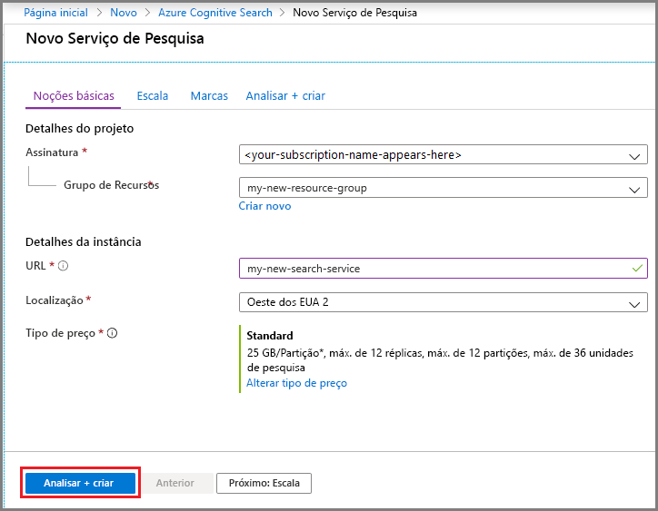
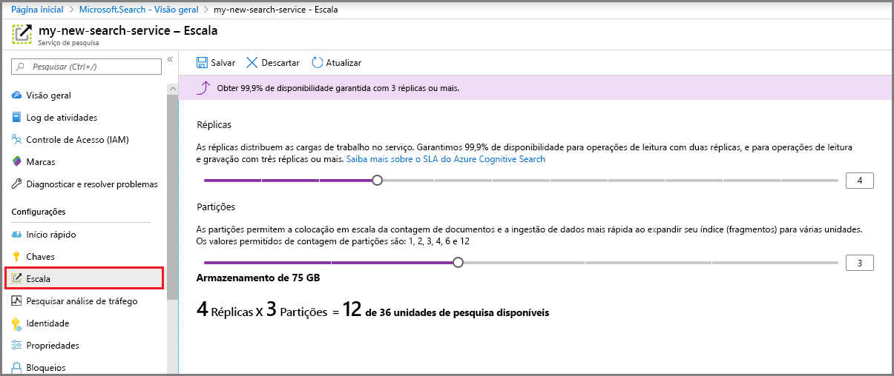

# Criar um serviço de Azure Search no portal

O Azure Search é um recurso independente usado para conectar uma experiência de pesquisa a aplicativos personalizados. Embora o Azure Search seja integrado com facilidade a outros serviços do Azure, você também poderá usá-lo por si só, com aplicativos em servidores de rede ou com o software em execução em outras plataformas de nuvem.

Neste artigo, saiba como criar um recurso do Azure Search no [portal do Azure](https://portal.azure.com/).

Prefere o PowerShell? Use o [modelo de serviço](https://azure.microsoft.com/resources/templates/101-azure-search-create/) do Azure Resource Manager. Para obter ajuda para começar a usá-lo, confira [Manage Azure Search with PowerShell](search-manage-powershell.md) (Gerenciar o Azure Search com o PowerShell).

## Assinar (gratuito ou pago)

[Abra uma conta gratuita do Azure](https://azure.microsoft.com/pricing/free-trial/?WT.mc_id=A261C142F) e use créditos gratuitos para experimentar serviços pagos do Azure. Depois que os créditos forem usados, mantenha a conta e continue a usar os serviços do Azure gratuitos, como os sites. Seu cartão de crédito nunca será cobrado, a menos que você altere explicitamente suas configurações, solicitando esse tipo de cobrança.

Alternativamente, você pode [ativar os benefícios de assinante MSDN](https://azure.microsoft.com/pricing/member-offers/msdn-benefits-details/?WT.mc_id=A261C142F). Todos os meses, uma assinatura do MSDN lhe oferece créditos que podem ser usados para serviços pagos do Azure. 

## Encontrar o Azure Search

1. Entre no [Portal do Azure](https://portal.azure.com/).
2. Clique no sinal de adição ("+ Criar Recurso") no canto superior esquerdo.
3. Use a barra de pesquisa para localizar "Azure Search" ou navegue para o recurso por meio de **Web** > **Azure Search**.

## Nome do serviço e o ponto de extremidade da URL

Um nome de serviço é parte do ponto de extremidade da URL na qual as chamadas à API são emitidas: `https://your-service-name.search.windows.net`. Digite o nome do serviço no campo **URL**.

Por exemplo, caso deseje que o ponto de extremidade seja `https://my-app-name-01.search.windows.net`, insira `my-app-name-01`.

Requisitos de nome de serviço:

* Ele deve ser exclusivo dentro do namespace search.windows.net
* Dois a 60 caracteres de comprimento
* Use letras minúsculas, dígitos ou traços ("-")
* Evite traços ("-") nos 2 primeiros caracteres ou o último caractere
* Sem traços consecutivos ("--") em nenhum lugar

## Selecionar uma assinatura

Se você tiver mais de uma assinatura, escolha uma que também tenha serviços de armazenamento de arquivos ou dados. O Azure Search pode detectar automaticamente o armazenamento de Tabelas e Blobs do Azure, o Banco de Dados SQL e o Azure Cosmos DB para indexação por meio de [*indexadores*](search-indexer-overview.md), mas apenas para os serviços na mesma assinatura.

## Selecionar um grupo de recursos

Um grupo de recursos é uma coleção de serviços e recursos do Azure que são usados juntos. Por exemplo, se você estiver usando a Azure Search para indexar um banco de dados SQL, esses dois serviços deverão fazer parte do mesmo grupo de recursos.

Se você não estiver combinando recursos em um único grupo ou se os grupos de recursos existentes estiverem preenchidos com recursos usados em soluções não relacionadas, crie um grupo de recursos apenas para o recurso do Azure Search.

> [!TIP]
> Excluir um grupo de recursos também exclui os serviços dentro dele. Para projetos de protótipo utilizando vários serviços, colocar todos eles no mesmo grupo de recursos facilita a limpeza depois da conclusão do projeto.

## Selecione um local de hospedagem

Como um serviço do Azure, a Azure Search pode ser hospedado em datacenters em todo o mundo. [Os preços podem variar](https://azure.microsoft.com/pricing/details/search/) de acordo com a geografia.

Se você estiver indexando o conteúdo localizado em um serviço do Azure (Armazenamento do Azure, Azure Cosmos DB, Banco de Dados SQL do Azure), crie seu serviço Azure Search na mesma região dos dados para evitar encargos de largura de banda. Não há encargos para dados de saída quando os serviços estão na mesma região.

## Selecionar um tipo de preço (SKU)

[O Azure Search é oferecido em vários tipos de preço no momento](https://azure.microsoft.com/pricing/details/search/): Gratuito, Básico ou Padrão. Cada tipo tem sua própria [capacidade e limites](search-limits-quotas-capacity.md). Confira [Escolher um tipo de preço ou SKU](search-sku-tier.md) para obter orientações.

Geralmente, o Standard é escolhido para cargas de trabalho de produção, mas a maioria dos clientes começa com o serviço Gratuito.

A camada de preços não pode ser alterada depois que o serviço é criado. Se você precisar de um nível superior ou inferior mais tarde, você precisa recriar o serviço.

## Criar seu serviço

Lembre-se de fixar o seu serviço no painel para acesso fácil sempre que você entrar.

## Obter uma chave e um ponto de extremidade de URL

Com poucas exceções, o uso do novo serviço requer que você forneça o ponto de extremidade de URL e uma chave de API de autorização. Guias de início rápido, tutoriais como [Explorar APIs REST do Azure Search (Postman)](search-fiddler.md) e [Como usar o Azure Search do .NET](search-howto-dotnet-sdk.md), exemplos e um código personalizado precisam de um ponto de extremidade e de uma chave para serem executados no recurso específico.

1. Na página de visão geral do serviço, localize e copie o ponto de extremidade de URL do lado direito da página.

   

2. No painel de navegação esquerdo, selecione **Chaves** e, em seguida, copie uma das chaves de administração (elas são equivalentes). As chaves de API do administrador são necessárias para criar, atualizar e excluir objetos em seu serviço.

   

Um ponto de extremidade e uma chave não são necessários para tarefas baseadas no portal. O portal já está vinculado ao recuso do Azure Search com direitos de administrador. Para obter um tutorial do portal, comece com [Tutorial: Importar, indexar e consultar no Azure Search](search-get-started-portal.md).

## Dimensione seu serviço

Pode levar alguns minutos para criar um serviço (15 minutos ou mais dependendo da camada). Depois que o serviço é fornecido, você pode dimensioná-lo para atender às suas necessidades. Com a escolha do tipo Standard para o serviço do Azure Search, você pode dimensionar o serviço em duas dimensões: réplicas e partições. Com a escolha do tipo Básico, você pode apenas adicionar réplicas. Se você provisionou o serviço gratuito, o dimensionamento não estará disponível.

As ***partições*** permitem que o seu serviço armazene e pesquise mais documentos.

***Réplicas*** permitem que seu serviço lide com uma carga maior de consultas de pesquisa.

A adição de recursos aumenta sua fatura mensal. A [calculadora de preços](https://azure.microsoft.com/pricing/calculator/) pode ajudá-lo a entender as implicações de cobrança de adição de recursos. Lembre-se de que você pode ajustar os recursos com base na carga. Por exemplo, você pode aumentar os recursos para criar um índice inicial completo e reduzir recursos posteriormente para um nível mais adequado para indexação incremental.

> [!Important]
> Um serviço deve ter [duas réplicas para o SLA somente leitura e três réplicas para o SLA de leitura/gravação](https://azure.microsoft.com/support/legal/sla/search/v1_0/).

1. Vá até a folha de serviço de pesquisa no Portal do Azure.
2. No painel de navegação esquerdo, selecione **Configurações** > **Escala**.
3. Use a barra deslizante para adicionar recursos de qualquer tipo.

> [!Note]
> Cada camada tem diferentes [limites](search-limits-quotas-capacity.md) do número total de Unidades de Pesquisa permitidas em um único serviço (Réplicas * Partições = Total de Unidades de Pesquisa).

## Quando adicionar um segundo serviço

A maioria dos clientes usa apenas um serviço provisionado em uma camada que fornece o [equilíbrio certo de recursos](search-sku-tier.md). Um serviço pode hospedar vários índices, sujeito aos [limites máximos na camada selecionada](search-capacity-planning.md), com cada índice isolado do outro. No Azure Search, as solicitações podem ser direcionadas somente para um índice, minimizando a possibilidade de recuperação de dados acidental ou intencional de outros índices no mesmo serviço.

Embora a maioria dos clientes use apenas um serviço, a redundância de serviço poderá ser necessária se os requisitos operacionais incluírem o seguinte:

* Recuperação de desastre (interrupção do datacenter). O Azure Search não fornece failover instantâneo caso ocorra uma interrupção. Para obter recomendações e diretrizes, consulte [Administração de serviço](search-manage.md).
* Sua investigação de modelagem de multilocação determinou que serviços adicionais são o design ideal. Para obter mais informações, consulte [Design para multilocação](search-modeling-multitenant-saas-applications.md).
* Para aplicativos implantados globalmente, é possível exigir uma instância do Azure Search em várias regiões para minimizar a latência de tráfego internacional do aplicativo.

> [!NOTE]
> No Azure Search, não é possível segregar cargas de trabalho de indexação e de consulta; portanto, você nunca criará vários serviços para cargas de trabalho segregadas. Um índice sempre é consultado no serviço em que foi criado (não é possível criar um índice em um serviço e copiá-lo para outro).

Um segundo serviço não é necessário para alta disponibilidade. A alta disponibilidade para consultas é obtida ao usar duas ou mais réplicas no mesmo serviço. Atualizações de réplica são sequenciais, o que significa que, pelo menos, uma está operacional quando uma atualização de serviço é distribuída. Para obter mais informações sobre tempo de atividade, consulte [Contratos de Nível de Serviço](https://azure.microsoft.com/support/legal/sla/search/v1_0/).

## Próximas etapas

Depois de provisionar um serviço Azure Search, continue no portal para criar seu primeiro índice.

> [!div class="nextstepaction"]
> [Tutorial: Importar dados, indexar e executar consultas no portal](search-get-started-portal.md)
