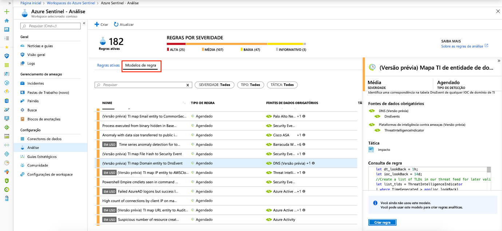

# Tutorial: detectar ameaças prontas para uso

> [!IMPORTANT]
> A detecção de ameaças pronta para uso está atualmente em visualização pública.
> Esse recurso é fornecido sem um contrato de nível de serviço e não é recomendado para cargas de trabalho de produção.
> Para obter mais informações, consulte [Termos de Uso Complementares de Versões Prévias do Microsoft Azure](https://azure.microsoft.com/support/legal/preview-supplemental-terms/).

Depois de [conectar suas fontes de dados](quickstart-onboard.md) ao Azure Sentinel, você deseja ser notificado quando algo suspeito acontecer. Para permitir que você faça isso, o Sentinela do Azure fornece modelos internos prontos para uso. Esses modelos foram projetados pela equipe da Microsoft de especialistas em segurança e analistas com base em ameaças conhecidas, em vetores de ataque comuns e em cadeias de escalonamento de atividades suspeitas. Depois de habilitar esses modelos, eles pesquisarão automaticamente qualquer atividade que pareça suspeita em seu ambiente. Muitos dos modelos podem ser personalizados para pesquisar ou filtrar atividades, de acordo com suas necessidades. Os alertas gerados por esses modelos criarão incidentes que você pode atribuir e investigar em seu ambiente.

Este tutorial ajuda você a detectar ameaças com o Azure Sentinel:

> [!div class="checklist"]
> * Usar as detecções prontas para uso
> * Automatizar as respostas a ameaças

## Sobre as detecções prontas para uso

Para exibir todas as detecções prontas para uso, acesse **Análise** e **Modelos de regra**. Esta guia contém todas as regras internas do Azure Sentinel.

   

Os seguintes tipos de modelo estão disponíveis:

- **Segurança da Microsoft** -os modelos de segurança da Microsoft criam automaticamente incidentes do Azure Sentinel a partir dos alertas gerados em outras soluções de segurança da Microsoft, em tempo real. Você pode usar as regras de segurança da Microsoft como um modelo para criar novas regras com lógica semelhante. Para obter mais informações sobre regras de segurança, consulte [criar automaticamente incidentes de alertas de segurança da Microsoft](create-incidents-from-alerts.md).
- **Fusão** -baseada na tecnologia Fusion, a detecção avançada de ataques de multiestágio no Azure Sentinel usa algoritmos de aprendizado de máquina escalonáveis que podem correlacionar muitos alertas e eventos de baixa fidelidade em vários produtos em incidentes de alta fidelidade e acionáveis. A fusão é habilitada por padrão. Como a lógica está oculta, você não pode usá-la como um modelo para criar mais de uma regra.
- **Análise comportamental do Machine Learning** -esses modelos são baseados em algoritmos proprietários de Microsoft Machine Learning, portanto, você não pode ver a lógica interna de como eles funcionam e quando eles são executados. Como a lógica está oculta, você não pode usá-la como um modelo para criar mais de uma regra.
-   **Agendado** – as regras analíticas agendadas são consultas agendadas escritas por especialistas em segurança da Microsoft. Você pode ver a lógica de consulta e fazer alterações nela. Você pode usar regras agendadas como um modelo para criar novas regras com lógica semelhante.

## Usar as detecções prontas para uso

1. Para usar um modelo interno, clique em **criar regra** para criar uma nova regra ativa com base nesse modelo. Cada entrada tem uma lista de fontes de dados necessárias que são automaticamente verificadas e isso pode resultar na desabilitação da **regra de criação** .
  
   
 
1. Isso abre o assistente de criação de regras, com base no modelo selecionado. Todos os detalhes são preenchidos de forma automática e para **regras agendadas** ou **regras de segurança da Microsoft**, você pode personalizar a lógica para se adequar melhor à sua organização ou criar regras adicionais com base no modelo interno. Depois de seguir as etapas no Assistente para criação de regras e terminar de criar uma regra com base no modelo, a nova regra aparecerá na guia **regras ativas** .

Para obter mais informações sobre os campos no assistente, consulte [tutorial: criar regras analíticas personalizadas para detectar ameaças suspeitas](tutorial-detect-threats-custom.md).

## Próximas etapas
Neste tutorial, você aprendeu a começar a detectar ameaças usando o Azure Sentinel. 

Para saber como automatizar suas respostas a ameaças, [Configure as respostas de ameaças automatizadas no Azure Sentinel](tutorial-respond-threats-playbook.md).

