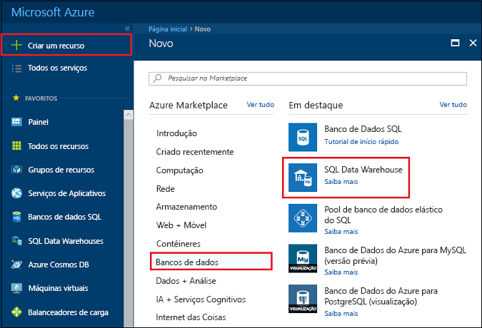
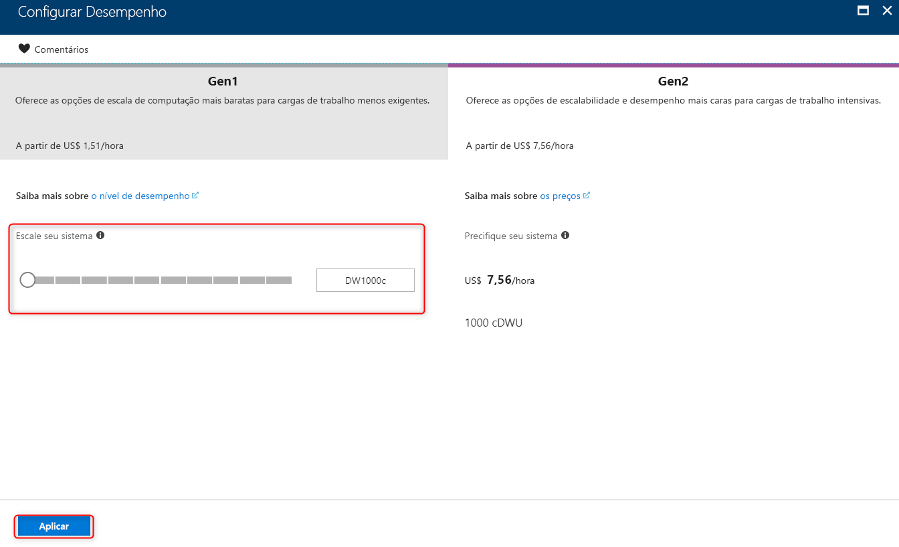
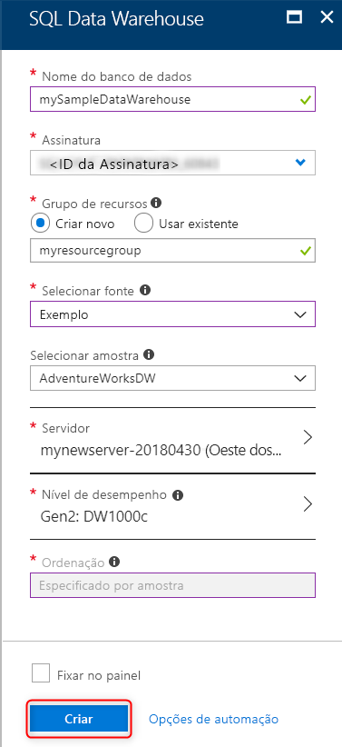
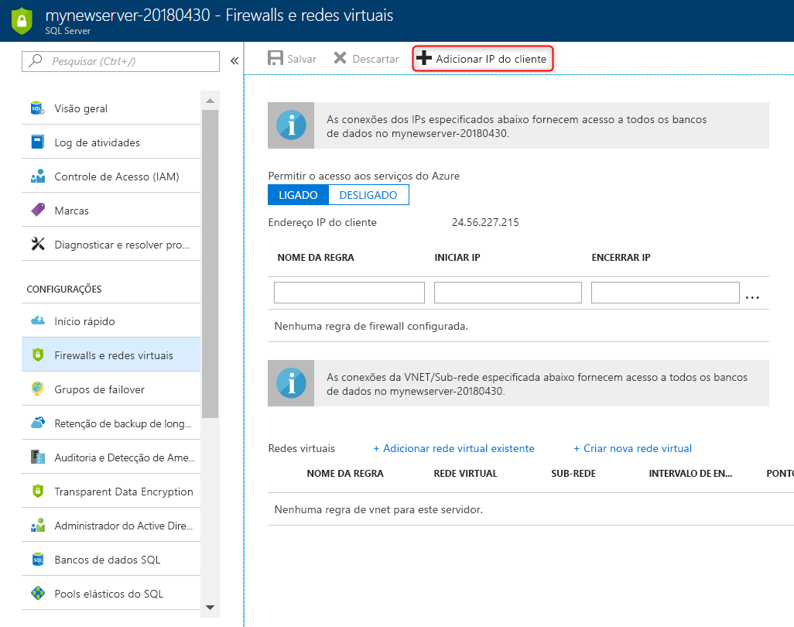
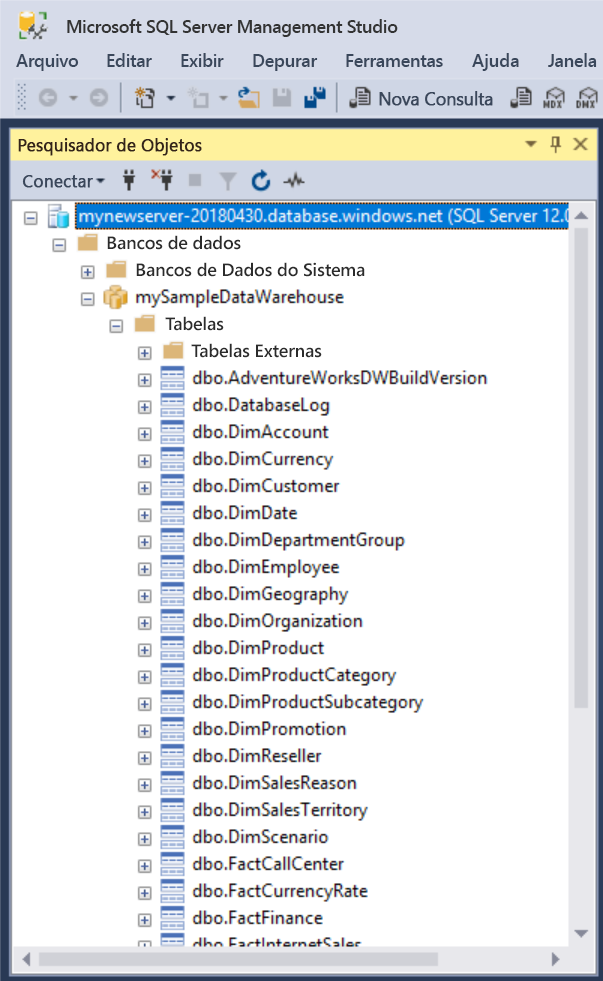

# <a name="quickstart-create-and-query-an-azure-sql-data-warehouse-in-the-azure-portal"></a>Início Rápido: Criar e consultar um SQL Data Warehouse do Azure no portal do Azure

Crie e consulte rapidamente um SQL Data Warehouse do Azure usando o portal do Azure.

Se você não tiver uma assinatura do Azure, crie uma conta [gratuita](https://azure.microsoft.com/free/) antes de começar.

> [!NOTE]
> A criação de um SQL Data Warehouse pode resultar em um novo serviço faturável.  Para obter mais informações, confira [Preços do SQL Data Warehouse](https://azure.microsoft.com/pricing/details/sql-data-warehouse/).
>
>

## <a name="before-you-begin"></a>Antes de começar

Baixe e instale a versão mais recente do [SQL Server Management Studio](/sql/ssms/download-sql-server-management-studio-ssms) (SSMS).

## <a name="sign-in-to-the-azure-portal"></a>Entre no Portal do Azure

Entre no [portal do Azure](https://portal.azure.com/).

## <a name="create-a-data-warehouse"></a>Criar um data warehouse

Um SQL Data Warehouse do Azure é criado com um conjunto definido de [recursos de computação](memory-and-concurrency-limits.md). O banco de dados é criado dentro de um [grupo de recursos do Azure](../azure-resource-manager/resource-group-overview.md) e em um [servidor lógico SQL do Azure](../sql-database/sql-database-logical-servers.md). 

Siga estas etapas para criar um SQL data warehouse com os dados de exemplo de AdventureWorksDW. 

1. Clique em **Criar um recurso** no canto superior esquerdo do Portal do Azure.

2. Selecione **Bancos de dados** na página **Novo** e selecione **SQL Data Warehouse** em **Em destaque** na página **Novo**.

    

3. Preencha o formulário do SQL Data Warehouse com as seguintes informações:   

    | Configuração | Valor sugerido | DESCRIÇÃO | 
    | ------- | --------------- | ----------- | 
    | **Nome do banco de dados** | meuDataWarehouseDeExemplo | Para ver os nomes do banco de dados válidos, consulte [Identificadores do Banco de Dados](/sql/relational-databases/databases/database-identifiers). Observe que um data warehouse é um tipo de banco de dados.| 
    | **Assinatura** | Sua assinatura  | Para obter detalhes sobre suas assinaturas, consulte [Assinaturas](https://account.windowsazure.com/Subscriptions). |
    | **Grupo de recursos** | myResourceGroup | Para ver os nomes do grupo de recursos válidos, consulte [Regras e restrições de nomenclatura](https://docs.microsoft.com/azure/architecture/best-practices/naming-conventions). |
    | **Selecionar fonte** | Amostra | Especifica a carga de um banco de dados de exemplo. Observe que um data warehouse é um tipo de banco de dados. |
    | **Selecionar exemplo** | AdventureWorksDW | Especifica a carga do banco de dados de exemplo AdventureWorksDW.  |

    

4. Clique em **Servidor** para criar e configurar um novo servidor para o novo banco de dados. Preencha o **formulário Novo servidor** com as seguintes informações: 

    | Configuração | Valor sugerido | DESCRIÇÃO | 
    | ------------ | ------------------ | ------------------------------------------------- | 
    | **Nome do servidor** | Qualquer nome exclusivo globalmente | Para ver os nomes do servidor válidos, consulte [Regras e restrições de nomenclatura](https://docs.microsoft.com/azure/architecture/best-practices/naming-conventions). | 
    | **Logon de administrador do servidor** | Qualquer nome válido | Para ver os nomes de logon válidos, consulte [Identificadores do Banco de Dados](https://docs.microsoft.com/sql/relational-databases/databases/database-identifiers).|
    | **Senha** | Qualquer senha válida | Sua senha deve ter, pelo menos, oito caracteres e deve conter caracteres de três das seguintes categorias: caracteres com letras maiúsculas, letras minúsculas, números e caracteres não alfanuméricos. |
    | **Localidade** | Qualquer local válido | Para obter mais informações sobre as regiões, consulte [Regiões do Azure](https://azure.microsoft.com/regions/). |

    

5. Clique em **Selecionar**.

6. Clique em **Nível de desempenho** para especificar a configuração de desempenho para o data warehouse.

7. Para este tutorial, selecione **Gen2**. O controle deslizante, por padrão, é definido como **DW1000c**.  Experimente movê-lo para cima e para baixo para ver como ele funciona. 

    

8. Clique em **Aplicar**.

9. Agora que você concluiu o formulário do SQL Data Warehouse, clique em **Criar** para provisionar o banco de dados. O provisionamento demora alguns minutos. 

    

10. Na barra de ferramentas, clique em **Notificações** para monitorar o processo de implantação.
    
     

## <a name="create-a-server-level-firewall-rule"></a>Criar uma regra de firewall no nível de servidor

O serviço do SQL Data Warehouse cria um firewall no nível do servidor que impede que os aplicativos e ferramentas externos conectem-se ao servidor ou a bancos de dados no servidor. Para habilitar a conectividade, é possível adicionar regras de firewall que habilitem a conectividade para endereços IP específicos.  Siga estas etapas para criar uma [regra de firewall de nível de servidor](../sql-database/sql-database-firewall-configure.md) para o endereço IP do seu cliente. 

> [!NOTE]
> O SQL Data Warehouse comunica-se pela porta 1433. Se você estiver tentando conectar-se de dentro de uma rede corporativa, o tráfego de saída pela porta 1433 talvez não seja permitido pelo firewall de sua rede. Se isto acontecer, você não poderá conectar o servidor do Banco de Dados SQL do Azure, a menos que o departamento de TI abra a porta 1433.
>

1. Depois da implantação ser concluída, clique em **SQL Data Warehouse** no menu à esquerda, depois, clique em **mySampleDatabase** na página **SQL Data Warehouse**. A página de visão geral de seu banco de dados é aberta, mostrando o nome do servidor totalmente qualificado (como **meunovoservidor-20180430.database.windows.net**) e fornece opções para configurações adicionais. 

2. Copie esse nome do servidor totalmente qualificado para se conectar ao servidor e a seus bancos de dados nos próximos guias de início rápido. Para abrir as configurações do servidor, clique no nome do servidor.

    

3. Para abrir as configurações do servidor, 
4. clique no nome do servidor.

    

5. Clique em **Mostrar configurações de firewall**. A página **Configurações do firewall** do servidor de Banco de Dados SQL é aberta. 

    

4. Para adicionar seu endereço IP atual a uma nova regra de firewall, clique em **Adicionar IP do cliente** na barra de ferramentas. Uma regra de firewall pode abrir a porta 1433 para um único endereço IP ou um intervalo de endereços IP.

5. Clique em **Salvar**. Uma regra de firewall no nível do servidor é criada para a porta de abertura 1433 de seu endereço IP atual no servidor lógico.

6. Clique em **OK**, em seguida, feche a página **Configurações do Firewall**.

Agora é possível conectar-se ao SQL Server e a seus data warehouses usando este endereço IP. A conexão funciona no SQL Server Management Studio ou em outra ferramenta de sua escolha. Quando você se conectar, use a conta ServerAdmin criada anteriormente.  

> [!IMPORTANT]
> Por padrão, o acesso através do firewall do Banco de Dados SQL está habilitado para todos os serviços do Azure. Clique em **DESLIGAR** nesta página e, em seguida, clique em **Salvar** para desabilitar o firewall para todos os serviços do Azure.

## <a name="get-the-fully-qualified-server-name"></a>Obter o nome do servidor totalmente qualificado

Obtenha o nome do servidor totalmente qualificado para seu SQL Server no Portal do Azure. Posteriormente, você usará o nome totalmente qualificado ao se conectar ao servidor.

1. Entre no [portal do Azure](https://portal.azure.com/).
2. Selecione **SQL Data Warehouse** no menu à esquerda e clique em seu banco de dados na página **SQL Data Warehouse**. 
3. No painel **Essentials**, na página do Portal do Azure de seu banco de dados, localize e copie o **Nome do servidor**. Neste exemplo, o nome totalmente qualificado é meunovoservidor-20180430.database.windows.net. 

      

## <a name="connect-to-the-server-as-server-admin"></a>Conectar-se ao servidor como administrador do servidor

Esta seção usa o [SSMS](/sql/ssms/download-sql-server-management-studio-ssms) (SQL Server Management Studio) para estabelecer uma conexão com o SQL Server do Azure.

1. Abra o SQL Server Management Studio.

2. Na caixa de diálogo **Conectar ao Servidor**, insira as informações a seguir:

   | Configuração       | Valor sugerido | DESCRIÇÃO | 
   | ------------ | ------------------ | ------------------------------------------------- | 
   | Tipo de servidor | Mecanismo de banco de dados | Esse valor é obrigatório |
   | Nome do servidor | O nome do servidor totalmente qualificado | Aqui está um exemplo: **mynewserver 20180430.database.windows.net**. |
   | Autenticação | Autenticação do SQL Server | A Autenticação do SQL é o único tipo de autenticação configurado neste tutorial. |
   | Logon | A conta do administrador do servidor | Esta é a conta que você especificou quando criou o servidor. |
   | Senha | A senha para sua conta do administrador do servidor | Esta é a senha que você especificou quando criou o servidor. |

    

4. Clique em **Conectar**. A janela Pesquisador de Objetos abre no SSMS. 

5. No Pesquisador de Objetos, expanda **Bancos de dados**. Em seguida, expanda **meuBancoDeDadosDeExemplo** para exibir os objetos no novo banco de dados.

     

## <a name="run-some-queries"></a>Executar algumas consultas

O SQL Data Warehouse usa T-SQL como a linguagem de consulta. Para abrir uma janela de consulta e executar algumas consultas T-SQL, use as seguintes etapas:

1. Clique com o botão direito do mouse em **meuDataWarehouseDeExemplo** e selecione **Nova Consulta**.  Uma nova janela de consulta é aberta.
2. Na janela de consulta, digite o seguinte comando para ver uma lista de bancos de dados.

    ```sql
    SELECT * FROM sys.databases
    ```

3. Clique em **Executar**.  Os resultados da consulta mostram dois bancos de dados: **mestre** e **meuDataWarehouseDeExemplo**.

    

4. Para examinar alguns dados, use o comando a seguir para ver o número de clientes com o sobrenome Alves com três filhos em casa. Os resultados listam seis clientes. 

    ```sql
    SELECT LastName, FirstName FROM dbo.dimCustomer
    WHERE LastName = 'Adams' AND NumberChildrenAtHome = 3;
    ```

    

## <a name="clean-up-resources"></a>Limpar recursos

Você está sendo cobrado por unidades de data warehouse e pelos dados armazenados em seu data warehouse. Esses recursos de computação e armazenamento são cobrados separadamente. 

- Se desejar manter os dados no armazenamento, será possível pausar a computação quando você não estiver usando o data warehouse. Ao pausar a computação, você será cobrado apenas pelo armazenamento de dados. Você poderá retomar a computação sempre que estiver pronto para trabalhar com os dados.
- Se desejar remover encargos futuros, será possível excluir o data warehouse. 

Siga estas etapas para limpar os recursos conforme desejado.

1. Faça logon no [portal do Azure](https://portal.azure.com) e clique no seu data warehouse.

    

1. Para pausar a computação, clique no botão **Pausar**. Quando o data warehouse for pausado, você verá um botão **Iniciar**.  Para retomar a computação, clique **Iniciar**.

2. Para remover o data warehouse para você não ser cobrado pela computação ou pelo armazenamento, clique em **Excluir**.

3. Para remover o SQL Server criado, clique em **meunovoservidor-20180430.database.windows.net** na imagem anterior e, em seguida, clique em **Excluir**.  Tenha cuidado com essa exclusão, uma vez que a exclusão do servidor também exclui todos os bancos de dados atribuídos ao servidor.

4. Para remover o grupo de recursos, clique em **meuGrupoDeRecursos** e, em seguida, clique em **Excluir grupo de recursos**.


## <a name="next-steps"></a>Próximas etapas
Agora você criou um data warehouse, criou uma regra de firewall, conectou-se ao data warehouse e executou algumas consultas. Para saber mais sobre o SQL Data Warehouse do Azure, prossiga para o tutorial de carregamento de dados.
> [!div class="nextstepaction"]
>[Carregar dados no SQL Data Warehouse](load-data-from-azure-blob-storage-using-polybase.md)
