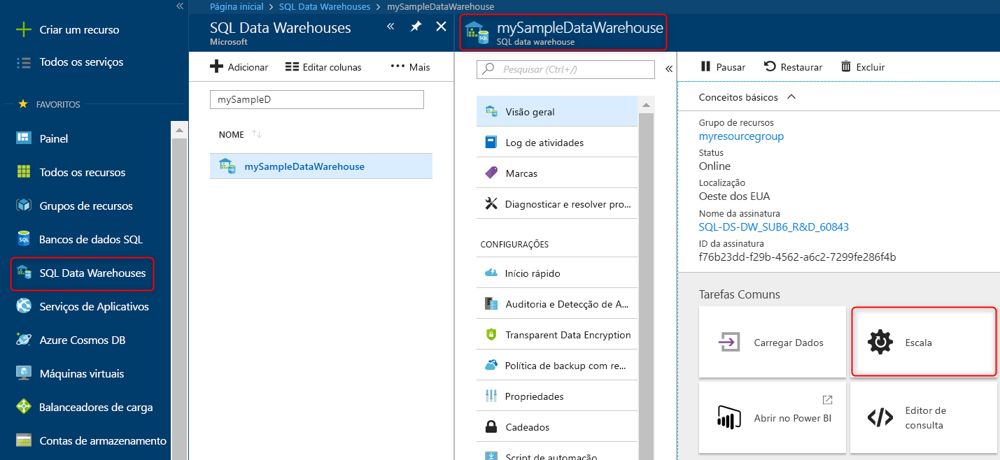

# Início Rápido: dimensionar a computação no SQL Data Warehouse do Azure no Portal do Azure

Dimensionar a computação no SQL Data Warehouse do Azure no Portal do Azure. [Escale horizontalmente a computação](sql-data-warehouse-manage-compute-overview.md) para melhorar o desempenho ou reduza a escala da computação para economizar custos. 

Se você não tiver uma assinatura do Azure, crie uma conta [gratuita](https://azure.microsoft.com/free/) antes de começar.

## Entrar no Portal do Azure

Entre no [portal do Azure](https://portal.azure.com/).

## Antes de começar

Você pode dimensionar um data warehouse que você já tenha ou usar o [Início Rápido: Criar e conectar – portal](create-data-warehouse-portal.md) para criar um data warehouse com o nome **mySampleDataWarehouse**.  Este início rápido dimensiona o **mySampleDataWarehouse**.

## Computação de escala

No SQL Data Warehouse, você pode aumentar ou diminuir os recursos de computação ao ajustar as unidades de data warehouse. O [Criar e conectar – portal](create-data-warehouse-portal.md) criou o **mySampleDataWarehouse** e o inicializou com 400 DWUs. As seguintes etapas ajustam as DWUs do **mySampleDataWarehouse**.

Para alterar unidades de data warehouse:

1. Clique em **SQL data warehouses** na página esquerda do portal do Azure.
2. Selecione **mySampleDataWarehouse** na página **SQL data warehouses**. O data warehouse é aberto.
3. Clique em **Escala**.

    

2. No painel Escala, mova o controle deslizante para a esquerda ou direita para alterar a configuração de DWU.

    

3. Clique em **Salvar**. Será exibida uma mensagem de confirmação. Clique em **sim** para confirmar ou em **não** para cancelar.

    

## Próximas etapas
Agora, você aprendeu como dimensionar a computação para seu data warehouse. Para saber mais sobre o SQL Data Warehouse do Azure, prossiga para o tutorial de carregamento de dados.

> [!div class="nextstepaction"]
>[Carregar dados no SQL Data Warehouse](load-data-from-azure-blob-storage-using-polybase.md)
