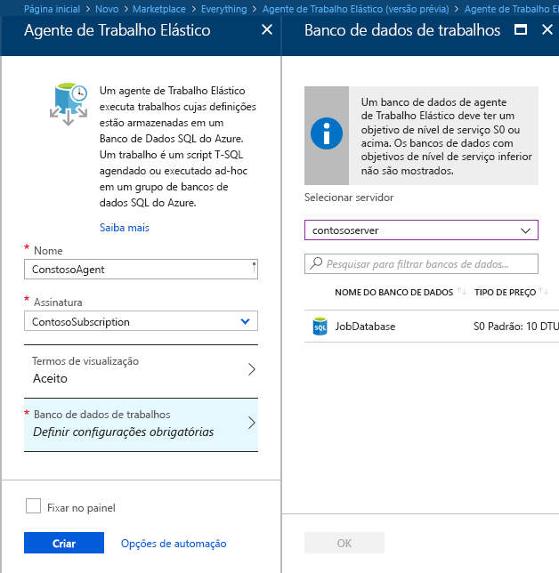
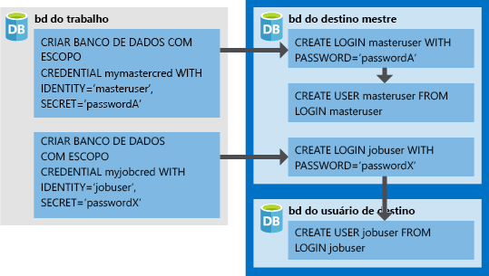

# <a name="create-configure-and-manage-elastic-jobs"></a>Criar, configurar e gerenciar trabalhos elásticos

Neste artigo, você aprenderá a criar, configurar e gerenciar trabalhos elásticos. Se você nunca tiver usado os Trabalhos elásticos, [saiba mais sobre os conceitos de automação de trabalho no Banco de Dados SQL do Azure](sql-database-job-automation-overview.md).

## <a name="create-and-configure-the-agent"></a>Criar e configurar o agente

1. Crie ou identifique um S0 vazio ou um banco de dados SQL superior. Esse banco de dados será usado como o *Banco de dados de trabalhos* durante a criação do agente de Trabalho Elástico.
2. Crie um agente de Trabalho Elástico no [portal](https://portal.azure.com/#create/Microsoft.SQLElasticJobAgent) ou com o [PowerShell](elastic-jobs-powershell.md#create-the-elastic-job-agent).

   

## <a name="create-run-and-manage-jobs"></a>Criar, executar e gerenciar trabalhos

1. Crie uma credencial para a execução de trabalhos no *Banco de dados de trabalhos* usando o [PowerShell](elastic-jobs-powershell.md#create-job-credentials-so-that-jobs-can-execute-scripts-on-its-targets) ou o [T-SQL](elastic-jobs-tsql.md#create-a-credential-for-job-execution).
2. Defina o grupo de destino (os bancos de dados em que você deseja executar o trabalho) usando o [PowerShell](elastic-jobs-powershell.md#define-the-target-databases-you-want-to-run-the-job-against) ou o [T-SQL](elastic-jobs-tsql.md#create-a-target-group-servers).
3. Crie uma credencial de agente de trabalho em cada banco de dados em que o trabalho será executado [(adicione o usuário (ou função) para cada banco de dados no grupo)](sql-database-control-access.md). Para obter um exemplo, confira o [tutorial do PowerShell](elastic-jobs-powershell.md#create-job-credentials-so-that-jobs-can-execute-scripts-on-its-targets).
4. Crie um trabalho usando o [PowerShell](elastic-jobs-powershell.md#create-a-job) ou o [T-SQL](elastic-jobs-tsql.md#deploy-new-schema-to-many-databases).
5. Adicione etapas de trabalho usando o [PowerShell](elastic-jobs-powershell.md#create-a-job-step) ou o [T-SQL](elastic-jobs-tsql.md#deploy-new-schema-to-many-databases).
6. Execute um trabalho usando o [PowerShell](elastic-jobs-powershell.md#run-the-job) ou o [T-SQL](elastic-jobs-tsql.md#begin-ad-hoc-execution-of-a-job).
7. Monitore o status de execução do trabalho usando o portal, o [PowerShell](elastic-jobs-powershell.md#monitor-status-of-job-executions) ou o [T-SQL](elastic-jobs-tsql.md#monitor-job-execution-status).

   

## <a name="credentials-for-running-jobs"></a>Credenciais para executar trabalhos

Os trabalhos usam [credenciais no escopo do banco de dados](/sql/t-sql/statements/create-database-scoped-credential-transact-sql) para se conectar aos bancos de dados especificados pelo grupo de destino após a execução. Se um grupo de destino contém servidores ou pools, essas credenciais no escopo do banco de dados são usadas para conexão com o banco de dados mestre a fim de enumerar os bancos de dados disponíveis.

A configuração das devidas credenciais para executar um trabalho pode ser um pouco confusa e, portanto, tenha os seguintes pontos em mente:

- As credenciais no escopo do banco de dados devem ser criadas no *banco de dados de trabalhos*.
- **Todos os bancos de dados de destino devem ter um logon com [permissões suficientes](https://docs.microsoft.com/sql/relational-databases/security/permissions-database-engine) para que o trabalho seja concluído com êxito** (`jobuser` no diagrama abaixo).
- As credenciais podem ser reutilizadas entre os trabalhos e as senhas de credencial são criptografadas e protegidas contra usuários que têm acesso somente leitura a objetos de trabalho.

A imagem a seguir foi criada para ajudar na compreensão e na configuração das credenciais de trabalho adequadas. **Lembre-se de criar o usuário em cada banco de dados (todos os *bancos de dados de usuário de destino*) em que o trabalho será executado**.



## <a name="security-best-practices"></a>Práticas recomendadas de segurança

Algumas considerações sobre melhores práticas para usar trabalhos elásticos:

- Limite o uso das APIs somente a pessoas confiáveis.
- As credenciais devem ter os privilégios mínimos necessários para executar a etapa do trabalho. Para mais informações, veja [Autorizações e permissões do SQL Server](https://docs.microsoft.com/dotnet/framework/data/adonet/sql/authorization-and-permissions-in-sql-server).
- Ao usar um servidor e/ou um membro do grupo de destino de pool, é altamente recomendável criar uma credencial separada com direitos sobre o banco de dados mestre para exibir/listar bancos de dados, que será usada para expandir as listas de banco de dados dos servidores e/ou pools antes da execução do trabalho.

## <a name="agent-performance-capacity-and-limitations"></a>Desempenho, capacidade e limitações do agente

Os Trabalhos Elásticos usam o mínimo de recursos de computação enquanto aguardam a conclusão dos trabalhos de longa execução.

Dependendo do tamanho do grupo de destino de bancos de dados e do tempo de execução desejado para um trabalho (número de trabalhos simultâneos), o agente requer quantidades diferentes de computação e desempenho do *banco de dados de trabalhos* (quanto mais destinos e trabalhos, maior será a quantidade de computação necessária).

Atualmente, a versão prévia está limitada a 100 trabalhos simultâneos.

### <a name="prevent-jobs-from-reducing-target-database-performance"></a>Impedir que os trabalhos reduzam o desempenho do banco de dados de destino

Para que os recursos não fiquem sobrecarregados ao executar trabalhos em bancos de dados em um pool elástico do SQL, os trabalhos podem ser configurados para limitar o número de bancos de dados em que o trabalho pode ser executado simultaneamente.

Definir o número de bancos de dados simultâneos de um trabalho é executado no definindo a `sp_add_jobstep` procedimento armazenado `@max_parallelism` parâmetro no T-SQL ou `Add-AzSqlElasticJobStep -MaxParallelism` no PowerShell.

## <a name="best-practices-for-creating-jobs"></a>Melhores práticas para a criação de trabalhos

### <a name="idempotent-scripts"></a>Scripts idempotentes
Os scripts T-SQL de um trabalho devem ser [idempotentes](https://en.wikipedia.org/wiki/Idempotence). **Idempotente** significa que, se o script tiver êxito e for executado novamente, o mesmo resultado ocorrerá. Um script pode falhar devido a problemas de rede transitórios. Nesse caso, o trabalho repetirá automaticamente a execução do script por um número predefinido de vezes antes de desistir. Um script idempotente tem o mesmo resultado, mesmo que tenha sido executado com êxito duas vezes (ou mais).

É uma tática simples para testar a existência de um objeto antes de criá-lo.


```sql
IF NOT EXIST (some_object)
    -- Create the object
    -- If it exists, drop the object before recreating it.
```

Da mesma forma, um script deve ser capaz de realizar a execução com êxito testando e combatendo logicamente quaisquer condições que encontrar.


## <a name="next-steps"></a>Próximas etapas

- [Criar e gerenciar trabalhos Elásticos usando o PowerShell](elastic-jobs-powershell.md)
- [Criar e gerenciar trabalhos Elásticos usando o Transact-SQL (T-SQL)](elastic-jobs-tsql.md)
