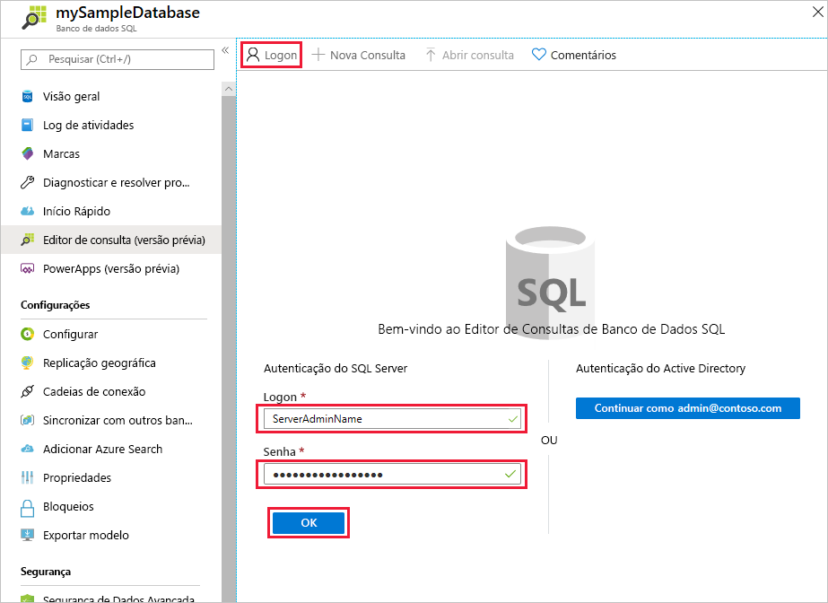
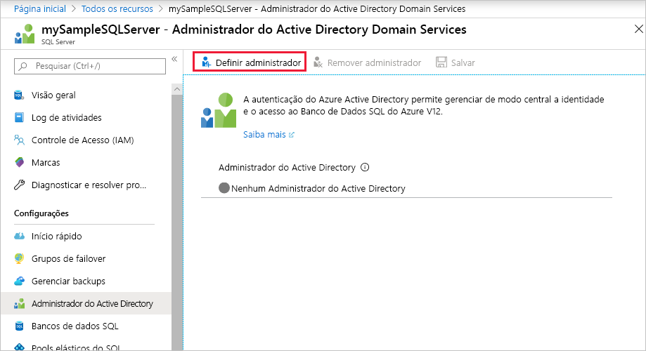
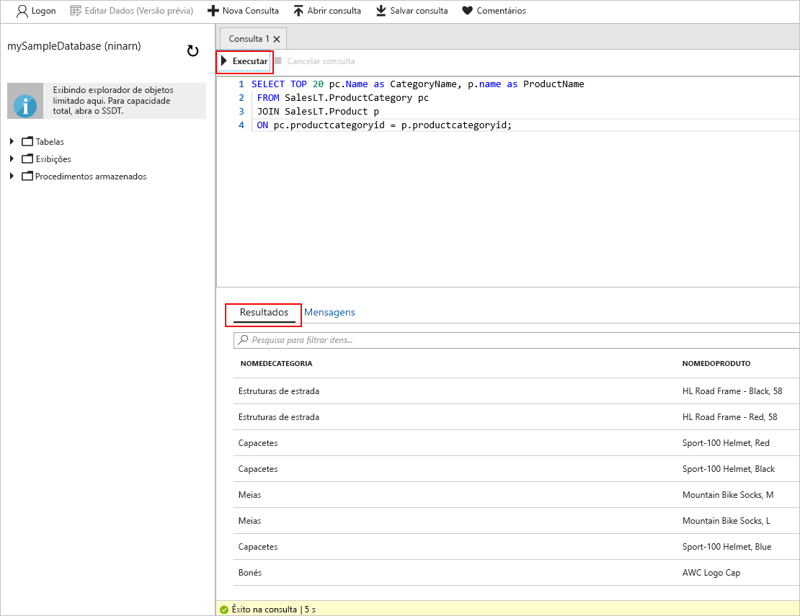

# <a name="quickstart-use-the-azure-portals-sql-query-editor-to-connect-and-query-data"></a>Início Rápido: Use o editor de consultas SQL do portal do Azure para se conectar e consultar dados

O editor de consultas SQL é uma ferramenta de navegador do portal do Azure que fornece uma maneira fácil de executar consultas SQL em seu Banco de Dados SQL do Azure ou SQL Data Warehouse do Azure. Este guia rápido demonstra o uso do editor de consultas para se conectar a um Banco de Dados SQL e executar instruções do Transact-SQL para consultar, inserir, atualizar e excluir dados.

## <a name="prerequisites"></a>Pré-requisitos

Para concluir este tutorial, você precisará:

[!INCLUDE [prerequisites-create-db](../../includes/sql-database-connect-query-prerequisites-create-db-includes.md)]

> [!NOTE]
> Verifique se a opção **Permitir acesso aos serviços do Azure** está definida como **ON** nas configurações de firewall do seu SQL Server. Essa opção dá ao editor de consultas SQL acesso aos seus bancos de dados e data warehouses.

## <a name="sign-in-the-azure-portal"></a>Entre no Portal do Azure

Entre no [Portal do Azure](https://portal.azure.com/).

## <a name="connect-using-sql-authentication"></a>Conectar-se usando a autenticação do SQL

1. Selecione **Bancos de dados SQL** no menu esquerdo e selecione **mySampleDatabase**.

2. No menu esquerdo, localize e selecione **Editor de consultas (versão prévia)**. A página **Logon** é exibida.

    

3. No menu suspenso **Tipo de autorização**, selecione **Autenticação do SQL Server** e insira a ID de usuário e a senha da conta do administrador do servidor usada para criar o banco de dados.

     

4. Selecione **OK**.


## <a name="connect-using-azure-active-directory"></a>Conectar-se usando o Azure Active Directory

Configurar um administrador do AD (Active Directory) permite que você use uma única identidade para entrar no portal do Azure e seu Banco de Dados SQL. Siga as etapas abaixo para configurar um administrador do AD para o SQL Server.

> [!NOTE]
* Ainda não há suporte para contas de email (por exemplo, outlook.com, gmail.com, yahoo.com e assim por diante) como administradores do AD. Escolha um usuário criado nativamente no Azure AD ou federado no Azure AD.
* A conexão do administrador do Azure AD não funciona com contas que têm a autenticação de dois fatores habilitada.

1. Selecione **Todos os Recursos** no menu à esquerda e, em seguida, selecione o SQL Server.

2. No menu **Configurações** do SQL Server, selecione **Administrador do Active Directory**.

3. Na barra de ferramentas da página de administrador do AD, selecione **Definir administrador** e escolha o usuário ou o grupo como o administrador do AD.

    

4. Na barra de ferramentas da página de administrador do AD, selecione **Salvar**.

5. Navegue até o banco de dados **mySampleDatabase** e, no menu esquerdo, selecione **Editor de consultas (versão prévia)**. A página **Logon** é exibida. Se você for um administrador do AD, no lado direito, em **Logon único do Active Directory**, será exibida uma mensagem informando que foi feito seu logon. 
   
6. Selecione **OK**.


## <a name="view-data"></a>Exibir dados

1. Depois de você estar autenticado, cole o SQL a seguir no editor de consultas para recuperar os 20 principais produtos por categoria.

   ```sql
    SELECT TOP 20 pc.Name as CategoryName, p.name as ProductName
    FROM SalesLT.ProductCategory pc
    JOIN SalesLT.Product p
    ON pc.productcategoryid = p.productcategoryid;
   ```

2. Na barra de ferramentas, selecione **Executar** e, em seguida, examine a saída no painel **Resultados**.



## <a name="insert-data"></a>Inserir dados

Use a seguinte instrução [INSERT](https://msdn.microsoft.com/library/ms174335.aspx) do Transact-SQL para adicionar um novo produto à tabela `SalesLT.Product`.

1. Substitua a consulta anterior por esta.

   ```sql
   INSERT INTO [SalesLT].[Product]
           ( [Name]
           , [ProductNumber]
           , [Color]
           , [ProductCategoryID]
           , [StandardCost]
           , [ListPrice]
           , [SellStartDate]
           )
     VALUES
           ('myNewProduct'
           ,123456789
           ,'NewColor'
           ,1
           ,100
           ,100
           ,GETDATE() );
   ```


2. Selecione **Executar** para inserir uma nova linha na tabela Product. O painel **Mensagens** exibe **Êxito na consulta: Linhas afetadas: 1**.


## <a name="update-data"></a>Atualizar dados

Use a seguinte instrução [UPDATE](https://msdn.microsoft.com/library/ms177523.aspx) do Transact-SQL para modificar seu novo produto.

1. Substitua a consulta anterior por esta.

   ```sql
   UPDATE [SalesLT].[Product]
   SET [ListPrice] = 125
   WHERE Name = 'myNewProduct';
   ```

2. Selecione **Executar** para atualizar a linha especificada na tabela Product. O painel **Mensagens** exibe **Êxito na consulta: Linhas afetadas: 1**.

## <a name="delete-data"></a>Excluir dados

Use a seguinte instrução Transact-SQL [DELETE](https://msdn.microsoft.com/library/ms189835.aspx) para remover seu novo produto.

1. Substitua a consulta anterior por esta:

   ```sql
   DELETE FROM [SalesLT].[Product]
   WHERE Name = 'myNewProduct';
   ```

2. Selecione **Executar** para excluir a linha especificada na tabela Product. O painel **Mensagens** exibe **Êxito na consulta: Linhas afetadas: 1**.


## <a name="query-editor-considerations"></a>Considerações sobre o editor de consultas

Há algumas coisas que se deve saber ao trabalhar com o editor de consultas.

* Você não pode usar o editor de consultas para consultar bancos de dados do SQL Server em uma Rede Virtual.

* Pressionar F5 atualiza a página do editor de consultas e qualquer consulta em que se esteja trabalhando é perdida.

* O editor de consultas não dá suporte a se conectar ao banco de dados mestre.

* Há um tempo limite de 5 minutos para a execução da consulta.

* O editor de consultas só dá suporte à projeção cilíndrica para tipos de dados geográficos.

* Não há suporte para IntelliSense para tabelas e exibições de banco de dados. No entanto, o editor oferece suporte para preenchimento automático de nomes que já foram digitados.


## <a name="next-steps"></a>Próximas etapas

Para saber mais sobre o Transact-SQL com suporte em bancos de dados SQL do Azure, confira [Resolvendo diferenças do Transact-SQL durante a migração para o Banco de Dados SQL](sql-database-transact-sql-information.md).
