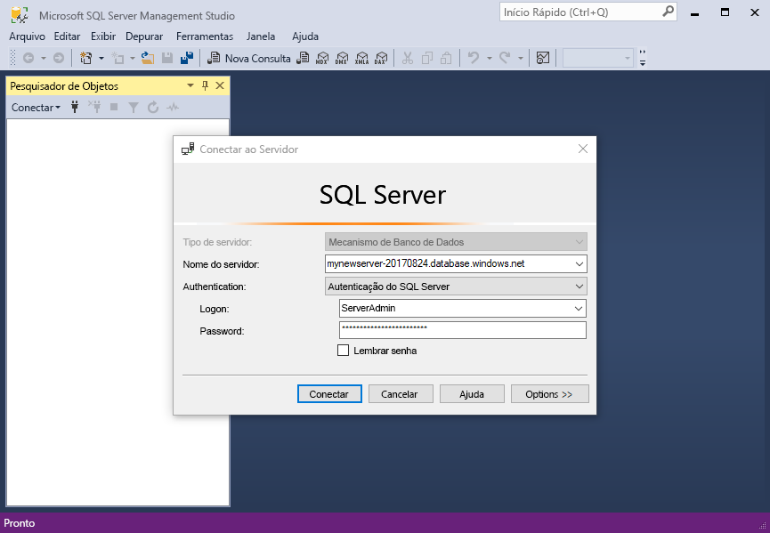

# <a name="quickstart-use-sql-server-management-studio-to-connect-and-query-an-azure-sql-database"></a>Início Rápido: Usar o SQL Server Management Studio para conectar e consultar um Banco de Dados SQL do Azure

Neste início rápido, você usará o [SSMS][ssms-install-latest-84g] (SQL Server Management Studio) para conectar-se a um Banco de Dados SQL do Azure. Em seguida, você executará instruções Transact-SQL para consultar, inserir, atualizar e excluir dados. Você pode usar o SSMS para gerenciar qualquer infraestrutura SQL, desde o SQL Server até o Banco de Dados SQL para Microsoft Windows.  

## <a name="prerequisites"></a>Pré-requisitos

Para concluir este tutorial, você precisará:

[!INCLUDE [prerequisites-create-db](../../includes/sql-database-connect-query-prerequisites-create-db-includes.md)]

#### <a name="install-the-latest-ssms"></a>Instalar o SSMS mais recente

Antes de começar, verifique se você instalou a versão mais recente do [SSMS][ssms-install-latest-84g]. 

## <a name="sql-server-connection-information"></a>Informações de conexão do servidor SQL

[!INCLUDE [prerequisites-server-connection-info](../../includes/sql-database-connect-query-prerequisites-server-connection-info-includes.md)]

## <a name="connect-to-your-database"></a>Conectar-se ao seu banco de dados

No SMSS, conecte-se ao servidor do Banco de Dados SQL do Azure. 

> [!IMPORTANT]
> Um servidor lógico do Banco de Dados SQL do Azure escuta na porta 1433. Para se conectar a um servidor lógico por trás de um firewall corporativo, essa porta do firewall deverá estar aberta.
>

1. Abra o SSMS. A caixa de diálogo **Conectar-se ao Servidor** é exibida.

2. Insira as seguintes informações:

   | Configuração      | Valor sugerido    | DESCRIÇÃO | 
   | ------------ | ------------------ | ----------- | 
   | **Tipo de servidor** | Mecanismo de banco de dados | Valor obrigatório. |
   | **Nome do servidor** | O nome do servidor totalmente qualificado | Algo como: **mynewserver20170313.database.windows.net**. |
   | **Autenticação** | Autenticação do SQL Server | Este tutorial usa a Autenticação do SQL. |
   | **Logon** | ID de usuário da conta do administrador do servidor | A ID de usuário da conta do administrador do servidor usada para criar o servidor. |
   | **Senha** | Senha da conta do administrador do servidor | A senha da conta do administrador do servidor usada para criar o servidor. |
   ||||

     

3. Selecione **Opções** na caixa de diálogo **Conectar-se ao servidor**. No menu suspenso **Conectar-se ao banco de dados**, selecione **mySampleDatabase**.

     

4. Selecione **Conectar**. A janela Pesquisador de Objetos se abre. 

5. Para exibir objetos do banco de dados, expanda **Bancos de Dados** e, em seguida, expanda **mySampleDatabase**.

     

## <a name="query-data"></a>Consultar dados

Execute esse código Transact-SQL [SELECT](https://msdn.microsoft.com/library/ms189499.aspx) para consultar os 20 principais produtos por categoria.

1. No Pesquisador de Objetos, clique com o botão direito do mouse em **mySampleDatabase** e selecione **Nova Consulta**. Abre uma nova janela de consulta conectada ao banco de dados.

2. Na janela de consultas, cole esta consulta SQL.

   ```sql
   SELECT pc.Name as CategoryName, p.name as ProductName
   FROM [SalesLT].[ProductCategory] pc
   JOIN [SalesLT].[Product] p
   ON pc.productcategoryid = p.productcategoryid;
   ```

3. Na barra de ferramentas, selecione **Executar** para recuperar dados das tabelas `Product` e `ProductCategory`.

    

## <a name="insert-data"></a>Inserir dados

Execute esse código Transact-SQL [INSERT](https://msdn.microsoft.com/library/ms174335.aspx) para criar um produto na tabela `SalesLT.Product`.

1. Substitua a consulta anterior por esta.

   ```sql
   INSERT INTO [SalesLT].[Product]
           ( [Name]
           , [ProductNumber]
           , [Color]
           , [ProductCategoryID]
           , [StandardCost]
           , [ListPrice]
           , [SellStartDate] )
     VALUES
           ('myNewProduct'
           ,123456789
           ,'NewColor'
           ,1
           ,100
           ,100
           ,GETDATE() );
   ```

2. Selecione **Executar** para inserir uma nova linha na tabela `Product`. O painel **Mensagens** é exibido **(1 linha afetada)**.

## <a name="view-the-result"></a>Exibir o resultado

1. Substitua a consulta anterior por esta.

   ```sql
   SELECT * FROM [SalesLT].[Product] 
   WHERE Name='myNewProduct' 

2. Select **Execute**. The following result appears. 

   

 
## Update data

Run this [UPDATE](https://msdn.microsoft.com/library/ms177523.aspx) Transact-SQL code to modify your new product.

1. Replace the previous query with this one.

   ```sql
   UPDATE [SalesLT].[Product]
   SET [ListPrice] = 125
   WHERE Name = 'myNewProduct';
   ```

2. Selecione **Executar** para atualizar a linha especificada na tabela `Product`. O painel **Mensagens** é exibido **(1 linha afetada)**.

## <a name="delete-data"></a>Excluir dados

Execute esse código Transact-SQL [DELETE](https://msdn.microsoft.com/library/ms189835.aspx) para remover o novo produto.

1. Substitua a consulta anterior por esta.

   ```sql
   DELETE FROM [SalesLT].[Product]
   WHERE Name = 'myNewProduct';
   ```

2. Selecione **Executar** para excluir a linha especificada na tabela `Product`. O painel **Mensagens** é exibido **(1 linha afetada)**.

## <a name="next-steps"></a>Próximas etapas

- Para saber mais sobre o SSMS, confira [SQL Server Management Studio](https://msdn.microsoft.com/library/ms174173.aspx).
- Para se conectar e consultar usando o Portal do Azure, consulte [Conectar e consultar com o editor de consultas do SQL do Portal do Azure](sql-database-connect-query-portal.md).
- Para conectar e consultar usando o Visual Studio Code, veja [Conectar e consultar com o Visual Studio Code](sql-database-connect-query-vscode.md).
- Para conectar e consultar usando o .NET, veja [Conectar e consultar com o .NET](sql-database-connect-query-dotnet.md).
- Para conectar e consultar usando o PHP, veja [Conectar e consultar com o PHP](sql-database-connect-query-php.md).
- Para conectar e consultar usando o Node.js, veja [Conectar e consultar com o Node.js](sql-database-connect-query-nodejs.md).
- Para conectar e consultar usando o Java, veja [Conectar e consultar com o Java](sql-database-connect-query-java.md).
- Para conectar e consultar usando o Python, veja [Conectar e consultar com o Python](sql-database-connect-query-python.md).
- Para conectar e consultar usando o Ruby, veja [Conectar e consultar com o Ruby](sql-database-connect-query-ruby.md).


<!-- Article link references. -->

[ssms-install-latest-84g]: https://docs.microsoft.com/sql/ssms/sql-server-management-studio-ssms

